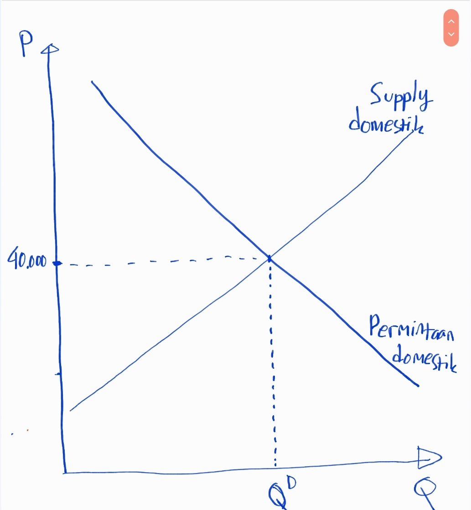
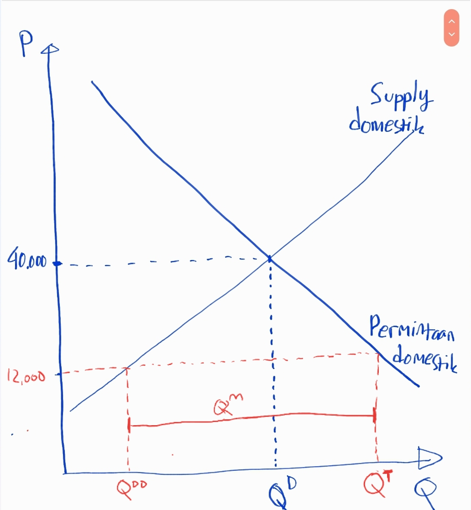
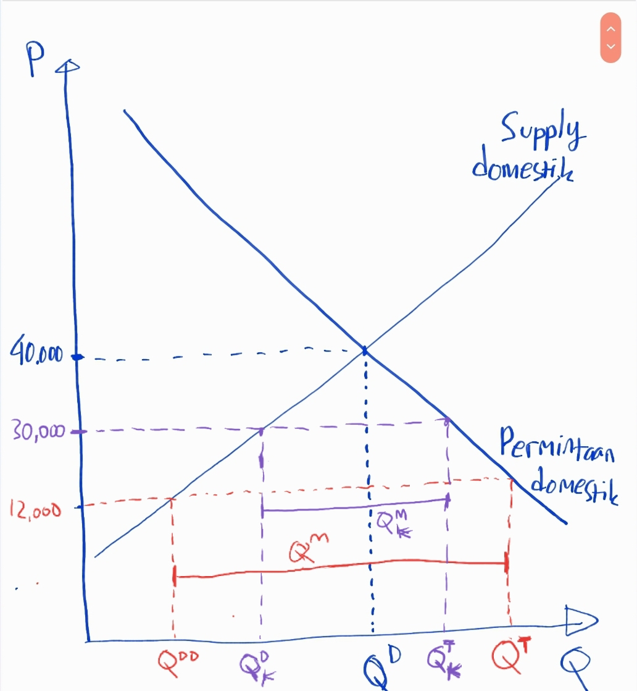
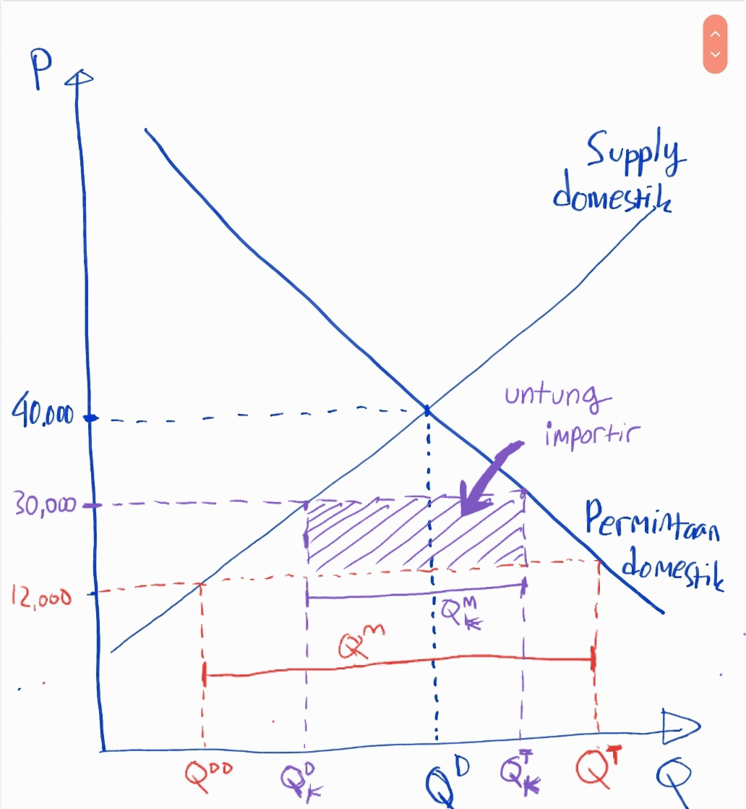

Recently, netizens were rocked by news of the [arrest of officials in a garlic import bribery case](https://beritagar.id/artikel-amp/berita/urus-impor-bawang-putih-nyoman-minta-imbalan-rp36-m?__twitter_impression=true). Beritagar has documented this case in considerable detail, and in my personal opinion, each of their reports is very interesting to read. The arrest produced evidence of a transfer of IDR 2 billion out of a total deal of "IDR 3.6 billion and a commitment fee of IDR 1,700-1,800 per kg of imported garlic." Crazy, right? IDR 2 billion could buy a lifetime supply of chicken porridge!

But garlic imports -- how much could they be worth? What's the profit? How can import bribes reach billions from garlic sales?

Garlic is one of many commodities whose imports are restricted by quotas. So imports are allowed, but not freely. It depends on the Ministry of Trade and the Ministry of Agriculture designating specific parties that are permitted to import, and how much they can import.

Because of this barrier, there's a gap between international and domestic prices. Data from the [UN Comtrade Database](https://comtrade.un.org/data/) shows that in 2018, Indonesia imported 582,994,508 kg of garlic (HS 070320), with a total value of 497,259,293 USD. That means the price per kg is about 0.853 USD. At an exchange rate of 14,000, that's about IDR 12,000 per kg. In other words, importers buy garlic from abroad at IDR 12,000 per kg.

Of course, this calculation should be scrutinized since it uses annual figures, which may have monthly or daily fluctuations. But for rough estimates, these numbers are sufficient, especially considering that the global market is generally quite fluid. Transaction difficulties usually come from the domestic import permit process, which is a long chain with unpredictable timelines. The table below provides a slightly more detailed calculation for 2018, 2019, and 2020. USD and kg come from the [UN Comtrade Database](https://comtrade.un.org/data/) while exchange rates come from the [World Bank](https://data.worldbank.org/indicator/PA.NUS.FCRF?end=2020&locations=ID&start=2015).

| Year | USD | Kg | $\frac{USD}{Kg}$ | $\frac{IDR}{USD}$ | $\frac{IDR}{Kg}$ |
| --- | --- | --- | --- | --- | --- |
| 2018 | 497.259.293 | 582.994.508 | 0,853 | 14.239,939 | 12.146,668 |
| 2019 | 529.965.497 | 465.344.332 | 1,139 | 14.147,671 | 16.114,197 |
| 2020 | 585.785.247 | 587.748.401 | 0,997 | 14.582,203 | 14.538,483 |

What's the domestic price per kg of garlic? Using Beritagar's price of IDR 30,000 per kg, that means importers can profit up to IDR 18,000 per kg! That's a 150% markup! Since in 2018 Indonesia imported 582,994,508 kg, if the profit is truly IDR 18,000 per kg, then the total profit from the garlic import business is IDR 10,493,901,000,000! Lots of zeros!

INTERMEZZO: IDR 30,000 per kg might be a bit high. Looking at PIHPS, the average garlic price in 2018 was around IDR 21,000. But fluctuations are quite high, especially during Eid. It makes sense if importers only release garlic to market when prices are relatively high.

We can debate whether IDR 30,000 is the right domestic price to use. The point is, paying out IDR 3.6 billion in bribes is pocket change in context. And garlic imports seem likely to only increase.

UPDATE: Tempo has published their own calculation based on court testimony at [this link](https://bisnis.tempo.co/read/1094542/mafia-bawang-putih-impor-dari-cina-raup-untung-rp-19-t-per-tahun/full&view=ok). Turns out the profit reaches IDR 19 trillion. The IDR 30,000/kg figure was even too low. Here's Tempo's [investigation](https://majalah.tempo.co/read/investigasi/159659/gurita-kuota-impor-bawang).

After seeing how frightening the garlic import bribes are, we naturally ask: Why does this country impose import quotas?

Essentially, import quotas are part of a country's industrial policy. Industrial policy is designed to protect certain industries from global competition. In the case of garlic, the quota exists to protect garlic farmers. We import because international prices are cheaper than domestic prices. International prices are cheaper because foreign farmers are more productive. Since our farmers can't compete, they're protected with quotas.

I've made an illustration of how quotas affect supply and demand in the APPENDIX at the very bottom. Scroll down if you're curious and don't already know.

Back to the main point: quotas are generally disliked simply because the biggest beneficiaries are importers. The importers' profits are prone to being exploited by those with the authority to grant import quotas. These price differentials are frequently used as opportunities for corruption.

Corruption causes inefficiency. Imagine: you're an efficient importer with qualified graduates, but when applying for a license, you lose to an inferior importer because they're willing to pay bribes. So instead of competing on quality, it becomes a game of who pays more. Similar to other corruption cases -- instead of building quality, money goes to bribes.

There are two policy alternatives even if we still want to restrict garlic imports and protect garlic farmers.

The first is import tariffs. Compared to quotas, tariffs can achieve the same effect, but the beneficiary is the government. For example, if the government imposes a tariff of IDR 18,000 per kg, then the domestic price will be IDR 30,000 per kg, the same as with quotas. But the IDR 10 trillion in profit would go to state coffers as tax revenue.

However, Indonesia is bound by trade agreements, especially ACFTA (ASEAN-China Free Trade Agreement). We can't set high tariffs. That's precisely why we use quotas -- because we know we can't use tariffs. The earliest regulation I could find on horticultural product quotas is from 2012. So we first implemented quotas on garlic, vegetables, and fruit in 2012, 2 years after ACFTA. Coincidence?

The second option: keep using quotas, but make the licensing or import permit process more transparent and competitive. Currently, as far as I know, the criteria for granting a garlic import permit are somewhat unclear. It would be better if import licenses were auctioned. Those who want an import permit must pay the state. The highest bidder gets the license. As for why we don't implement license auctions, I still don't know the reason.

Intermezzo: The Ministry of Agriculture now requires prospective importers to grow their own garlic equivalent to 5% of their total imports. So there are some requirements. I personally don't quite understand why this is necessary.

But the argument of defending garlic farmers is actually a bit dubious. I was once told by a friend that garlic farmers are actually very few, almost nonexistent. This is consistent with the beritagar article above, which states that according to the Ministry of Trade, 95% of our garlic needs are imported. So even at IDR 30,000, our domestic farmers contribute only 5%. Looking at the 5% mandatory planting requirement, that 5% is exactly from the planting obligation, not organically grown by farmers. So who is this quota really protecting? From a public policy perspective, the garlic quota is hard for me to justify.

But well, it is garlic after all. Delicious stuff!

**APPENDIX**
In this section, I'll try to illustrate the impact of imposing a quota. Hope it's helpful.

If we didn't import at all (garlic imports BANNED!), garlic would be produced at $Q^D$ and the price would be, say, IDR 40,000 per kg. At this stage, garlic farmers would be happy because the price per kg is very high. But consumers get ripped off, and industries using garlic become uncompetitive. Instant noodle prices would skyrocket!
What happens if we allow free imports?

We know importers buy from abroad at IDR 12,000 per kg. With completely free imports, the garlic price falls to IDR 12,000. Total garlic in the country rises from $Q^D$ to $Q^T$ (because it's cheap). At IDR 12,000, farmers don't want to supply as much. They'll supply $Q^{DD}$, and $Q^M$ will be imported. Here, importers don't profit because the domestic price equals the world price.

But of course we don't have free imports. We're not liberals, right? The Ministry of Trade doesn't want us importing $Q^M$ worth. Too much. Imports are limited to $Q^{M}_K<Q^M$. What happens?

Because we can't import freely, supply decreases. Prices rise to IDR 30,000. Total garlic in circulation becomes $Q^T_K$, lower than $Q^T$ but higher than $Q^D$. Domestic supply increases to $Q^D_K$, and imports are capped at $Q^M_K$. Here, the domestic price is IDR 30,000 and the international price remains IDR 12,000.
Under the quota, importers profit by the total import quantity $Q^M_K$ times the domestic-international price differential, 30,000-12,000. Importer profit $=Q^M_K\times(30,000-12,000)=Q^M_K\times12,000$. In the figure below, the importer's profit is the shaded area.

Importer's Profit

Here, garlic farmers benefit compared to free trade, because under free trade they'd only supply $Q^{DD}$, while under quotas they supply $Q^D_K$ at IDR 30,000.

Now, if we replace the quota with an import tariff of IDR 18,000, the shaded area goes to the government. Importers can import as much as they want, but because the price becomes expensive due to the tariff, they won't import much. Imports will be $Q^M_K$. And $Q^M_K\times\text{18,000}$ becomes government tax revenue, while importer profit will be tiny, as small as under free trade.
