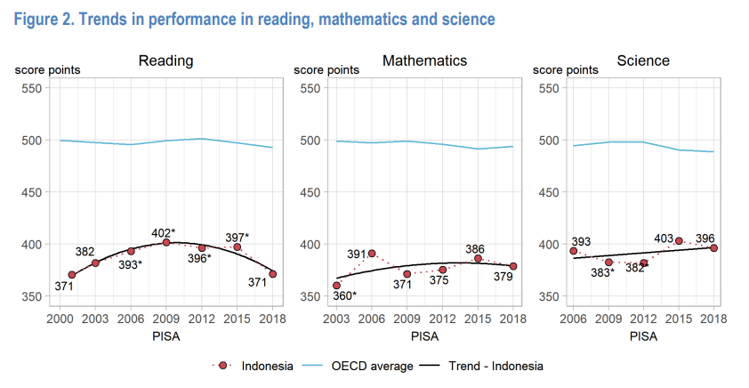

On Thursday, July 6, 2023, the Fiscal Policy Agency (BKF) at the Ministry of Finance held an event called _fiscal day_. One of the themes raised was a policy discussion on Indonesia's demographic bonus. This discussion is highly relevant, especially now as Indonesia pursues investment and economic growth, trying to prevent "growing old before growing rich."

BKF opened with interesting statistics. According to them, in 2020, Indonesia's working-age population reached 191 million people, or about 70.7% of the total population. This is positive because it means the ratio of working to non-working population is quite high. By 2028-2031, this figure will begin to decline. Unfortunately, according to BKF, this demographic bonus could become a problem if the population isn't productive.

According to BKF's briefing document:

> Unfortunately, human resource issues in Indonesia still face numerous challenges. Among them, Indonesia's workforce is still dominated by primary school graduates and below at 39.76%. Workers with junior high school education make up 18.24%, senior high school 19.18%, and vocational high school 9.31%. Meanwhile, workers with higher education degrees remain very limited: Diploma I/II/III at 2.20%, and Diploma IV, Bachelor's, Master's, and Doctoral degrees at 9.31% (BPS, February 2023). This condition impacts relatively low labor productivity and competitiveness.

BKF also notes Indonesia's low _Human Development Index_ score.

Compared to neighboring countries, Indonesia's HDI is similar to Vietnam's, still higher than India's, and still below Malaysia and Thailand. What's quite surprising is how China and Vietnam are catching up with Indonesia while Indonesia appears to be standing still.

<iframe src="https://ourworldindata.org/grapher/children-per-woman-vs-human-development-index?time=latest&country=IDN~SGP~VNM~MYS~THA~PHL~IND~CHN" loading="lazy" style="width: 100%; height: 600px; border: 0px none;"></iframe>

Several interesting points for discussion:

1. Is Indonesia's current demographic bonus showing signs of becoming a blessing, or is it signaling trouble?

2. Are current government policies adequate? What sectors should be prioritized to maximize the demographic bonus?

3. What policies should the government prepare for the aging population era after the demographic bonus ends?

4. Discuss and formulate better policy recommendations and innovations related to the demographic bonus!

## Blessing or disaster?

Looking at some youth statistics, there are indeed signs pointing toward disaster. The 2 charts below show Indonesian youth who are idle (NEET) or unemployed. The numbers are below India's but still above neighboring countries.

<iframe src="https://data.worldbank.org/share/widget?end=2021&indicators=SL.UEM.NEET.ZS&locations=CN-IN-ID-MY-TH-VN-SG-PH&start=2017" width='450' height='300' frameBorder='0' scrolling="no" ></iframe>

<iframe src="https://data.worldbank.org/share/widget?end=2021&indicators=SL.UEM.NEET.ZS&locations=CN-IN-ID-MY-TH-VN-SG-PH&start=2017" width='450' height='300' frameBorder='0' scrolling="no" ></iframe>

Open unemployment by education level (%)
| Education level | 2020 | 2021 | 2022 |
| ----------- | ----- | ----- | ----- |
| Primary school and below | 3.61 | 3.61 | 3.59 |
| Junior high | 6.46 | 6.45 | 5.95 |
| Senior high | 9.86 | 9.09 | 8.57 |
| Vocational high | 13.55 | 11.13 | 9.42 |
| Diploma | 8.08 | 5.87 | 4.59 |
| Bachelor's and above | 7.35 | 5.98 | 4.80 |

The lowest unemployment rate is actually among primary school graduates and below, while vocational school graduates -- who are supposed to be trained for work -- have the highest rate. So blaming education per se may not be entirely accurate, since more education actually correlates with more unemployment, _to some extent_. Could there be a _mismatch_? This is of course on top of [general education quality issues](https://smeru.or.id/id/keywords/kualitas-pendidikan). According to SMERU:

> Currently, only 37% of teachers have teaching qualifications as stipulated by the 2005 Teacher Law, and about 15% of teachers are absent on any given workday across Indonesia.

Not only that, according to BPS statistics, [nearly 60%](https://bps.go.id/indicator/6/2155/1/proporsi-lapangan-kerja-informal-menurut-jenis-kelamin.html) of those employed work in the informal sector. According to [World Bank](https://documents.worldbank.org/en/publication/documents-reports/documentdetail/262411468771676229/income-insecurity-and-underemployment-in-indonesias-informal-sector) research, workers in the informal sector are at higher risk of income loss, especially during _shocks_.

Poorly educated youth lacking job opportunities may be prone to involvement in vigilantism. Incidentally, Indonesia also has a vigilantism problem. This has been studied by [Sana Jaffrey](https://link.springer.com/article/10.1007/s12116-021-09336-7#Constitutional%20Barriers%20to%20Legislative%20Change%20Incentivize%20Extra-Legal%20Measures), who examines the prevalence of vigilantism in Indonesia and India, a country with similar _youth unemployment_. Additionally, according to [Blane Lewis](https://www.tandfonline.com/doi/abs/10.1080/03003930.2022.2103673?journalCode=flgs20), local vigilante activity increases near local election periods.

In short, it's hard to be optimistic about Indonesia's demographic bonus.

## Are current policies sufficient?

According to BKF, several policies are related to leveraging the demographic bonus:

1. Allocating 20% of the state budget (APBN) for education spending. In 2023, this allocation reached IDR 612.2 trillion, distributed across several ministries/agencies (Kemendikbudristek, BRIN, Kemenag, etc.) and through Regional Transfers and Village Funds.
2. The Kartu Prakerja (pre-employment card) program. In 2020, the budget was IDR 10 trillion for 2 million participants. In 2023, the budget allocation dropped to IDR 2.67 trillion targeting 1 million participants.
3. Vocational education development through _super tax deduction_ governed by Presidential Regulation No. 68/2022 on Vocational Education and Training Revitalization.

According to BKF, these policies seem inadequate. For example, the 20% APBN allocation hasn't improved school quality or graduates (evident from PISA scores that have [declined rather than improved](https://www.oecd.org/pisa/publications/PISA2018_CN_IDN.pdf)).

That's probably fair. If asked what the recipe for improving school quality is, I'd probably be confused too. But school improvement won't change things quickly. Currently, even those responsible for improving education in Indonesia don't seem to know what to do, while the demographic bonus will end soon. Education systems certainly need fixing, but we also seem to need quick-win policies.

The pre-employment card can also be critiqued. If education is problematic, then graduates' ability to learn new concepts and skills may also be problematic.

We must also not forget that quality humans come from healthy mothers and non-stunted children. Indonesia's policies are [too biased toward rice](https://youtu.be/YrNi3r1bYW8) (both supply-side and demand-side policies) which may actually promote diabetes while lacking macro and micro nutrients from other foods. Maternal and child nutrition is critical, and access to nutritious food at affordable prices is essential. [Import barriers are very counterproductive](https://theconversation.com/jangan-dibatasi-impor-bahan-makanan-bisa-perkuat-perekonomian-dan-ketahanan-pangan-192625) in this regard.

<iframe width="560" height="315" src="https://www.youtube.com/embed/YrNi3r1bYW8" title="YouTube video player" frameborder="0" allow="accelerometer; autoplay; clipboard-write; encrypted-media; gyroscope; picture-in-picture; web-share" allowfullscreen></iframe>

Lastly, employment also faces problems because investment may be insufficient. This is a classic issue. Indonesia is actually quite competitive, but many things discourage people from starting investments. There are many problems -- legal uncertainty, bureaucratic red tape, and [expensive capital](https://www.krisna.or.id/post/ngobroltempo/).

> Interest rates are high, banks don't accept production equipment as collateral, and the government keeps issuing bonds with attractive yields (crowding out). Domestic investors lack liquidity, while foreign investors are happy to enter Indonesia because interest rates abroad are low and Bank Indonesia is very committed to keeping the currency stable (by raising interest rates haha). Crowding out becomes more apparent when the export sector doesn't help boost domestic liquidity.

<iframe src="https://data.worldbank.org/share/widget?end=2022&indicators=FR.INR.LEND&locations=CN-IN-ID-TH-MY-VN-SG-PH&start=2006" width='450' height='300' frameBorder='0' scrolling="no" ></iframe>

For quick wins, we need jobs that can hire our current demographic, which is dominated by 12-year compulsory education graduates. Instead, we have Industry 4.0 policies that require educated workers and employ few 12-year-education graduates.

## Post-demographic-bonus policies

This is actually a very difficult question. Indonesia currently doesn't have a sufficient saving rate. It seems like it'll be hard to prepare. The currency and economy are too insignificant for cheap refinancing like Japan or China. The only current path is to boost healthy economic growth and improve education. But this means massive investment and reaping returns as quickly as possible, _preferably_ before 2035. Is it possible? The fear is that going all-out might lead to another 1998. It's still difficult without strengthening education and institutions, which takes time.

Perhaps one way out is to prepare for overseas employment, if domestic conditions are this difficult to fix. There are many overseas jobs that provide decent wages and enough money for remittances. We've heard a lot about TKI (Indonesian migrant workers), but there are opportunities in sectors like senior care or nursing homes, given that other countries will age first. Recently, Indonesia and Australia established an engineering cooperation that may make it easier for Indonesian engineers to work in Australia in the future. But this is certainly not easy either.

Evaluation of existing programs must continue. BKF isn't in a position to halt a policy, but at least they can conduct evaluation studies.
