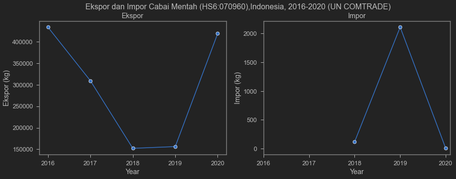
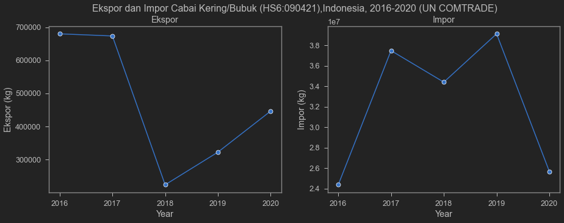

Chili is one of the most important commodities in Indonesia. Indonesians love chili. Even while studying abroad, I still bought sambal because chili is just that good. It's not only vital in various Indonesian dishes but also contains very high levels of vitamin C!

One morning, I saw a somewhat viral video of a farmer angrily kicking and stomping on his chili plants.

<blockquote class="twitter-tweet"><p lang="in" dir="ltr">Ngene Iki Lurrrrrr akibaté, nek Rego / Harga si-Lombok terjun bebas, murahnya kebangetan,..petani tekor, modal tanam tekadang pinjaman / kredit Bank, tahu kenapa...! <a href="https://t.co/IjTEcvZxO0">pic.twitter.com/IjTEcvZxO0</a></p>&mdash; Susilo Samin Blora (@Susilo_Blora) <a href="https://twitter.com/Susilo_Blora/status/1430780278364987394?ref_src=twsrc%5Etfw">August 26, 2021</a></blockquote> <script async src="https://platform.twitter.com/widgets.js" charset="utf-8"></script> 

According to the account I embedded above, the cause appears to be the collapse of chili prices during harvest. This is obviously heartbreaking. Imagine -- months of effort, cost, time, and energy, all lost when output prices plummet.

Another post I found quite interesting. I've embedded it below:

<blockquote class="twitter-tweet"><p lang="in" dir="ltr">lanjutannya. diambil dari sini sepertinya ya <a href="https://t.co/Lz4vNibZb6">https://t.co/Lz4vNibZb6</a> <a href="https://t.co/lthDKPFjvc">pic.twitter.com/lthDKPFjvc</a></p>&mdash; Krisna &#39;imed&#39; Gupta (@iMedKrisna) <a href="https://twitter.com/iMedKrisna/status/1431461097760976903?ref_src=twsrc%5Etfw">August 28, 2021</a></blockquote> <script async src="https://platform.twitter.com/widgets.js" charset="utf-8"></script> 

That post was interesting for two reasons. First, the account linked the phenomenon to the [Job Creation Law (UUCK)](https://peraturan.bpk.go.id/Home/Details/149750/uu-no-11-tahun-2020), claiming that now chili imports no longer need to consider domestic farmer production. Second, the account took an image and headline from a Bisnis.com article titled ["Chili Supply is in Surplus, So Why Are We Importing 27,851 Tons?"](https://ekonomi.bisnis.com/read/20210824/12/1433531/pasokan-cabai-surplus-kok-ada-impor-27851-ton).

Of course, what's interesting is that the article confirms the imports were dried/powdered chili for the manufacturing industry. Quoting the article:

> Bisnis.com, JAKARTA -- The Ministry of Agriculture states that the supply of various chilies for consumption in Indonesia is in surplus. Indonesia also imports chili to meet industrial needs.

> Director of Horticultural Product Processing and Marketing at the Ministry of Agriculture, Bambang Sugiharto, explained that the 27,851 tons of chili imported in the first semester of 2021 was to meet industrial needs. Chili was imported in the form of dried chili, crushed or ground chili, not fresh chili for consumption.

> Based on BPS data, national chili production in 2020 reached 2.77 million tons. This figure represents a 7.11% increase compared to 2019. Additionally, Indonesia exported various chilies valued at USD 25.18 million in 2020, up 69.86% from 2019.

Unfortunately, the account didn't provide a link to the actual article for its followers to read. Just a screenshot of the headline. Be careful, folks! Always question headline screenshots and always read the full article before sharing with a particular _prejudice_!

But regardless, I found the narrative quite interesting. The account linked the phenomenon to imports. In other words, chili prices fell because imports happened during the chili harvest season. Second, the account linked these imports to the UUCK.

It's obviously hard to prove this comprehensively and coherently. But maybe we can at least estimate a few things.

First, for imports to affect domestic prices, we need to at least examine the magnitude of imports relative to local production and exports. According to the article excerpt above, national production is 2.77 million tons. Moreover, Indonesia is actually a chili exporter!

Second, the claim that high chili imports are caused by the UUCK. This means that before the UUCK, imports should have been lower or even insignificant, then risen in 2020 and 2021.

Let's check with export-import data. For this post, I use [UN COMTRADE's](https://comtrade.un.org/Data/) API because the data is quite comprehensive and accessible to anyone. Skip this section if you don't want to see the code.

I'll pull total Indonesian export and import data to and from other countries. There are 2 goods I'll extract data for. First is Fresh Chili with HS 6-digit code 070960, which is alleged to be heavily imported since the UUCK took effect. Second is Dried Chili (non-crushed) with HS 6-digit code 090421, the product that was actually imported according to the article above. See -- fresh chili and dried chili have different HS codes. Dangerous to just read headlines.

From these two datasets, let's see whether we actually imported a lot of Fresh Chili starting from 2020, when the UUCK took effect. Unfortunately, UN COMTRADE doesn't have 2021 data yet. BPS has monthly data, but since not everyone has access, we'll hold off on 2021.

## Pulling data from UN COMTRADE

Pull via API from [UN COMTRADE](https://comtrade.un.org/Data/).


```python
# cari api key-nya di https://comtrade.un.org/Data/
api_key='/api/get?max=502&type=C&freq=A&px=HS&ps=2016%2C2017%2C2018%2C2019%2C2020&r=360&p=0&rg=2%2C1&cc=070960%2C090421'
url='https://comtrade.un.org/'+api_key+'&fmt=csv'
cabe=pd.read_csv(url)
# cek nama variabel
cabe.columns
```


    Index(['Classification', 'Year', 'Period', 'Period Desc.', 'Aggregate Level',
           'Is Leaf Code', 'Trade Flow Code', 'Trade Flow', 'Reporter Code',
           'Reporter', 'Reporter ISO', 'Partner Code', 'Partner', 'Partner ISO',
           '2nd Partner Code', '2nd Partner', '2nd Partner ISO',
           'Customs Proc. Code', 'Customs', 'Mode of Transport Code',
           'Mode of Transport', 'Commodity Code', 'Commodity', 'Qty Unit Code',
           'Qty Unit', 'Qty', 'Alt Qty Unit Code', 'Alt Qty Unit', 'Alt Qty',
           'Netweight (kg)', 'Gross weight (kg)', 'Trade Value (US$)',
           'CIF Trade Value (US$)', 'FOB Trade Value (US$)', 'Flag'],
          dtype='object')


Lots of variables. Let's keep only the important ones. I'll make two types of tables, one for Fresh Chili and one for Dried Chili.


```python
# Ambil variabel yg penting aja
cabe=cabe[['Year','Trade Flow','Commodity Code', 'Commodity',
           'Netweight (kg)', 'Trade Value (US$)']]
# Menyiapkan cabe mentah
xcabe_mentah=cabe.query('`Commodity Code` == 70960 & `Trade Flow` == "Export"').sort_values(by=['Year']).reset_index()
xcabe_mentah=xcabe_mentah[['Year','Netweight (kg)','Trade Value (US$)']]
xcabe_mentah=xcabe_mentah.rename(columns={"Netweight (kg)": "Ekspor (kg)",
                                          "Trade Value (US$)": "Ekspor (US$)"})
mcabe_mentah=cabe.query('`Commodity Code` == 70960 & `Trade Flow` == "Import"').sort_values(by=['Year']).reset_index()
mcabe_mentah=mcabe_mentah[['Year','Netweight (kg)','Trade Value (US$)']]
mcabe_mentah=mcabe_mentah.rename(columns={"Netweight (kg)": "Impor (kg)",
                                          "Trade Value (US$)": "Impor (US$)"})
#cabe_mentah=cabe_mentah.set_index('Year')
#cabe_mentah['Tahun']=pd.to_datetime(cabe_mentah['Year'],format='%Y')
xcabe_kering=cabe.query('`Commodity Code` == 90421 & `Trade Flow` == "Export"').sort_values(by=['Year']).reset_index()
xcabe_kering=xcabe_kering[['Year','Netweight (kg)','Trade Value (US$)']]
xcabe_kering=xcabe_kering.rename(columns={"Netweight (kg)": "Ekspor (kg)",
                                          "Trade Value (US$)": "Ekspor (US$)"})
mcabe_kering=cabe.query('`Commodity Code` == 90421 & `Trade Flow` == "Import"').sort_values(by=['Year']).reset_index()
mcabe_kering=mcabe_kering[['Year','Netweight (kg)','Trade Value (US$)']]
mcabe_kering=mcabe_kering.rename(columns={"Netweight (kg)": "Impor (kg)",
                                          "Trade Value (US$)": "Impor (US$)"})
```


## Fresh Chili

First let's check the fresh chili export-import table, along with the charts.


```python
cm=pd.merge(xcabe_mentah,mcabe_mentah,on='Year',how='outer')
print(cabe.Commodity.iloc[2])
print(cabe['Commodity Code'].iloc[2])
cm
```

    Vegetables; fruits of the genus capsicum or of the genus pimenta, fresh or chilled
    70960
    


<div>
<style scoped>
    .dataframe tbody tr th:only-of-type {
        vertical-align: middle;
    }

    .dataframe tbody tr th {
        vertical-align: top;
    }

    .dataframe thead th {
        text-align: right;
    }
</style>
<table border="1" class="dataframe">
  <thead>
    <tr style="text-align: right;">
      <th></th>
      <th>Year</th>
      <th>Ekspor (kg)</th>
      <th>Ekspor (US$)</th>
      <th>Impor (kg)</th>
      <th>Impor (US$)</th>
    </tr>
  </thead>
  <tbody>
    <tr>
      <th>0</th>
      <td>2016</td>
      <td>433825</td>
      <td>587063</td>
      <td>NaN</td>
      <td>NaN</td>
    </tr>
    <tr>
      <th>1</th>
      <td>2017</td>
      <td>309464</td>
      <td>635331</td>
      <td>NaN</td>
      <td>NaN</td>
    </tr>
    <tr>
      <th>2</th>
      <td>2018</td>
      <td>152292</td>
      <td>387459</td>
      <td>120.0</td>
      <td>526.0</td>
    </tr>
    <tr>
      <th>3</th>
      <td>2019</td>
      <td>156327</td>
      <td>316311</td>
      <td>2112.0</td>
      <td>4216.0</td>
    </tr>
    <tr>
      <th>4</th>
      <td>2020</td>
      <td>418972</td>
      <td>669580</td>
      <td>6.0</td>
      <td>37.0</td>
    </tr>
  </tbody>
</table>
</div>


```python
fig, axes = plt.subplots(1, 2, figsize=(15, 5))
fig.suptitle('Ekspor dan Impor Cabai Mentah (HS6:070960),Indonesia, 2016-2020 (UN COMTRADE)')
sns.lineplot(ax=axes[0], data=cm ,x='Year', y='Ekspor (kg)',marker='o')
axes[0].set_title('Ekspor (kg)')
axes[0].xaxis.set_ticks([2016,2017,2018,2019,2020])
sns.lineplot(ax=axes[1], data=mcabe_mentah ,x='Year', y='Impor (kg)',marker='o')
axes[1].set_title('Impor (kg)')
axes[1].xaxis.set_ticks([2016,2017,2018,2019,2020])
```


    [<matplotlib.axis.XTick at 0x26ed40c7ca0>,
     <matplotlib.axis.XTick at 0x26ed40c7c70>,
     <matplotlib.axis.XTick at 0x26ed40f9520>,
     <matplotlib.axis.XTick at 0x26ed41123a0>,
     <matplotlib.axis.XTick at 0x26ed4126df0>]


    

    


As shown in the table and chart above, our fresh chili imports are tiny. In 2020, when the UUCK took effect, imports didn't increase -- they actually fell. UN COMTRADE data says in 2020, Indonesia imported 6 kilograms of chili. This figure is clearly far below the 2.77 million ton production level. UNCOMTRADE has no fresh chili import data for 2016 and 2017, probably because we simply didn't import fresh chili in those years.

In fact, we're actually a net exporter of fresh chili. Quite interesting actually. This means our country is fairly competitive in chili production (perhaps?). Far from importing, we're exporting a lot! If so, why are farmers losing money? Are chili farmers just being dramatic?

Not necessarily! Many factors could be at play. It could be distribution to markets, someone might be hoarding supply, not all farmers may have access to export markets, consumer demand might be weak, or planting seasons might not be coordinated. For instance, during planting season everyone plants and nobody harvests, so chili is scarce at market. During harvest, everyone harvests simultaneously, creating a supply glut. When supply is high, prices crash.

There are many possible issues I don't fully understand. But clearly, imports are not the problem. Don't get me wrong -- there are many problems caused by import rents (and export rents), but apparently not for chili.

## Dried Chili (non-crushed)

One problem we could hypothesize is weak industrial absorption of farmers' chili. This would be reflected in dried chili imports. The logic: if there's an oversupply of fresh chili, those chilies should be usable for dried chili production, reducing dried chili imports. Let's look at how dried chili exports and imports look in the table and chart below.


```python
ck=pd.merge(xcabe_kering,mcabe_kering,on='Year',how='outer')
print(cabe.Commodity.iloc[10])
print(cabe['Commodity Code'].iloc[10])
ck
```

    Spices; fruits of the genus Capsicum or Pimenta, dried, neither crushed nor ground
    90421
    


<div>
<style scoped>
    .dataframe tbody tr th:only-of-type {
        vertical-align: middle;
    }

    .dataframe tbody tr th {
        vertical-align: top;
    }

    .dataframe thead th {
        text-align: right;
    }
</style>
<table border="1" class="dataframe">
  <thead>
    <tr style="text-align: right;">
      <th></th>
      <th>Year</th>
      <th>Ekspor (kg)</th>
      <th>Ekspor (US$)</th>
      <th>Impor (kg)</th>
      <th>Impor (US$)</th>
    </tr>
  </thead>
  <tbody>
    <tr>
      <th>0</th>
      <td>2016</td>
      <td>680078</td>
      <td>4497982</td>
      <td>24374457</td>
      <td>31019978</td>
    </tr>
    <tr>
      <th>1</th>
      <td>2017</td>
      <td>673598</td>
      <td>2393926</td>
      <td>37490445</td>
      <td>45749699</td>
    </tr>
    <tr>
      <th>2</th>
      <td>2018</td>
      <td>223126</td>
      <td>725423</td>
      <td>34409357</td>
      <td>51208284</td>
    </tr>
    <tr>
      <th>3</th>
      <td>2019</td>
      <td>321959</td>
      <td>934735</td>
      <td>39132270</td>
      <td>65280761</td>
    </tr>
    <tr>
      <th>4</th>
      <td>2020</td>
      <td>446247</td>
      <td>1095573</td>
      <td>25674802</td>
      <td>52323399</td>
    </tr>
  </tbody>
</table>
</div>


```python
fig, axes = plt.subplots(1, 2, figsize=(15, 5))
fig.suptitle('Ekspor dan Impor Cabai Kering/Bubuk (HS6:090421),Indonesia, 2016-2020 (UN COMTRADE)')

sns.lineplot(ax=axes[0], data=ck ,x='Year', y='Ekspor (kg)',marker='o')
axes[0].set_title('Ekspor')
axes[0].xaxis.set_ticks([2016,2017,2018,2019,2020])
sns.lineplot(ax=axes[1], data=ck ,x='Year', y='Impor (kg)',marker='o')
axes[1].set_title('Impor')
axes[1].xaxis.set_ticks([2016,2017,2018,2019,2020])
```


    [<matplotlib.axis.XTick at 0x26ed47da910>,
     <matplotlib.axis.XTick at 0x26ed47da8e0>,
     <matplotlib.axis.XTick at 0x26ed480bd90>,
     <matplotlib.axis.XTick at 0x26ed483f400>,
     <matplotlib.axis.XTick at 0x26ed482db50>]


    

    


Now dried chili is a different story. While there are exports, imports still dominate. The import scale in the chart is so large it had to be expressed in scientific notation (1e7 or $10^7$). Dried chili imports are large. I'm also not sure whether dried chili imports are controlled like fresh chili, but looking at the data, it shouldn't have too significant an impact on farmer prices. Indonesia has a very large food industry, so it's quite reasonable that it needs more supply than farmers can provide. Moreover, dried chili has a _storage_ advantage -- you can buy in bulk and store it. This means dried chili prices probably don't need to depend on harvest timing. Advantageous for industry.

The problem, of course, is when consumers also switch to buying dried chili. If the price gap is really that wide, even those who prefer fresh chili might opt for dried. As mentioned above, dried chili imports are large. How much is actually used by industry? Should we ban dried chili imports too? What about industries that use chili (like producers of [instant gado-gado sauce]()) that would have to buy chili at higher prices?

## The chili mystery

Regardless, low chili prices for farmers remain a problem. I dug around a bit on this chili issue and found only 1 paper that seems to agree that the problems are many, but not imports.

Muflikh et al. (2021)[^1] state that since 2016, Indonesia has completely stopped importing chili because the reference price policy has completely failed to control chili prices that are always volatile each year. This could influence why industry imports so much dried chili: abroad, dried chili producers have _free access_ to cheap fresh chili. Since domestic industry finds it hard to import fresh chili, they just import dried chili instead. As I mentioned earlier, Indonesia's food manufacturing industry is one of the largest and fastest growing.

Well, if the problem is low international prices, the problems of chili farmers are clearly far more fundamental than imports or the UUCK. Domestic fresh chili, despite farmers complaining about low prices, is still relatively more expensive than abroad. This remains problematic **even** amid the chili import ban. This shows domestic problems that are more fundamental than blaming imports.

Additionally, Muflikh et al. (2021) state:

> The volatility is caused mainly by seasonal production, unorganised market governance, and consumer preference for fresh chillies. 

In other words, Indonesia's chili price problems seem to be largely domestic issues.

## The UUCK mystery

Regarding the UUCK: chili price volatility has been happening for a long time, as have fresh chili import regulations and high dried chili imports. Fresh chili has been protected all along, and since 2016 there have been no fresh chili imports at all. Meanwhile, dried chili has never had import restrictions. What's supposed to become "more freely imported" if it's already free?

This means it's hard to blame the UUCK, at least for now. We may need to see 2021 data to clearly blame the UUCK, or examine implementing regulations that specifically target fresh and dried chili imports. The UUCK is indeed a controversial law. There's much we can criticize, but we should do so with a cool head and on target. Especially sharing headline screenshots without citing sources -- that should be avoided.

I'll stop here for now. I know quite a bit about international trade, but I'm no chili expert. Hopefully this post motivates those who want to advance agriculture, especially chili farming, in Indonesia. As I said, there seems to be room for a _rigorous study_ on chili in Indonesia, which could make for a very interesting thesis topic. Even better if you can do fieldwork. Hehe.

That's it for this post. Thanks for reading!

------------------------------------------------------------------------

## Updates

#### Ban on curly chili imports?

I've embedded some Twitter responses about chili in this section. If there's anything interesting I'll keep updating.

<blockquote class="twitter-tweet"><p lang="in" dir="ltr">Hrg cabe dlm negeri lg hancur, hrg hancur sdh berbulan², klo pun dipanen malah petani tambah merugi. Sebagian petani membiarkan cabenya membusuk dilahan.<br><br>Masyarakat konsumsi cabe segar jng cabe kering, krn kita kalah bersaing dng hrg cabe kering impor.<br><br>Mari kita diskusikan ini. <a href="https://t.co/dZD3SwSPr7">https://t.co/dZD3SwSPr7</a> <a href="https://t.co/nZcyT4QfBe">pic.twitter.com/nZcyT4QfBe</a></p>&mdash; Petani Rasional (@PetaniRasional) <a href="https://twitter.com/PetaniRasional/status/1431632092429905925?ref_src=twsrc%5Etfw">August 28, 2021</a></blockquote> <script async src="https://platform.twitter.com/widgets.js" charset="utf-8"></script> 

If the price difference is that large, even those who love fresh chili might choose dried. Not just industry -- household consumers might also opt for dried chili if fresh chili prices are high.

The solution: ban dried chili imports too? Maybe we'll discuss that in another post.

<blockquote class="twitter-tweet"><p lang="in" dir="ltr">Tujuan impor cabe kering yg harusnya untuk kebutuhan industri ((( KONON KATANYA ))), tetapi faktanya bocor sampai beredar dipasaran tradisional, ditambah lg petani dlm negri lg panen raya. Dampaknya harga cabe hancur dalam tempo waktu yg lama, petani menjerit. <a href="https://t.co/coalvk1m7L">pic.twitter.com/coalvk1m7L</a></p>&mdash; Petani Rasional (@PetaniRasional) <a href="https://twitter.com/PetaniRasional/status/1430719631887458307?ref_src=twsrc%5Etfw">August 26, 2021</a></blockquote> <script async src="https://platform.twitter.com/widgets.js" charset="utf-8"></script> 

#### Grow other commodities

The tweet below is also interesting: grow commodities that can be exported. Do your own market research and forget the government. Of course, not all farmers can do this, and it doesn't mean we should stop criticizing government agricultural programs.

<blockquote class="twitter-tweet"><p lang="in" dir="ltr">Mas,<br>Aku tanam Lemon California, walau gak begitu banyak. Di bulang juni-juli kemarin juga kena badai harga. Di petani anjlok sampai 1500-2000 perkilo. Sedang harga dipasaran tetap sama. Kenapa gak dipasarkan langsung? Mana ada waktu dan tenaganya. Belum lagi biayanya untuk itu.</p>&mdash; Calon Ketua RT (@bukanboslagi) <a href="https://twitter.com/bukanboslagi/status/1432002620969807876?ref_src=twsrc%5Etfw">August 29, 2021</a></blockquote> <script async src="https://platform.twitter.com/widgets.js" charset="utf-8"></script>

#### Subsidy difficulties and forming farmer groups

Poorly targeted subsidies seem to be par for the course in countries with bad bureaucracies. This tweet provides a more detailed account of the mess around fertilizer subsidies, from difficulty accessing them (hard to join farmer groups) to resale at market prices (instead of using the subsidized fertilizer, they resell it like rent seekers).

<blockquote class="twitter-tweet"><p lang="in" dir="ltr">Pupuk subsidi itu hanya diperoleh kelompok tani. Jgn lupa masih sgt banyak petani yg tdk masuk kelompok tani. Bentuk kelompok tani jg gak mudah di daerah.<br>Jd distribusi pupuk subsidi gak semulus yg dibayangkan. Kacaunya anggota kel tani jual balik pupuk subsidi dgn harga pasar.</p>&mdash; Andreas S Kurniawan (@ansyaku) <a href="https://twitter.com/ansyaku/status/1432143731503759363?ref_src=twsrc%5Etfw">August 30, 2021</a></blockquote> <script async src="https://platform.twitter.com/widgets.js" charset="utf-8"></script> 

[^1]: Muflikh, Y. N., Smith, C., Brown, C., & Aziz, A. A. (2021). Analysing price volatility in agricultural value chains using systems thinking: A case study of the Indonesian chilli value chain. Agricultural Systems, 192, 103179. https://doi.org/https://doi.org/10.1016/j.agsy.2021.103179 
