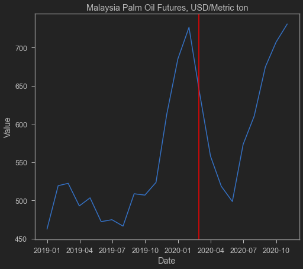
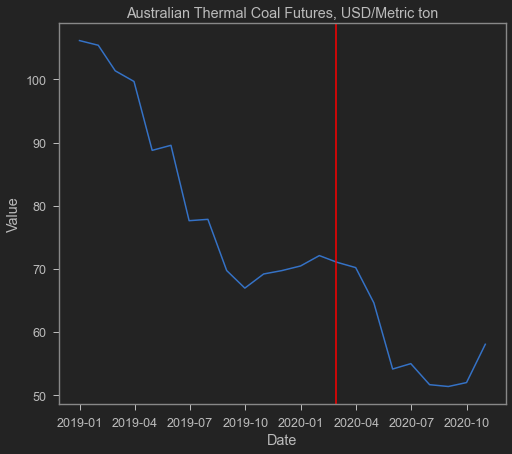
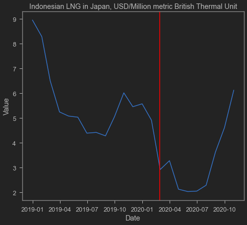
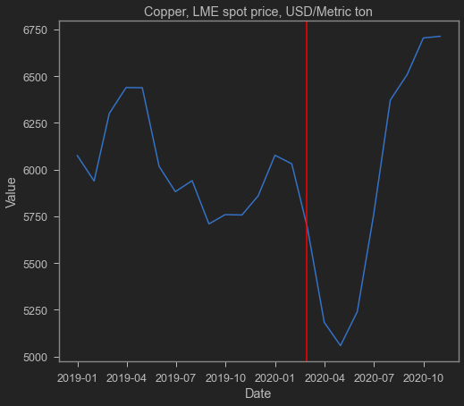
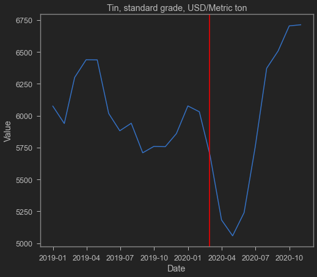
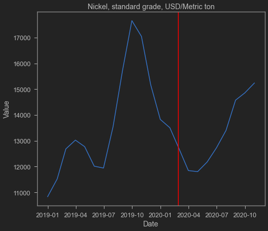

COVID-19 has certainly hit exports and imports. However, in recent months, Indonesia's trade balance has been showing increasing signs of surplus. I often explain that Indonesian manufacturing is heavily linked to Global Value Chains (GVCs), so [imports are needed for production and exports](https://krisna.netlify.app/post/imporinput/). Of course, amid COVID-19, production appears to have been hampered, and Indonesia's imports of semi-finished goods and capital seem to have declined. The government also dislikes imports, especially expensive capital imports that erode the rupiah.

Now, if you want exports only and don't like lots of imports, the best bet is commodity exports. Coal, CPO, and other mining products can simply be exported without complex production processes or value-added from imports. Indonesia is indeed very resource-rich and has often depended on commodity exports, from petroleum (a long time ago), to coal and other minerals, to the current star: CPO.

As China recovers and Western governments like the US and EU maintain high levels of *support*, demand for these goods keeps improving. This is reflected in the rising prices of commodities in the market. Below are some visualizations of key Indonesian commodity prices sourced from IMF.

The red vertical line marks late February 2020 / early March 2020, when COVID-19 was first detected in Indonesia.

One important note about coal: its trend had been declining recently. This aligns with the world moving away from coal toward renewable energy. With China also jumping on the decarbonization bandwagon, relying on coal may not be _sustainable_ going forward, and Indonesia needs to find new ways to maintain a stable current account.

Next time I'll update with export volumes too, not just prices. For now, this is what we have.

    <matplotlib.lines.Line2D at 0x1fcd1b7c610>

    <matplotlib.lines.Line2D at 0x1fcd1c6c3d0>

    <matplotlib.lines.Line2D at 0x1fcd1bf0580>

    <matplotlib.lines.Line2D at 0x1fcd1e74100>

    <matplotlib.lines.Line2D at 0x1fcd1d56430>

    <matplotlib.lines.Line2D at 0x1fcd1db49d0>

