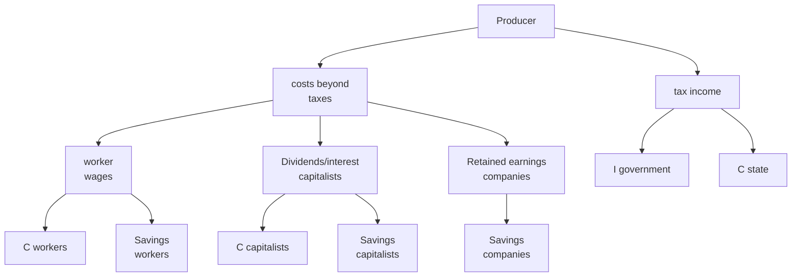
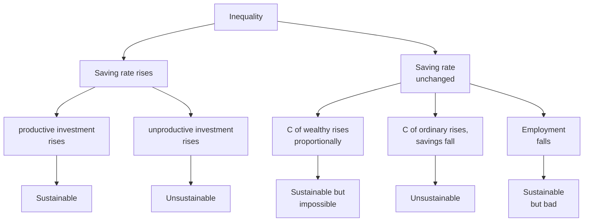

I recently finished Michael Pettis's book "The Great Rebalancing: Trade, Conflict, and the Perilous Road Ahead for the World Economy." The book discusses global economic imbalances caused by differences in savings and consumption rates between advanced and developing countries. Pettis argues that these imbalances could trigger a global economic crisis if left unaddressed.

I frequently use this argument when discussing international trade, for instance at a [Lembaga Manajemen UI event](https://www.krisna.or.id/talk/global-macroeconomic-imbalance/) some time ago.

In this post, I want to try unpacking the mechanism of inequality, saving rates, and their impact on the national (and global) economy, since an imbalance in one country will be mirrored by an imbalance in another. Then I'll briefly discuss conditions in Indonesia.

## Inequality, saving rate, and aftermath

In the book, Pettis argues that changes in saving rates are heavily influenced by income inequality in a country. Countries with high income inequality tend to have higher saving rates, because wealthy individuals tend to save more than poor individuals. Conversely, countries with lower income inequality tend to have lower saving rates, because poor individuals tend to spend most of their income on consumption.

He cites Federal Reserve Board Chairman Marriner Eccles:
> "A mass production has to be accompanied by mass consumption."

If the additional wealth created is not distributed well, then additional consumption will be smaller than that additional wealth, inequality rises along with a rising saving rate.

According to Pettis, this inequality process doesn't only occur between individuals (for example between fellow workers or fellow capitalists) or between classes, but can also occur between economic agents. That is, inequality (and consequently saving rates) can emerge if companies and the state control more income than the public.

Corporate wealth is different from the wealth of the capitalist class[^1]. The capitalist class only receives money from companies if the company distributes dividends, or the company pays interest on debt (to bond holders, or banks, whose profits are transferred to bank owners and the public as deposit interest). If the company retains earnings, whether to let it sit or reinvest, it becomes corporate wealth. So national savings also has corporate savings behind it. And Pettis argues, the larger the retained earnings (not distributed as employee bonuses or shareholder dividends), the higher the national saving rate[^2].

To illustrate, it's roughly like this. First, let's consider Earth as one closed economic system (we can't yet trade with the Moon or Mars).

$$
GDP = C + I
$$

All output can only become consumption, while the rest becomes investment for tomorrow. C and I are calculated from:

Total GDP from the production side is calculated from producer value added, while GDP from the expenditure side is C + I. Total C is workers' C + capitalists' C + state C, and total I is workers' savings + capitalists' savings + corporate I + government I. GDP from both sides must be equal. BPS calculates this every quarter.

According to Pettis, inequality leads to a higher saving rate vis-a-vis consumption rate. When inequality occurs through rising retained earnings rather than worker wages or capitalist dividends, total C automatically falls because reinvested earnings all become corporate I[^3].

Of course, the government's share can also be increased by, for example, raising the tax ratio or expanding SOE roles. After that, it's up to the government whether to increase C (e.g., subsidies or simply running administration by paying employee salaries) or increase I (e.g., building a high-speed rail or a new city. For example).

Let's assume a sudden **transfer from ordinary parties to wealthy parties**, without affecting GDP (a strong assumption, but let's set it aside for now). This wealthy party could be a transfer from poor to rich people, but could also be from the public to companies or to the state.

Pettis's framework is quite simple. It can be illustrated with the following diagram:

Although the diagram above looks dichotomous, in reality everything could occur in proportions simultaneously.

According to Pettis, the dominant scenario that occurred in Spain, Portugal, Italy, Greece, and the United States is the scenario where ordinary people's consumption rises while their saving rate falls. This can manifest as rising household debt to finance daily consumption, or at minimum, people who struggle to save because their salary is barely enough to survive. In other words, savings that increase among the wealthy (for example [tech companies in the US](https://www.economist.com/business/2017/06/03/tech-firms-hoard-huge-cash-piles)), are "compensated" by falling savings among ordinary people. High asset prices from wealthy people's investments make ordinary people feel rich, so the inequality doesn't feel so acute. But can asset prices keep rising forever?

But when talking about the US, which is a deficit country, their aggregate saving rate is actually very low despite tech companies having lots of money. This happens because the US's low saving rate is offset by other countries' high saving rates, especially China, Taiwan, Japan, and Germany. Particularly in China and Japan, state assets are quite high due to high foreign reserve accumulation. So the one saving abroad is the Central Bank. This is explained more fully in Pettis's book and articles.

Which scenario is playing out in Indonesia?

## What about Indonesia?

Recently, Pak Haryo also [posted](https://x.com/Aswicahyono/status/1967069732009566245?s=20) Indonesia's GINI figures. The higher the number, the higher the income inequality in a country.

<blockquote class="twitter-tweet">
Dari data SWIID (Standardized World Income Inequality Database) saya bandingkan Gini IDN vs 3 negara tetangga  Negara2 lain gini_disp (Gini setelah pajak, biru) lebih rendah dari gini-mkt (Gini sebelum pajak, merah). Tapi data IDN kebalik. Apa perpajakan di IDN ~&gt; REGRESIF? <a href="https://t.co/27CeKEot3l">https://t.co/27CeKEot3l</a> <a href="https://t.co/kNi71CFShk">pic.twitter.com/kNi71CFShk</a>
&mdash; Haryo Aswicahyono (@Aswicahyono) <a href="https://twitter.com/Aswicahyono/status/1967069732009566245?ref_src=twsrc%5Etfw">September 14, 2025</a></blockquote> 

Indonesia's GINI coefficient increased quite significantly (especially the post-transfer/tax measure) around the period after 2001. Around that time, China joined the WTO and prices for mineral and vegetable oil commodities surged sharply. This commodity price increase roughly plateaued after around 2011. The commodity industry is one with quite high inequality because it's capital-intensive. When this industry grows, the income gains are enjoyed by relatively fewer workers. [Pasaribu and Hill](https://www.jstor.org/stable/27193068) discuss this more fully.

I'm not too surprised because I once checked saving rates in [this post](https://www.krisna.or.id/post/consumption/). I tried to examine the dynamics of inequality and saving rates in Indonesia. My premise at the time was that I was quite taken aback by Indonesia's net exports surging dramatically in 2022. This means our external savings rose significantly. I then started exploring BPS data, and yes, the saving rate of the bottom 20% of households was negative. I also found World Bank research showing a declining labor share of income. I ended up looking at GINI ratios not just recently but also during the commodity boom years, finding charts that are broadly similar to what Pak Haryo presented.

Clearly this doesn't look great, especially since recently there has been a lot of _discontent_ among the public, who increasingly feel that Indonesia's economic growth isn't being shared broadly. I also wanted to write about the government's efforts to increase the saving rate, including converting SOEs from mandatory PNBP payments to the state (which is spent on consumption, presumably) into fresh funds for Danantara to be invested. Also the rising SAL balance, essentially reducing government consumption in favor of savings for financial sector injection.

Well, at least let's hope this rising saving rate becomes productive investment and not unproductive speculation! That's it for this post, hope it's useful.

[^1]: My use of the term "class" is completely value-neutral and purely definitional. The "classes" I describe aren't really dichotomous. Workers who receive wages can also own capital that generates returns.

[^2]: Income inequality through capital income (interest and dividends) vs. wage income is also called "compositional inequality," discussed quite thoroughly by [Branko Milanovic](https://branko2f7.substack.com/p/new-capitalism-ii-compositional-vs), author of "Capitalism, Alone."

[^3]: Why does it all become I? Because all income not consumed becomes I. Of course, if retained earnings just sit in a bank account, they're still counted as I. This is simply accounting.
