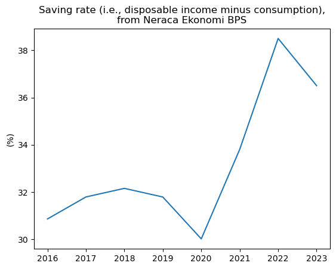
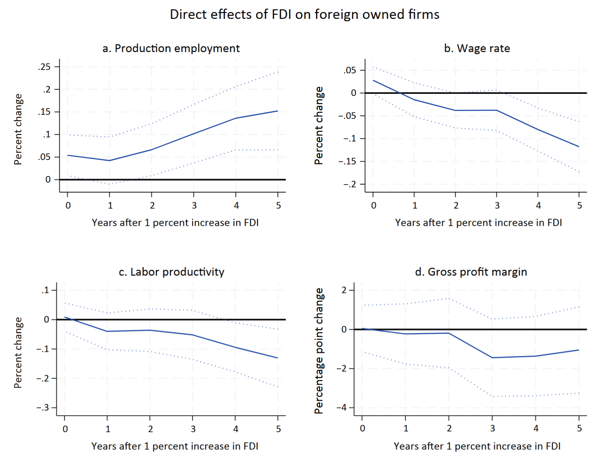
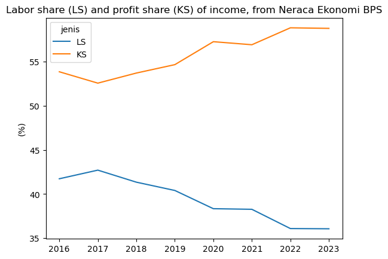

Recently, there have been many reports about the weakening of Indonesia's middle class. The middle class in Indonesia has been shrinking since 2018 and now [makes up only 17% of the total population](https://databoks.katadata.co.id/infografik/2024/09/05/populasi-kelas-menengah-indonesia-kian-berkurang). However, consumption growth often relies on the middle class. Unsurprisingly, Indonesia's consumption growth has long lagged behind that of other countries in the region, except Thailand.  

<iframe src="https://data.worldbank.org/share/widget?end=2023&indicators=NE.CON.TOTL.KD.ZG&locations=ID-TH-VN-PH-MY&start=2013" width='900' height='600' frameBorder='0' scrolling="no" ></iframe>

Indonesia's consumption growth has been below the general pace of economic growth for quite some time. How is it possible for economic growth to outpace consumption growth?  

One explanation is that this economic growth benefits those with a low _consumption share_. Consumption share refers to the portion of an individual’s income spent on consumption. Typically, this group consists of wealthy individuals or corporations. These entities already have high consumption levels. Any additional income is more likely to be allocated toward increasing assets (savings) or spending abroad. I previously discussed this issue in [The Conversation Indonesia](https://theconversation.com/jokowi-resah-tabungan-mengendap-rp-690-triliun-di-bank-betulkah-masyarakat-yang-harus-belanja-200929).  

I will attempt to explore this theory by presenting two points: (1) Indonesia’s saving rate is increasing, and (2) the labor share is decreasing. I illustrate these two points using data from [Total Economy - Integrated Institutional Sector Accounts (trillion rupiahs), 2016 - 2023](https://www.bps.go.id/id/statistics-table/1/MjE4MSMx/total-ekonomi---neraca-institusi-terintegrasi---triliun-rupiah---2016---2023.html) from BPS. This balance sheet is a very useful and interesting dataset as it includes calculations from all three methods of calculating Gross Domestic Product (GDP). I have made slight adjustments to the data, which can be viewed at the end of this post.  

## Increasing Saving Rate  

The saving rate reflects the proportion of income saved by the population. A high saving rate indicates that people save more than they spend on consumption. As discussed above, the economic balance sheet does not differentiate the owners of the saving rate, but a significant increase in the saving rate typically signals a rising income share among groups more likely to save, such as wealthy individuals or corporations.  


```python
import seaborn as sns
import matplotlib as plt
import pandas as pd
```


```python
data=pd.read_excel("neraca.xlsx",sheet_name="Sheet3")
dat=data[["tahun","LS","KS"]]
dat=dat.melt("tahun",var_name="jenis",value_name="nilai")
det=data[["tahun","srhh"]]
```


```python
ax=sns.lineplot(data=det,x="tahun",y="srhh")
ax.set(xlabel="",ylabel="(%)",title="Saving rate (i.e., disposable income minus consumption),\nfrom Neraca Ekonomi BPS")
```


    [Text(0.5, 0, ''),
     Text(0, 0.5, '(%)'),
     Text(0.5, 1.0, 'Saving rate (i.e., disposable income minus consumption),\nfrom Neraca Ekonomi BPS')]


    

    


Since 2016, Indonesia's saving rate has continued to increase. COVID-19 forced everyone to reduce their savings, even increasing debt to maintain consumption. However, since then, the saving rate has risen again, even higher than usual. It seems that COVID-19 really dealt a blow to Indonesian consumers.  

## Declining Labor Share  

Some analysts say that one of the problems is weak wage growth. Reed, Pasha, and Gonzales, in [their report for the World Bank Group](https://documents1.worldbank.org/curated/en/099754312062434827/pdf/IDU11c5662011a9eb14aee18baa1e0efad04ad35.pdf), wrote about weak wage growth and profits in manufacturing companies with high foreign ownership. The image excerpt below is from the report.  

  

In the economic balance sheet, we can also calculate how much _primary income_ is allocated for various purposes. I divide it into three: taxes, employee expenses, and profits. Profits consist of income that has already been reduced by taxes and employee expenses. I’ve plotted this below, but I excluded taxes as the amount is very small, around 5% of the total balance sheet[^1].  

[^1]: This 5% figure is quite interesting because Indonesia's corporate income tax rate is much higher than that. This could make for an entire post on its own—maybe another time.  


```python
ax=sns.lineplot(data=dat,x="tahun",y="nilai",hue="jenis",palette="tab10")
ax.set(xlabel="",ylabel="(%)",title="Labor share (LS) and profit share (KS) of income, from Neraca Ekonomi BPS")
```


    [Text(0.5, 0, ''),
     Text(0, 0.5, '(%)'),
     Text(0.5, 1.0, 'Labor share (LS) and profit share (KS) of income, from Neraca Ekonomi BPS')]


    

    


And it’s quite apparent that there has been progressive growth in the share of income absorbed by companies. As hypothesized above, an increase in the income share for companies is more likely to be saved, while an increase in the income share for employees is more likely to be consumed. So, at least based on this result, it makes sense.

Anyway, this post is actually just to share the chart. We can have a discussion outside of this post. Let me know what you think.

Below is the data I used. All of it was downloaded from [Total Economy - Integrated Institutional Sector Accounts (trillion rupiahs), 2016 - 2023](https://www.bps.go.id/id/statistics-table/1/MjE4MSMx/total-ekonomi---neraca-institusi-terintegrasi---triliun-rupiah---2016---2023.html) with slight adjustments.


```python
data
```


<div>
<style scoped>
    .dataframe tbody tr th:only-of-type {
        vertical-align: middle;
    }

    .dataframe tbody tr th {
        vertical-align: top;
    }

    .dataframe thead th {
        text-align: right;
    }
</style>
<table border="1" class="dataframe">
  <thead>
    <tr style="text-align: right;">
      <th></th>
      <th>tahun</th>
      <th>L</th>
      <th>K</th>
      <th>T</th>
      <th>va/output</th>
      <th>LS</th>
      <th>TS</th>
      <th>KS</th>
      <th>srhh</th>
    </tr>
  </thead>
  <tbody>
    <tr>
      <th>0</th>
      <td>2016</td>
      <td>40.576885</td>
      <td>55.127270</td>
      <td>4.295845</td>
      <td>52.877975</td>
      <td>41.728750</td>
      <td>4.435895</td>
      <td>53.835356</td>
      <td>30.864658</td>
    </tr>
    <tr>
      <th>1</th>
      <td>2017</td>
      <td>41.472019</td>
      <td>53.934836</td>
      <td>4.593145</td>
      <td>53.108782</td>
      <td>42.704020</td>
      <td>4.746633</td>
      <td>52.549347</td>
      <td>31.795110</td>
    </tr>
    <tr>
      <th>2</th>
      <td>2018</td>
      <td>39.977940</td>
      <td>55.237447</td>
      <td>4.784614</td>
      <td>52.986106</td>
      <td>41.343331</td>
      <td>4.965863</td>
      <td>53.690807</td>
      <td>32.159447</td>
    </tr>
    <tr>
      <th>3</th>
      <td>2019</td>
      <td>39.252272</td>
      <td>55.950651</td>
      <td>4.797077</td>
      <td>52.971298</td>
      <td>40.403369</td>
      <td>4.954449</td>
      <td>54.642181</td>
      <td>31.793236</td>
    </tr>
    <tr>
      <th>4</th>
      <td>2020</td>
      <td>37.304707</td>
      <td>58.410155</td>
      <td>4.285138</td>
      <td>53.170697</td>
      <td>38.341668</td>
      <td>4.418889</td>
      <td>57.239443</td>
      <td>30.021169</td>
    </tr>
    <tr>
      <th>5</th>
      <td>2021</td>
      <td>37.283856</td>
      <td>58.021987</td>
      <td>4.694157</td>
      <td>53.484228</td>
      <td>38.272325</td>
      <td>4.833429</td>
      <td>56.894245</td>
      <td>33.807914</td>
    </tr>
    <tr>
      <th>6</th>
      <td>2022</td>
      <td>35.453018</td>
      <td>59.557783</td>
      <td>4.989199</td>
      <td>53.799988</td>
      <td>36.094115</td>
      <td>5.095040</td>
      <td>58.810845</td>
      <td>38.504459</td>
    </tr>
    <tr>
      <th>7</th>
      <td>2023</td>
      <td>34.970118</td>
      <td>60.019108</td>
      <td>5.010774</td>
      <td>53.400921</td>
      <td>36.068580</td>
      <td>5.184493</td>
      <td>58.746927</td>
      <td>36.506632</td>
    </tr>
  </tbody>
</table>
</div>


```python

```
