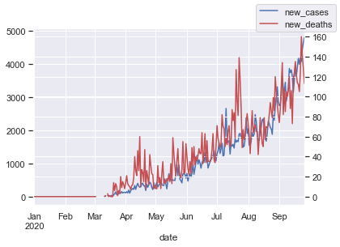
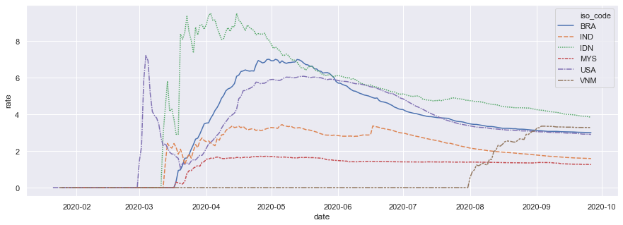

This morning, as usual, I prepared breakfast, did the dishes, all while listening to a podcast. One of my favorite, [Babbage](https://www.economist.com/podcasts/2020/09/23/the-pandemics-progress-what-is-the-next-stage-in-the-fight-against-covid-19) aired the recent development of COVID-19, including the decreasing death rate across the world.

As cases grow, we should expect a still increasing death rate as well. What happens is the contrary. [Slavea Chankova](https://mediadirectory.economist.com/people/slavea-chankova/), the healthcare-correspondent at The Economist, said that healthcare workers now have the knowledge to better treat COVID-19 patients. They also able to reduce the use of ICU bed, which is a good thing.

Other publications also say similar things. A post from [The Conversation](https://theconversation.com/coronavirus-why-arent-death-rates-rising-with-case-numbers-145865) says that the decreased death rate is the result of increased proportion of young age. As test capacity increases, the death rate converges to the 'true' death rate.

## What about Indonesia?
Furthermore, [The Conversation post](https://theconversation.com/coronavirus-why-arent-death-rates-rising-with-case-numbers-145865) shows a graph where albeit increased number of new cases, new deaths are going down. This is in UK btw.


This is in UK

This is not the case in Indonesia. I try to re-create the graph for Indonesian context using data from [Our World in Data](https://ourworldindata.org/coronavirus)


```python
import pandas as pd
import seaborn as sns; sns.set()
import matplotlib.pyplot as plt
c=pd.read_csv("https://raw.githubusercontent.com/owid/covid-19-data/master/public/data/owid-covid-data.csv")
c['date']=pd.to_datetime(c['date'])
```


```python
y1=c['new_cases'][c['iso_code']=='IDN']
y2=c['new_deaths'][c['iso_code']=='IDN']
x=c['date'][c['iso_code']=='IDN']
df=pd.DataFrame({'date':x,'new_cases':y1,'new_deaths':y2})
plt.figure(figsize=(15,5))
ax = df.plot(x='date', y='new_cases', legend=False)
ax2 = ax.twinx()
df.plot(x='date', y='new_deaths', ax=ax2, legend=False, color="r")
ax.figure.legend()
plt.show()

#nt=sns.load_dataset("c")
#sns.lineplot(x=x, y=y, data=c)
# sns.lineplot(x=x, y=y4, data=c)
```





As you can see from the graph above, Indonesia's new deaths are still on the increase as new cases goes up. New cases in Indonesia is [still increasing](https://tirto.id/update-corona-indonesia-24-september-angka-kematian-capai-10-ribu-f48j), with new record breaking number of cases every day. Indeed, Indonesia, albeit its ability to ramp-up testing capacity, is still being criticised for [not testing enough.](https://theconversation.com/3-overlooked-facts-behind-indonesias-high-covid-19-death-rate-135223)

## Death Ratio is converging

But when in comes to death rate, Indonesia is indeed converging to the world. [The Jakarta Post](https://www.thejakartapost.com/news/2020/08/05/indonesias-covid-19-mortality-rate-still-tops-global-average-task-force.html), citing the satgas' spokeperson Wiku Adisasmito, report that Indonesia's death rate is constantly decreasing since April, although still above the world's average.This may be at least a silver lining, although in Indonesia there's also a ruckuss about [the government trying to propose change the definition of COVID-19 death](https://katadata.co.id/pingitaria/berita/5f6b179d9567c/polemik-usulan-perubahan-definisi-angka-kematian-covid-19).

using $death rate = \frac{total cases}{total deaths} * 100$ , I try to illustrate Indonesia's death rate and compare them to some countries I feel comparable. Data from [Our World in Data](https://ourworldindata.org/coronavirus).


```python
cn=c[(c['iso_code'] == 'IDN') | (c['iso_code'] == 'IND') | (c['iso_code'] == 'BRA')  | (c['iso_code'] == 'USA') | (c['iso_code'] == 'VNM') | (c['iso_code'] == 'MYS')]
cn['rate']=cn['total_deaths']/cn['total_cases']*100
plt.figure(figsize=(15,5))
#nt=sns.load_dataset("c")
#sns.lineplot(x=x, y=y, data=c)
sns.lineplot(x="date", y="rate", hue="iso_code", style="iso_code",data=cn)
```



Apart from Vietnam, the deathrate among these countries seem to have similar patterns. The explanation might be similar: better knowledge on how to treat patient, more, converging tests, and increased fraction of young population.

## So, all is good?
Not necessarily. Remember, Indonesia's case is still increasing fast, and with it, its new deaths. [Hospital capacity](https://katadata.co.id/ekarina/berita/5f5f0c5f3618e/kapasitas-rumah-sakit-hampir-penuh-dokter-dukung-psbb-jakarta) and [the availability of healthcare workers](https://www.kompas.com/tren/read/2020/08/13/080500665/berikut-4-rs-yang-sempat-ditutup-karena-tenaga-medisnya-terpapar-covid-19?page=all) are increasingly become issues in handling COVID-19. This is still a big concern.

Naively speaking, there are two possible ways to handle this. One is to decrease the viral infection's sped (so called flattening the curve), and the other is to improve healthcare capacity. Which one's easier?

Another big recent news in Indonesia is the resignation of [Professor Akmal Taher,](https://www.thejakartapost.com/news/2020/09/25/top-indonesian-doctor-quits-covid-19-task-force.html) a respectable doctor, from Indonesia's COVID-19 task force. His reason was that improving testing and tracing would be easier to be done from outside of the task force. To me, this is very interesting development. What other place with better authority and resource to improve testing and tracing? Resource-wise, there can't be a better place?

Does this means the top structure of the task force does not put testing and tracing as the main strategy? It is possible that the task force is prioritizing healthcare infrastructure, which is not what Akmal Taher would want. Me, being nobody, have not enough information to assess the best strategy in handling COVID-19, but it does seem that Indonesian government is having a lot of problems in terms of conducting a proper test and trace. Does that mean it is easier to buy hospital beds and recruit doctors and nurses?

Alas, this post provides more question than answer. So what do you think? Testing and tracing or improving healthcare capacity? Or both?
