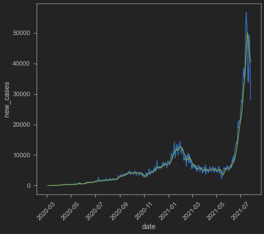
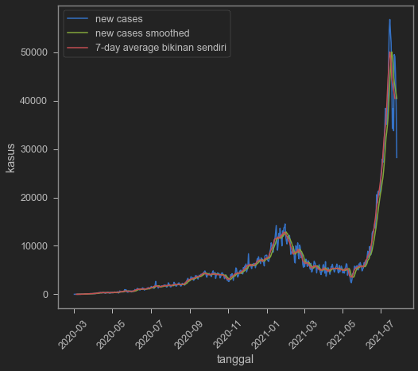
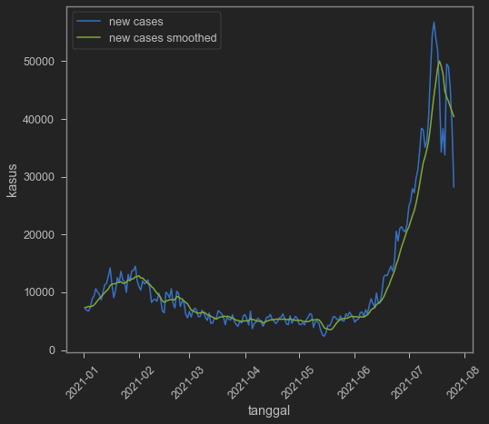
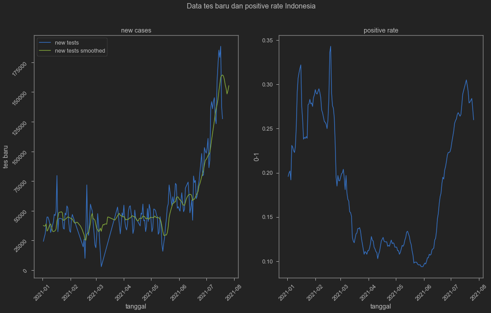
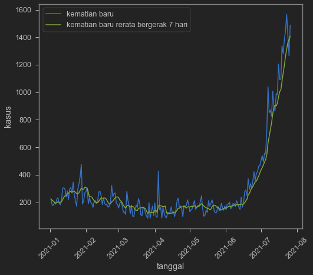

It has been a while since i last wrote about COVID-19. Today i'd like to check out Indonesia's statistic on COVID-19, especially since it seem to get worse these days, unfortunately, and so many people talked about possibility of the government intentionally undertest to push down new cases at the cost of human lives.

<blockquote class="twitter-tweet"><p lang="in" dir="ltr">Penambahan kasus Covid-19 harian cenderung menurun. Hal ini terjadi seiring dengan turunnya jumlah pemeriksaan secara signifikan. Masih terlalu dini untuk menyimpulkan bahwa gelombang Covid-19 telah terkendali. <a href="https://twitter.com/hashtag/Humaniora?src=hash&amp;ref_src=twsrc%5Etfw">#Humaniora</a> <a href="https://twitter.com/hashtag/AdadiKompas?src=hash&amp;ref_src=twsrc%5Etfw">#AdadiKompas</a> <a href="https://twitter.com/aik_arif?ref_src=twsrc%5Etfw">@aik_arif</a> <a href="https://t.co/eYvloMmpIC">https://t.co/eYvloMmpIC</a></p>&mdash; Harian Kompas (@hariankompas) <a href="https://twitter.com/hariankompas/status/1417642983227236357?ref_src=twsrc%5Etfw">July 21, 2021</a></blockquote> <script async src="https://platform.twitter.com/widgets.js" charset="utf-8"></script> 

I rely heavily on [Our World in Data](https://ourworldindata.org/coronavirus-source-data#deaths-and-cases-our-data-source) [^1] which give [free access of COVID-19 data](https://github.com/owid/covid-19-data/tree/master/public/data).

[^1]: Hannah Ritchie, Esteban Ortiz-Ospina, Diana Beltekian, Edouard Mathieu, Joe Hasell, Bobbie Macdonald, Charlie Giattino, Cameron Appel, Lucas Rodés-Guirao and Max Roser (2020) - "Coronavirus Pandemic (COVID-19)". Published online at OurWorldInData.org. Retrieved from: 'https://ourworldindata.org/coronavirus' [Online Resource]

Grab the data and show 6 tops


```python
url='https://covid.ourworldindata.org/data/owid-covid-data.csv' # simpan url
df=pd.read_csv(url, parse_dates=['date']) # download dari url. parse_dates untuk menjadikan kolom date jadi tipe waktu
df.head(6) # menampilkan 10 baris paling atas
```


<div>
<style scoped>
    .dataframe tbody tr th:only-of-type {
        vertical-align: middle;
    }

    .dataframe tbody tr th {
        vertical-align: top;
    }

    .dataframe thead th {
        text-align: right;
    }
</style>
<table border="1" class="dataframe">
  <thead>
    <tr style="text-align: right;">
      <th></th>
      <th>iso_code</th>
      <th>continent</th>
      <th>location</th>
      <th>date</th>
      <th>total_cases</th>
      <th>new_cases</th>
      <th>new_cases_smoothed</th>
      <th>total_deaths</th>
      <th>new_deaths</th>
      <th>new_deaths_smoothed</th>
      <th>...</th>
      <th>extreme_poverty</th>
      <th>cardiovasc_death_rate</th>
      <th>diabetes_prevalence</th>
      <th>female_smokers</th>
      <th>male_smokers</th>
      <th>handwashing_facilities</th>
      <th>hospital_beds_per_thousand</th>
      <th>life_expectancy</th>
      <th>human_development_index</th>
      <th>excess_mortality</th>
    </tr>
  </thead>
  <tbody>
    <tr>
      <th>0</th>
      <td>AFG</td>
      <td>Asia</td>
      <td>Afghanistan</td>
      <td>2020-02-24</td>
      <td>1.0</td>
      <td>1.0</td>
      <td>NaN</td>
      <td>NaN</td>
      <td>NaN</td>
      <td>NaN</td>
      <td>...</td>
      <td>NaN</td>
      <td>597.029</td>
      <td>9.59</td>
      <td>NaN</td>
      <td>NaN</td>
      <td>37.746</td>
      <td>0.5</td>
      <td>64.83</td>
      <td>0.511</td>
      <td>NaN</td>
    </tr>
    <tr>
      <th>1</th>
      <td>AFG</td>
      <td>Asia</td>
      <td>Afghanistan</td>
      <td>2020-02-25</td>
      <td>1.0</td>
      <td>0.0</td>
      <td>NaN</td>
      <td>NaN</td>
      <td>NaN</td>
      <td>NaN</td>
      <td>...</td>
      <td>NaN</td>
      <td>597.029</td>
      <td>9.59</td>
      <td>NaN</td>
      <td>NaN</td>
      <td>37.746</td>
      <td>0.5</td>
      <td>64.83</td>
      <td>0.511</td>
      <td>NaN</td>
    </tr>
    <tr>
      <th>2</th>
      <td>AFG</td>
      <td>Asia</td>
      <td>Afghanistan</td>
      <td>2020-02-26</td>
      <td>1.0</td>
      <td>0.0</td>
      <td>NaN</td>
      <td>NaN</td>
      <td>NaN</td>
      <td>NaN</td>
      <td>...</td>
      <td>NaN</td>
      <td>597.029</td>
      <td>9.59</td>
      <td>NaN</td>
      <td>NaN</td>
      <td>37.746</td>
      <td>0.5</td>
      <td>64.83</td>
      <td>0.511</td>
      <td>NaN</td>
    </tr>
    <tr>
      <th>3</th>
      <td>AFG</td>
      <td>Asia</td>
      <td>Afghanistan</td>
      <td>2020-02-27</td>
      <td>1.0</td>
      <td>0.0</td>
      <td>NaN</td>
      <td>NaN</td>
      <td>NaN</td>
      <td>NaN</td>
      <td>...</td>
      <td>NaN</td>
      <td>597.029</td>
      <td>9.59</td>
      <td>NaN</td>
      <td>NaN</td>
      <td>37.746</td>
      <td>0.5</td>
      <td>64.83</td>
      <td>0.511</td>
      <td>NaN</td>
    </tr>
    <tr>
      <th>4</th>
      <td>AFG</td>
      <td>Asia</td>
      <td>Afghanistan</td>
      <td>2020-02-28</td>
      <td>1.0</td>
      <td>0.0</td>
      <td>NaN</td>
      <td>NaN</td>
      <td>NaN</td>
      <td>NaN</td>
      <td>...</td>
      <td>NaN</td>
      <td>597.029</td>
      <td>9.59</td>
      <td>NaN</td>
      <td>NaN</td>
      <td>37.746</td>
      <td>0.5</td>
      <td>64.83</td>
      <td>0.511</td>
      <td>NaN</td>
    </tr>
    <tr>
      <th>5</th>
      <td>AFG</td>
      <td>Asia</td>
      <td>Afghanistan</td>
      <td>2020-02-29</td>
      <td>1.0</td>
      <td>0.0</td>
      <td>0.143</td>
      <td>NaN</td>
      <td>NaN</td>
      <td>0.0</td>
      <td>...</td>
      <td>NaN</td>
      <td>597.029</td>
      <td>9.59</td>
      <td>NaN</td>
      <td>NaN</td>
      <td>37.746</td>
      <td>0.5</td>
      <td>64.83</td>
      <td>0.511</td>
      <td>NaN</td>
    </tr>
  </tbody>
</table>
<p>6 rows × 60 columns</p>
</div>


I am not super familiar with its variable. So let's check them out with `df.columns`.


```python
df.columns # untuk panggil list dari nama-nama variabel
```


    Index(['iso_code', 'continent', 'location', 'date', 'total_cases', 'new_cases',
           'new_cases_smoothed', 'total_deaths', 'new_deaths',
           'new_deaths_smoothed', 'total_cases_per_million',
           'new_cases_per_million', 'new_cases_smoothed_per_million',
           'total_deaths_per_million', 'new_deaths_per_million',
           'new_deaths_smoothed_per_million', 'reproduction_rate', 'icu_patients',
           'icu_patients_per_million', 'hosp_patients',
           'hosp_patients_per_million', 'weekly_icu_admissions',
           'weekly_icu_admissions_per_million', 'weekly_hosp_admissions',
           'weekly_hosp_admissions_per_million', 'new_tests', 'total_tests',
           'total_tests_per_thousand', 'new_tests_per_thousand',
           'new_tests_smoothed', 'new_tests_smoothed_per_thousand',
           'positive_rate', 'tests_per_case', 'tests_units', 'total_vaccinations',
           'people_vaccinated', 'people_fully_vaccinated', 'new_vaccinations',
           'new_vaccinations_smoothed', 'total_vaccinations_per_hundred',
           'people_vaccinated_per_hundred', 'people_fully_vaccinated_per_hundred',
           'new_vaccinations_smoothed_per_million', 'stringency_index',
           'population', 'population_density', 'median_age', 'aged_65_older',
           'aged_70_older', 'gdp_per_capita', 'extreme_poverty',
           'cardiovasc_death_rate', 'diabetes_prevalence', 'female_smokers',
           'male_smokers', 'handwashing_facilities', 'hospital_beds_per_thousand',
           'life_expectancy', 'human_development_index', 'excess_mortality'],
          dtype='object')


There's a huge chunk of variable names! Musta been a super hard work collecting all the data. Shout out to Hannah Ritchie et al.

Aight now let's check new cases! New cases tends to be volatile, especially if there's seasonality in the data itself. It is quite common to see seasonality on daily data just because of weekends. Thankfully, there's `new_cases_smoothed` which I imagine take into account seasonality by plotting 7-day rolling average. I only take Indonesian data for this post.


```python
indo=df[["iso_code","date","new_cases","new_cases_smoothed"]].query('iso_code == "IDN"')
```

Plot time!


```python
sns.lineplot(data=indo,x='date',y='new_cases')
sns.lineplot(data=indo,x='date',y='new_cases_smoothed')
plt.xticks(rotation=45)
```


    (array([18322., 18383., 18444., 18506., 18567., 18628., 18687., 18748.,
            18809.]),
     [Text(0, 0, ''),
      Text(0, 0, ''),
      Text(0, 0, ''),
      Text(0, 0, ''),
      Text(0, 0, ''),
      Text(0, 0, ''),
      Text(0, 0, ''),
      Text(0, 0, ''),
      Text(0, 0, '')])


    

    


I try to make my own 7-day rolling average by [copying codes from here](https://datavizpyr.com/how-to-make-a-time-series-plot-with-rolling-average-in-python/) 


```python
indo['cases_7day_ave'] = indo.new_cases.rolling(7).mean().shift(-3)
indo.head(10)
```


<div>
<style scoped>
    .dataframe tbody tr th:only-of-type {
        vertical-align: middle;
    }

    .dataframe tbody tr th {
        vertical-align: top;
    }

    .dataframe thead th {
        text-align: right;
    }
</style>
<table border="1" class="dataframe">
  <thead>
    <tr style="text-align: right;">
      <th></th>
      <th>iso_code</th>
      <th>date</th>
      <th>new_cases</th>
      <th>new_cases_smoothed</th>
      <th>cases_7day_ave</th>
    </tr>
  </thead>
  <tbody>
    <tr>
      <th>44074</th>
      <td>IDN</td>
      <td>2020-03-02</td>
      <td>2.0</td>
      <td>NaN</td>
      <td>NaN</td>
    </tr>
    <tr>
      <th>44075</th>
      <td>IDN</td>
      <td>2020-03-03</td>
      <td>0.0</td>
      <td>NaN</td>
      <td>NaN</td>
    </tr>
    <tr>
      <th>44076</th>
      <td>IDN</td>
      <td>2020-03-04</td>
      <td>0.0</td>
      <td>NaN</td>
      <td>NaN</td>
    </tr>
    <tr>
      <th>44077</th>
      <td>IDN</td>
      <td>2020-03-05</td>
      <td>0.0</td>
      <td>NaN</td>
      <td>0.857143</td>
    </tr>
    <tr>
      <th>44078</th>
      <td>IDN</td>
      <td>2020-03-06</td>
      <td>2.0</td>
      <td>NaN</td>
      <td>2.428571</td>
    </tr>
    <tr>
      <th>44079</th>
      <td>IDN</td>
      <td>2020-03-07</td>
      <td>0.0</td>
      <td>0.571</td>
      <td>3.571429</td>
    </tr>
    <tr>
      <th>44080</th>
      <td>IDN</td>
      <td>2020-03-08</td>
      <td>2.0</td>
      <td>0.857</td>
      <td>4.571429</td>
    </tr>
    <tr>
      <th>44081</th>
      <td>IDN</td>
      <td>2020-03-09</td>
      <td>13.0</td>
      <td>2.429</td>
      <td>4.571429</td>
    </tr>
    <tr>
      <th>44082</th>
      <td>IDN</td>
      <td>2020-03-10</td>
      <td>8.0</td>
      <td>3.571</td>
      <td>9.285714</td>
    </tr>
    <tr>
      <th>44083</th>
      <td>IDN</td>
      <td>2020-03-11</td>
      <td>7.0</td>
      <td>4.571</td>
      <td>13.142857</td>
    </tr>
  </tbody>
</table>
</div>


Which confirms that `new_cases_smoothed` is indeed 7-day rolling average.


```python
sns.lineplot(data=indo,x='date',y='new_cases')
sns.lineplot(data=indo,x='date',y='new_cases_smoothed')
sns.lineplot(data=indo,x='date',y='cases_7day_ave')
plt.xticks(rotation=45)
plt.legend(['new cases','new cases smoothed','7-day average bikinan sendiri'])
plt.ylabel('kasus')
plt.xlabel('tanggal')
```


    Text(0.5, 0, 'tanggal')


    

    

A year and a half is a bit too long (dear god it's already a year and a half??), so let's cut it to just 2021. 


```python
indo2=indo.query('date>20210101') # ambil hanya setelah 1 Januari 2021
# lalu kita plot persis seperti di atas
sns.lineplot(data=indo2,x='date',y='new_cases')
sns.lineplot(data=indo2,x='date',y='new_cases_smoothed')
plt.xticks(rotation=45)
plt.legend(['new cases','new cases smoothed','7-day average bikinan sendiri'])
plt.ylabel('kasus')
plt.xlabel('tanggal')
```


    Text(0.5, 0, 'tanggal')


    

    


Cases is indeed seem to go down even with the smoothed one. But is this because of undertesting? We can also see it from our dataset. We add positive rate to really make sure.


```python
indo=df[["iso_code","date","new_tests","new_tests_smoothed",
        "new_cases","new_cases_smoothed","positive_rate"]].query('iso_code == "IDN"')
indo2=indo.query('date>20210101')
```


```python
fig, axes = plt.subplots(1, 2, figsize=(18, 10))
fig.suptitle('Data tes baru dan positive rate Indonesia')
sns.lineplot(ax=axes[0],data=indo2,x='date',y='new_tests')
sns.lineplot(ax=axes[0],data=indo2,x='date',y='new_tests_smoothed')
axes[0].tick_params(labelrotation=45)
axes[0].legend(['new tests','new tests smoothed'])
axes[0].set_ylabel('tes baru')
axes[0].set_xlabel('tanggal')
axes[0].set_title('new cases')
sns.lineplot(ax=axes[1],data=indo2,x='date',y='positive_rate')
plt.xticks(rotation=45)
plt.ylabel('0-1')
plt.xlabel('tanggal')
axes[1].set_title('positive rate')
```


    Text(0.5, 1.0, 'positive rate')


    

    


And yes test is indeed goes down. At the same time, positive rate seem to be trending down as well. This will depend on how testing is conducted in terms of selecting who gets to be tested and who's not. We can be sure if we check hospitalisation and death. Unfortunately Indonesian hospitalisation number is non-existent in this dataset.

```python
df.query('iso_code=="IDN"')[['weekly_icu_admissions','weekly_hosp_admissions']]
```


<div>
<style scoped>
    .dataframe tbody tr th:only-of-type {
        vertical-align: middle;
    }

    .dataframe tbody tr th {
        vertical-align: top;
    }

    .dataframe thead th {
        text-align: right;
    }
</style>
<table border="1" class="dataframe">
  <thead>
    <tr style="text-align: right;">
      <th></th>
      <th>weekly_icu_admissions</th>
      <th>weekly_hosp_admissions</th>
    </tr>
  </thead>
  <tbody>
    <tr>
      <th>44074</th>
      <td>NaN</td>
      <td>NaN</td>
    </tr>
    <tr>
      <th>44075</th>
      <td>NaN</td>
      <td>NaN</td>
    </tr>
    <tr>
      <th>44076</th>
      <td>NaN</td>
      <td>NaN</td>
    </tr>
    <tr>
      <th>44077</th>
      <td>NaN</td>
      <td>NaN</td>
    </tr>
    <tr>
      <th>44078</th>
      <td>NaN</td>
      <td>NaN</td>
    </tr>
    <tr>
      <th>...</th>
      <td>...</td>
      <td>...</td>
    </tr>
    <tr>
      <th>44582</th>
      <td>NaN</td>
      <td>NaN</td>
    </tr>
    <tr>
      <th>44583</th>
      <td>NaN</td>
      <td>NaN</td>
    </tr>
    <tr>
      <th>44584</th>
      <td>NaN</td>
      <td>NaN</td>
    </tr>
    <tr>
      <th>44585</th>
      <td>NaN</td>
      <td>NaN</td>
    </tr>
    <tr>
      <th>44586</th>
      <td>NaN</td>
      <td>NaN</td>
    </tr>
  </tbody>
</table>
<p>513 rows × 2 columns</p>
</div>


On death (*Dear God, bless all the lost souls and those who they left*), situation is rather gloom.


```python
indo=df[["iso_code","date","new_deaths","new_deaths_smoothed"]].query('iso_code == "IDN"')
indo2=indo.query('date>20210101')
sns.lineplot(data=indo2,x='date',y='new_deaths')
sns.lineplot(data=indo2,x='date',y='new_deaths_smoothed')
plt.xticks(rotation=45)
plt.legend(['kematian baru','kematian baru rerata bergerak 7 hari'])
plt.ylabel('kasus')
plt.xlabel('tanggal')

```


    Text(0.5, 0, 'tanggal')


    

    


Judging from the death data, pandemic still far from over. Note that death may follow new cases, hence have a lag in its trending down. However, if we cannot trust test data, death data is also hard to be trusted. I think with unreliable data, it is hard to react on any news really, whether cases go up or down. It is hard to make a good case for the government, because people's like: low cases: bad data! bad testing!. High cases: Government is stupid!

So yeah. I guess it is helping if we don't overreact over the new cases because it might not reveal the true state of Indonesian COVID-19 Pandemic situation.

What about vaccination? Judging from all of our graph up there, new cases and positive rate shot up during June-ish. What happen during that month? Delta entrance? What kind of crowdy events happen during that time? What high mobility event took place during that date? The government might let high mobility events to take place amid vaccination program has started. So let me end this blog by posting vaccination speed between countries, including Indonesia.

<iframe src="https://ourworldindata.org/grapher/daily-covid-vaccination-doses-per-capita?country=BRA~CHN~IND~LKA~TUR~OWID_WRL~IDN" loading="lazy" style="width: 100%; height: 600px; border: 0px none;"></iframe>
