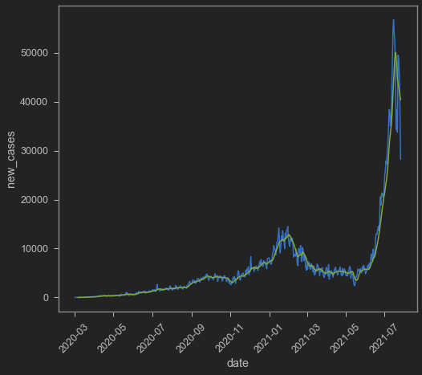
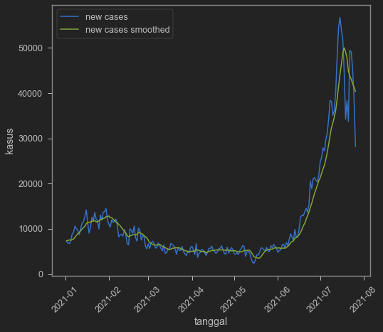
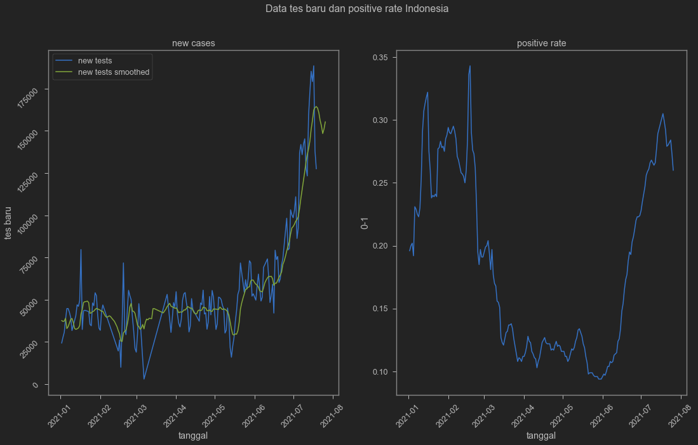
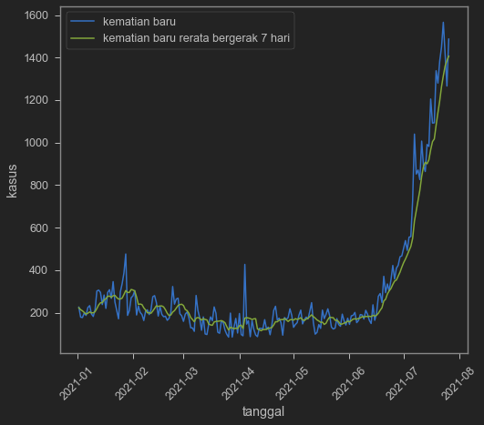

Saya sangat jarang nulis di blog tentang COVID-19. Terakhir ngepost tentang stats covid kayaknya waktu bahas soal [kematian](https://www.krisna.or.id/post/covdeath/). Hari ini mau coba lihat lagi statistik COVID-19 di Indonesia, terutama belakangan ini karena lagi ramai lagi soal undertesting.

<blockquote class="twitter-tweet"><p lang="in" dir="ltr">Penambahan kasus Covid-19 harian cenderung menurun. Hal ini terjadi seiring dengan turunnya jumlah pemeriksaan secara signifikan. Masih terlalu dini untuk menyimpulkan bahwa gelombang Covid-19 telah terkendali. <a href="https://twitter.com/hashtag/Humaniora?src=hash&amp;ref_src=twsrc%5Etfw">#Humaniora</a> <a href="https://twitter.com/hashtag/AdadiKompas?src=hash&amp;ref_src=twsrc%5Etfw">#AdadiKompas</a> <a href="https://twitter.com/aik_arif?ref_src=twsrc%5Etfw">@aik_arif</a> <a href="https://t.co/eYvloMmpIC">https://t.co/eYvloMmpIC</a></p>&mdash; Harian Kompas (@hariankompas) <a href="https://twitter.com/hariankompas/status/1417642983227236357?ref_src=twsrc%5Etfw">July 21, 2021</a></blockquote> <script async src="https://platform.twitter.com/widgets.js" charset="utf-8"></script> 

Tentu saja andalan saya adalah [Our World in Data](https://ourworldindata.org/coronavirus-source-data#deaths-and-cases-our-data-source) [^1] yang datanya [bisa diakses siapa saja](https://github.com/owid/covid-19-data/tree/master/public/data) dengan mudah.

[^1]: Hannah Ritchie, Esteban Ortiz-Ospina, Diana Beltekian, Edouard Mathieu, Joe Hasell, Bobbie Macdonald, Charlie Giattino, Cameron Appel, Lucas Rodés-Guirao and Max Roser (2020) - "Coronavirus Pandemic (COVID-19)". Published online at OurWorldInData.org. Retrieved from: 'https://ourworldindata.org/coronavirus' [Online Resource]

Kita tarik dulu datanya dari internet dan menampilkan 10 baris teratas.


```python
url='https://covid.ourworldindata.org/data/owid-covid-data.csv' # simpan url
df=pd.read_csv(url, parse_dates=['date']) # download dari url. parse_dates untuk menjadikan kolom date jadi tipe waktu
df.head(6) # menampilkan 10 baris paling atas
```


<div>
<style scoped>
    .dataframe tbody tr th:only-of-type {
        vertical-align: middle;
    }

    .dataframe tbody tr th {
        vertical-align: top;
    }

    .dataframe thead th {
        text-align: right;
    }
</style>
<table border="1" class="dataframe">
  <thead>
    <tr style="text-align: right;">
      <th></th>
      <th>iso_code</th>
      <th>continent</th>
      <th>location</th>
      <th>date</th>
      <th>total_cases</th>
      <th>new_cases</th>
      <th>new_cases_smoothed</th>
      <th>total_deaths</th>
      <th>new_deaths</th>
      <th>new_deaths_smoothed</th>
      <th>...</th>
      <th>extreme_poverty</th>
      <th>cardiovasc_death_rate</th>
      <th>diabetes_prevalence</th>
      <th>female_smokers</th>
      <th>male_smokers</th>
      <th>handwashing_facilities</th>
      <th>hospital_beds_per_thousand</th>
      <th>life_expectancy</th>
      <th>human_development_index</th>
      <th>excess_mortality</th>
    </tr>
  </thead>
  <tbody>
    <tr>
      <th>0</th>
      <td>AFG</td>
      <td>Asia</td>
      <td>Afghanistan</td>
      <td>2020-02-24</td>
      <td>1.0</td>
      <td>1.0</td>
      <td>NaN</td>
      <td>NaN</td>
      <td>NaN</td>
      <td>NaN</td>
      <td>...</td>
      <td>NaN</td>
      <td>597.029</td>
      <td>9.59</td>
      <td>NaN</td>
      <td>NaN</td>
      <td>37.746</td>
      <td>0.5</td>
      <td>64.83</td>
      <td>0.511</td>
      <td>NaN</td>
    </tr>
    <tr>
      <th>1</th>
      <td>AFG</td>
      <td>Asia</td>
      <td>Afghanistan</td>
      <td>2020-02-25</td>
      <td>1.0</td>
      <td>0.0</td>
      <td>NaN</td>
      <td>NaN</td>
      <td>NaN</td>
      <td>NaN</td>
      <td>...</td>
      <td>NaN</td>
      <td>597.029</td>
      <td>9.59</td>
      <td>NaN</td>
      <td>NaN</td>
      <td>37.746</td>
      <td>0.5</td>
      <td>64.83</td>
      <td>0.511</td>
      <td>NaN</td>
    </tr>
    <tr>
      <th>2</th>
      <td>AFG</td>
      <td>Asia</td>
      <td>Afghanistan</td>
      <td>2020-02-26</td>
      <td>1.0</td>
      <td>0.0</td>
      <td>NaN</td>
      <td>NaN</td>
      <td>NaN</td>
      <td>NaN</td>
      <td>...</td>
      <td>NaN</td>
      <td>597.029</td>
      <td>9.59</td>
      <td>NaN</td>
      <td>NaN</td>
      <td>37.746</td>
      <td>0.5</td>
      <td>64.83</td>
      <td>0.511</td>
      <td>NaN</td>
    </tr>
    <tr>
      <th>3</th>
      <td>AFG</td>
      <td>Asia</td>
      <td>Afghanistan</td>
      <td>2020-02-27</td>
      <td>1.0</td>
      <td>0.0</td>
      <td>NaN</td>
      <td>NaN</td>
      <td>NaN</td>
      <td>NaN</td>
      <td>...</td>
      <td>NaN</td>
      <td>597.029</td>
      <td>9.59</td>
      <td>NaN</td>
      <td>NaN</td>
      <td>37.746</td>
      <td>0.5</td>
      <td>64.83</td>
      <td>0.511</td>
      <td>NaN</td>
    </tr>
    <tr>
      <th>4</th>
      <td>AFG</td>
      <td>Asia</td>
      <td>Afghanistan</td>
      <td>2020-02-28</td>
      <td>1.0</td>
      <td>0.0</td>
      <td>NaN</td>
      <td>NaN</td>
      <td>NaN</td>
      <td>NaN</td>
      <td>...</td>
      <td>NaN</td>
      <td>597.029</td>
      <td>9.59</td>
      <td>NaN</td>
      <td>NaN</td>
      <td>37.746</td>
      <td>0.5</td>
      <td>64.83</td>
      <td>0.511</td>
      <td>NaN</td>
    </tr>
    <tr>
      <th>5</th>
      <td>AFG</td>
      <td>Asia</td>
      <td>Afghanistan</td>
      <td>2020-02-29</td>
      <td>1.0</td>
      <td>0.0</td>
      <td>0.143</td>
      <td>NaN</td>
      <td>NaN</td>
      <td>0.0</td>
      <td>...</td>
      <td>NaN</td>
      <td>597.029</td>
      <td>9.59</td>
      <td>NaN</td>
      <td>NaN</td>
      <td>37.746</td>
      <td>0.5</td>
      <td>64.83</td>
      <td>0.511</td>
      <td>NaN</td>
    </tr>
  </tbody>
</table>
<p>6 rows × 60 columns</p>
</div>


Berhubung saya jarang banget ngeliatin data COVID-19, saya ga hapal apa aja variabel yang dikumpulkan oleh Ritchie dkk. Panggil dulu semua kolomnya dengan `df.columns`.


```python
df.columns # untuk panggil list dari nama-nama variabel
```


    Index(['iso_code', 'continent', 'location', 'date', 'total_cases', 'new_cases',
           'new_cases_smoothed', 'total_deaths', 'new_deaths',
           'new_deaths_smoothed', 'total_cases_per_million',
           'new_cases_per_million', 'new_cases_smoothed_per_million',
           'total_deaths_per_million', 'new_deaths_per_million',
           'new_deaths_smoothed_per_million', 'reproduction_rate', 'icu_patients',
           'icu_patients_per_million', 'hosp_patients',
           'hosp_patients_per_million', 'weekly_icu_admissions',
           'weekly_icu_admissions_per_million', 'weekly_hosp_admissions',
           'weekly_hosp_admissions_per_million', 'new_tests', 'total_tests',
           'total_tests_per_thousand', 'new_tests_per_thousand',
           'new_tests_smoothed', 'new_tests_smoothed_per_thousand',
           'positive_rate', 'tests_per_case', 'tests_units', 'total_vaccinations',
           'people_vaccinated', 'people_fully_vaccinated', 'new_vaccinations',
           'new_vaccinations_smoothed', 'total_vaccinations_per_hundred',
           'people_vaccinated_per_hundred', 'people_fully_vaccinated_per_hundred',
           'new_vaccinations_smoothed_per_million', 'stringency_index',
           'population', 'population_density', 'median_age', 'aged_65_older',
           'aged_70_older', 'gdp_per_capita', 'extreme_poverty',
           'cardiovasc_death_rate', 'diabetes_prevalence', 'female_smokers',
           'male_smokers', 'handwashing_facilities', 'hospital_beds_per_thousand',
           'life_expectancy', 'human_development_index', 'excess_mortality'],
          dtype='object')


Wah gilaaa banyak banget ya nama variabelnya. Cape banget pasti ngumpulin ini semua. Hebat emang Hannah Ritchie dkk. Oke deh sekarang coba kita ngelihat jumlah kasus baru. ada setidaknya tiga nama variabel yang bisa diambil, yaitu `new_cases` dan `new_cases_smoothed`. Kalau dari namanya sih ketaker ya kalo yang smoothed itu kayaknya moving average, alias diambil alusnya dari data `new_cases` yang bisa jadi sangat volatil. Sering terjadi di data harian gini karena, misalnya, setiap hari senin selalu membludak, sementara sabtu minggu selalu sepi. Apa malah kebalik, sabtu minggu malah rame karena orang libur jadi bisa datang ke tempat testing. Yg jelas ada *pattern* mingguan yang bikin data harian jadi volatil. Nah kita ambil dua-duanya yok!

Kalau kamu cuma tertarik ambil data Indonesia, maka jangan lupa diambil yang Indonesia aja.


```python
indo=df[["iso_code","date","new_cases","new_cases_smoothed"]].query('iso_code == "IDN"')
```

Saatnya diplot!


```python
sns.lineplot(data=indo,x='date',y='new_cases')
sns.lineplot(data=indo,x='date',y='new_cases_smoothed')
plt.xticks(rotation=45)
```


    (array([18322., 18383., 18444., 18506., 18567., 18628., 18687., 18748.,
            18809.]),
     [Text(0, 0, ''),
      Text(0, 0, ''),
      Text(0, 0, ''),
      Text(0, 0, ''),
      Text(0, 0, ''),
      Text(0, 0, ''),
      Text(0, 0, ''),
      Text(0, 0, ''),
      Text(0, 0, '')])


    

    


kayaknya new_cases_smoothed ini adalah 7-day rollong average. Seperti yang saya tulis sebelumnya, data harian biasanya punya tren mingguan. Makanya dibuat *rolling average* dalam 7 hari adalah hal yang umum dilakukan. Yok kita cek! Saya pake rolling averagenya panda yang [saya contek di sini](https://datavizpyr.com/how-to-make-a-time-series-plot-with-rolling-average-in-python/) dengan tambahan shift(-3) untuk mundurin NaN 3 hari ke depan dan 3 hari ke belakang.


```python
indo['cases_7day_ave'] = indo.new_cases.rolling(7).mean().shift(-3)
indo.head(10)
```


<div>
<style scoped>
    .dataframe tbody tr th:only-of-type {
        vertical-align: middle;
    }

    .dataframe tbody tr th {
        vertical-align: top;
    }

    .dataframe thead th {
        text-align: right;
    }
</style>
<table border="1" class="dataframe">
  <thead>
    <tr style="text-align: right;">
      <th></th>
      <th>iso_code</th>
      <th>date</th>
      <th>new_cases</th>
      <th>new_cases_smoothed</th>
      <th>cases_7day_ave</th>
    </tr>
  </thead>
  <tbody>
    <tr>
      <th>44074</th>
      <td>IDN</td>
      <td>2020-03-02</td>
      <td>2.0</td>
      <td>NaN</td>
      <td>NaN</td>
    </tr>
    <tr>
      <th>44075</th>
      <td>IDN</td>
      <td>2020-03-03</td>
      <td>0.0</td>
      <td>NaN</td>
      <td>NaN</td>
    </tr>
    <tr>
      <th>44076</th>
      <td>IDN</td>
      <td>2020-03-04</td>
      <td>0.0</td>
      <td>NaN</td>
      <td>NaN</td>
    </tr>
    <tr>
      <th>44077</th>
      <td>IDN</td>
      <td>2020-03-05</td>
      <td>0.0</td>
      <td>NaN</td>
      <td>0.857143</td>
    </tr>
    <tr>
      <th>44078</th>
      <td>IDN</td>
      <td>2020-03-06</td>
      <td>2.0</td>
      <td>NaN</td>
      <td>2.428571</td>
    </tr>
    <tr>
      <th>44079</th>
      <td>IDN</td>
      <td>2020-03-07</td>
      <td>0.0</td>
      <td>0.571</td>
      <td>3.571429</td>
    </tr>
    <tr>
      <th>44080</th>
      <td>IDN</td>
      <td>2020-03-08</td>
      <td>2.0</td>
      <td>0.857</td>
      <td>4.571429</td>
    </tr>
    <tr>
      <th>44081</th>
      <td>IDN</td>
      <td>2020-03-09</td>
      <td>13.0</td>
      <td>2.429</td>
      <td>4.571429</td>
    </tr>
    <tr>
      <th>44082</th>
      <td>IDN</td>
      <td>2020-03-10</td>
      <td>8.0</td>
      <td>3.571</td>
      <td>9.285714</td>
    </tr>
    <tr>
      <th>44083</th>
      <td>IDN</td>
      <td>2020-03-11</td>
      <td>7.0</td>
      <td>4.571</td>
      <td>13.142857</td>
    </tr>
  </tbody>
</table>
</div>


Seperti bisa dilihat di atas, sepertinya bener `new_cases_smoothed` adalah 7-day average soalnya ada 6 NaN berturut-turut. Kayaknya bedanya adalah sama si Ritchie dkk nggak di-shift. ya gpp kita tes plot aja yuk.


```python
sns.lineplot(data=indo,x='date',y='new_cases')
sns.lineplot(data=indo,x='date',y='new_cases_smoothed')
sns.lineplot(data=indo,x='date',y='cases_7day_ave')
plt.xticks(rotation=45)
plt.legend(['new cases','new cases smoothed','7-day average bikinan sendiri'])
plt.ylabel('kasus')
plt.xlabel('tanggal')
```


    Text(0.5, 0, 'tanggal')


    

    


berhubung satu setengah tahun adalah waktu yang panjang (gila lama juga ya covid ga beres-beres), maka kita potong aja deh tahun 2020. Kalo dilihat di atas sih sepertinya first wave yang sebenarnya malah baru keliatna di awal-awal 2021 ya. Oh iya jangan lupa Indonesia juga undertesting kalau dilihat positive rate. Anyway, ayo kita pangkas lagi data kita di `indo` dengan membuah tahun 2020. Oh iya satu lagi, kita pakai aja `new_cases_smoothed` yang dari aslinya ga usah kita buat *rolling average* sendiri.


```python
indo2=indo.query('date>20210101') # ambil hanya setelah 1 Januari 2021
# lalu kita plot persis seperti di atas
sns.lineplot(data=indo2,x='date',y='new_cases')
sns.lineplot(data=indo2,x='date',y='new_cases_smoothed')
plt.xticks(rotation=45)
plt.legend(['new cases','new cases smoothed','7-day average bikinan sendiri'])
plt.ylabel('kasus')
plt.xlabel('tanggal')
```


    Text(0.5, 0, 'tanggal')


    

    


Hmm keliatannya sih emang new cases nya cenderung turun lagi ya. Turunnya dalem juga, bahkan setelah di-*smooth*. Coba sekarang kita bandingkan dengan testing. Jumlah tes baru juga dicatat oleh Our World in Data. mantap banget.

Sekarang kita ulangi ambil datanya, kali ini ambil lebih banyak variabel dari data asli Our World in Data. Sama kita plot tahun 2021 aja.


```python
indo=df[["iso_code","date","new_tests","new_tests_smoothed",
        "new_cases","new_cases_smoothed","positive_rate"]].query('iso_code == "IDN"')
indo2=indo.query('date>20210101')
```


```python
fig, axes = plt.subplots(1, 2, figsize=(18, 10))
fig.suptitle('Data tes baru dan positive rate Indonesia')
sns.lineplot(ax=axes[0],data=indo2,x='date',y='new_tests')
sns.lineplot(ax=axes[0],data=indo2,x='date',y='new_tests_smoothed')
axes[0].tick_params(labelrotation=45)
axes[0].legend(['new tests','new tests smoothed'])
axes[0].set_ylabel('tes baru')
axes[0].set_xlabel('tanggal')
axes[0].set_title('new cases')
sns.lineplot(ax=axes[1],data=indo2,x='date',y='positive_rate')
plt.xticks(rotation=45)
plt.ylabel('0-1')
plt.xlabel('tanggal')
axes[1].set_title('positive rate')
```


    Text(0.5, 1.0, 'positive rate')


    

    


Memang benar tes-nya berkurang. Tapi di saat yang sama, positive rate juga berkurang di akhir-akhir. Kalau misalnya tes-nya dikurangi tapi kasus di lapangan tetap tinggi, mestinya sih positive rate naik ya. Kecuali ya tes-nya disasar ke orang-orang yang cenderung keliatan ga bergejala.

Sebenernya ini bisa ketawan kalo ternyata yang masuk rumah sakit banyak atau tingkat kematian masih tinggi. Sayangnya data Indonesia untuk hospital dan ICU admissions nggak ada.


```python
df.query('iso_code=="IDN"')[['weekly_icu_admissions','weekly_hosp_admissions']]
```


<div>
<style scoped>
    .dataframe tbody tr th:only-of-type {
        vertical-align: middle;
    }

    .dataframe tbody tr th {
        vertical-align: top;
    }

    .dataframe thead th {
        text-align: right;
    }
</style>
<table border="1" class="dataframe">
  <thead>
    <tr style="text-align: right;">
      <th></th>
      <th>weekly_icu_admissions</th>
      <th>weekly_hosp_admissions</th>
    </tr>
  </thead>
  <tbody>
    <tr>
      <th>44074</th>
      <td>NaN</td>
      <td>NaN</td>
    </tr>
    <tr>
      <th>44075</th>
      <td>NaN</td>
      <td>NaN</td>
    </tr>
    <tr>
      <th>44076</th>
      <td>NaN</td>
      <td>NaN</td>
    </tr>
    <tr>
      <th>44077</th>
      <td>NaN</td>
      <td>NaN</td>
    </tr>
    <tr>
      <th>44078</th>
      <td>NaN</td>
      <td>NaN</td>
    </tr>
    <tr>
      <th>...</th>
      <td>...</td>
      <td>...</td>
    </tr>
    <tr>
      <th>44582</th>
      <td>NaN</td>
      <td>NaN</td>
    </tr>
    <tr>
      <th>44583</th>
      <td>NaN</td>
      <td>NaN</td>
    </tr>
    <tr>
      <th>44584</th>
      <td>NaN</td>
      <td>NaN</td>
    </tr>
    <tr>
      <th>44585</th>
      <td>NaN</td>
      <td>NaN</td>
    </tr>
    <tr>
      <th>44586</th>
      <td>NaN</td>
      <td>NaN</td>
    </tr>
  </tbody>
</table>
<p>513 rows × 2 columns</p>
</div>


Sementara itu, jika dilihat plot kematian (*Dear God, bless all the lost souls and those who they left*), sepertinya belum ada tanda-tanda berkurang.


```python
indo=df[["iso_code","date","new_deaths","new_deaths_smoothed"]].query('iso_code == "IDN"')
indo2=indo.query('date>20210101')
sns.lineplot(data=indo2,x='date',y='new_deaths')
sns.lineplot(data=indo2,x='date',y='new_deaths_smoothed')
plt.xticks(rotation=45)
plt.legend(['kematian baru','kematian baru rerata bergerak 7 hari'])
plt.ylabel('kasus')
plt.xlabel('tanggal')

```


    Text(0.5, 0, 'tanggal')


    

    


Jika dilihat dari tingkat kematian, sepertinya pandemi masih belum selesai, sayangnya. Perlu dicatat bahwa mungkin tingkat kematian akan turun seiring dengan turunnya kasus, karena bisa jadi tingkat kematian agak mundur dibandingkan tingkat ketahuan positif. Namun demikian, jika tes-nya bermasalah, ada kemungkinan pencatatan kematian juga bermasalah. Sepertinya sih memang kita tidak bisa bereaksi berlebihan, baik ketika kasus naik maupun kasus turun, selama integritas datanya masih dapat dipertanyakan.

Berarti apakah kita bisa bergantung pada vaksinasi? Kalau dilihat dari grafik di atas, kasus baru harian dan positive rate meningkat sejak bulan Juni. Apakah bulan Juni adalah bulan-bulan di mana mulai masuk varian delta? Ada keramaian apa bulan itu? Mobilitas tinggi apa yang dibiarkan di bulan sekitar itu? Mungkin Pemerintah bertaruh membiarkan mobilitas karena program vaksinasi sudah dimulai ya? Kalau begitu, saya akan akhiri postingan kali ini dengan data vaksinasi, dengan komparasi negara-negara lain.

<iframe src="https://ourworldindata.org/grapher/daily-covid-vaccination-doses-per-capita?country=BRA~CHN~IND~LKA~TUR~OWID_WRL~IDN" loading="lazy" style="width: 100%; height: 600px; border: 0px none;"></iframe>
