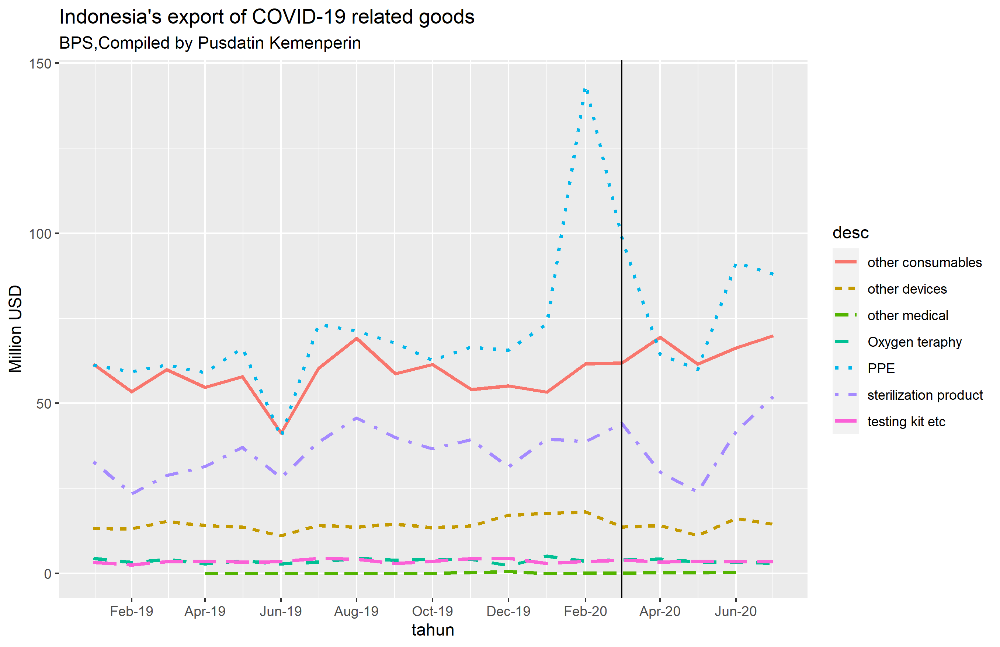
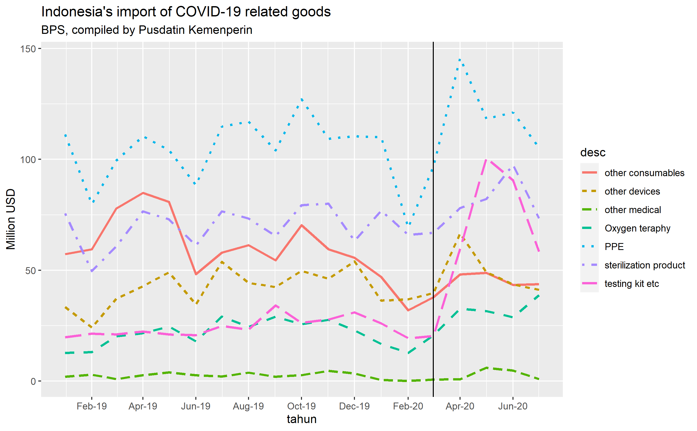

This is an updated figures on COVID-19-related goods export and import in Indonesia. I was once [presenting about it](https://krisna.netlify.app/talk/ip/) in ANU Indonesia Project's global seminar series, and I cited Indonesian monthly trade data until March 2020. WCO/WHO classification second edition was used to identify what are considered COVID-19-related goods.

This time around, I've got my hands on the trade data until July 2020, and I am using WCO/WHO [third revision](http://www.wcoomd.org/-/media/wco/public/global/pdf/topics/nomenclature/covid_19/hs-classification-reference_edition-3_en.pdf?la=en) classification. Illustration is conducted in R codes. So let's see what happens.

# Exports are generally similar to last year's

First, let's take a look at export.

``` r
# Loading and cleaning the data
library(dplyr)
library(tidyverse)
library(lubridate)
library(ggplot2)

expor<-read.csv('Book1.csv') # read the data
a<-colnames(expor)           # add column names to a for easy rename
expor<-expor %>%             # rename variable names
  rename(hs=a[1],deskripsi=a[2],tujuan=a[3],periode=a[4],kg=a[5],usd=a[6])

# make periode into time series
expor$periode<-as.Date(paste0(as.character(expor$periode), '01'),format='%Y%m%d')

# Make aggregation to all countries
exporall<-expor %>% group_by(hs,periode) %>% summarise((expor=sum(usd)))
a<-colnames(exporall)
exporall<-exporall %>% rename(usd=a[3])

# Make aggregation on WCO goods classification
wco<-read.csv('wco.csv') # adding wco classification
wco<-wco %>% distinct(hshs, .keep_all = TRUE) # drop duplicates
wco$hshs<-as.character(wco$hshs) #make hshs a string so i can join them
exporall$hshs<-substr(as.character(exporall$hs),start=1,stop=6) # taking the first 6 digits
final<-inner_join(exporall,wco,by="hshs")
finall<-final %>% group_by(desc,periode) %>% summarise(expor=sum(usd))
a<-colnames(finall)
finall<-finall %>% rename(usd=a[3])
finall$usd6<-finall$usd/1000000

# plot
ggplot(finall,aes(x=periode,y=usd6, color=desc)) +
  geom_line(aes(linetype=desc),size=1.1) +
  scale_x_date(date_labels="%b-%y",date_breaks = "2 month")+
  # theme_ipsum() +
  # theme(axis.text.x=element_text(angle=60, hjust=1)) +
  geom_vline(xintercept=as.Date('20200301',format='%Y%m%d')) +
  labs(x='tahun',y="Million USD",title="Indonesia's export of COVID-19 related goods",subtitle="BPS,Compiled by Pusdatin Kemenperin")
```

<!-- -->

Apart from other consumables and PPE, Indonesia isn't really comparatively advantageous in producing health equipments in general. PPE jump in February was the infamous skyrocketed export in masks due to demand surge by China and Singapore, the two countries experienced COVID-19 at the early stage. In March, Indonesia consulted to [export ban on PPEs](https://www.eastasiaforum.org/2020/06/16/indonesias-ppe-export-ban-backfires/) and other stuffs, but export was still quite strong amind commitment to buyers.

During the talk, I mentioned how Indonesia can be a powerhouse in making PPEs in a competitive way, provided the inputs. However, export ban seems to prevent this. It is also still possible to say production did increase but it was mostly consumed domestically.

Indonesian export value tends to reduced during the ramadhan season which happened in June in 2019, but May in 2020. The export ban and many other trade measures was revoked in June 2020, so it will be interesting to take a look at the numbers after July 2020.

# Testing kits imports were raising, but most imports went down in July

More things can be said on imports.



 As you can see, import plays a significant role in Indonesian health service even before COVID-19. While Indonesia can produce surgical gown competitively, capital-intensive PPE such as masks are still mostly imported. Moreover, Indonesia also imports a lot of other COVID-19-related goods quite extensively.

 Indonesia's first case was in early March. And as you can see, the number of imports shot up right after March, especially testing kits and PPEs. The trend weakend on May (ramadhan?) except for the testing kits import. Interestingly, coming July, all imports went down except for other medical equipments. I mentioned about revoked rules (yes, including for easing up imports for private enterprises), so this may reflect that. It could also reflect improvement on domestic production but I am not sure. Sadly domestic production numbers are a bit harder to get.

 Notably, Imports are generally decreased in February (take this with a grain of salt but I am thinking Chinese New Year. China is a major source of import).