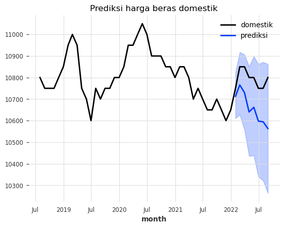
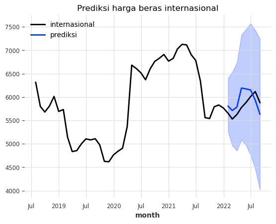

I’m one of the regular readers of tweets by [Haryo Aswicahyono](https://twitter.com/Aswicahyono), who often talks about economics. Just the other day, he tweeted mainly about how rice prices remain high, even though there's an abundant supply. Here’s the tweet:

<blockquote class="twitter-tweet"><p lang="in" dir="ltr">Biasanya kalau diviralin harga turun. Ini harga beras masih naik terus, padahal katanya stock melimpah.<br><br>Harga Pasar Modern: 15,900<br>Harga Pasar Tradisional: 15,700<br>Harga Pedagang Besar: 14,800<br>Harga Produsen (Petani): 13,100<br>ini harga rata2 se Indonesia ya<a href="https://t.co/dLx2YHPm1w">https://t.co/dLx2YHPm1w</a> <a href="https://t.co/KY80KG3sRK">pic.twitter.com/KY80KG3sRK</a></p>&mdash; Haryo Aswicahyono (@Aswicahyono) <a href="https://twitter.com/Aswicahyono/status/1940960141735866517?ref_src=twsrc%5Etfw">July 4, 2025</a></blockquote> <script async src="https://platform.twitter.com/widgets.js" charset="utf-8"></script>

At the time, I happened to be working on a paper about the Commodity Balance Sheet for the Center for Indonesian Policy Studies (CIPS), alongside Hasran and Rasya. Rice is one of the products covered by the Commodity Balance. So I was writing a bit about rice myself—and sure enough, I found the same thing: domestic rice prices remain high. The steep price stands in stark contrast to international rice prices, which have declined since early 2024.

<div>                        <script type="text/javascript">window.PlotlyConfig = {MathJaxConfig: 'local'};</script>
        <script charset="utf-8" src="https://cdn.plot.ly/plotly-3.0.1.min.js" integrity="sha256-oy6Be7Eh6eiQFs5M7oXuPxxm9qbJXEtTpfSI93dW16Q=" crossorigin="anonymous"></script>                <div id="e5db522d-dcbc-4736-a11f-9390ccc3423e" class="plotly-graph-div" style="height:100%; width:100%;"></div>            <script type="text/javascript">                window.PLOTLYENV=window.PLOTLYENV || {};                                if (document.getElementById("e5db522d-dcbc-4736-a11f-9390ccc3423e")) {                    Plotly.newPlot(                        "e5db522d-dcbc-4736-a11f-9390ccc3423e",                        [{"hovertemplate":"jenis=domestik\u003cbr\u003emonth=%{x}\u003cbr\u003eharga=%{y}\u003cextra\u003e\u003c\u002fextra\u003e","legendgroup":"domestik","line":{"color":"#3366CC","dash":"solid"},"marker":{"symbol":"circle"},"mode":"lines","name":"domestik","orientation":"v","showlegend":true,"x":["2018-07-31T00:00:00.000000000","2018-08-31T00:00:00.000000000","2018-09-30T00:00:00.000000000","2018-10-31T00:00:00.000000000","2018-11-30T00:00:00.000000000","2018-12-31T00:00:00.000000000","2019-01-31T00:00:00.000000000","2019-02-28T00:00:00.000000000","2019-03-31T00:00:00.000000000","2019-04-30T00:00:00.000000000","2019-05-31T00:00:00.000000000","2019-06-30T00:00:00.000000000","2019-07-31T00:00:00.000000000","2019-08-31T00:00:00.000000000","2019-09-30T00:00:00.000000000","2019-10-31T00:00:00.000000000","2019-11-30T00:00:00.000000000","2019-12-31T00:00:00.000000000","2020-01-31T00:00:00.000000000","2020-02-29T00:00:00.000000000","2020-03-31T00:00:00.000000000","2020-04-30T00:00:00.000000000","2020-05-31T00:00:00.000000000","2020-06-30T00:00:00.000000000","2020-07-31T00:00:00.000000000","2020-08-31T00:00:00.000000000","2020-09-30T00:00:00.000000000","2020-10-31T00:00:00.000000000","2020-11-30T00:00:00.000000000","2020-12-31T00:00:00.000000000","2021-01-31T00:00:00.000000000","2021-02-28T00:00:00.000000000","2021-03-31T00:00:00.000000000","2021-04-30T00:00:00.000000000","2021-05-31T00:00:00.000000000","2021-06-30T00:00:00.000000000","2021-07-31T00:00:00.000000000","2021-08-31T00:00:00.000000000","2021-09-30T00:00:00.000000000","2021-10-31T00:00:00.000000000","2021-11-30T00:00:00.000000000","2021-12-31T00:00:00.000000000","2022-01-31T00:00:00.000000000","2022-02-28T00:00:00.000000000","2022-03-31T00:00:00.000000000","2022-04-30T00:00:00.000000000","2022-05-31T00:00:00.000000000","2022-06-30T00:00:00.000000000","2022-07-31T00:00:00.000000000","2022-08-31T00:00:00.000000000","2022-09-30T00:00:00.000000000","2022-10-31T00:00:00.000000000","2022-11-30T00:00:00.000000000","2022-12-31T00:00:00.000000000","2023-01-31T00:00:00.000000000","2023-02-28T00:00:00.000000000","2023-03-31T00:00:00.000000000","2023-04-30T00:00:00.000000000","2023-05-31T00:00:00.000000000","2023-06-30T00:00:00.000000000","2023-07-31T00:00:00.000000000","2023-08-31T00:00:00.000000000","2023-09-30T00:00:00.000000000","2023-10-31T00:00:00.000000000","2023-11-30T00:00:00.000000000","2023-12-31T00:00:00.000000000","2024-01-31T00:00:00.000000000","2024-02-29T00:00:00.000000000","2024-03-31T00:00:00.000000000","2024-04-30T00:00:00.000000000","2024-05-31T00:00:00.000000000","2024-06-30T00:00:00.000000000","2024-07-31T00:00:00.000000000","2024-08-31T00:00:00.000000000","2024-09-30T00:00:00.000000000","2024-10-31T00:00:00.000000000","2024-11-30T00:00:00.000000000","2024-12-31T00:00:00.000000000","2025-01-31T00:00:00.000000000","2025-02-28T00:00:00.000000000","2025-03-31T00:00:00.000000000","2025-04-30T00:00:00.000000000"],"xaxis":"x","y":{"dtype":"f8","bdata":"AAAAAAAYxUAAAAAAAP\u002fEQAAAAAAA\u002f8RAAAAAAAD\u002fxEAAAAAAABjFQAAAAAAAMcVAAAAAAABjxUAAAAAAAHzFQAAAAAAAY8VAAAAAAAD\u002fxEAAAAAAAObEQAAAAAAAtMRAAAAAAAD\u002fxEAAAAAAAObEQAAAAAAA\u002f8RAAAAAAAD\u002fxEAAAAAAABjFQAAAAAAAGMVAAAAAAAAxxUAAAAAAAGPFQAAAAAAAY8VAAAAAAAB8xUAAAAAAAJXFQAAAAAAAfMVAAAAAAABKxUAAAAAAAErFQAAAAAAASsVAAAAAAAAxxUAAAAAAADHFQAAAAAAAGMVAAAAAAAAxxUAAAAAAADHFQAAAAAAAGMVAAAAAAADmxEAAAAAAAP\u002fEQAAAAAAA5sRAAAAAAADNxEAAAAAAAM3EQAAAAAAA5sRAAAAAAADNxEAAAAAAALTEQAAAAAAAzcRAAAAAAAD\u002fxEAAAAAAADHFQAAAAAAAMcVAAAAAAAAYxUAAAAAAABjFQAAAAAAA\u002f8RAAAAAAAD\u002fxEAAAAAAABjFQAAAAAAAfMVAAAAAAADgxUAAAAAAAPnFQAAAAAAAXcZAAAAAAADzxkAAAAAAAD7HQAAAAAAABshAAAAAAABqyEAAAAAAAFHIQAAAAAAAnMhAAAAAAACDyEAAAAAAAGrIQAAAAAAAS8lAAAAAAAB3ykAAAAAAAMLKQAAAAAAA28pAAAAAAAD0ykAAAAAAAHHLQAAAAAAAM81AAAAAAAAzzUAAAAAAAITMQAAAAAAAB8xAAAAAAADuy0AAAAAAAAfMQAAAAAAAB8xAAAAAAAAHzEAAAAAAANXLQAAAAAAAvMtAAAAAAAC8y0AAAAAAANXLQAAAAAAAB8xAAAAAAAAgzEA="},"yaxis":"y","type":"scatter"},{"hovertemplate":"jenis=internasional\u003cbr\u003emonth=%{x}\u003cbr\u003eharga=%{y}\u003cextra\u003e\u003c\u002fextra\u003e","legendgroup":"internasional","line":{"color":"#DC3912","dash":"solid"},"marker":{"symbol":"circle"},"mode":"lines","name":"internasional","orientation":"v","showlegend":true,"x":["2018-07-31T00:00:00.000000000","2018-08-31T00:00:00.000000000","2018-09-30T00:00:00.000000000","2018-10-31T00:00:00.000000000","2018-11-30T00:00:00.000000000","2018-12-31T00:00:00.000000000","2019-01-31T00:00:00.000000000","2019-02-28T00:00:00.000000000","2019-03-31T00:00:00.000000000","2019-04-30T00:00:00.000000000","2019-05-31T00:00:00.000000000","2019-06-30T00:00:00.000000000","2019-07-31T00:00:00.000000000","2019-08-31T00:00:00.000000000","2019-09-30T00:00:00.000000000","2019-10-31T00:00:00.000000000","2019-11-30T00:00:00.000000000","2019-12-31T00:00:00.000000000","2020-01-31T00:00:00.000000000","2020-02-29T00:00:00.000000000","2020-03-31T00:00:00.000000000","2020-04-30T00:00:00.000000000","2020-05-31T00:00:00.000000000","2020-06-30T00:00:00.000000000","2020-07-31T00:00:00.000000000","2020-08-31T00:00:00.000000000","2020-09-30T00:00:00.000000000","2020-10-31T00:00:00.000000000","2020-11-30T00:00:00.000000000","2020-12-31T00:00:00.000000000","2021-01-31T00:00:00.000000000","2021-02-28T00:00:00.000000000","2021-03-31T00:00:00.000000000","2021-04-30T00:00:00.000000000","2021-05-31T00:00:00.000000000","2021-06-30T00:00:00.000000000","2021-07-31T00:00:00.000000000","2021-08-31T00:00:00.000000000","2021-09-30T00:00:00.000000000","2021-10-31T00:00:00.000000000","2021-11-30T00:00:00.000000000","2021-12-31T00:00:00.000000000","2022-01-31T00:00:00.000000000","2022-02-28T00:00:00.000000000","2022-03-31T00:00:00.000000000","2022-04-30T00:00:00.000000000","2022-05-31T00:00:00.000000000","2022-06-30T00:00:00.000000000","2022-07-31T00:00:00.000000000","2022-08-31T00:00:00.000000000","2022-09-30T00:00:00.000000000","2022-10-31T00:00:00.000000000","2022-11-30T00:00:00.000000000","2022-12-31T00:00:00.000000000","2023-01-31T00:00:00.000000000","2023-02-28T00:00:00.000000000","2023-03-31T00:00:00.000000000","2023-04-30T00:00:00.000000000","2023-05-31T00:00:00.000000000","2023-06-30T00:00:00.000000000","2023-07-31T00:00:00.000000000","2023-08-31T00:00:00.000000000","2023-09-30T00:00:00.000000000","2023-10-31T00:00:00.000000000","2023-11-30T00:00:00.000000000","2023-12-31T00:00:00.000000000","2024-01-31T00:00:00.000000000","2024-02-29T00:00:00.000000000","2024-03-31T00:00:00.000000000","2024-04-30T00:00:00.000000000","2024-05-31T00:00:00.000000000","2024-06-30T00:00:00.000000000","2024-07-31T00:00:00.000000000","2024-08-31T00:00:00.000000000","2024-09-30T00:00:00.000000000","2024-10-31T00:00:00.000000000","2024-11-30T00:00:00.000000000","2024-12-31T00:00:00.000000000","2025-01-31T00:00:00.000000000","2025-02-28T00:00:00.000000000","2025-03-31T00:00:00.000000000","2025-04-30T00:00:00.000000000"],"xaxis":"x","y":{"dtype":"f8","bdata":"xty1hPSquEBhN2xbVKe2QE+vlGUgMLZA001iEPixtkAwTKYKHn23QI47pYP1PbZAzF1LyJ9ktkBpAG+BNBe0QFitTPi14rJADDz3Hlb2skChZ7PqI4ezQOWzPA9e8rNAVz7L82Dcs0AcX3tm+fSzQLTIdr6PcrNAE0n0MuoQskBW1GAaBgmyQAOy17svnbJAJXUCmujsskDuX1lp8imzQNydtdv++bRACCC1iWMaukBmoDL+TdC5QAq6vaQRdrlADaZh+CDiuEA1e6AV0My5QPfkYaHGabpAEDtT6JyuukDl0CLbGf66QAZkr3dvcLpAFeP8TRiqukDPMSB7vXO7QN0kBoHV1rtACp3X2A3Mu0BWfa62Mvi6QD0K16PwfrpAfCdmvcjGuEDBHD1+D7i1QOPHmLu2pLVAon+Ci0WgtkBXJvxSF8a2QGUZ4lgXhrZA6ZrJNzsVtkBWgsXhjJm1QKd0sP7n+7VAPUSjO\u002fiQtkA3iUFgZf22QO1kcJS8erdAgv+tZNflt0AMAiuHlvm2QLGiBtPwwbZAECOERxtXuEBOnNzvMKm5QMx\u002fSL8NlrpAYOrnTcXWukCYF2AfnUC6QAfwFkhQeLpAlPYGXwigukBzhXe5cPK6QChhpu0fyb1AZmZmZmZ1vUAyVTAqCee\u002fQKN1VDU1sMFATfOOUyijwkBzEd+J3YrDQH6MuWvpI8NAJ6Wg25\u002fcwkByUMJMk\u002fXCQGFUUicE+MFAVg4tsrW3wUAFbt3NIw7CQKBP5EmG08FAHLYtykSwwUAMAiuHrgjBQH7ja89EVcBA0qkrn+VXv0Dc14FzrkS\u002fQIY97fBXs75AYviImIo6vEDMXUvIh5i5QLTIdr5PgLhAAAAAAAAA+H8="},"yaxis":"y","type":"scatter"}],                        {"template":{"data":{"barpolar":[{"marker":{"line":{"color":"rgb(17,17,17)","width":0.5},"pattern":{"fillmode":"overlay","size":10,"solidity":0.2}},"type":"barpolar"}],"bar":[{"error_x":{"color":"#f2f5fa"},"error_y":{"color":"#f2f5fa"},"marker":{"line":{"color":"rgb(17,17,17)","width":0.5},"pattern":{"fillmode":"overlay","size":10,"solidity":0.2}},"type":"bar"}],"carpet":[{"aaxis":{"endlinecolor":"#A2B1C6","gridcolor":"#506784","linecolor":"#506784","minorgridcolor":"#506784","startlinecolor":"#A2B1C6"},"baxis":{"endlinecolor":"#A2B1C6","gridcolor":"#506784","linecolor":"#506784","minorgridcolor":"#506784","startlinecolor":"#A2B1C6"},"type":"carpet"}],"choropleth":[{"colorbar":{"outlinewidth":0,"ticks":""},"type":"choropleth"}],"contourcarpet":[{"colorbar":{"outlinewidth":0,"ticks":""},"type":"contourcarpet"}],"contour":[{"colorbar":{"outlinewidth":0,"ticks":""},"colorscale":[[0.0,"#0d0887"],[0.1111111111111111,"#46039f"],[0.2222222222222222,"#7201a8"],[0.3333333333333333,"#9c179e"],[0.4444444444444444,"#bd3786"],[0.5555555555555556,"#d8576b"],[0.6666666666666666,"#ed7953"],[0.7777777777777778,"#fb9f3a"],[0.8888888888888888,"#fdca26"],[1.0,"#f0f921"]],"type":"contour"}],"heatmap":[{"colorbar":{"outlinewidth":0,"ticks":""},"colorscale":[[0.0,"#0d0887"],[0.1111111111111111,"#46039f"],[0.2222222222222222,"#7201a8"],[0.3333333333333333,"#9c179e"],[0.4444444444444444,"#bd3786"],[0.5555555555555556,"#d8576b"],[0.6666666666666666,"#ed7953"],[0.7777777777777778,"#fb9f3a"],[0.8888888888888888,"#fdca26"],[1.0,"#f0f921"]],"type":"heatmap"}],"histogram2dcontour":[{"colorbar":{"outlinewidth":0,"ticks":""},"colorscale":[[0.0,"#0d0887"],[0.1111111111111111,"#46039f"],[0.2222222222222222,"#7201a8"],[0.3333333333333333,"#9c179e"],[0.4444444444444444,"#bd3786"],[0.5555555555555556,"#d8576b"],[0.6666666666666666,"#ed7953"],[0.7777777777777778,"#fb9f3a"],[0.8888888888888888,"#fdca26"],[1.0,"#f0f921"]],"type":"histogram2dcontour"}],"histogram2d":[{"colorbar":{"outlinewidth":0,"ticks":""},"colorscale":[[0.0,"#0d0887"],[0.1111111111111111,"#46039f"],[0.2222222222222222,"#7201a8"],[0.3333333333333333,"#9c179e"],[0.4444444444444444,"#bd3786"],[0.5555555555555556,"#d8576b"],[0.6666666666666666,"#ed7953"],[0.7777777777777778,"#fb9f3a"],[0.8888888888888888,"#fdca26"],[1.0,"#f0f921"]],"type":"histogram2d"}],"histogram":[{"marker":{"pattern":{"fillmode":"overlay","size":10,"solidity":0.2}},"type":"histogram"}],"mesh3d":[{"colorbar":{"outlinewidth":0,"ticks":""},"type":"mesh3d"}],"parcoords":[{"line":{"colorbar":{"outlinewidth":0,"ticks":""}},"type":"parcoords"}],"pie":[{"automargin":true,"type":"pie"}],"scatter3d":[{"line":{"colorbar":{"outlinewidth":0,"ticks":""}},"marker":{"colorbar":{"outlinewidth":0,"ticks":""}},"type":"scatter3d"}],"scattercarpet":[{"marker":{"colorbar":{"outlinewidth":0,"ticks":""}},"type":"scattercarpet"}],"scattergeo":[{"marker":{"colorbar":{"outlinewidth":0,"ticks":""}},"type":"scattergeo"}],"scattergl":[{"marker":{"line":{"color":"#283442"}},"type":"scattergl"}],"scattermapbox":[{"marker":{"colorbar":{"outlinewidth":0,"ticks":""}},"type":"scattermapbox"}],"scattermap":[{"marker":{"colorbar":{"outlinewidth":0,"ticks":""}},"type":"scattermap"}],"scatterpolargl":[{"marker":{"colorbar":{"outlinewidth":0,"ticks":""}},"type":"scatterpolargl"}],"scatterpolar":[{"marker":{"colorbar":{"outlinewidth":0,"ticks":""}},"type":"scatterpolar"}],"scatter":[{"marker":{"line":{"color":"#283442"}},"type":"scatter"}],"scatterternary":[{"marker":{"colorbar":{"outlinewidth":0,"ticks":""}},"type":"scatterternary"}],"surface":[{"colorbar":{"outlinewidth":0,"ticks":""},"colorscale":[[0.0,"#0d0887"],[0.1111111111111111,"#46039f"],[0.2222222222222222,"#7201a8"],[0.3333333333333333,"#9c179e"],[0.4444444444444444,"#bd3786"],[0.5555555555555556,"#d8576b"],[0.6666666666666666,"#ed7953"],[0.7777777777777778,"#fb9f3a"],[0.8888888888888888,"#fdca26"],[1.0,"#f0f921"]],"type":"surface"}],"table":[{"cells":{"fill":{"color":"#506784"},"line":{"color":"rgb(17,17,17)"}},"header":{"fill":{"color":"#2a3f5f"},"line":{"color":"rgb(17,17,17)"}},"type":"table"}]},"layout":{"annotationdefaults":{"arrowcolor":"#f2f5fa","arrowhead":0,"arrowwidth":1},"autotypenumbers":"strict","coloraxis":{"colorbar":{"outlinewidth":0,"ticks":""}},"colorscale":{"diverging":[[0,"#8e0152"],[0.1,"#c51b7d"],[0.2,"#de77ae"],[0.3,"#f1b6da"],[0.4,"#fde0ef"],[0.5,"#f7f7f7"],[0.6,"#e6f5d0"],[0.7,"#b8e186"],[0.8,"#7fbc41"],[0.9,"#4d9221"],[1,"#276419"]],"sequential":[[0.0,"#0d0887"],[0.1111111111111111,"#46039f"],[0.2222222222222222,"#7201a8"],[0.3333333333333333,"#9c179e"],[0.4444444444444444,"#bd3786"],[0.5555555555555556,"#d8576b"],[0.6666666666666666,"#ed7953"],[0.7777777777777778,"#fb9f3a"],[0.8888888888888888,"#fdca26"],[1.0,"#f0f921"]],"sequentialminus":[[0.0,"#0d0887"],[0.1111111111111111,"#46039f"],[0.2222222222222222,"#7201a8"],[0.3333333333333333,"#9c179e"],[0.4444444444444444,"#bd3786"],[0.5555555555555556,"#d8576b"],[0.6666666666666666,"#ed7953"],[0.7777777777777778,"#fb9f3a"],[0.8888888888888888,"#fdca26"],[1.0,"#f0f921"]]},"colorway":["#636efa","#EF553B","#00cc96","#ab63fa","#FFA15A","#19d3f3","#FF6692","#B6E880","#FF97FF","#FECB52"],"font":{"color":"#f2f5fa"},"geo":{"bgcolor":"rgb(17,17,17)","lakecolor":"rgb(17,17,17)","landcolor":"rgb(17,17,17)","showlakes":true,"showland":true,"subunitcolor":"#506784"},"hoverlabel":{"align":"left"},"hovermode":"closest","mapbox":{"style":"dark"},"paper_bgcolor":"rgb(17,17,17)","plot_bgcolor":"rgb(17,17,17)","polar":{"angularaxis":{"gridcolor":"#506784","linecolor":"#506784","ticks":""},"bgcolor":"rgb(17,17,17)","radialaxis":{"gridcolor":"#506784","linecolor":"#506784","ticks":""}},"scene":{"xaxis":{"backgroundcolor":"rgb(17,17,17)","gridcolor":"#506784","gridwidth":2,"linecolor":"#506784","showbackground":true,"ticks":"","zerolinecolor":"#C8D4E3"},"yaxis":{"backgroundcolor":"rgb(17,17,17)","gridcolor":"#506784","gridwidth":2,"linecolor":"#506784","showbackground":true,"ticks":"","zerolinecolor":"#C8D4E3"},"zaxis":{"backgroundcolor":"rgb(17,17,17)","gridcolor":"#506784","gridwidth":2,"linecolor":"#506784","showbackground":true,"ticks":"","zerolinecolor":"#C8D4E3"}},"shapedefaults":{"line":{"color":"#f2f5fa"}},"sliderdefaults":{"bgcolor":"#C8D4E3","bordercolor":"rgb(17,17,17)","borderwidth":1,"tickwidth":0},"ternary":{"aaxis":{"gridcolor":"#506784","linecolor":"#506784","ticks":""},"baxis":{"gridcolor":"#506784","linecolor":"#506784","ticks":""},"bgcolor":"rgb(17,17,17)","caxis":{"gridcolor":"#506784","linecolor":"#506784","ticks":""}},"title":{"x":0.05},"updatemenudefaults":{"bgcolor":"#506784","borderwidth":0},"xaxis":{"automargin":true,"gridcolor":"#283442","linecolor":"#506784","ticks":"","title":{"standoff":15},"zerolinecolor":"#283442","zerolinewidth":2},"yaxis":{"automargin":true,"gridcolor":"#283442","linecolor":"#506784","ticks":"","title":{"standoff":15},"zerolinecolor":"#283442","zerolinewidth":2}}},"xaxis":{"anchor":"y","domain":[0.0,1.0],"title":{"text":"month"}},"yaxis":{"anchor":"x","domain":[0.0,1.0],"title":{"text":"harga"}},"legend":{"title":{"text":"jenis"},"tracegroupgap":0,"orientation":"h","yanchor":"bottom","y":1.02,"xanchor":"right","x":1},"title":{"text":"harga beras bulanan (PIHPS)"}},                        {"responsive": true}                    )                };            </script>        </div>

Rice prices rose in mid-2023 due to [climate conditions and India](https://www.cnbc.com/2023/08/10/global-rice-prices-soar-close-to-12-year-highs-according-to-un-fao-.html?msockid=0807c93cf124679e3401dc6df07266b0), a major exporter that banned its rice exports. But if we look at the trend, domestic and international rice prices had already started rising in mid-2022, around August. Both rose in parallel until early 2024, when they began to diverge. Domestic prices continued climbing, while international prices started falling. Interestingly, these persistently high domestic prices emerged at a time when [domestic stock was abundant](https://www.bulog.co.id/2025/05/04/stok-bulog-selama-4-bulan-capai-35-juta-ton-terbesar-sejak-merdeka/).

Given the surplus, the issue with high domestic rice prices might stem from [distribution](https://www.kompas.id/artikel/mengapa-harga-beras-melonjak-meski-stok-nasional-tinggi?status=sukses_login&loc=header)—from warehouses to markets—not moving quickly enough. I’m not too familiar with how the distribution chain works from Bulog to markets, such as how much rice is purchased from warehouses or the selling price determined by distributors. But if distribution were quicker, prices might better reflect the stock levels.

## Commodity Balance Sheet

Part of the rice supply chain involves the Commodity Balance Sheet, a system designed to regulate imports. Rice may only be imported if forecast data suggests that domestic production will fall short of consumption. If a surplus is predicted, imports are halted. Imports can help lower domestic prices, since international rice prices are typically cheaper.

International prices often serve as reference points for analysts to track domestic trends. Broad factors affecting rice production, such as regional weather events, will influence both domestic and international prices. But if an event is isolated to Indonesia, only domestic prices will rise. That’s where imports become useful—if international prices remain stable while domestic supply is disrupted, imports help stabilize the market.

The speed of price stabilization depends on how fast imports can arrive. The Commodity Balance Sheet was reportedly designed to accelerate import decisions. Rice was added to this system in 2022. Before that, imports were still restricted but not using this mechanism. So—does the Commodity Balance Sheet actually work better?

In a paper co-written with Hasran and Rasya, I explored price movements in Indonesia without the Commodity Balance Sheet by estimating rice prices using other price indicators (a method called synthetic control). The results? You’ll have to wait until the paper’s out—lol.

In this blog post, let’s try a ‘lite’ version using forecasting. The premise: what would domestic rice prices look like if the Commodity Balance Sheet didn’t exist? We use Darts—specifically, Exponential Smoothing—to forecast post-2022 prices based on historical data, then compare those predictions to actual outcomes. The gap is attributed to the Commodity Balance Sheet. As a benchmark, we do the same for international rice prices, which weren’t affected by this system.

The time series is monthly. Domestic rice prices are sourced from PIHPS (Strategic Food Price Information Center), while international prices come from the IMF commodity market. I cut the data at August 2023, since prices start trending upward from then. A time series alone isn’t enough to capture all the dynamics at play.


```python
#package
import pandas as pd
import plotly.express as px
from darts import TimeSeries
from darts.models import ExponentialSmoothing

# plot domestik vs internasional
df = pd.read_excel('beras.xlsx')
df['month'] = pd.Series(pd.date_range(start='2018-07-01', end='2025-05-10', freq='ME'))
dfl=df.melt(id_vars=['month'], var_name='jenis', value_name='harga')
fig = px.line(dfl, x="month", y="harga", title='harga beras bulanan (PIHPS)',color='jenis',
              color_discrete_sequence=px.colors.qualitative.G10,template='plotly_dark')
fig.update_layout(
        legend=dict(
            orientation="h",  # Horizontal orientation
            yanchor="bottom", # Anchor the legend's y-position to the bottom
            y=1.02,           # Adjust the y-position (can be slightly above the plot)
            xanchor="right",  # Anchor the legend's x-position to the right
            x=1               # Adjust the x-position (can be slightly to the right of the plot)
        )
    )
fig.write_html('wew.html', full_html=False, include_plotlyjs='cdn')
```


```python
df2=df[:-32]
```


```python
series = TimeSeries.from_dataframe(df2, "month", "domestik")
train,val=series[:-8],series[-8:]
model=ExponentialSmoothing()
model.fit(train)
prediction=model.predict(len(val),num_samples=1000)
series.plot()
prediction.plot(label='prediksi',low_quantile=.05,high_quantile=.95)
plt.title('Prediksi harga beras domestik')
plt.legend()

```


    <matplotlib.legend.Legend at 0x1ea12e5bd90>


    

    


```python
series = TimeSeries.from_dataframe(df2, "month", "internasional")
train,val=series[:-8],series[-8:]
model=ExponentialSmoothing()
model.fit(train)
prediction=model.predict(len(val),num_samples=1000)
series.plot()
prediction.plot(label='prediksi',low_quantile=.05,high_quantile=.95)
plt.title('Prediksi harga beras internasional')
plt.legend()
```


    <matplotlib.legend.Legend at 0x1ea12ef4a50>


    

    


The forecasting results show that domestic rice prices should have either declined or at least flattened since the Commodity Balance Sheet was implemented. But in reality, domestic prices actually increased. Meanwhile, international rice prices don’t seem too far off from the forecast. Technically, the forecast still falls within the 95% confidence interval—though just barely, haha. Is this because of the Commodity Balance Sheet? Possibly, but we’d need further analysis to confirm.

Alright, that’s it for today’s post. Honestly, this entry is half a soft promo for the paper and half a playful experiment with Darts. Next time, we’ll try another, more exciting forecasting model!
