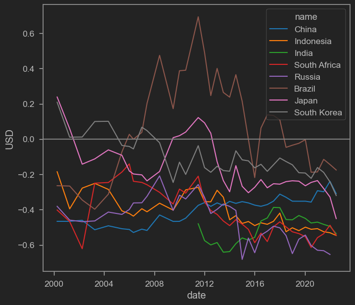

The topic of [de-dollarization](https://www.reuters.com/article/markets-dollar-dedollarisation-idTRNIKBN2XG09Q) has been a hot-button issue lately. De-dollarization -- the effort by many countries to reduce dependence on the US dollar (USD) -- is reportedly being championed especially by [BRICS](https://katadata.co.id/sortatobing/ekonopedia/64362b63a2ec5/dedolarisasi-upaya-brics-dan-asean-kurangi-ketergantungan-dolar-as) nations (Brazil, Russia, India, China, and South Africa).

Indonesia is no exception. Bank Indonesia has established Local Currency Settlement (LCS) agreements with South Korea, Japan, China, Malaysia, and Thailand. In other words, Indonesia and its partner countries can now use their respective domestic currencies to settle cross-border payments without using the US dollar.

According to this [article](https://www.kompas.id/baca/ekonomi/2023/05/02/indonesia-tambah-negara-untuk-kerjasama-dedolarisasi), LCS is important for minimizing exchange rate risk in bilateral transactions. That may be true if the currency usage focuses solely on trade in goods and services. But these days, currencies are also used for asset transactions. In fact, the use of currencies for asset trading may well dominate their use for goods and services.

## Currency as a medium for asset exchange?

To answer this, some technical knowledge of the balance of payments (BoP) is needed. The BoP consists of two main accounts: the current account and the financial account.

In an open economy, we have:

$$
Y=C+I+G+(X-M)
$$

Meanwhile, saving is income that is neither consumed nor taxed, so S=Y-C-G (assuming total taxes = G). Therefore:

$$
Y-C-G-I=X-M
$$

Replacing Y-C-G with S:

$$
S-I=X-M
$$

S-I is the financial account, while X-M is the current account. One balances the other.

Put simply, a current account surplus means you sell goods but get paid with IOUs. Or more precisely, you accumulate savings that you don't spend right away.

Back to the currency question: for countries with trade surpluses, it means they store the proceeds from their exports in the form of foreign assets or investments. This is where a problem emerges: why would we hold another country's currency?

Holding foreign currency may be useful if you plan to import from that country. But this logic breaks down when the countries in these partnerships are NEARLY ALL IN SURPLUS! See for yourself:

<iframe src="https://data.worldbank.org/share/widget?end=2021&indicators=NE.RSB.GNFS.ZS&locations=ID-KR-JP-CN-BR-RU-ZA-IN&start=2011" width='450' height='300' frameBorder='0' scrolling="no" ></iframe>

Above I show the trade balance deficit (as % of GDP) for BRICS, Indonesia, Japan, and South Korea. As you can see, nearly all of them run surpluses. In other words, they generally supply more goods to the world than they buy, and the proceeds are stored as assets rather than spent.

## Undervaluation

This may be because these countries largely follow a mercantilist philosophy -- an economic doctrine that prioritizes export promotion and [dislikes imports](https://nasional.kompas.com/read/2021/03/05/07210071/saat-jokowi-gaungkan-benci-produk-luar-negeri) to boost industrial competitiveness. Export-oriented countries typically prefer a weak currency, because a weak currency makes exports cheap and imports expensive, pushing X-M into surplus.

For these countries, currency intervention is fully justified to keep their currencies weak, even though they should arguably be valued higher. We can check for this by looking at undervaluation -- comparing the nominal exchange rate with the "true" value. One approach is to use the [Big Mac Index](https://www.krisna.or.id/en/post/bigmacindex/) from The Economist.


```python
#import wbdata as wb

import datetime

## Read data from the economist

url='https://raw.githubusercontent.com/TheEconomist/big-mac-data/master/output-data/big-mac-raw-index.csv'

bmi=pd.read_csv(url,parse_dates=['date'])

## Create the 'real' exchange rate measures

bmi['bmi']=bmi['dollar_ex']+bmi['dollar_ex']*bmi['USD']

bmi.iso_a3.unique() # Showing unique iso_a3 codes for the next cell
```


    array(['ARG', 'AUS', 'BRA', 'GBR', 'CAN', 'CHL', 'CHN', 'CZE', 'DNK',
           'EUZ', 'HKG', 'HUN', 'IDN', 'ISR', 'JPN', 'MYS', 'MEX', 'NZL',
           'POL', 'RUS', 'SGP', 'ZAF', 'KOR', 'SWE', 'CHE', 'TWN', 'THA',
           'USA', 'PHL', 'NOR', 'PER', 'TUR', 'VEN', 'EGY', 'COL', 'CRI',
           'PAK', 'SAU', 'LKA', 'UKR', 'URY', 'ARE', 'IND', 'VNM', 'AZE',
           'BHR', 'HRV', 'GTM', 'HND', 'JOR', 'KWT', 'LBN', 'MDA', 'NIC',
           'OMN', 'QAT', 'ROU'], dtype=object)


```python
b=[]

ctr=('CHN','IDN','IND','ZAF','RUS','BRA','JPN','KOR')

for i in ctr:

    bmii=bmi.loc[(bmi['iso_a3'] == i)]

    b.append(bmii)

b=pd.concat(b)

sns.lineplot(data=b,x='date',y='USD',hue='name',palette='tab10')

plt.axhline(0,color='grey')
```


    <matplotlib.lines.Line2D at 0x2b17256fa48>


    

    


As we can see, except perhaps for Brazil, BRICS countries, Indonesia, Japan, and South Korea all have currencies that are _undervalued_ relative to the USD. In other words, there are indications that these countries deliberately suppress their currencies to keep their products "competitive" in global markets.

Using the Big Mac Index isn't exactly rigorous, but if you're interested in diving deeper into currency misalignment, check out my colleague Wishnu Mahraddika's publication [here](https://www.semanticscholar.org/paper/Real-exchange-rate-misalignments-in-developing-The-Mahraddika/db4e36ea6bda5ea90c484157e80bdf2111f31161).

In other words, these countries appear to actively pursue trade surpluses! But not everyone can be in surplus at the same time, can they? This becomes even more stark when we compare trade balances in USD terms:

<iframe src="https://data.worldbank.org/share/widget?end=2021&indicators=NE.RSB.GNFS.CD&locations=ID-KR-JP-CN-BR-RU-ZA-IN&start=2011" width='450' height='300' frameBorder='0' scrolling="no" ></iframe>

Who can absorb China's surplus??

## Uncle Sam to the rescue

So far, the surpluses of these net-exporter countries have been absorbed by none other than the United States.

<iframe src="https://data.worldbank.org/share/widget?end=2021&indicators=NE.RSB.GNFS.CD&locations=ID-KR-JP-CN-BR-RU-ZA-IN-US&start=2011" width='450' height='300' frameBorder='0' scrolling="no" ></iframe>

As you can see, it is the US that has been absorbing these countries' surpluses. How does the US government manage this? Through debt, of course! Everyone wants to sell to the US because it has deep pockets, and because everyone sells to the US, everyone holds US dollars, which makes the dollar the world's primary reserve currency -- a self-fulfilling network effect!

On top of that, the US has a relatively open financial account. It's very easy for anyone to trade assets in the US. You can easily buy stocks and other financial products there. Capital controls are lax, so everyone feels safe parking their money in the US. The US is also where many creative and promising startups emerge.

## Does de-dollarization reduce exchange rate risk?

The problem is that the countries in these partnerships (including Malaysia and Thailand) are almost all surplus countries. They maintain their surpluses by exchanging goods for foreign assets. The most popular foreign assets? Those of the country with the largest deficit in the world -- the United States. Consequently, even if bilateral trade is settled in local currencies, those currencies end up being exchanged for dollars anyway to purchase US assets. Or perhaps bilateral trade is only a fraction of total trade with the US.

Again, as long as the US remains the world's number one buyer of goods and services, it will be hard to avoid holding US dollars. And since we'll ultimately transact with the US (whether buying assets or selling goods), the exchange rate relative to the USD will remain relevant.

That said, de-dollarization pressures may actually be coming more from the US side itself! US sanctions against Russia have made the entire world rethink the safety of USD-denominated assets. Additionally, the possibility of a US government bond default due to the debt ceiling may also erode global confidence in US assets.

And beyond exchange rates, the changing global order going forward could have even bigger implications for our economy. If BRICS and many countries do push through with de-dollarization, the giant surplus countries will need to rethink their domestic industries because they won't be able to export like before (since the main buyer for many countries is the US). The impact could be far greater than "mere" exchange rate effects.

That said, I think LCS options like these are still attractive. The more payment systems available, the better, and efforts like LCS deserve our appreciation.

That's it for this post -- hope it's useful.
