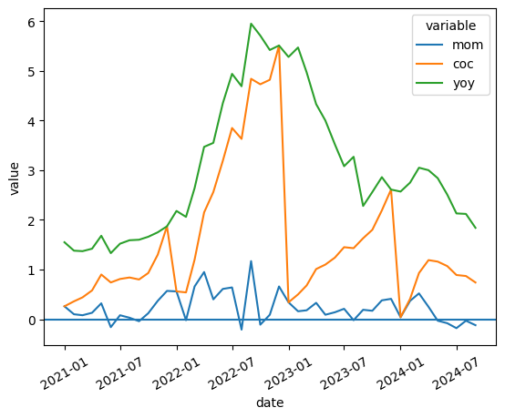
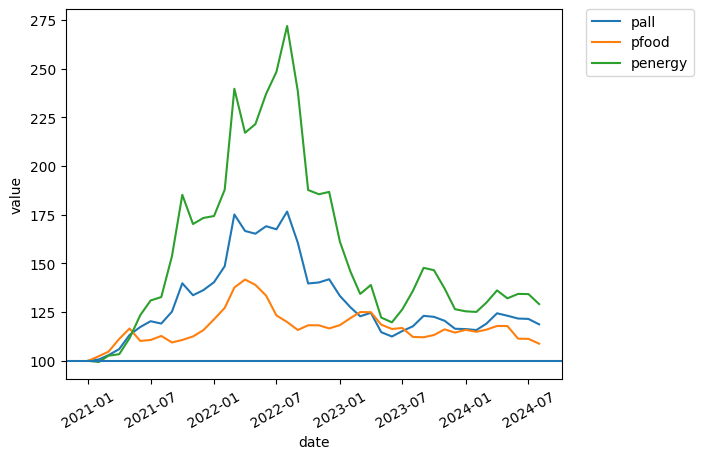
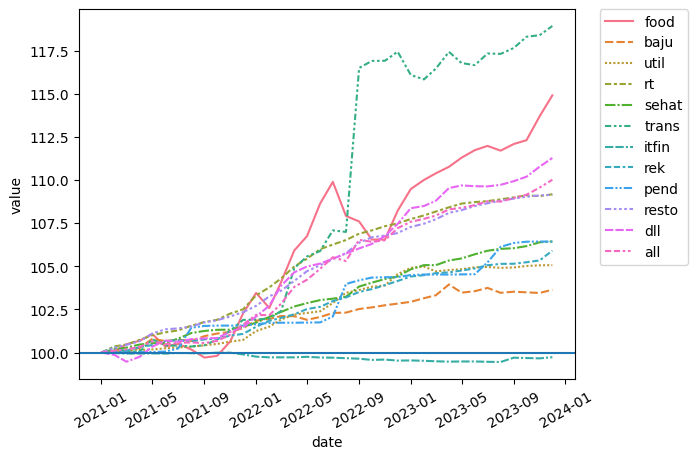
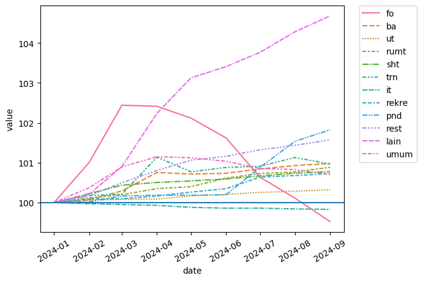
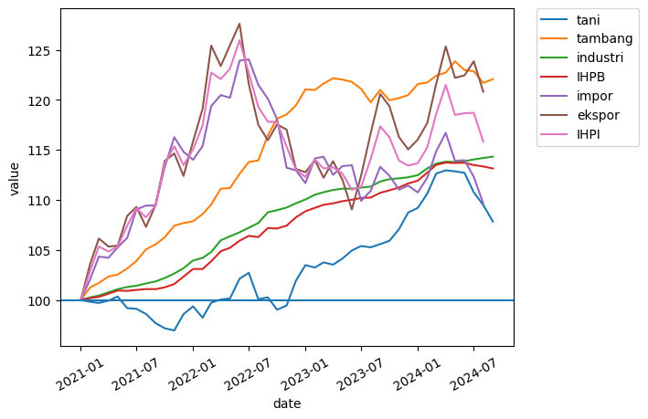

Indonesia has recently been buzzing about five consecutive months of deflation. Some analysts like [INDEF](https://finance.detik.com/berita-ekonomi-bisnis/d-7573591/deflasi-5-bulan-berturut-bukti-kelas-menengah-tak-punya-uang) have argued this signals weakening purchasing power among the middle class. But [Finance Minister Sri Mulyani](https://money.kompas.com/read/2024/10/04/203606126/sri-mulyani-anggap-deflasi-5-bulan-berturut-turut-berdampak-positif?lgn_method=google&google_btn=onetap) considers it not a serious concern because _core inflation_ (inflation excluding food and energy prices, which tend to be volatile) on a month-to-month basis is still positive.

We can easily check this. I use data from [SEKI](https://www.bi.go.id/id/statistik/ekonomi-keuangan/seki/default.aspx#headingFour), specifically Table VIII.1. I visualize it with seaborn, though I haven't used Python in a while -- I've been using R more recently, so apologies if the code isn't the cleanest.

Let's first look at overall inflation. Typically, cumulative-over-cumulative inflation can be set aside. Month-over-month usually hovers below 1%, and we can indeed see that m-o-m has been in negative territory for the last 5 months. Year-over-year inflation remains around 2%, consistent with Bank Indonesia's target. But we can see that y-o-y inflation was relatively high throughout 2022, then started declining in 2023 through the present. What happened in 2022?


```python
import pandas as pd
import seaborn as sns
import matplotlib.pyplot as plt
import datetime
## Read data from the economist
url=f'https://docs.google.com/spreadsheets/d/1--ddaTIthvm3kQe97GTEqj1Rb1km0fwI/export?gid=1542512999#gid=1542512999&format=xlsx'
data=pd.read_excel(url,engine='openpyxl')
## Create the 'real' exchange rate measures
index=data.iloc[:,0:4]
index=pd.melt(index, id_vars='date').reset_index()
sns.lineplot(data=index,y='value',x='date',hue='variable')
plt.xticks(rotation=30)
plt.axhline(0)
```


    <matplotlib.lines.Line2D at 0x20f57727650>


    

    


2022 was the beginning of the Russia-Ukraine war. Two prices surged dramatically: food and energy! Russia, a major oil and gas exporter, and Ukraine+Russia, major exporters of food commodities (specifically wheat) and fertilizers. This naturally had a massive impact on inflation in Indonesia. So could Sri Mulyani be right that the current deflation is driven by food and energy prices stabilizing?

By the way, the chart below is taken from the [IMF Primary Commodity Prices Excel database](https://www.imf.org/en/Research/commodity-prices). I use the overall commodity price index, food only, and energy only, all normalized to January 2021. The spike is very clear, especially in energy. Food prices were also volatile but not as extreme as energy prices.


```python
## Read data from the economist
url=f'https://docs.google.com/spreadsheets/d/1--ddaTIthvm3kQe97GTEqj1Rb1km0fwI/export?gid=1542512999#gid=1542512999&format=xlsx'
data=pd.read_excel(url,engine='openpyxl')
## Create the 'real' exchange rate measures
index=data[['date','pall','pfood','penergy']]
index=pd.melt(index, id_vars='date').reset_index()
sns.lineplot(data=index,y='value',x='date',hue='variable')
plt.axhline(100)
plt.xticks(rotation=30)
plt.legend(bbox_to_anchor=(1.05, 1), loc=2, borderaxespad=0.)

```


    <matplotlib.legend.Legend at 0x20f58356c60>


    

    


How about in Indonesia? If Sri Mulyani is right, and food and energy were indeed the main drivers of inflation in previous years (so current deflation reflects price normalization), we should see a similar trend in Indonesian food and energy prices. Again, I use price indices normalized to January 2021. One complication is that SEKI appears to have shifted its base year in 2024, making it difficult to create continuous charts from 2021 onward. I had to cut at January 2024. Unfortunately SEKI doesn't explicitly note this base year change.

Below I break down various price indices by category as defined in SEKI.

| Variable | Meaning |
| --- | --- |
| food | FOOD, BEVERAGES AND TOBACCO |
| baju | CLOTHING AND FOOTWEAR |
| util | HOUSING, WATER, ELECTRICITY AND HOUSEHOLD FUEL |
| rt | FURNISHINGS, HOUSEHOLD EQUIPMENT AND ROUTINE MAINTENANCE |
| sehat | HEALTH |
| trans | TRANSPORTATION |
| itfin | INFORMATION, COMMUNICATION AND FINANCIAL SERVICES |
| rek | RECREATION, SPORTS AND CULTURE |
| pend | EDUCATION |
| resto | FOOD AND BEVERAGE PROVISION/RESTAURANTS |
| dll | PERSONAL CARE AND OTHER SERVICES |
| all | GENERAL |


```python
## Read data from the economist
url=f'https://docs.google.com/spreadsheets/d/1--ddaTIthvm3kQe97GTEqj1Rb1km0fwI/export?gid=1542512999#gid=1542512999&format=xlsx'
data=pd.read_excel(url,engine='openpyxl')
## Create the 'real' exchange rate measures
index=data[['date','food','baju','util','rt','sehat','trans','itfin','rek','pend','resto','dll','all']]
index=pd.melt(index, id_vars='date').reset_index()
sns.lineplot(data=index,y='value',x='date',hue='variable',style='variable')
plt.axhline(100)
plt.xticks(rotation=30)
plt.legend(bbox_to_anchor=(1.05, 1), loc=2, borderaxespad=0.)

```


    <matplotlib.legend.Legend at 0x20f5a83c740>


    

    


We can see that before 2024, transportation prices were the biggest contributor to inflation. In July, there was a sudden significant increase in the transportation price index -- probably due to fuel prices. But food prices truly surged from late 2021 through 2022. Remember the cooking oil shortage? It wasn't just cooking oil -- many food prices rose as countries imposed food export bans globally. Interestingly, IT and financial services prices have been in deflation for a long time. Why? The index has been declining continuously since January 2021. Unfortunately energy prices aren't directly visible here, but we can treat the transportation price index as a proxy for energy prices, given that Indonesia's largest energy import is fuel.

Now let's move to 2024.


```python
## Read data from the economist
url=f'https://docs.google.com/spreadsheets/d/1--ddaTIthvm3kQe97GTEqj1Rb1km0fwI/export?gid=1542512999#gid=1542512999&format=xlsx'
data=pd.read_excel(url,engine='openpyxl')
## Create the 'real' exchange rate measures
index=data[['date','fo','ba','ut','rumt','sht','trn','it','rekre','pnd','rest','lain','umum']]
index=pd.melt(index, id_vars='date').reset_index()
sns.lineplot(data=index,y='value',x='date',hue='variable',style='variable')
plt.axhline(100)
plt.xticks(rotation=30)
plt.legend(bbox_to_anchor=(1.05, 1), loc=2, borderaxespad=0.)

```


    <matplotlib.legend.Legend at 0x20f5aa9f500>


    

    


Sure enough, the food price index drops significantly starting from March, in line with the normalization of international food commodity prices. By August, food prices returned to January 2021 levels! Food and beverages typically form the largest share of the average Indonesian consumer's basket, so when food prices drop, overall inflation naturally falls. Transportation also appears to have stabilized -- not declining, but not rising either. Could Sri Mulyani be right?

Education prices jumped suddenly in August -- could this be related to the controversy over universities raising tuition fees? And IT & financial services continue their deflationary trend. Also, personal care and other services rose significantly -- what's going on there?

But no discussion of inflation and purchasing power would be complete without looking at the Wholesale Price Index (WPI, or IHPB in Indonesian). The WPI typically reflects the producer side and is often more volatile than the consumer price index. I use SEKI Table VIII.2. It also includes the international trade price index (IHPI) consisting of import and export wholesale prices.


```python
## Read data from the economist
url=f'https://docs.google.com/spreadsheets/d/1--ddaTIthvm3kQe97GTEqj1Rb1km0fwI/export?gid=1542512999#gid=1542512999&format=xlsx'
data=pd.read_excel(url,engine='openpyxl')
## Create the 'real' exchange rate measures
index=data[['date','tani','tambang','industri','IHPB','impor','ekspor','IHPI']]
index=pd.melt(index, id_vars='date').reset_index()
sns.lineplot(data=index,y='value',x='date',hue='variable')
plt.axhline(100)
plt.xticks(rotation=30)
plt.legend(bbox_to_anchor=(1.05, 1), loc=2, borderaxespad=0.)

```


    <matplotlib.legend.Legend at 0x20f5b212540>


    

    


Similar pattern. International trade prices started rising as early as 2021, peaking around late 2021/early 2022 before normalizing. Recently, the export price index has risen higher than the import price index, indicating cheap imports relative to exports. This is typically good news -- it means our exports fetch high prices while imports are cheap. With modest exports, we can buy lots of imports! Of course, the recent drama around Chinese imports suggests that cheap imports aren't necessarily good for everyone.

Agricultural product prices have been rising since H2 2022. But from the end of Q1, agricultural prices started stagnating and even declined from July. This seems consistent with falling food prices. Not only are food imports cheaper, but domestic prices are falling too. Meanwhile, the overall WPI appears fairly stable.

In summary, Indonesia's five consecutive months of deflation appear to be driven primarily by the food sector. Given that food prices had previously surged, we probably shouldn't be too worried about this deflation -- it seems to reflect food prices returning to pre-Russia-Ukraine war levels.

Non-food prices are still growing, which suggests non-food demand remains healthy. Meanwhile, falling prices could be driven by weak demand or increased production. The production shock of 2022 appears to be subsiding, allowing supply to shift rightward again. In other words, this might not be something to worry about.

However, to complement this analysis, we need to wait for Indonesia's Q3 GDP data, which should be released soon or at the latest next month. Only then can we conclude more confidently whether this deflation is normal or alarming. That said, I disagree with [Sri Mulyani's statement about unemployment shifting to ride-hailing](https://tirto.id/srimul-11-juta-lapangan-kerja-tercipta-di-tengah-isu-banyak-phk-g4rv?utm_source=dlvr.it&utm_medium=twitter#google_vignette) because the shift from formal to informal employment is not something we want. I'm also concerned about the [shrinking middle class](https://open.spotify.com/episode/0NhTDAeIbTmlTdjyDcs7AV?si=163b2e76f3184dc2), which I find very alarming. But on deflation specifically, we probably don't need to panic just yet.

What do you think? Tag me on [twitter](https://twitter.com/imedkrisna) and let's discuss.

By the way, the data I used for these visualizations can be downloaded [here](https://docs.google.com/spreadsheets/d/1--ddaTIthvm3kQe97GTEqj1Rb1km0fwI/edit?usp=sharing&ouid=104276702488037611353&rtpof=true&sd=true).
