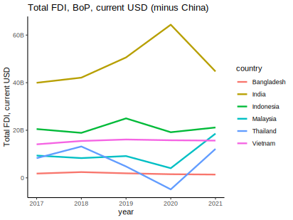
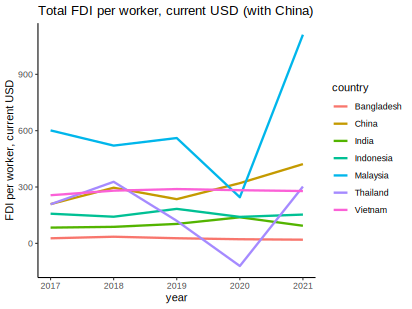

Indonesia was surprised on a holiday by the issuance of the [Job Creation Government Regulation in Lieu of Law (Perppu)](https://katadata.co.id/ariayudhistira/infografik/63b8f666b58c4/kontroversi-hari-libur-di-perppu-cipta-kerja) as a replacement for the law currently being debated by the Constitutional Court (MK). This appears to have been driven by the government's concerns about [foreign investment](https://www.republika.co.id/berita/rnwmit457/peneliti-perppu-cipta-kerja-tak-lantas-tuntaskan-masalah-investasi). The argument is that the Job Creation Law being contested at the Constitutional Court creates uncertainty for investors. This is compounded by the approaching election year, which makes the future of the law -- currently in the government's court -- even more uncertain.

The government's concerns seem well-founded. The global economy amid raging inflation in developed countries is not the best time for investment. Many investors are [torn](https://www.cnbc.com/2022/11/03/companies-look-to-diversify-as-chinas-covid-controls-take-a-toll.html) between staying in China or moving elsewhere, and those looking to diversify [don't seem to be looking much at Indonesia](https://www.businessinsider.com/china-trade-war-covid-companies-moving-supply-chains-2022-12). All of this amid our pride in growing foreign investment in nickel smelters that were painstakingly attracted with an export ban that [wasn't cheap](https://www.thejakartapost.com/opinion/2022/04/03/indonesias-claim-that-banning-nickel-exports-spurs-downstreaming-isquestionable.html), [Softbank](https://bisnis.tempo.co/read/1675957/kembali-singgung-batalnya-softbank-berinvestasi-di-ikn-bahlil-pemerintah-tidak-bisa-diatur-investor?utm_source=Twitter&utm_medium=Audev&utm_campaign=Bisnis_O) backing out of its investment promise in the new capital, and of course [Tesla](https://www.cnbcindonesia.com/tech/20221129201843-37-392292/luhut-haqqul-yaqin-tesla-bakal-investasi-di-indonesia), whose commitment has yet to materialize.

Looking at [World Development Indicators](https://data.worldbank.org/) data, Indonesia appears to have attracted fairly high FDI. As shown in Figure 1, Indonesia's FDI is second only to India.



However, we need to account for the size of the economy. While Indonesia's FDI is fairly high, we should look at FDI per worker. After all, the capital built through investment will be used by workers. Think of it this way: two companies might each buy 10 computers, but that investment is more valuable in the company with 10 employees than the one with 20. In the first company, each employee gets a computer; in the second, employees have to share. That's if they even get a computer -- some might have to bring their own laptop (this is a personal gripe; please ignore).



On a per-capita basis, Indonesia clearly needs more FDI. By the way, Figure 1 doesn't include China because adding China would make all other countries look tiny in comparison.

Looking at the trend in both figures, FDI growth in Indonesia hasn't outpaced neighboring countries. Even the impact of the Job Creation Law isn't clearly visible in the trend.

Lastly, as a country with a large domestic economy, it's quite natural for Indonesia to depend more on domestic investment than foreign investment. [BPS data from BKPM](https://www.bps.go.id/indicator/13/793/1/realisasi-investasi-penanaman-modal-dalam-negeri-menurut-provinsi-investasi-.html) shows that foreign investment is indeed relatively small compared to domestic investment.

Table 1. Domestic and foreign investment realization in million USD
| Investment | 2016 | 2017 | 2018 | 2019 | 2020 | 2021 |
| --------- | ---- | ---- | ---- | ---- | ---- | ---- |
| Domestic | 216,230.8 |	262,350.5 |	328,604.9 | 386,498.4 |	413,535.5 |	447,063.6 |
| Foreign | 28,964.1 |	32,239.8 |	29,307.9 | 28,208.8 |	28,666.3 |	31,093.1 |

On the other hand, this may also indicate that foreign investors haven't been very interested in Indonesia from the start. While domestic investment keeps growing, FDI has stagnated. Can the Perppu change this? Let's see!

The code to reproduce Figures 1 and 2 is below.

```r
library(WDI)
library(tidyverse)

indi<-c(           
  "fdi"="BX.KLT.DINV.CD.WD",
  "lab"="SL.TLF.TOTL.IN",
  "pop"="SP.POP.TOTL"
)

ctr<-c('BGD','CHN','IDN','MYS','IND','THA','VNM')

dat<-as_tibble(WDI(
  indicator = indi,
  country = ctr,
  start=2017
  ))
dat$weks<-dat$fdi/dat$pop
dat$wuks<-dat$fdi/dat$lab

dat |>
  subset(country!="China") |> 
  ggplot(aes(x=year,y=fdi,color=country))+geom_line(linewidth=1.1)+theme_classic()+
  labs(title = "Total FDI, BoP, current USD (minus China)", y="Total FDI, current USD")+
  scale_y_continuous(labels = scales::label_number_si())
ggsave("pic1.svg")
ggplot(data=dat,aes(x=year,y=weks,color=country))+geom_line(linewidth=1.1)+theme_classic()+
  labs(title = "Total FDI per capita, current USD (with China)", y="FDI per capita, current USD")+
  scale_y_continuous(labels = scales::label_number_si())
ggsave("pic2.svg")
ggplot(data=dat,aes(x=year,y=wuks,color=country))+geom_line(linewidth=1.1)+theme_classic()+
  labs(title = "Total FDI per worker, current USD (with China)", y="FDI per worker, current USD")+
  scale_y_continuous(labels = scales::label_number_si())
ggsave("pic3.svg")
```
