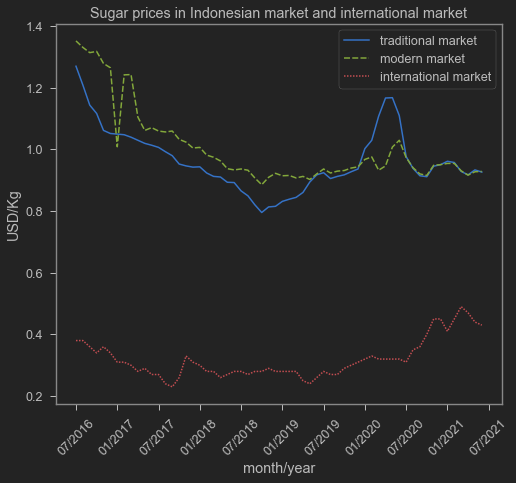

## Sugar Prices
Sugar is one of the most important commodity in Indonesia. Sugar consumption in Indonesia is high. In 2018, Indonesian consumption of sugar reached 26.34 kg per capita, much higher than India, Vietnam and The Philippines[^1]. That is true even when Indonesian domestic sugar price is consistently higher if we compared to International market[^1].

I downloaded data from CEIC Indonesia Premium Database[^3] and FAO website[^4] and use it to plot the different prices of Indonesian sugar price in both traditional and modern market, and compare it with the world price.


```python
url='secret!' # url is deleted because I can't freely distribute data from CEIC sorry
a=pd.read_csv(url) # taking data from google drive
a=pd.melt(a,id_vars='date',value_vars=['tprice','mprice','ip']) # melt it to fit my plot
# making a neat x axis
lol=pd.date_range('2016-07-01','2021-07-01', 
              freq='6MS').strftime("%m/%Y").tolist()
```


```python
# plotting
sns.lineplot(data=a,x='date',y='value',hue='variable',style='variable')
plt.xticks(ticks=lol,rotation=45)
plt.legend(labels=['traditional market','modern market','international market'])
plt.title('Sugar prices in Indonesian market and international market')
plt.xlabel('month/year')
plt.ylabel('USD/Kg')
```


    Text(0, 0.5, 'USD/Kg')


    

    


As the graph above show, Indonesian domestic price of sugar is consistently higher than international market by about 3 times. One might wonder if international market price of sugar is so low, why don't we import more of it? The obvious answer is because trade is restricted.

## Sugar Trade

Indonesia import almost 70% of its sugar consumption from international market[^2]. Not only Indonesians love its teh manis, but sugar is also play a crucial role in sugar refining industry. This industry is then supplying other industries like sugary drinks.

{}
Previously I wrote that sugar-using industry also need to apply for sugar import to Ministry of Industry and Ministry of Trade. However according to Risetio, a person who once involved in this industry, sugar-using industry don't import. Instead, they buy domestically from sugar refinery who do the import. Not sure why sugar-using industry don't import directly. See thread below.
{}

<blockquote class="twitter-tweet"><p lang="in" dir="ltr">Balesnya di sini aja Med. Jadi kalau baca artikel tersebut, ada 1 kesalahan paling krusial. Perusahaan industri pengguna gula (industri makanan dan minuman) TIDAK meminta rekomendasi impor maupun persetujuan impor gula.</p>&mdash; Risetioz (@risetioz) <a href="https://twitter.com/risetioz/status/1413680694774038531?ref_src=twsrc%5Etfw">July 10, 2021</a></blockquote> <script async src="https://platform.twitter.com/widgets.js" charset="utf-8"></script> 

The regulation that restrict trade of sugar is MOT regulations. To be precise, it's [Peraturan Menteri Perdagangan Nomor 14 Tahun 2020](http://jdih.kemendag.go.id/peraturan/detail/1960/2) which superseeds Peraturan Menteri Perdagangan Nomor 117 Tahun 2015. This regulation put a quota restriction on sugar. According to the regulation, imports are allowed only to supply domestic industry and control inflation. How much quota to import is determined in a coordination meeting held by Coordinating Ministry of Economy. I feel like this is basically Ministry of Agriculture asking for low quota to protect farmers, while Ministry of Industry asking for high quota to help sugar-using industries. But I might be wrong.

To get how much quoota to import next year, the flow chart looks like this:


In short, the data Ministries are using come from (partially) sugar-using firms. Surveyor is needed to make sure that the asked quota is in-line to firms' actual production capacity. A small firms asking for a big quota might turn out to be a reseller, a rent-seeker if you will, hence needs to be audited. This process happens every year.

Now that the quota has been settled, sugar refineries need to apply for the actual quota.


The process is rather tedious, involving many agencies and web applications. Ministries may only grant a fraction of the asked quota. This process is not very transparent, in the sense that you may not always know why your quota is cut, or how much quota is left for the taking[^1]. Additionally, some firms who get refined sugar intended for industry were also sometimes sold as white sugar in the consumer market which priced higher, creating an illegal trading[^1].

The quota to import sugar for household is granted by the ministry only to 3 or 4 State-Owned Enterprises[^1]. These firms are also prone to badly time their imports and rent-seeking behavior can't be excluded since these firms will always get the quota even when they don't realize the quota[^1]. 

If that is the case, let's improve domestic sugar production! We should not rely on imported sugar, right? Well, that depends. Improving domestic sugar market is also a bit of a problem. Some of the on-farm problems include sufficient manpower, lack of monitoring of subsidized seeds and fertilizers, and inefficient mills[^1]. On-farm and off-farm is already highly subsidized, but productivity remain low. Not only the government spent a lot of money on improving productivity, it still turns out to be more expensive compared to international production of sugar.

## New Solution?

There is this thing called ['Neraca Komoditas'](https://money.kompas.com/read/2021/05/04/130900726/pemerintah-godok-neraca-komoditas-apa-urgensinya-?page=all), which supposed to have an information on how much production and consumption of a commodity, including sugar. The difference between production and consumption on that data will be used to settle on how much quota to import. Setting the quota to import seems to be highly political. It is basically a battle between sugar producer and sugar consumer. It is clear that sugar is used by many industries under the Ministry of Industry which just finished a regulation which says [it will guarantee a steady flow of industrial inputs](https://www.antaranews.com/berita/2152478/neraca-komoditas-gula-perlu-segera-dibentuk-kata-anggota-dpr).

Neraca Komoditas wants to cut a process of negotiating how much sugar is imported in the coordination meeting. Remember my impression about sugar producer vs sugar-using industries? The data for sugar production mainly comes from Ministry of Agriculture, while the data for sugar consumption comes from Ministry of Industry (like in the first diagram). When the two clashes, Ministry of Industry might accuse Ministry of Agriculture of inflating their figures, as Industry still have hard times getting sugar. With Neraca Komoditas as the one sole data which rule them all, this dispute is (hopefully?) no more. This is hypothesized to cut a bit of a red-tape as the coordination meeting may not last as long.

It will be much more interesting if Neraca Komoditas actually cuts the need to apply for recommendation letters. It is possible that the web portal SIINAS to actually remember how much quota firms planned for the import, the quota is set per firms instead of in aggregate. Firms can feel safer as ministries can no longer cut their proposed quota. It may reduce rent-seeking activity. It will be even better if ministries actually publish the data, the quota, and who gets how much. It will be easier for firms to check their actual allowance and for public to audit the system.

If the whole recommendation letters are still in place, then the red tape faced by industries seems to be staying. Neraca Komoditas might help bureaucrats in their debates of settling in a quota (remember, Neraca Komoditas is not only about sugar, but also a huge lists of 'commodities'). But it seems like it won't affect industries that much.

At the end of the day, it is still going to be the good ol' quota. Neraca Komoditas might solve the data issue, but the old quota problem seems to not be addressed. If firms granted by the quota is still restricted, it won't solve the problem. If how much quota left or how fast it is disbursed to the market is not clear, it won't solve the problem. If industries which import industrial inputs will still mask their refined sugar to white crystal and do shadow trading, it won't solve the problem.

There will be a material center for small business who can't import their own inputs. Will it be another SOE? we'll have to see.

It is easy to be pessimistic, but let's give the benefit of the doubt to the government. Again.

What do you think? Please comment on my [twitter!](https://twitter.com/iMedKrisna/status/1413547344407138304?s=20)

[^1]: Saputri, N. K., & Respatiadi, H. (2018). Policy reform to lower sugar prices in Indonesia. CIPS Indonesia. https://repository.cips-indonesia.org/media/270481-policy-reform-to-lower-sugar-prices-in-i-839081a1.pdf 

[^2]: Amanta, F. (2021). The cost of Non-Tariff Measures on Food and Agriculture in Indonesia. CIPS Policy Paper, 36. https://www.cips-indonesia.org/cost-of-ntm 

[^3]: CEIC. "Average Retail Price: Sugar: Local". _CEIC Indonesia Premium Database_. CEIC.

[^4]: FAO. "ICE Future US: Sugar". _GIEWS FPMA_. https://fpma.apps.fao.org/giews/food-prices/tool/public/#/dataset/international


