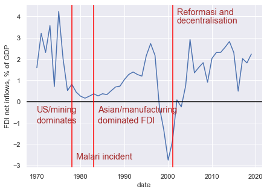
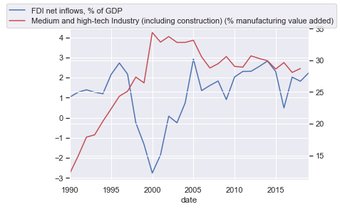
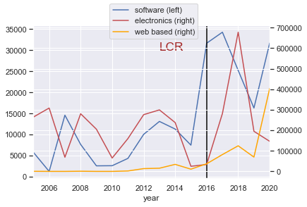
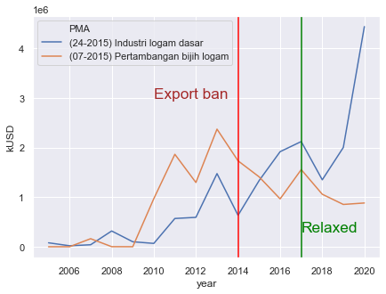
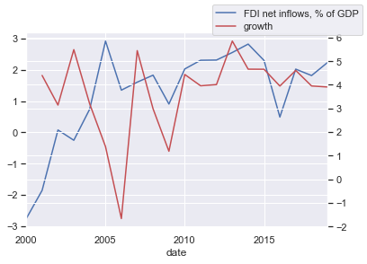

This post briefly discusses FDI developments in Indonesia.

## FDI Trends Since 1970

The chart below shows Indonesia's net FDI inflows as a percentage of GDP. The data source is the World Bank's World Development Indicators.

The chart is accompanied by a narrative from Linblad (2015). According to him, there are at least three major phases in Indonesia's FDI story: before 1985 (the oil boom era), after 1985 through the crisis, and the reform period.

## FDI and high-tech industry

Again using World Development Indicator data, I searched for indicators containing the keyword "high-tech," and WDI returned these four indicators:

    id                 name
    -----------------  ------------------------------------------------------------------------------------
    NV.MNF.TECH.ZS.UN  Medium and high-tech Industry (including construction) (% manufacturing value added)
    TX.MNF.TECH.ZS.UN  Medium and high-tech exports (% manufactured exports)
    TX.VAL.TECH.CD     High-technology exports (current US$)
    TX.VAL.TECH.MF.ZS  High-technology exports (% of manufactured exports)

I use the first one for the visualization below.

There doesn't seem to be much of a link between FDI and high-tech manufacturing growth. In fact, it almost looks inverted: when FDI rises as a share of GDP, high-tech manufacturing actually declines. Of course, manufacturing also includes construction and CPO processing. Besides, FDI also flows into mining and services like e-commerce and banking. FDI may not be going into high-tech manufacturing at all -- it may be going into industries with low high-tech value added. This makes sense: FDI flows into the most profitable industries, and when those industries grow, factors of production shift toward them. High-tech manufacturing growth dropped in 2005 and never recovered. The mid-2000s was the peak of the commodity boom and the era of so-called 'sunset industries.'

## Two Non-Tariff Measures (NTMs): TKDN and Export Ban

TKDN stands for Tingkat Komponen Dalam Negeri (Local Content Requirement). One of the most prominent TKDN cases involves smartphones.

The chart below shows realized FDI (source: BKPM) in the electronics, software, and IT industries. TKDN for smartphones became mandatory in 2016. We can see that FDI in these three industries suddenly surged after 2016.

    <Figure size 504x360 with 0 Axes>

Below is the mineral export ban. In 2014, mineral exports were banned, though the ban was relaxed in 2017. Investment in base metals increased while mining of metal ores declined. Investors appear to have shifted into mineral processing due to the raw commodity export ban.

    Text(2017-01-01 00:00:00, 300000, 'Relaxed')

## How about FDI and industrial growth?

This time I use the World Bank Global Economic Monitor (GEM) to get Indonesia's industrial production data. Since it's in constant USD, I convert it to growth rates ($\Delta log$), though this is still not ideal.

    id         name
    ---------  -----------------------------------------------
    IPTOTNSKD  Industrial Production, constant US$
    IPTOTSAKD  Industrial Production, constant US$, seas. adj.

    <function matplotlib.pyplot.show(*args, **kw)>

Industrial growth, as we can see above, was briefly negative in 2006. It has since stagnated at around 4-5%. There doesn't seem to be any relationship with FDI. Again, it's possible that FDI isn't going into the manufacturing sector at all.
