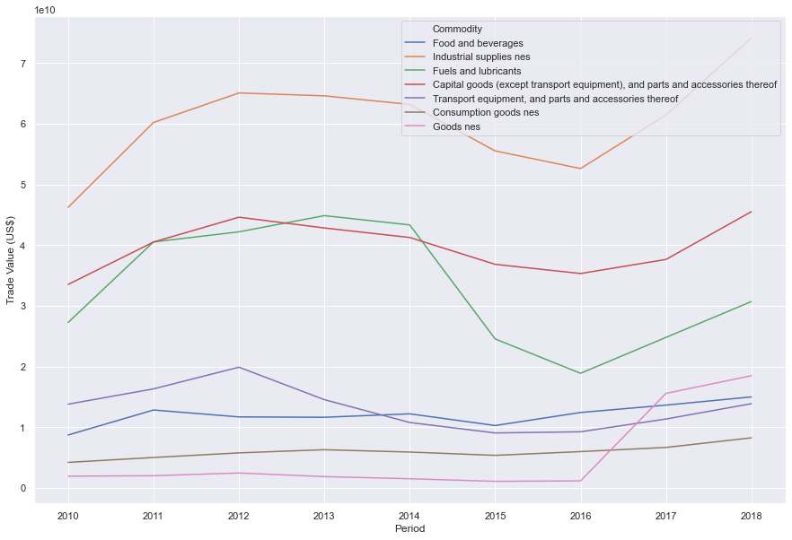

```python
import pandas as pd
import seaborn as sns; sns.set()
import matplotlib.pyplot as plt
c=pd.read_csv('data.csv')
# c['Year']=pd.to_datetime(c['Year'])
c
```


<div>
<style scoped>
    .dataframe tbody tr th:only-of-type {
        vertical-align: middle;
    }

    .dataframe tbody tr th {
        vertical-align: top;
    }

    .dataframe thead th {
        text-align: right;
    }
</style>
<table border="1" class="dataframe">
  <thead>
    <tr style="text-align: right;">
      <th></th>
      <th>Classification</th>
      <th>Year</th>
      <th>Period</th>
      <th>Period Desc.</th>
      <th>Aggregate Level</th>
      <th>Is Leaf Code</th>
      <th>Trade Flow Code</th>
      <th>Trade Flow</th>
      <th>Reporter Code</th>
      <th>Reporter</th>
      <th>...</th>
      <th>Qty</th>
      <th>Alt Qty Unit Code</th>
      <th>Alt Qty Unit</th>
      <th>Alt Qty</th>
      <th>Netweight (kg)</th>
      <th>Gross weight (kg)</th>
      <th>Trade Value (US$)</th>
      <th>CIF Trade Value (US$)</th>
      <th>FOB Trade Value (US$)</th>
      <th>Flag</th>
    </tr>
  </thead>
  <tbody>
    <tr>
      <th>0</th>
      <td>BE</td>
      <td>2015</td>
      <td>2015</td>
      <td>2015</td>
      <td>1</td>
      <td>0</td>
      <td>1</td>
      <td>Import</td>
      <td>360</td>
      <td>Indonesia</td>
      <td>...</td>
      <td>NaN</td>
      <td>NaN</td>
      <td>NaN</td>
      <td>NaN</td>
      <td>NaN</td>
      <td>NaN</td>
      <td>10278507559</td>
      <td>NaN</td>
      <td>NaN</td>
      <td>0</td>
    </tr>
    <tr>
      <th>1</th>
      <td>BE</td>
      <td>2015</td>
      <td>2015</td>
      <td>2015</td>
      <td>1</td>
      <td>0</td>
      <td>1</td>
      <td>Import</td>
      <td>360</td>
      <td>Indonesia</td>
      <td>...</td>
      <td>NaN</td>
      <td>NaN</td>
      <td>NaN</td>
      <td>NaN</td>
      <td>NaN</td>
      <td>NaN</td>
      <td>55528874227</td>
      <td>NaN</td>
      <td>NaN</td>
      <td>0</td>
    </tr>
    <tr>
      <th>2</th>
      <td>BE</td>
      <td>2015</td>
      <td>2015</td>
      <td>2015</td>
      <td>1</td>
      <td>0</td>
      <td>1</td>
      <td>Import</td>
      <td>360</td>
      <td>Indonesia</td>
      <td>...</td>
      <td>NaN</td>
      <td>NaN</td>
      <td>NaN</td>
      <td>NaN</td>
      <td>NaN</td>
      <td>NaN</td>
      <td>24544865534</td>
      <td>NaN</td>
      <td>NaN</td>
      <td>0</td>
    </tr>
    <tr>
      <th>3</th>
      <td>BE</td>
      <td>2015</td>
      <td>2015</td>
      <td>2015</td>
      <td>1</td>
      <td>0</td>
      <td>1</td>
      <td>Import</td>
      <td>360</td>
      <td>Indonesia</td>
      <td>...</td>
      <td>NaN</td>
      <td>NaN</td>
      <td>NaN</td>
      <td>NaN</td>
      <td>NaN</td>
      <td>NaN</td>
      <td>36836914241</td>
      <td>NaN</td>
      <td>NaN</td>
      <td>0</td>
    </tr>
    <tr>
      <th>4</th>
      <td>BE</td>
      <td>2015</td>
      <td>2015</td>
      <td>2015</td>
      <td>1</td>
      <td>0</td>
      <td>1</td>
      <td>Import</td>
      <td>360</td>
      <td>Indonesia</td>
      <td>...</td>
      <td>NaN</td>
      <td>NaN</td>
      <td>NaN</td>
      <td>NaN</td>
      <td>NaN</td>
      <td>NaN</td>
      <td>9055977726</td>
      <td>NaN</td>
      <td>NaN</td>
      <td>0</td>
    </tr>
    <tr>
      <th>...</th>
      <td>...</td>
      <td>...</td>
      <td>...</td>
      <td>...</td>
      <td>...</td>
      <td>...</td>
      <td>...</td>
      <td>...</td>
      <td>...</td>
      <td>...</td>
      <td>...</td>
      <td>...</td>
      <td>...</td>
      <td>...</td>
      <td>...</td>
      <td>...</td>
      <td>...</td>
      <td>...</td>
      <td>...</td>
      <td>...</td>
      <td>...</td>
    </tr>
    <tr>
      <th>58</th>
      <td>BE</td>
      <td>2014</td>
      <td>2014</td>
      <td>2014</td>
      <td>1</td>
      <td>0</td>
      <td>1</td>
      <td>Import</td>
      <td>360</td>
      <td>Indonesia</td>
      <td>...</td>
      <td>NaN</td>
      <td>NaN</td>
      <td>NaN</td>
      <td>NaN</td>
      <td>NaN</td>
      <td>NaN</td>
      <td>43331670200</td>
      <td>NaN</td>
      <td>NaN</td>
      <td>0</td>
    </tr>
    <tr>
      <th>59</th>
      <td>BE</td>
      <td>2014</td>
      <td>2014</td>
      <td>2014</td>
      <td>1</td>
      <td>0</td>
      <td>1</td>
      <td>Import</td>
      <td>360</td>
      <td>Indonesia</td>
      <td>...</td>
      <td>NaN</td>
      <td>NaN</td>
      <td>NaN</td>
      <td>NaN</td>
      <td>NaN</td>
      <td>NaN</td>
      <td>41258986399</td>
      <td>NaN</td>
      <td>NaN</td>
      <td>0</td>
    </tr>
    <tr>
      <th>60</th>
      <td>BE</td>
      <td>2014</td>
      <td>2014</td>
      <td>2014</td>
      <td>1</td>
      <td>0</td>
      <td>1</td>
      <td>Import</td>
      <td>360</td>
      <td>Indonesia</td>
      <td>...</td>
      <td>NaN</td>
      <td>NaN</td>
      <td>NaN</td>
      <td>NaN</td>
      <td>NaN</td>
      <td>NaN</td>
      <td>10779398194</td>
      <td>NaN</td>
      <td>NaN</td>
      <td>0</td>
    </tr>
    <tr>
      <th>61</th>
      <td>BE</td>
      <td>2014</td>
      <td>2014</td>
      <td>2014</td>
      <td>1</td>
      <td>0</td>
      <td>1</td>
      <td>Import</td>
      <td>360</td>
      <td>Indonesia</td>
      <td>...</td>
      <td>NaN</td>
      <td>NaN</td>
      <td>NaN</td>
      <td>NaN</td>
      <td>NaN</td>
      <td>NaN</td>
      <td>5907223118</td>
      <td>NaN</td>
      <td>NaN</td>
      <td>0</td>
    </tr>
    <tr>
      <th>62</th>
      <td>BE</td>
      <td>2014</td>
      <td>2014</td>
      <td>2014</td>
      <td>1</td>
      <td>1</td>
      <td>1</td>
      <td>Import</td>
      <td>360</td>
      <td>Indonesia</td>
      <td>...</td>
      <td>NaN</td>
      <td>NaN</td>
      <td>NaN</td>
      <td>NaN</td>
      <td>NaN</td>
      <td>NaN</td>
      <td>1510641554</td>
      <td>NaN</td>
      <td>NaN</td>
      <td>0</td>
    </tr>
  </tbody>
</table>
<p>63 rows × 35 columns</p>
</div>


```python
plt.figure(figsize=(15,10))
#nt=sns.load_dataset("c")
#sns.lineplot(x=x, y=y, data=c)
g=sns.lineplot(x="Period", y="Trade Value (US$)", hue="Commodity",data=c)
g.legend(loc='best', ncol=1)
```


    <matplotlib.legend.Legend at 0x1eadc0ef088>





```python

```
