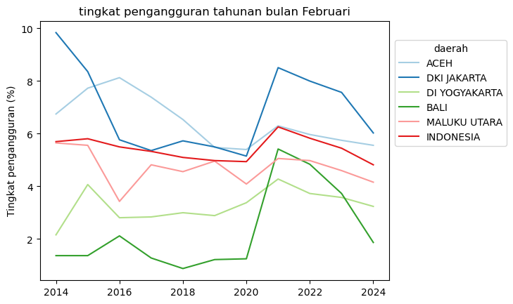
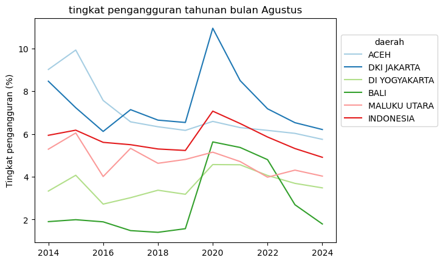
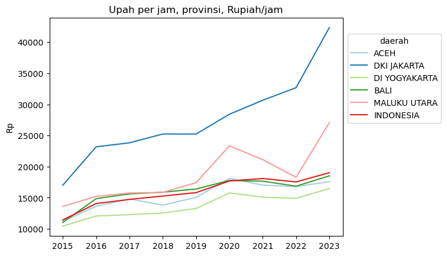

Some time ago, my colleague Anton and I were invited to chat on the Indah G Show platform. It was a casual, mostly spontaneous conversation. Unfortunately, in these impromptu settings, I often don't have data memorized, and there's no opportunity to check data -- or at least doing so would break the flow. Quite different from chatting on Twitter, which is asynchronous.

One such moment was when we were discussing the unemployment rate. At the time (the recording was around October or November 2024), news about deflation and unemployment was widespread, and many were claiming unemployment was high. I said that the unemployment rate at the time probably wasn't that different from previous periods. I also mentioned that unemployment rates can vary by region. Unfortunately, checking provincial unemployment figures takes a bit of time.

Now it's time to check the data. I claimed that unemployment was probably not higher than usual in 2024, and that it could be high in Aceh but low in Jakarta, so it's not so bad (or at least not worse than typical).

I use the [open unemployment rate by province](https://www.bps.go.id/id/statistics-table/2/NTQzIzI=/tingkat-pengangguran-terbuka-menurut-provinsi--persen-.html) table from BPS. BPS uses the Sakernas survey conducted in two different months: February and August. I plot the last 10 years, separately for February and August. I select a few provinces: Aceh and Jakarta (since I mentioned these on the podcast), plus Yogyakarta, Bali, and North Maluku (no particular reason). The data is shown below.


```python
import seaborn as sns
import matplotlib as plt
import pandas as pd
```


```python
data=pd.read_excel("ur.xlsx")
feb=data.query("bulan=='Februari'")
aug=data.query("bulan=='Agustus'")
```


```python
ax=sns.lineplot(data=feb,x="tahun",y="ur",hue='daerah',palette='Paired')
sns.move_legend(ax,loc='lower right',bbox_to_anchor=(1.35,.5))
ax.set(xlabel="",ylabel="Unemployment rate (%)",title="Annual unemployment rate, February")
```


    [Text(0.5, 0, ''),
     Text(0, 0.5, 'Unemployment rate (%)'),
     Text(0.5, 1.0, 'Annual unemployment rate, February')]


    

    


```python
ax=sns.lineplot(data=aug,x="tahun",y="ur",hue='daerah',palette='Paired')
sns.move_legend(ax,loc='lower right',bbox_to_anchor=(1.35,.5))
ax.set(xlabel="",ylabel="Unemployment rate (%)",title="Annual unemployment rate, August")
```


    [Text(0.5, 0, ''),
     Text(0, 0.5, 'Unemployment rate (%)'),
     Text(0.5, 1.0, 'Annual unemployment rate, August')]


    

    


Obviously, 2020 saw the COVID-19 pandemic, which caused unemployment rates to spike. Bali and Jakarta experienced far worse problems than other regions and the national average (red line), which makes sense given that both are highly service-oriented economies.

Overall, we can see that by August and February 2024, unemployment rates had largely returned to the pre-pandemic trend. Moreover, Jakarta has historically had a high unemployment rate -- above the national average -- just like Aceh. In fact, Jakarta's unemployment rate is often higher than Aceh's.

In short:

> (1) the unemployment rate is probably not as bad as the news suggests, since it's approaching the 10-year trend and has generally been improving since the COVID disruption. (2) Jakarta has an unemployment rate comparable to Aceh's, and both are above the national average.

It's also important to note that the unemployment rate alone is insufficient for labor market analysis, as many other indicators need to be considered. First, it's important to know the **labor force size**, which can rise due to various factors (e.g., people who normally continue to university decide not to, thus entering the labor force), or even fall (people become so desperate about finding work that they give up and exit the labor force). Then there are **hours worked** (BPS defines someone as employed if they work at least 1 hour per week, so someone could be working but with reduced hours, indicating a weak labor market). And most importantly, the **wages** paid for those hours. I previously discussed the potential impact of minimum wages on the labor market [here](https://www.krisna.or.id/post/umk/).

In other words, it's quite possible that the unemployment rate hasn't changed much, but what's actually happening is a reduction in hours worked or wages. This is like when snack prices stay the same but the contents shrink.

Analyzing the labor market is not straightforward, which is why even among economists, labor economics is a whole specialization. Hopefully this helps you be more critical when you see these numbers going forward.

By the way, BPS has started disseminating more wage data -- a very welcome development. Here's one example of wage data on the [BPS website](https://www.bps.go.id/id/statistics-table/2/MTE3MiMy/upah-rata---rata-per-jam-pekerja-menurut-provinsi--rupiah-jam-.html). Also be careful looking at averages, since averages will be skewed and inflated by high earners, to some degree.

Hope this post helps clarify things.


```python
## This is a copilot generated code.
import pandas as pd
from io import StringIO

# Tab-delimited data
data = """daerah\t2015\t2016\t2017\t2018\t2019\t2020\t2021\t2022\t2023
ACEH\t11226\t13627\t14809\t13814\t15065\t18099\t17037\t16772\t17585
DKI JAKARTA\t17012\t23181\t23826\t25238\t25236\t28420\t30662\t32685\t42354
DI YOGYAKARTA\t10440\t12070\t12281\t12554\t13275\t15771\t15098\t14916\t16478
BALI\t11038\t14852\t15624\t15889\t16408\t17775\t17662\t16857\t18521
MALUKU UTARA\t13607\t15226\t15760\t15864\t17425\t23338\t21131\t18278\t27078
INDONESIA\t11434\t14068\t14731\t15275\t15823\t17696\t18089\t17542\t19027"""

# Use StringIO to read the string data into a pandas dataframe
df = pd.read_csv(StringIO(data), delimiter='\t')
df_long = pd.melt(df, id_vars=['daerah'], var_name='year', value_name='value')

## Seaborn
ax=sns.lineplot(data=df_long,x="year",y="value",hue='daerah',palette='Paired')
sns.move_legend(ax,loc='lower right',bbox_to_anchor=(1.35,.5))
ax.set(xlabel="",ylabel="Rp",title="Hourly wage by province, Rupiah/hour")
```


    [Text(0.5, 0, ''),
     Text(0, 0.5, 'Rp'),
     Text(0.5, 1.0, 'Hourly wage by province, Rupiah/hour')]


    

    
