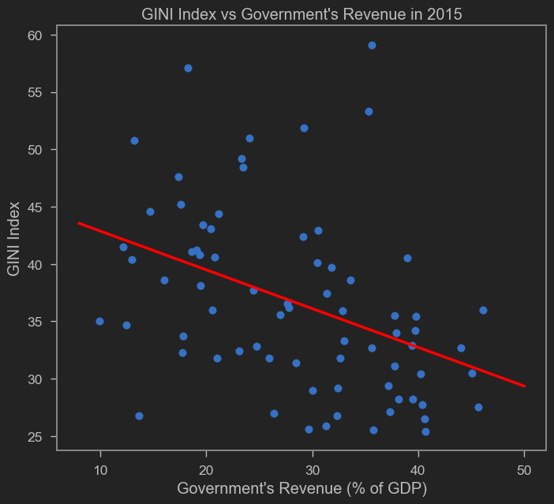

Inequality is one of the most important issues of our time. You've surely seen people discussing inequality on social media. Recently, a Twitter account crossed my timeline arguing: how can there be Coldplay tickets priced at 11 million rupiah while so many people are poor? And they sold out, too!

We can debate the validity of such statements. But we can't deny how widely discussed inequality is -- not just in Indonesia but worldwide. In the early days of neoliberalism's heyday (perhaps the 80s-90s), inequality didn't get much _spotlight_ from influential economists. It was considered a _byproduct_ of an efficient economy. Besides, for a more productive, efficient, and wealthy country, reducing inequality is naturally easier than in a poor one. That's no longer the case. More and more economists recognize the importance of inequality even before a country is rich.

But the argument that wealthy nations can more easily reduce inequality may be valid. After all, wealthy citizens spend more and drive the economy for others -- so-called "trickle-down economics" (we can argue against trickle-down economics; perhaps in another post).

More importantly, if citizens are wealthy, the government can tax more. With more tax revenue, the government can redistribute more to those in need. This is essentially forced trickle-down. This is the trick used by countries that lean social democratic and welfare-state. Thanks to redistribution, income inequality matters less because high earners pay more taxes, and the proceeds are distributed as social assistance, so consumption inequality can be kept in check.

It's therefore clearly important to see how GDP growth can translate into high tax and non-tax government revenue! How does Indonesia's government revenue compare to other countries?

<iframe src="https://data.worldbank.org/share/widget?end=2021&indicators=GC.REV.XGRT.GD.ZS&locations=ID-MY-TH-AU-SG&start=2008" width='450' height='300' frameBorder='0' scrolling="no" ></iframe>

The relationship between inequality and government revenue can actually be tested -- and easily, since nowadays we can pull data from the World Bank's [World Development Indicators](https://data.worldbank.org/indicator/GC.REV.XGRT.GD.ZS?end=2021&locations=ID-MY-TH-AU-SG&start=2008). Here I plot GINI Ratio against Government Revenue from that source.

The GINI Ratio ranges from 0 to 100, where 0 means perfect equality and 100 means perfect inequality. Government Revenue is measured as % of GDP. I use World Development Indicators data from 2015.



There does appear to be an inverse relationship, consistent with the theory above: the higher the government revenue, the lower the GINI Ratio. There are some outliers, but most observations fit the red regression line. From this simple exercise, it's clear that ensuring government revenue keeps pace with economic growth must be a key target. Moreover, continuing or even [expanding anti-inequality programs](https://ekonomi.bisnis.com/read/20230509/9/1654164/bank-dunia-minta-sri-mulyani-tambah-anggaran-bansos) is increasingly necessary.

Disclaimer: this is just plain OLS with no treatment of any kind and plenty of potential biases. Think of this as an introduction for those who want to conduct more serious and in-depth research. For those interested in replicating the chart above, I used the code below. Hope this post is useful.


```python
import wbdata as wb
import datetime
import statsmodels.api as sm
import numpy as np
import matplotlib.pyplot as plt

## Pull data from World Development Indicators
a=wb.get_dataframe({"SI.POV.GINI" : "GINI"},
                   data_date=datetime.datetime(2015,1,1), convert_date=True, keep_levels=True)
a["GR"]=wb.get_dataframe({"GC.REV.XGRT.GD.ZS" : "GR"},
                   data_date=datetime.datetime(2015,1,1), convert_date=True, keep_levels=True)
a=a.reset_index()

## Find regression line parameters using OLS
x = sm.add_constant(a.GR)
model=sm.OLS(a.GINI,x,missing='drop')

results = model.fit()
b,c=results.params

## Plot chart
plt.scatter(a.GR,a.GINI)

# Plot regression line
xseq = np.linspace(8, 50, num=500)
plt.plot(xseq, b + c * xseq, color="red", lw=2.5)

plt.xlabel("Government's Revenue")
plt.ylabel('GINI Ratio')
plt.title("GINI Ratio vs Government Revenue")
plt.show()
```
