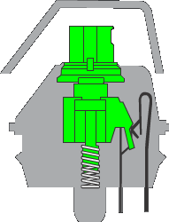
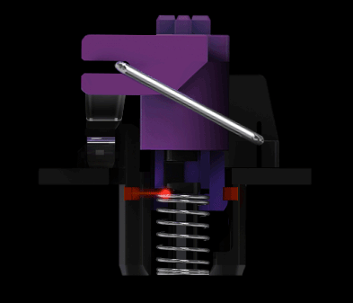

This semester has been incredibly busy. Lots of work, a [presentation](https://krisna.netlify.app/talk/paper2/) for one of my dissertation milestones, and teaching. On the teaching front, I was fortunate that during the pandemic, when the university cut staff heavily, I was among those kept on. The problem is that with fewer hires, I got buried in marking -- checking assignments and final exams. Very stressful.

As the semester ended, so came Black Friday + Cyber Monday + Boxing Day -- a string of discount days in Australia. I figured, since I rarely splurge, I could treat myself this time.

Among the discounted items, electronics got massive markdowns. Since I had some cash, I decided to try buying a keyboard to replace my current one. I'd been using the [Logitech MX Keys](https://www.jbhifi.com.au/products/logitech-mx-keys-advanced-wireless-illuminated-keyboard), a very sleek and comfortable keyboard. Based on forums, mechanical keyboards are supposedly better for typing because they provide better _feedback_. You don't have to press as deep, making them more comfortable for typing. Having never tried typing on a mechanical keyboard, I thought I'd give it a shot.

I tried buying keyboards at [JB Hi-Fi](https://www.jbhifi.com.au/), a major electronics retailer in Australia. Prices are fairly competitive, there are many locations, and the Belconnen store lets you try different switches in-person. Best of all, if you don't like the product after a week or two, you can exchange it for something else. That's the power of [Australian Consumer Law](https://support.jbhifi.com.au/hc/en-au/articles/360053720393-Faulty-Products-Consumer-Guarantees).

Thanks to the exchange policy, I got to try 3 different keyboards. I browsed various switches recommended for typing and bought based on discounts. The first keyboard I tried was the [Logitech G512 GX Brown Switch](https://www.jbhifi.com.au/products/logitech-g512-carbon-lightsync-rgb-mechanical-gaming-keyboard-gx-brown-switch), mainly because I'm a huge Logitech fan. Their products are expensive but genuinely good. Unfortunately, it didn't suit me. So I switched to a Razer product, the Razer BlackWidow. Still not quite right, so I ended up with the Razer Huntsman. Here are the specs:

| Keyboard | Logitech MX Keys | Logitech G512 GX Brown | Razer BlackWidow | Razer Huntsman |
|----------|------------------|------------------------|------------------|----------------|
| Switches | Scissor | [GX-Brown](https://www.logitechg.com/en-au/innovation/mechanical-switches.html) | [Razer Green](https://www2.razer.com/au-en/razer-mechanical-switches) | [Razer Purple](https://www2.razer.com/au-en/razer-optical-switch) |
| Feel | Tactile | Bump | Clicky | Clicky |
| Actuation force (g) | 37.1 | 50 | 50 | 35.5 |
| Actuation travel (mm) | 1.26 | 1.9 | 1.74 | 1.56 |
| Total travel (mm) | 1.84 | 4.0 | 4.0 | 3.5 |
| typing speed (WPM) | 73 | 68 | 73 | 80 |

Some notes:
1. Actuation force: how hard you need to press the key. Higher means more finger fatigue during long typing sessions, but also fewer accidental key presses.
1. Actuation travel: how far you need to press before the keystroke registers. Higher means deeper press required.
1. Total travel: how far the key can be pressed to the bottom. Higher means deeper.
1. I tested typing speed using [typingtest.com](https://www.typingtest.com/) at medium difficulty for 3 minutes. WPM = Words per Minute.
1. Other figures from [rtings.com](https://www.rtings.com/), except Logitech specs which are from the [official Logitech website](https://www.logitechg.com/en-au/innovation/mechanical-switches.html).

I'll give my review and reasons why I didn't like the Logitech G512 and Razer BlackWidow. I'm currently still trying the Huntsman and hoping it works out. I'll focus on typing and _switches_, since switches are the main reason I tried mechanical keyboards. Macros are the most useful feature beyond that. I'm not particularly interested in RGB.

Note that I'm not a keyboard enthusiast. I'm just a regular user who browses around. I read various reviews from Rtings, Tom's Hardware, etc. and watched YouTube videos from channels like RandomFrankP and Hardware Canucks. For serious reviews, I'd recommend those sources.

## Logitech MX Keys

| What I love | What I hate |
| --------- | ---------- |
| Thin and compact | Programmable only for F1-F12 keys |
| Great for typing | Expensive |
| Wireless is superb | |
| Battery lasts forever | |
| Logitech Flow is amazing | |

In early COVID-19 days in Australia (around early March), my university allowed reallocating part of research student funds to purchase _Work From Home_ (WFH) equipment, since campus was closing and all staff and students were required to work from home. Research funds are typically used for attending academic conferences, which obviously weren't happening anytime soon due to the pandemic.

I chose the Logitech MX Keys as my home keyboard. No particular reason -- I'm just a Logitech fan.

It turned out to be wonderful. The switches feel better than my office keyboard, in my opinion. Several standout features: First, it's wireless, supporting both a dongle (2.4 GHz) and Bluetooth. The wireless can use a unified dongle, so the keyboard and mouse (also Logitech) share one dongle. Bluetooth can connect to 3 devices -- other computers, tablets, and smartphones. Very helpful when I need to type on a tablet or phone. The wireless setup also keeps the desk clean. Switching between the wireless dongle and 3 Bluetooth devices is effortless because there are physical buttons on the keyboard.

Second, Logitech has a technology called _Flow_. If I copy text on my laptop, I can paste it on my tablet. Super helpful.

Third, the keyboard is very thin, reasonably compact, and has excellent build quality. The desk feels spacious, and hand position is comfortable because the keyboard is thin enough that you don't need to raise your fingers high. No finger fatigue typing here since the _actuation point_ is short and the force required is minimal.

## Logitech G512 GX-Brown

| What I love | What I hate |
| ----------- | ----------- |
| Fairly affordable | Cable is terrible |
| | The switches |
| | No macros |

This was the first keyboard I bought -- my first-ever mechanical keyboard. It was reasonably priced for a mechanical keyboard and on sale at the time. Being my first, I started cheap. Didn't dare go expensive right away.

The GX-Brown switch is Logitech's _tactile_ switch without the click sound typical of mechanicals. The keyboard sends a signal when the plates connect upon pressing. Unfortunately, it's hard to see in this gif I made from images on the Logitech website.

After trying it out, typing with the G512 was tiring and didn't suit me. My fingers got sore, and my palm area near the pinky ached. I think because I'm used to thin keyboards, I always press all the way to the bottom. But with mechanicals, you're supposed to hover -- you only need to press to the _actuation point_.

From the table above, this keyboard (and mechanical keyboards in general) requires slightly more force. Probably not noticeable for short typing sessions, but after typing all day, you definitely feel it.

This keyboard is also much taller than the MX Keys. My hand position felt awkward, so I had to buy a fairly tall wrist rest to keep my hands level. Somewhat more comfortable, but still sore during extended typing. The keyboard height is compounded by the tall _keycaps_ and longer travel distance. The differences look small on paper, but over a full day of typing, they add up.

As for speed, my typing speed actually dropped with this one, even though I switched to mechanical for better typing. Already uncomfortable AND slower -- a truly bad investment. Luckily I could still exchange it.

I decided to try clicky switches, since supposedly clicky feels better and you can feel the _actuation point_ more clearly, so you don't have to press as deep.

## Razer BlackWidow

| What I love | What I hate |
| ----------- | ----------- |
| Razer Green switch is amazing | Good value for money | 
| Fully programmable | |
| RGB is wild | |

I exchanged for the Razer BlackWidow. This was my first Razer product. It has clicky switches -- they make a clicking sound when pressed. In the gif below from Razer's official website, you can see that when the key is pressed, a plate hits another plate inside. That's when the keystroke registers and the computer detects the key press.

You can also see that the plate makes contact without needing to press the keycap all the way to the bottom.

The clicky switch is indeed better than the half-hearted tactile one. Truly satisfying to type with that click-click sound. But this keyboard still wasn't perfectly comfortable. Fingers still got sore. Based on specs, this keyboard has the same travel distance and actuation force as the GX-Brown. I was probably still bottoming out despite the click feedback.

That said, the click-click sound is genuinely enjoyable. Makes you feel like you're typing something really important. The downside, of course, is that it's fairly noisy. Could be annoying in an office. My wife said the sound was noticeable, though not too disruptive -- but hard to use while she's sleeping[^1].

This keyboard is fully programmable, so every key can be remapped and the options are extensive: you can set keys to alt, shift, launch programs or websites, and most importantly, store text snippets.

This keyboard is better than the Logitech GX-Brown. In my opinion, the Razer Green Switch is one of the best switches around, especially once you get used to the floating typing style. But there's a learning curve if you're coming from thin membrane keyboards. Once you adapt though, it's great.

[^1]: My WFH workspace = the bedroom. Can't help it -- renting a small unit to save money.

## Razer Huntsman

| What I love | What I hate |
| ----------- | ----------- |
| Razer Purple switch is amazing | Expensive | 
| Fully programmable | |
| RGB is wild | |

The last keyboard I tried is the Razer Huntsman. It uses new technology called opto-mechanical. While previous switches use electrical signals from metal plates, this keyboard uses laser to send signals from keyboard to computer. When a key is pressed, the laser connects to its receiver, sending a signal that the key has been pressed.

According to Razer, sending signals via laser makes it faaaaaaaaaar faster than metal plates. But it probably doesn't make a real difference, especially for an old person like me whose reflexes are already snail-paced.

What drew me to try this is that it has lighter actuation force and shorter travel distance than regular mechanicals, while retaining the same clicky feeling as the Razer Green switch. This should be more comfortable on the fingers for typing, especially for someone just starting with mechanical keyboards.

The clicky feel isn't quite as satisfying as the BlackWidow, in my opinion. But it's still nice. More importantly, my hands have been fine so far. Typing feels better here than with the Green switch. Hopefully I'll stick with this one.

In terms of speed, this switch has given me the fastest typing speed so far (80 WPM), even faster than the MX Keys at 73 WPM. It really is more comfortable to type on. Let's see how it holds up over the coming weeks. So far, the Huntsman is the most comfortable of the keyboards I've tried.

## Conclusion
Typing on the MX Keys was already very comfortable. Even though you bottom out every keystroke (it's so thin), your hands don't get sore. The wireless features -- switching between devices and copy-paste across them -- are incredibly useful. The unified receiver keeps the desk clean with just one dongle for keyboard and mouse. Logitech really is the best at making office products.

But typing with clicky-clicky switches brings a joy I can't quite explain. Mechanical keyboards also have extensive macros that are super useful for storing frequently-used commands and methods for coding. Maybe I just wasn't used to thick keyboards after years on laptops and the MX Keys. So far I haven't fully felt the mechanical advantage over MX Keys (aside from the click-clack). Oh, and the RGB grows on you over time.

Update: the Razer Huntsman has become my daily driver. After learning to type properly on a mechanical keyboard, Razer's clicky switches are genuinely fantastic. My fastest speed is on the Huntsman. It's lighter than typical clicky mechanical switches, so it's decent for newcomers. The full programmability is also excellent if you need it. I think Razer has the best software for key programming and macros. I do miss the MX Keys' versatile wireless capability, but programmability and clicky switches won me over.

Also read about my experience with the Yellow switch on the Razer Blackwidow V3 Mini [here](https://krisna.netlify.app/post/keyboard2/).
