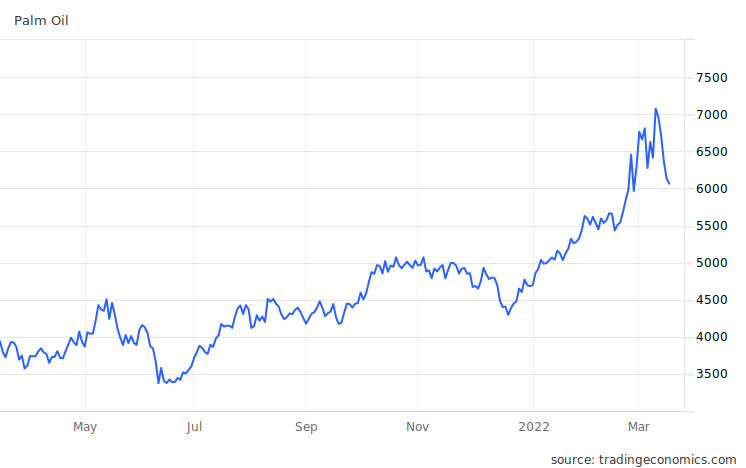
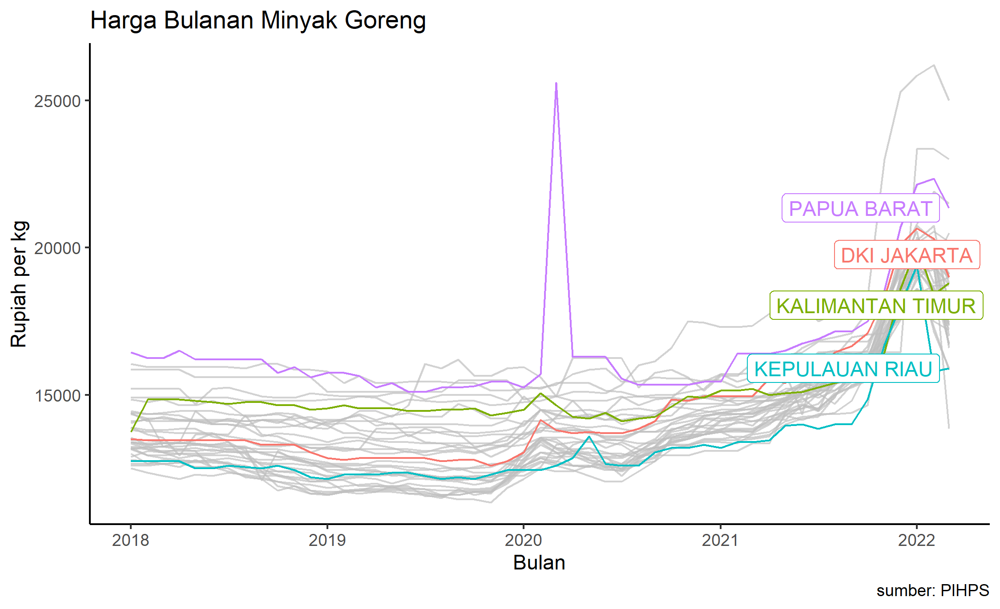

(update 7 April 2022: added no. 8 in table 1)

## Introduction

In recent days, the government has been grappling with rising cooking oil prices. The government is trying to keep cooking oil prices low. The President [tasked the Ministry of Trade](https://www.jawapos.com/ekonomi/04/01/2022/jokowi-minta-mendag-stabilkan-harga-minyak-goreng/) with ensuring price stability. The instruments used by the Ministry of Trade (MoT) include imposing a _Domestic Market Obligation_ (DMO) on palm oil as the raw material for cooking oil, as well as setting a _Domestic Price Obligation_ (DPO) for palm oil and a maximum retail price (HET) for cooking oil. Below is a summary of [MoT regulations](http://jdih.kemendag.go.id/peraturan?page=1) issued up to the time of writing.

###### Table 1: Timeline of MoT regulations on CPO and cooking oil
| No | Date | Regulation | Issue |
| -- | ------- | ------ | --- |
| 1 | 11 January 2022 | Permendag 1/2022 | BPD PKS subsidy for cooking oil in simple packaging, with HET of IDR 14,000 per liter. |
| 2 | 18 January 2022 | Permendag 2/2022 | DMO obligation for 9 tariff lines begins. |
| 3 | 19 January 2022 | Permendag 3/2022 | Revision of no. 1, subsidy expanded to all packaging types. |
| 4 | 1 February 2022 | Permendag 6/2022 | HET split into 3: IDR 11,500 for bulk, IDR 13,500 for simple packaging, IDR 14,000 for premium packaging. |
| 5 | 8 February 2022 | Permendag 8/2022 | Revision of no. 2, DMO expanded to 60 tariff lines. |
| 6 | 10 February 2022 | Kepmendag 129/2022 | DMO set at 20%. |
| 7 | 9 March 2022 | Kepmendag 170/2022 | DMO set at 30%. |
| 8 | 20 March 2022 | Permendag 12/2022 | DMO revoked. |

In the latest development, the government will [release the HET](https://katadata.co.id/happyfajrian/berita/6230c963601c9/pemerintah-lepas-harga-minyak-goreng-kemasan-ke-mekanisme-pasar) for packaged cooking oil. Meanwhile, bulk cooking oil will follow an HET of IDR 14,000 per liter. This became effective on 16 March 2022. Why release the HET? Because under the HET described in no. 4 of table 1, supply shortages occurred, leaving many people unable to buy cooking oil -- some even [died](https://www.kompas.tv/article/270000/seorang-ibu-meninggal-saat-antre-minyak-goreng-pengamat-memilukan-terpaksa-demi-cukupi-kebutuhan) while queuing for it.

## Underlying Assumptions

The DMO instrument is naturally premised on the assumption that cooking oil is expensive because the raw material is expensive. Indeed, around July, palm oil prices appeared to start rising. According to data from [tradingeconomics.com](https://tradingeconomics.com/commodity/palm-oil) (figure 1), the price of Crude Palm Oil (CPO) began to climb around July 2021, and rose again in September 2021.

By the way, look at what happened to prices after January. They went even higher after Indonesia implemented the DMO and DPO.

Meanwhile, data presented by the Trade Minister at a [press conference](https://www.youtube.com/watch?v=FTS9TGx_scM) (minute 5) on 9 March 2022 showed a slight increase in July 2021, with a sharper spike around November 2021. It seems this November spike triggered the government's response. The Minister also showed a decline in cooking oil prices in February 2022, citing it as evidence that the HET successfully brought prices down.

Armed with this information, it seems reasonable for the MoT to deduce that rising CPO prices were the root cause of expensive cooking oil. If so, it is logical for the MoT to think the solution lies in restricting exports (in this case via the DMO), thereby suppressing domestic CPO prices.

In other words, because the Minister felt the problem was on the buyer-competition side, the MoT helped domestic CPO buyers by forcing exporters to divert 20% (later 30%) of their production to the domestic market.

Unfortunately, cooking oil remained expensive. The DMO and DPO should have ensured sufficient raw material supply for cooking oil. The next deduction: CPO was being channeled to the domestic market, but for products other than cooking oil. This is why the DMO was expanded from 9 to 60 products (table 1, no. 5), to cover downstream CPO products like soap.

Yet cooking oil remained scarce despite all these policies. The next deduction: there must be a mafia, speculators, or leakage abroad. This is how the MoT came to involve the police.

But could there be other problems?

## Other Possible Problems: Domestic Origins

If the issue were truly international prices, then the DMO and DPO should have resolved it. The DMO and DPO are unfortunately not very useful if there are other problems originating domestically.

#### Biodiesel

The first problem is biodiesel. According to [Faisal Basri](https://faisalbasri.com/2022/02/03/ulah-pemerintahlah-yang-membuat-harga-minyak-goreng-melonjak/), the recent CPO price increase did not actually affect Indonesian exports much. He therefore suggested the problem might actually be domestic.

He pointed out a significant shift in CPO usage, from food dominance to biodiesel dominance. Quoting from his blog:

> CPO consumption for biodiesel surged from 5.83 million tons in 2019 to 7.23 million tons in 2020, a 24% increase. Conversely, CPO consumption for food processing fell from 9.86 million tons in 2019 to 8.42 million tons in 2020.

This was driven by the government's B20 program, subsidized by [BPDPKS](https://www.bpdp.or.id/). B20 is a blend of 80% diesel and 20% bio-oil. This program has since been upgraded to [B30](https://solarindustri.com/blog/apa-itu-biosolar/) and is projected to continue rising to B100 -- meaning CPO demand for biodiesel is expected to keep growing.

Naturally, cooking oil producers cannot compete with biofuel (BBN) producers in purchasing cheap CPO, since the B20/B30 program has been subsidized by BPDPKS while cooking oil receives no subsidy. If the biofuel subsidy were discontinued, the program would almost certainly stop since BBN is not at all competitive against other fuels. But if the subsidy continues, then cooking oil would also need to be subsidized. Is there enough money for that?

The same point was made by [Nisrina](https://mediaindonesia.com/ekonomi/469771/cips-produksi-biofuel-ganggu-kestabilan-pasokan-minyak-goreng) from CIPS.

By the way, some argue that the B20 program was originally created to help CPO producers whose international prices collapsed around 2018. If so, well -- prices are high again now. Maybe it is time to pause the program?

#### Limited Production

Growing demand obviously needs to be matched by increasing production. The problem is that Indonesia's CPO production has been on a declining trend since 2019.

CIPS wrote about [production](https://id.cips-indonesia.org/post/ringkasan-kebijakan-harga-minyak-goreng-di-indonesia) issues in Indonesian CPO. Among the factors mentioned: rising fertilizer prices (Russia and China are among Indonesia's main fertilizer exporters -- Russia is at war while China has begun restricting fertilizer exports), labor shortages, and weather. Rising demand, both foreign and domestic, will push CPO prices up if supply shrinks.

## Why the Price Ceiling Failed

The two problems above touch on fundamental supply and demand dynamics that push prices upward, even in the absence of mafias or speculators. Therefore, if these two issues are real, the HET will also fail. Beyond these two factors, several other things made the HET worsen the situation.

#### Distribution Costs

Distribution costs vary across regions and can undermine the HET. Cooking oil factories appear to be concentrated in western Indonesia, such as Sumatra and Java[^1]. Shipping to other regions is necessary. If this is the case, cooking oil prices should vary across different regions even under normal circumstances. Using [monthly cooking oil price data](https://hargapangan.id/tabel-harga/pasar-tradisional/komoditas) from PIHPS, I created the chart below. It contains monthly cooking oil prices at traditional markets since January 2018 across all Indonesian provinces. I highlighted a few provinces.

If price variation exists even in normal times, then the HET threatens shortages in regions with difficult distribution, especially at a time when energy and shipping costs are at historic highs.

#### Other Issues

Actually, the government has long wanted to regulate packaged cooking oil -- since around 2016 if I recall correctly. There was a regulation requiring retailers to sell cooking oil only in packaging, not in bulk. But this regulation was repeatedly postponed because packaged cooking oil would become too expensive if imposed on all producers and consumers. In fact, based on these repeated postponements, one could have predicted the HET would cause problems. I don't think any HET has ever succeeded in Indonesia.

#### Mafia?

Many also claim mafias are involved, or that cooking oil is a cartel industry. I think these accusations are reasonably grounded, given Indonesia's poor reputation for [corruption and bureaucratic inefficiency](https://www3.weforum.org/docs/GCR2017-2018/03CountryProfiles/Standalone2-pagerprofiles/WEF_GCI_2017_2018_Profile_Indonesia.pdf) in starting businesses, and its ranking as the world's 8th most [crony-capitalist](https://www.economist.com/finance-and-economics/2022/03/12/our-crony-capitalism-index-offers-a-window-into-russias-billionaire-wealth) economy according to The Economist. Moreover, nearly 50% of cooking oil sales are controlled by just [4 companies](https://bisnis.tempo.co/read/1556268/4-jawara-produsen-minyak-goreng-di-indonesia/full&view=ok).

Dealing with mafias is difficult though. It is probably not just a cooking oil problem. Especially if vertical integration from plantations to downstream products is actually more efficient when done by large companies. If these "mafias" grew large because they are efficient, recklessly tinkering with the industry could actually reduce efficiency. The government may have chosen to intervene in the industry because it lacks the tools to prosecute the big players (for various reasons). But intervention in cooking oil risks hurting the small players, since the big ones can always maneuver. Don't forget, according to Ministry of Agriculture data, about 40% of palm oil plantations are smallholder estates that may benefit from supplying to larger factories.

<iframe style="height:550px; width:100%; border: none;" src="https://databoks.katadata.co.id/datapublishembed/113928/luas-perkebunan-sawit-rakyat-406-dari-total-perkebunan-sawit-indonesia"></iframe>

Besides, figure 2 shows a sharp spike in November 2021. If mafias played a significant role, prices should have been high all along. Why only November? Did the mafia just form that month? Did they just hold a price-fixing meeting? Probably not. The sharp rise actually correlates with the point when CPO consumption by biodiesel producers surpassed CPO for food.

I think the mafia argument is very plausible. In fact, new mafias may have emerged because of the HET, which increased incentives for hoarding and smuggling due to price disparities. However, it seems hard to use the mafia as the primary explanation for the sharp rise in cooking oil prices. Even if mafias play a large role, the HET and DMO are probably not the right solutions -- they may actually create incentives for both existing and aspiring mafias.

## Conclusion

This problem may have actually gotten worse because the DMO, DPO, and HET failed to stabilize prices and supply. People who lose confidence in the government's ability to secure supply may start hoarding, which only worsens the situation.

Meanwhile, producers unable to meet the DMO or unable to supply cooking oil at the HET price will be forced to stop production. This will inevitably have knock-on effects on employment and consumption more broadly -- particularly ironic as the fasting month approaches.

Can we blame the MoT alone? Of course not. As an agency tasked by the President, it is perfectly reasonable for the MoT to use DMO, DPO, and HET since those are the instruments at its disposal. Some alternative solutions -- such as increasing export levies -- require coordination with the Ministry of Finance (which was [eventually done](https://katadata.co.id/yuliawati/berita/6232f06132c57/pemerintah-hapus-dmo-cpo-dan-het-minyak-goreng-tarif-ekspor-naik-80)). The biofuel program falls under the Ministry of Energy and Mineral Resources. Social assistance falls under the Ministry of Social Affairs. Then there is the supply side: labor, weather, fertilizer prices. State land use? That is under the Ministry of Environment and Forestry. Distribution has always been a chronic problem in Indonesia. Not to mention mafias. All of these factors, which fundamentally push cooking oil prices up, lie outside the MoT's jurisdiction.

If all you have is a hammer, every problem looks like a nail.

Now the MoT has agreed to release the HET along with raising the export levy to 80%. I think this is a reasonable step. The government now has funds for cooking oil subsidies, at least for bulk oil (while biodiesel subsidies continue). Cooking oil is starting to reappear, and supply is recovering fairly quickly (from hoarders?). In my view, higher prices with available goods are better than low prices with nothing on the shelves. At least if the product is available, we can all buy it and consume it frugally.

Prices may surge initially after the release. But as supply increases and production restarts -- since prices will be more palatable for producers -- I am fairly confident we will start seeing cooking oil prices gradually decline, though they will likely remain above IDR 14,000 (remember, there are many fundamental issues at play). Prices may stay elevated due to increased demand as Ramadan approaches. _We'll see_.

For now, I very much appreciate the MoT's decision to finally release prices to the market. Time to support Pak Lutfi and the team at the MoT.

[^1]: Kementerian Perdagangan. *Profil Komoditas Minyak Goreng*. [link (download)](https://ews.kemendag.go.id/sp2kp-landing/assets/pdf/120116_ANK_PKM_DSK_Minyak.pdf)
