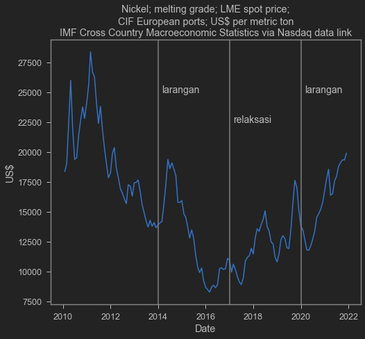
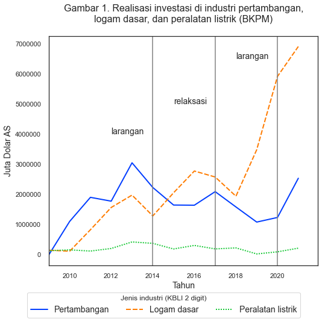

Recently, Indonesia has been buzzing about the MoU between Indonesia and LG Energy Solution, a South Korean battery cell manufacturer. The deal roughly entails LG Energy Solution making a massive upstream-to-downstream investment in battery cell production in Indonesia. My colleague Wishnu Mahraddika and I wrote about this at [The Conversation Indonesia](https://theconversation.com/mengapa-tren-kendaraan-listrik-adalah-momentum-transformasi-industri-otomotif-indonesia-152958). We were fairly optimistic about this development and hoped it would become a momentum for the automotive industry in Indonesia, particularly in electric vehicles.

## Investment Driven by Trade Restrictions

What I did not discuss there in depth is the critical role of the nickel export ban. In recent years, the Indonesian government has been [tightening nickel ore trade](https://katadata.co.id/desysetyowati/berita/5e9a4c3ac65b3/bkpm-larangan-ekspor-bijih-nikel-sesuai-uu-minerba#:~:text=Pemerintah%20melarang%20ekspor%20bijih%20nikel,Pengusahaan%20Pertambangan%20Mineral%20dan%20Batubara.) in order to increase domestic value-added. This has made it difficult for manufacturers outside Indonesia to source nickel. Investors who need nickel are effectively forced to invest in Indonesia.

But an export ban on minerals is not without problems. In the short run, the restriction has led to reduced investment and employment in the [downstream sector](https://www.iisd.org/sites/default/files/publications/case-study-indonesia-downstream-linkages.pdf). Nickel selling prices are regulated by the Ministry of Energy and Mineral Resources to maintain smelter economies of scale, resulting in selling prices [below international levels](https://tirto.id/harga-patokan-nikel-ditetapkan-30-di-bawah-harga-internasional-fSwz). This price regulation and oversight process is considered ineffective due to [lax enforcement](https://katadata.co.id/sortatobing/berita/5f7b0de0c8da2/kisruh-penambang-vs-pemilik-smelter-soal-harga-bijih-nikel?utm_source=Direct&utm_medium=Tags%20Pelarangan%20Ekspor%20Nikel&utm_campaign=BIG%20HL%20Slide%201).

Below are LME nickel prices, which I pulled from IMF Cross Country Macroeconomic Statistics via Quandl.

```python
import quandl
import datetime
quandl.ApiConfig.api_key = 'vDm7zkSvztuywGuZuuvY'
mydata = quandl.get('ODA/PNICK_USD', start_date="2010-01-31", paginate=True)
mydata = mydata.reset_index()
sns.lineplot(data=mydata,x='Date',y='Value')
plt.axvline(x=pd.to_datetime("2013-12-31"),color='grey')
plt.axvline(x=pd.to_datetime("2016-12-31"),color='grey')
plt.axvline(x=pd.to_datetime("2019-12-31"),color='grey')
plt.text(pd.to_datetime("2014-02-28"),25000,'ban',fontsize=14)
plt.text(pd.to_datetime("2017-02-28"),22500,'relaxation',fontsize=14)
plt.text(pd.to_datetime("2020-02-28"),25000,'ban',fontsize=14)
plt.title('Nickel; melting grade; LME spot price;\nCIF European ports; US$ per metric ton\nIMF Cross Country Macroeconomic Statistics via Nasdaq data link')
plt.ylabel('US$')
```


    Text(0, 0.5, 'US$')


    

    


As China's performance improves and several countries see declining COVID-19 cases, combined with Joe Biden's plans to boost U.S. domestic demand, demand for Indonesia's export commodities is likely to rise. Some observers even predict another commodity price boom. We have already felt the impact of rising soybean prices, which has angered tempeh producers.

This restriction somewhat reduces the potential for post-COVID-19 export-led recovery. As long as downstream nickel industries lack export capacity, the restriction will put pressure on the balance of payments. This short-term sacrifice may pay off if battery cell and electric vehicle exports can significantly boost the trade surplus in the future.

## Retaliation

Of course, the main problem with relying on exports is retaliation. This morning, the Twitter account of the Ministry of Trade ([@Kemendag](https://twitter.com/Kemendag)) tweeted that the European Union has filed a protest through the World Trade Organization (WTO). This is because Indonesia's nickel export ban disrupts supply chains in Europe.

<blockquote class="twitter-tweet"><p lang="en" dir="ltr">RI&#39;s new Trade Minister M Lutfi said he welcomes EU&#39;s appeal for <a href="https://twitter.com/wto?ref_src=twsrc%5Etfw">@wto</a> to rule in its favour on the EU-Indonesia nickel dispute (DS592).</p>&mdash; Kemendag (@Kemendag) <a href="https://twitter.com/Kemendag/status/1350227457157206022?ref_src=twsrc%5Etfw">January 15, 2021</a></blockquote> <script async src="https://platform.twitter.com/widgets.js" charset="utf-8"></script>

This is just the initial filing. Other countries may join in supporting the EU in this case. If Indonesia loses, it will have to revise the nickel ban. This would impact investors who have already built smelters and other nickel processing facilities, since reopening nickel exports would push domestic nickel prices up, disrupting their return-on-investment calculations.

We also must not forget that nickel, while very important, is only part of what electric vehicles need. EV production still requires several products that Indonesia does not currently have. One can imagine how damaging retaliation would be to the entire supply chain.

China tried a similar export ban. In 2010, China blocked exports of _rare-earth metals_. A 2014 WTO ruling found that China had violated WTO rules and the ban [had to be revised](https://www.reuters.com/article/us-china-wto-rareearths-idUSBREA2P0ZK20140326).

The WTO is currently weakened and it is unclear how long the EU-Indonesia case will take to resolve. But this could lead to retaliation. The EU could potentially ban or tax battery cell or EV exports from Indonesia. This could somewhat limit Indonesia's ability to explore global markets.

Relying on trade restrictions is generally not the best way to attract investment. Primarily because trade restrictions are highly distortive and can make the economy inefficient. We would naturally prefer investment driven by efficient bureaucracy, legal certainty, productive workers, and so on. But unfortunately, using trade restrictions seems to be a much easier and faster option.

## Staying Optimistic

But let us stay optimistic. This investment may generate _trickle-down_ effects for other industries and the SME sector, as the government hopes. We also need to see whether the Omnibus Law (UU CK) succeeds in reforming Indonesia's business environment to be more efficient and legally certain. The impact on supply chains has certainly been carefully considered by the government before issuing this policy.

Of course, we must be optimistic that the Ministry of Trade will successfully resolve this issue. Indonesia now has RCEP too, which may have its own mechanisms eventually. Even though we are forgoing some export-led recovery potential, hopefully it will all pay off with a thriving EV industry in the future. A healthy level of skepticism should be maintained, but of course we must all remain optimistic!

## Update

- Tesla is reportedly more sensitive to ESG considerations, while Indonesia's ESG practices appear to be [poor](https://tirto.id/potensi-investasi-tesla-terganjal-karena-indonesia-tak-ramah-esg-gaa9).

- Although nickel investment dipped temporarily, it appears to be climbing again. This coincides with a sharpening rise in foreign investment in the base metals industry. Batteries (classified under KBLI 27 "electrical equipment") have not yet shown a significant increase.

```python
# sns.set_theme(style="white", palette="bright")
dat=pd.read_csv('investasi_nikel.csv',parse_dates=['tahun'])
sns.lineplot(data=dat,x="tahun",y="jutaUSD",hue="industri",style="industri",linewidth=2)
plt.title('Figure 1. Investment realization in mining,\nbase metals, and electrical equipment (BKPM)\n',fontsize=16)
plt.ylabel('Million USD',fontsize=14)
plt.xlabel('Year',fontsize=14)
plt.xlim(pd.to_datetime("2009"),)
plt.legend(labels=['Mining', 'Base metals', 'Electrical equipment'],title='Industry type (2-digit KBLI)',
            bbox_to_anchor=(0.95,-0.1),ncol=3,fontsize=14)
plt.ticklabel_format(style='plain', axis='y')
plt.axvline(x=pd.to_datetime("2014"),color='grey')
plt.axvline(x=pd.to_datetime("2017"),color='grey')
plt.axvline(x=pd.to_datetime("2020"),color='grey')
plt.text(pd.to_datetime("2012"),4e6,'ban',fontsize=14)
plt.text(pd.to_datetime("2015"),5e6,'relaxation',fontsize=14)
plt.text(pd.to_datetime("2018"),6.5e6,'ban',fontsize=14)            
```


    Text(2018-01-01 00:00:00, 6500000.0, 'ban')


    

    


```python

```
