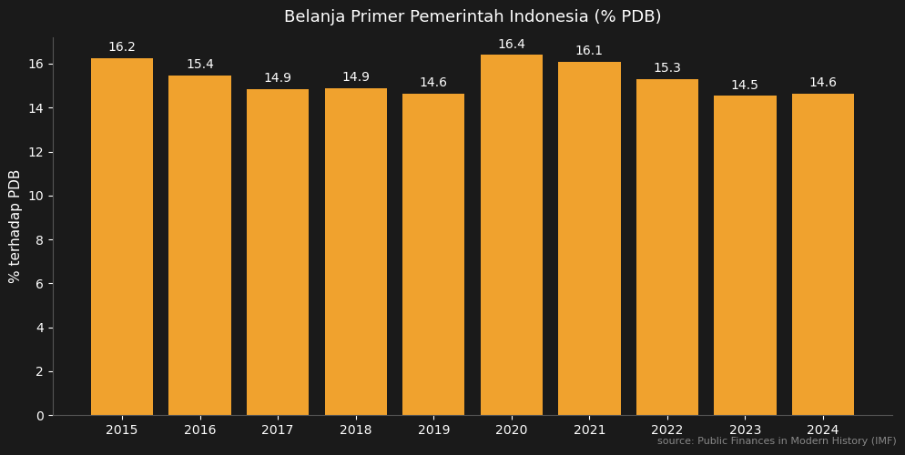
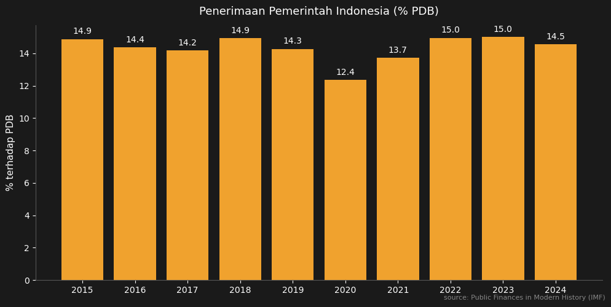
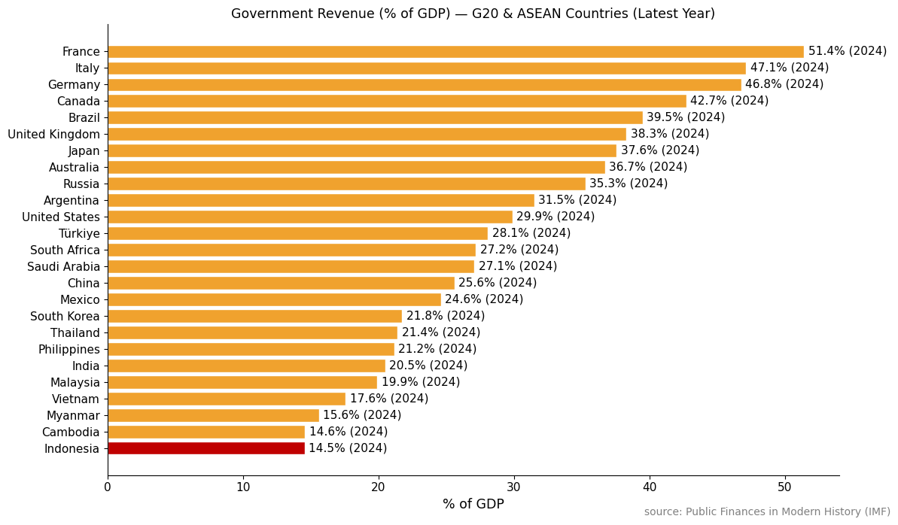

Together with [Rizki Siregar](https://scholar.google.com/citations?user=RxSIqXMAAAAJ) and [Riandy Laksono](https://scholar.google.com/citations?user=kPH8hCQAAAAJ), I recently published a [Survey of Recent Developments](https://doi.org/10.1080/00074918.2025.2588819) in the Bulletin of Indonesian Economic Studies (BIES). In that paper, we paint a rather pessimistic picture of the Indonesian economy, particularly on the fiscal side.

Unfortunately, due to word count constraints, there were several graphs we couldn't include in the paper. This post supplements the narrative in our paper with additional visualizations. The data comes from the IMF's [Public Finances in Modern History](https://www.imf.org/external/datamapper/datasets/FPP) database.

## Government spending: back to "normal"?

At first glance, Indonesia's government expenditure appears to have returned to pre-pandemic levels. During COVID, spending spiked — understandably, as stimulus was needed. But it has since gradually returned to normal.

## But "real" spending is actually declining

If we look deeper, the picture may be a bit worse. Government expenditure consists of two components: primary expenditure (spending on maintenance and government programs) and interest payments on debt.

Naturally, what the economy actually feels is mainly the primary component. Interest payments also circulate — after all, many bondholders are Indonesian residents too. But a portion goes to Bank Indonesia and foreign creditors. As the share of interest payments grows, primary expenditure — the spending that more directly drives economic activity — has been trending downward. This means that even though total spending looks stable, fiscal space for development programs, infrastructure, and social protection is shrinking.

## The revenue problem

Indonesia's fiscal challenge isn't just about spending being eroded by interest payments — it's also about revenue being persistently low. In our paper, this is one of the key points we highlight.

Indonesia's government revenue has consistently been at a low level — even before the pandemic. The chart below shows total government revenue as a percentage of GDP.

This revenue problem is no secret. The World Bank itself, in its [Indonesia Economic Prospects report of December 2024](https://www.worldbank.org/en/country/indonesia/publication/indonesia-economic-prospect) titled "Funding Indonesia's Vision 2045," highlighted Indonesia's low tax ratio. According to the World Bank, Indonesia's tax ratio is projected to remain at around 10% through 2027 — well below the average for middle-income countries. Moreover, a [recent World Bank study](https://documents.worldbank.org/en/publication/documents-reports/documentdetail/099030225225027356) found that Indonesia's tax gap averaged 6.4% of GDP between 2016 and 2021, mostly from VAT and corporate income tax.

## How does Indonesia compare?

Indonesia's revenue problem becomes even clearer when compared with other G20 and ASEAN countries. The chart below shows total government revenue as a percentage of GDP, and Indonesia sits at the very bottom among G20 and Southeast Asian countries.

## Closing: fiscal consolidation and tax capacity

In our paper, we make two recommendations. First, **fiscal consolidation** remains important. The government must be highly selective about its programs, especially those that are too large in scale and regressive.

Second, and more fundamentally: Indonesia must seriously improve its **tax collection capacity**. With a tax ratio still hovering around 10%, Indonesia simply doesn't have enough fiscal space to fund ambitious development programs — let alone Vision 2045. Without substantive tax reform — from broadening the tax base, improving compliance, to reducing ineffective incentives — fiscal space will continue to narrow, and the quality of government spending will keep deteriorating.

Our full paper is available [here](https://doi.org/10.1080/00074918.2025.2588819).
