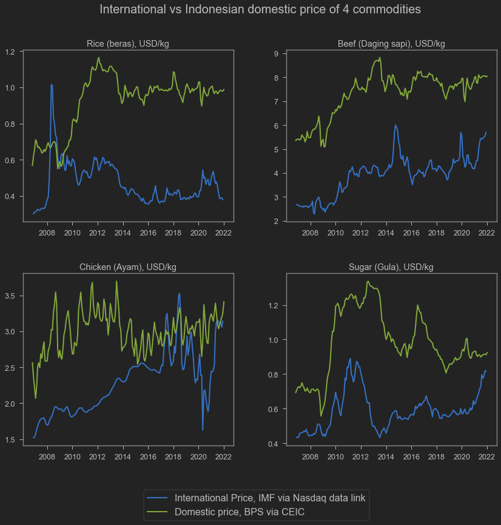

Many have said the possible increase the price of various important commodities. However, Indonesia may be able to limit the inflation of some of these goods. This is because Indonesia imposes quota restriction in many of those goods.

Amid quota restriction, domestic price of these goods are constantly higher than international prices. When domestic prices started to rise, the government needs only to relax quota, buy from the cheaper international market, increase supply and limit the price hike. As long as international price does not rise more than domestic prices, then the government can always use quota to manage domestic prices.

In this blog, I try to plot international prices vs domestic prices of 4 commodities: rice, chicken, beef and sugar. All of them is controlled by quota.

```python
## Download international prices from Nasdaq Data Link (previously quandl)
rice = quandl.get("ODA/PRICENPQ_USD", paginate=True, start_date="2006-11-30")
chicken = quandl.get("ODA/PPOULT_USD", paginate=True, start_date="2006-11-30")
beef = quandl.get("ODA/PBEEF_USD", paginate=True, start_date="2006-11-30")
sugar = quandl.get("ODA/PSUGAUSA_USD", paginate=True, start_date="2006-11-30")
## Just remembering definitions from quandl
legends=[
    'Rice; 5 percent broken milled white rice; Thailand nominal price quote; US$ per metric ton',
    'Poultry (chicken); Whole bird spot price; Ready-to-cook; whole; iced; Georgia docks; US cents per pound',
    'Beef; Australian and New Zealand 85% lean fores; CIF U.S. import price; US cents per pound',
    'Sugar; U.S. import price; contract no.14 nearest futures position; US cents per pound (Footnote: No. 14 revised to No. 16)'
]
```

```python
### Turns everything to USD/kg
rice['USD']=rice['Value']/1000
chicken['USD']=chicken['Value']/100*2.20462
beef['USD']=beef['Value']/100*2.20462
sugar['USD']=sugar['Value']/100*2.20462
```

```python
## Download domestic prices from CEIC. I have the file in my local computer
sembako=pd.read_excel('harga_sembako.xlsx',index_col='Date')
```

```python
## Plotting
fig, axs = plt.subplots(figsize=(14,12),ncols=2,nrows=2)
fig.subplots_adjust(hspace=0.3, wspace=.25)
sns.lineplot(data=rice,x='Date',y='USD', 
             linewidth=2, ax=axs[0,0],legend=True)
sns.lineplot(data=beef,x='Date',y='USD',
             linewidth=2, ax=axs[0,1],legend=True)
sns.lineplot(data=chicken,x='Date',y='USD',
             linewidth=2, ax=axs[1,0],legend=True)
sns.lineplot(data=sugar,x='Date',y='USD',
             linewidth=2, ax=axs[1,1],legend=True)
sns.lineplot(data=sembako,x='Date',y='rice',
             linewidth=2, ax=axs[0,0],legend=True)
sns.lineplot(data=sembako,x='Date',y='beef',
             linewidth=2, ax=axs[0,1],legend=True)
sns.lineplot(data=sembako,x='Date',y='chicken',
             linewidth=2, ax=axs[1,0],legend=True)
sns.lineplot(data=sembako,x='Date',y='sugar',
             linewidth=2, ax=axs[1,1],legend=True)
axs[0,0].set_title('Rice (beras), USD/kg')
axs[0,0].set_ylabel('')
axs[0,0].set_xlabel('')
axs[0,1].set_title('Beef (Daging sapi), USD/kg')
axs[0,1].set_ylabel('')
axs[0,1].set_xlabel('')
axs[1,0].set_title('Chicken (Ayam), USD/kg')
axs[1,0].set_ylabel('')
axs[1,0].set_xlabel('')
axs[1,1].set_title('Sugar (Gula), USD/kg')
axs[1,1].set_ylabel('')
axs[1,1].set_xlabel('')
fig.text(x=0.25, y=0.95, s='International vs Indonesian domestic price of 4 commodities', fontsize=20)
fig.legend(bbox_to_anchor=(0.7,0.05),labels=['International Price, IMF via Nasdaq data link','Domestic price, BPS via CEIC'],fontsize=16)
```


    <matplotlib.legend.Legend at 0x1a7ebe45a00>


    

    


As we can see, international price is consistently higher than domestic price of all 4 goods. Well, mostly. We can also see that while international prices are quite volatile especially during the pandemic, domestic prices are relatively more stable. This is because of the quota management.

**Chicken** is a bit different. Domestic vs international price converges around 2017. I am not sure why. It is possible this is just a US thingy cuz the chicken price is taken from the US market. I believe Indonesia's chicken are mostly imported from South America. Unfortunately I can't find the data from IMF Macroeconomic Statistics.

Domestic prices is downloaded from CEIC (source is National Statistics Body, the BPS), where BPS surveys domestic markets every month.International prices, taken from IMF Cross Country Macroeconomic Statistics via Quandle, are:

1. Rice; 5 percent broken milled white rice; Thailand nominal price quote; US$ per metric ton
1. Poultry (chicken); Whole bird spot price; Ready-to-cook; whole; iced; Georgia docks; US cents per pound
1. Beef; Australian and New Zealand 85\% lean fores; CIF U.S. import price; US cents per pound
1. Sugar; U.S. import price; contract no.14 nearest futures position; US cents per pound (Footnote: No. 14 revised to No. 16)

Sekian postingan kali ini. Semoga bermanfaat.
