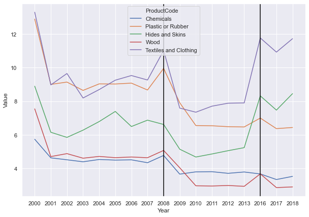

A couple of weeks ago, a colleague of mine, [Deasy Pane](https://www.linkedin.com/in/deasy-damayanti-p-pane-a618a68/?originalSubdomain=id) from Bappenas, invited me for a discussion about Indonesia's trade and investment situation policy. Indeed, that's the beauty of zoom right? Collabs know no boundaries! With us was [Donny](https://www.linkedin.com/in/donny-pasaribu/?originalSubdomain=au) and [Chandra](https://crawford.anu.edu.au/people/phd/chandra-putra), also trade anthusiast at ANU. Some of Bappenas' employee were also there.

In fact, one of Deasy's Bappenas colleague asked us about Indonesian tariff dynamics. Indeed, Indonesian manufacturing import was a bit volatile during 2000s and early 2010s, which could be driven by changes in tariff and Indonesian overall protectionism dynamics. Commodity boom might also a factor here. Generally, protectionism in terms of tariff was declining [during this time](https://scholar.ui.ac.id/en/publications/fifty-years-of-trade-policy-in-indonesia-new-world-trade-old-trea). However, the dynamics on overall protectionism is not so straight-forward if we include other measures, and in fact even in terms of tariff, [it rises a little bit during Jokowi's presidency](https://www.lowyinstitute.org/publications/trade-protectionism-indonesia-bad-times-and-bad-policy).

Additionally, since my last post I was showing how to use [World Bank's API with Python,](https://krisna.netlify.app/id/post/imporinput/), might as well shows how to use [WITS' API](https://github.com/mwouts/world_trade_data) this time around. To install:

```python
pip install world_trade_data --upgrade
```
To show tariff regulation (instead of how it might change welfare), I use effective applied simple average tariff and MFN simple average tariff. Here's what they are:


```python
import pandas as pd
import world_trade_data as wits
tariff=wits.get_indicators('tradestats-tariff')
tariff=tariff.filter(['name','definition'])
tariff=tariff.loc[['AHS-SMPL-AVRG','MFN-SMPL-AVRG']]
#pd.set_option('display.max_colwidth', None)
tariff
```


<div>
<style scoped>
    .dataframe tbody tr th:only-of-type {
        vertical-align: middle;
    }

    .dataframe tbody tr th {
        vertical-align: top;
    }

    .dataframe thead th {
        text-align: right;
    }
</style>
<table border="1" class="dataframe">
  <thead>
    <tr style="text-align: right;">
      <th></th>
      <th>name</th>
      <th>definition</th>
    </tr>
    <tr>
      <th>indicatorcode</th>
      <th></th>
      <th></th>
    </tr>
  </thead>
  <tbody>
    <tr>
      <th>AHS-SMPL-AVRG</th>
      <td>AHS Simple Average (%)</td>
      <td>Effectively Applied Simple Average tariff (%)</td>
    </tr>
    <tr>
      <th>MFN-SMPL-AVRG</th>
      <td>MFN Simple Average (%)</td>
      <td>Most Favored Nation ( (MFN) Simple Average tar...</td>
    </tr>
  </tbody>
</table>
</div>


## Using the API


```python
import pandas as pd
import datetime
#pd.set_option('display.max_rows', 20)
import seaborn as sns; sns.set()
import matplotlib.pyplot as plt
pd.options.display.max_rows=999
b=wits.get_products('tradestats-tariff')
b=b.loc[(b.grouptype=='Sector') & (b.index!='Total')].productdescription.values

# MFN tariff, weighted average
a=wits.get_indicator(indicator='MFN-SMPL-AVRG',reporter='IDN',datasource='tradestats-tariff',year=['2000','2019'])
a=a.reset_index()
a=a.set_index('ProductCode')
c,d,e=a.loc[b[0:4]],a.loc[b[5:10]],a.loc[b[11:]]
c,d,e=c.reset_index(),d.reset_index(),e.reset_index()
a=a.reset_index()

# Effective applied tariff, weighted average
o=wits.get_indicator(indicator='AHS-SMPL-AVRG',reporter='IDN',datasource='tradestats-tariff',year=['2000','2019'])
o=o.reset_index()
o=o.set_index('ProductCode')
p,q,r=o.loc[b[0:4]],o.loc[b[5:10]],o.loc[b[11:]]
p,q,r=p.reset_index(),q.reset_index(),r.reset_index()
o=o.reset_index()
```

For some reason, Indonesian tariff is missing in 2014 and 2015. If you see from all of my graph below, you will see a jump from 2013 to 2016. Seems like the API extract the year not as `datetime` object. It's a bit of a pain to change it myself cuz then I need to add two `NA` rows per sectors and I am too lazy to do that.

There are 16 different sectors WITS is giving us, HS-based. I split them into three broader groups so the graph is much more readable. In total, there are 6 graphs in this post. Here's the sectors:


```python
b
```


    array(['Animal', 'Vegetable', 'Food Products', 'Minerals', 'Fuels',
           'Chemicals', 'Plastic or Rubber', 'Hides and Skins', 'Wood',
           'Textiles and Clothing', 'Footwear', 'Stone and Glass', 'Metals',
           'Mach and Elec', 'Transportation', 'Miscellaneous'], dtype=object)


## Effective Applied Tariff, simple average

Three graphs below are the effective applied tariff. After 2008, Indonesia was very diligent in doing FTAs. Among them are ASEAN FTA driven (AFTA). The AFTA turned to plenty of AFTA+1 in 2010. Among them are AKFTA (with South Korea), ACFTA (China), AANZFTA (Australia and New Zealand), and AIFTA with India. Additionally There's also IJEPA with Japan, perhaps the only bilateral one Indonesia had before IACEPA comes along.

These FTAs eventually lower effective applied tariff.


```python
# FIGURES FOR AHS
plt.figure(figsize=(10,7))
sns.lineplot(data=p,x='Year',y='Value',hue='ProductCode')
plt.axvline('2016', color='black')
plt.axvline('2008', color='black')
```


    <matplotlib.lines.Line2D at 0x262584bb310>


Firstly, primary products. You can straight away see a far higher tariff in food producing sector compared to animal, vegetables, and minerals. The GFC clearly increased Indonesian food protectionism (as with other countries during that time). Overall, other sectors aren't that highly protected by tariff, which hover around 2-4%. Same thing can't be said for NTMs, however. But that's for another post.


```python
plt.figure(figsize=(10,7))
sns.lineplot(data=q,x='Year',y='Value',hue='ProductCode')
plt.axvline('2016', color='black')
plt.axvline('2008', color='black')
```


    <matplotlib.lines.Line2D at 0x2625eee11f0>





In some manufacturing, you see a higher tariff. These sectors were highly protected before Asian Financial Crisis (AFC) in 1998. It was lowered after AFC, but also after GFC, interestingly. Indeed, bad times lead to good policy. Another interesting thing is that Indonesia was famed to have a premature deindustrialisation during 2005s if my memory serves. These are times where textiles got more protection, as you can see from the graph.

Lastly, these tariff shot up in 2016 (remember, 2014 and 2015 are missing). What happened? What huge event happened in 2015/2015?


```python
plt.figure(figsize=(10,7))
sns.lineplot(data=r,x='Year',y='Value',hue='ProductCode')
plt.axvline('2016', color='black')
plt.axvline('2008', color='black')
```


    <matplotlib.lines.Line2D at 0x2625ef1ab80>


On this group, it seems like in general tariff are progressing to the lower end. Especially after AFC and GFC, protection given to transportation is stripped up, but also in metals, machinery, electronics, and other equipments. These are also sectors that have large intensity of Global Value Chain (GVC). Make sense to lower the trade cost of these stuff as low as possible. Again, you can see a bit of a jump in 2016.

## MFN, simple average

Here's MFN! In general, we should expect a higher level of tariff using MFN. But the trends are pretty much the same: aside from food products, crisis reduce the overall tariff level. 2016, everything jumped up.

This time, let me hear more from you! Please do comment on this blog or mention me on [twitter](https://twitter.com/imedkrisna) for a discussion!


```python
# FIGURES FOR AHS
plt.figure(figsize=(10,7))
sns.lineplot(data=c,x='Year',y='Value',hue='ProductCode')
plt.axvline('2016', color='black')
plt.axvline('2008', color='black')
```


    <matplotlib.lines.Line2D at 0x2625f0e5760>


```python
plt.figure(figsize=(10,7))
sns.lineplot(data=d,x='Year',y='Value',hue='ProductCode')
plt.axvline('2016', color='black')
plt.axvline('2008', color='black')
```


    <matplotlib.lines.Line2D at 0x2625f081700>


```python
plt.figure(figsize=(10,7))
sns.lineplot(data=e,x='Year',y='Value',hue='ProductCode')
plt.axvline('2016', color='black')
plt.axvline('2008', color='black')
```


    <matplotlib.lines.Line2D at 0x2625efa2e50>


