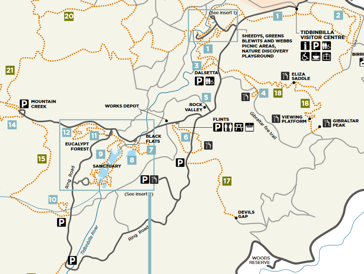
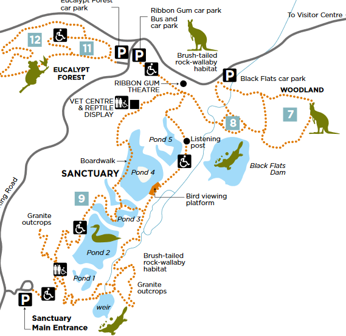
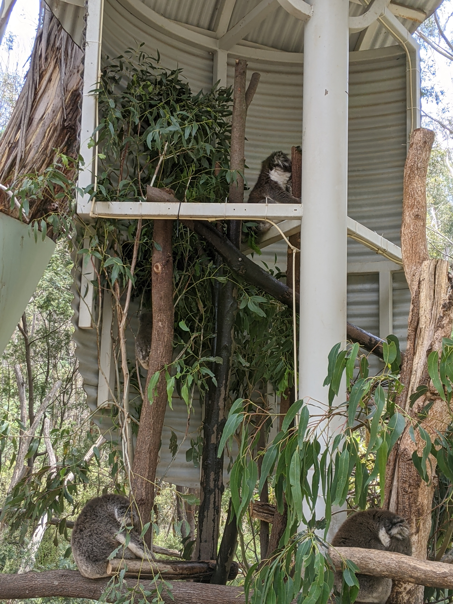
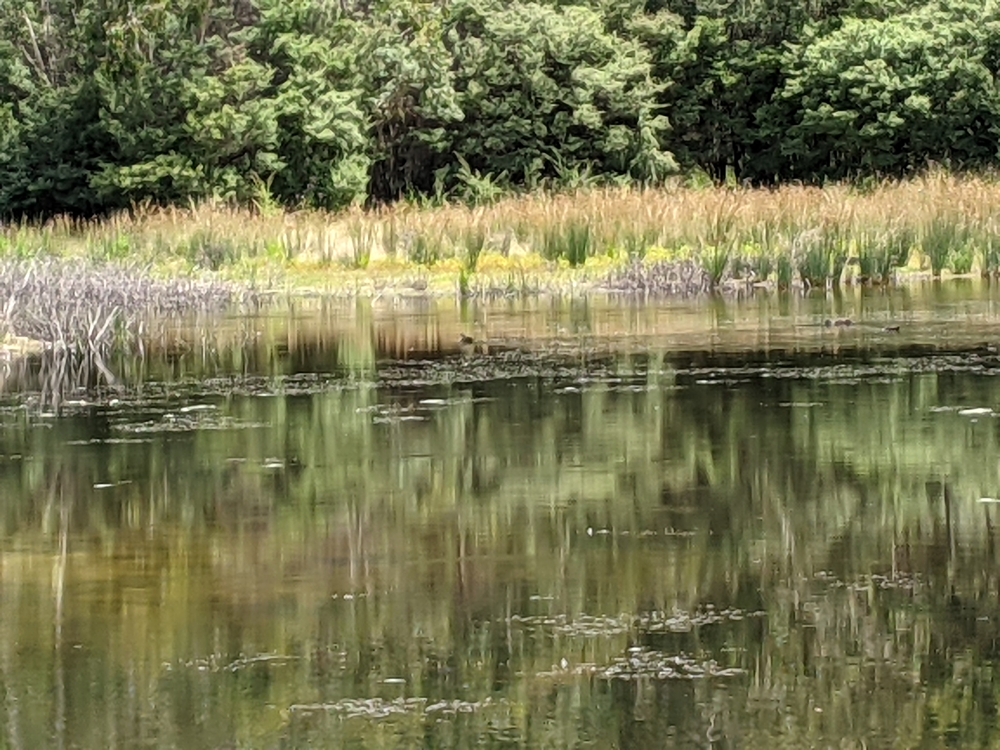

Traveling isn't really my forte. However, The year-end free entry to Tidbinbilla Natural Reserve can't really be missed can't it?

[Tidbinbilla](https://www.tidbinbilla.act.gov.au/) is a natural reserve in Canberra, Australia. Reachable from the city center by car, and you would prolly need around 40 minutes driving to get there. Here, you can walk in many bushwalking trail from the very easy, 1-2 km to the hard one with rocky and hilly climb. You will be able to see many Australian vegetation like eucalyptus and also its animals like birds, Kangaroos, Wallabies, Koala and Platypus.

Tidbinbilla is a very huge place. To explore all, you will need a whole day and a good prep. Check out its full map [over here](https://www.tidbinbilla.act.gov.au/__data/assets/pdf_file/0005/572288/Tidbinbilla-Map-and-Guide.pdf).

Me and wife only aim for its eucalyptus forest and a place called Sanctuary.

We first come to the visitor center to grab some maps, information and coffee. Maps and infos are necessary since you will prolly get no connection once you step inside the park. From here, you can actually go to a few walking trails to see Emu and Kangaroos. We actually saw both without even going to the trail!

We drive to the sanctuary from the visitor center.

First up, [eucalyptus forest](https://www.tidbinbilla.act.gov.au/do/the-eucalypt-forest)

We took the Koala Path, the easier bit.

From here, we went to the sanctuary. Unfortunately, no sight of Platypus 😢

According to the ranger, most animals including Platypus are shy and learn to avoid human. They can only be seen around early in the morning or later afternoon (something like 6pm-ish). Additionally, Platypus are said to be active around spring time. So I might need to go back here later in the different time!