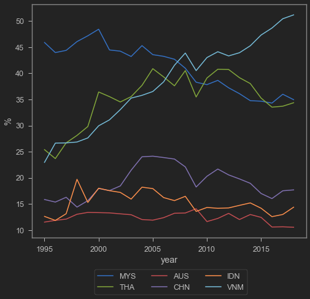
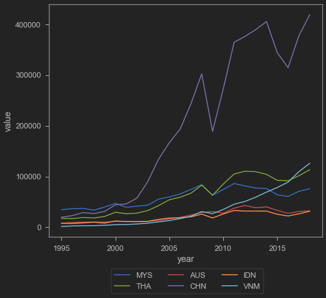
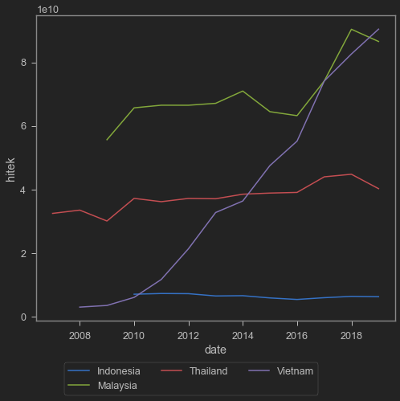
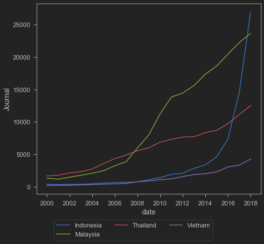

Global Value Chain (GVC) is a buzzword that frequently comes up among academics and consultants when discussing international trade and manufacturing growth. The essence of GVC is splitting the production of a finished good into several links in a value chain, with each link produced in a different country. Take bicycles as an example: to assemble one bicycle, a manufacturer sources components from various countries.


The image above is from the [World Development Report 2020](https://www.worldbank.org/en/publication/wdr2020), which I consider a fairly comprehensive read on GVC. I once illustrated (in a very simple way) in one of my posts how GVC helps produce [gado-gado sauce]() that successfully enters export markets. I also wrote a [short article](https://www.eastasiaforum.org/2020/06/16/indonesias-ppe-export-ban-backfires/) on the role of GVC during COVID-19. The longer version is [here](https://www.researchgate.net/publication/346643698_A_REVIEW_ON_INDONESIAN_TRADE_POLICY_IN_RESPONSE_TO_COVID-19).

GVC is often invoked by government officials, who argue that Indonesia's participation in GVC can drive the growth of its manufacturing sector. GVC has been one of the key strategies for ASEAN and East Asian countries in producing competitive manufactured goods. Indonesia is frequently said to underutilise GVC compared to its regional peers. Is this true?

One indicator that can be used to assess Indonesia's GVC participation is [Trade in Value Added (TiVA)](https://www.oecd.org/sti/ind/measuring-trade-in-value-added.htm). TiVA is an indicator based on trade data that estimates how much of a country's final goods consists of domestic versus imported content. A country that relies heavily on GVC will have a high share of imported content in its export value. In other words, using the bicycle example, TiVA shows how large the total imports of gears, chains, tyres, and so on are relative to the value of bicycle exports. The TiVA data used in this post is sourced [from here](https://stats.oecd.org/Index.aspx?DataSetCode=TIVA_2021_C1). As usual, I will use Python. Readers can replicate the data with this code.


```python
tiva=pd.read_excel('tiva.xlsx',sheet_name='pake') 
# source: https://stats.oecd.org/Index.aspx?DataSetCode=TIVA_2021_C1
tiva=pd.melt(tiva, id_vars=['year'])
tiva2=pd.read_excel('tiva.xlsx',sheet_name='pake2')
# source: https://stats.oecd.org/Index.aspx?DataSetCode=TIVA_2021_C1
tiva2=pd.melt(tiva2, id_vars=['year'])
```


```python
tiva.variable.unique() # check countries
```


    array(['OECD', 'AUS', 'AUT', 'BEL', 'CAN', 'CHL', 'COL', 'CRI', 'CZE',
           'DNK', 'EST', 'FIN', 'FRA', 'DEU', 'GRC', 'HUN', 'ISL', 'IRL',
           'ISR', 'ITA', 'JPN', 'KOR', 'LVA', 'LTU', 'LUX', 'MEX', 'NLD',
           'NZL', 'NOR', 'POL', 'PRT', 'SVK', 'SVN', 'ESP', 'SWE', 'CHE',
           'TUR', 'GBR', 'USA', 'NON', 'ARG', 'BRA', 'BRN', 'BGR', 'KHM',
           'CHN', 'HRV', 'CYP', 'IND', 'IDN', 'HKG', 'KAZ', 'LAO', 'MYS',
           'MLT', 'MAR', 'MMR', 'PER', 'PHL', 'ROU', 'RUS', 'SAU', 'SGP',
           'ZAF', 'TWN', 'THA', 'TUN', 'VNM', 'ROW', 'APEC', 'ASEAN', 'EASIA',
           'EU27', 'EU28', 'EU15', 'EU13', 'EA19', 'G20', 'ZEUR', 'ZASI',
           'ZNAM', 'ZSCA', 'ZOTH'], dtype=object)


The chart below shows the percentage of foreign content in the exports of selected countries. In other words, the y-axis represents $\frac{\text{foreign content}}{\text{total exports}}$ in aggregate. So we are counting not just bicycles, but all of Indonesia's exports. For foreign content, we are counting not just gears, tyres, etc., but all intermediate imports such as chips and so on. This measure does not reflect individual industries but the economy as a whole.


```python
b=[]
ctr=('MYS','THA','AUS','CHN','IDN','VNM')
for i in ctr:
    ttt=tiva.loc[(tiva['variable'] == i)]
    b.append(ttt)
b=pd.concat(b)
sns.lineplot(data=b,x='year',y='value',hue='variable')
plt.legend(title="",bbox_to_anchor=(0.8,-.12),ncol=3)
plt.ylabel("%")
```


    Text(0, 0.5, '%')


    

    


As we can see, Indonesia (IDN) has a very small share of imported content relative to its total exports, especially compared to other ASEAN countries. This is actually quite understandable, given that Indonesia's exports are dominated by raw commodities. Raw commodities do not require intermediate inputs from other countries to produce. By this indicator, Indonesia's participation is even higher than Australia's, a country that essentially has no manufacturing industry.

But perhaps the most striking case is Vietnam. Its foreign content share has been rising steadily.

The chart below shows total imports of raw materials and intermediate goods for each country. The data also comes from the TiVA database. By this metric, China is far ahead of the others. However, Indonesia remains the lowest. This is notable because Indonesia's economy is relatively larger than its neighbours'. Again, look at Vietnam.


```python
b2=[]
for i in ctr:
    t2=tiva2.loc[(tiva2['variable'] == i)]
    b2.append(t2)
b2=pd.concat(b2)
sns.lineplot(data=b2,x='year',y='value',hue='variable')
plt.legend(title="",bbox_to_anchor=(0.8,-.12),ncol=3)
```


    <matplotlib.legend.Legend at 0x133fa61e190>


    

    


Vietnam's economy is tiny. In 2019, Vietnam's GDP was only 261.9 billion USD, less than a quarter of Indonesia's 1,119 trillion USD in the same year. How can such a small economy import so many raw materials and intermediates as shown in the chart above, and keep growing? Who consumes the finished goods? Indonesia's large imports make sense given its large population and big market. But Vietnam? Why import so much?

The answer: to export. Let us look at high-technology exports below. This data comes from the [World Bank](https://data.worldbank.org/indicator/TX.VAL.TECH.CD?locations=VN-ID).


```python
import wbdata as wb
import datetime
tanggal=(datetime.datetime(1995,1,1), datetime.datetime(2019,1,1))
a=wb.get_dataframe({"TX.VAL.TECH.CD" : "hitek"}, country=["IDN","VNM","THA","MYS"],
                   data_date=tanggal, convert_date=True, keep_levels=True)
a=a.reset_index()
sns.lineplot(data=a,x='date',y='hitek',hue='country')
plt.legend(title="",bbox_to_anchor=(0.8,-.12),ncol=4)
plt.ylabel("USD")
plt.xlabel("year")
```


    <matplotlib.legend.Legend at 0x133fa6be820>


    

    


You can clearly see the growth in high-technology exports. Vietnam is not a country with a strong research tradition compared to its regional neighbours. They do not do their own R&D. They simply assemble. By importing raw materials and intermediates like chips, they become producers of high-technology goods. By the way, I did not include China in the chart above because if China were included, the others would look tiny.

The chart below shows scientific journal publications, also sourced from the World Bank. This serves as an illustration of each country's research capacity. Compare Vietnam with the rest.


```python
import wbdata as wb
import datetime
tanggal=(datetime.datetime(1995,1,1), datetime.datetime(2019,1,1))
a=wb.get_dataframe({"IP.JRN.ARTC.SC" : "Journal"}, country=["IDN","VNM","THA","MYS"],
                   data_date=tanggal, convert_date=True, keep_levels=True)
a=a.reset_index()
sns.lineplot(data=a,x='date',y='Journal',hue='country')
plt.legend(title="",bbox_to_anchor=(0.8,-.12),ncol=3)
```


    <matplotlib.legend.Legend at 0x133fa7e5820>


    

    


Speaking of research, Indonesia's publication count suddenly surged from 2016 onward. Impressive! How did that happen? What is the secret?

<blockquote class="twitter-tweet"><p lang="en" dir="ltr">Who published in &quot;predatory&quot; journals (2015-2017)?<br>Source: <a href="https://t.co/j5TQBWgrbr">https://t.co/j5TQBWgrbr</a> <a href="https://t.co/PLYXDx9QYX">pic.twitter.com/PLYXDx9QYX</a></p>&mdash; Arief Anshory Yusuf (@anshory72) <a href="https://twitter.com/anshory72/status/1358605111174463488?ref_src=twsrc%5Etfw">February 8, 2021</a></blockquote> <script async src="https://platform.twitter.com/widgets.js" charset="utf-8"></script>

What is the takeaway? I will leave that to the reader. That is all for today's post. Hopefully it is useful! Mention me on [twitter](https://twitter.com/iMedKrisna) for feedback, suggestions, or discussion. Thanks!
