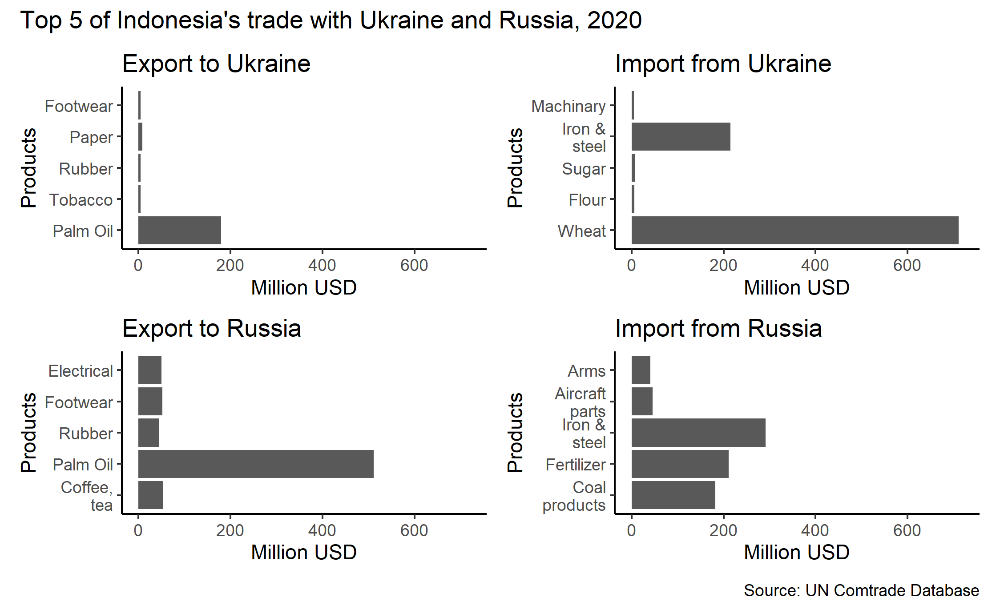
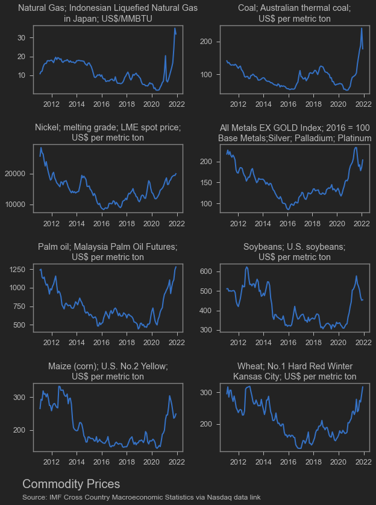

On 24 February 2022, Russia attacked Ukraine. It was not entirely a surprise, as [US intelligence](https://www.bbc.com/news/world-europe-60355295) had already indicated that Russia would invade Ukraine in the near future. At the time of writing, the war was still ongoing. Russian forces were attacking from [three directions](https://www.aljazeera.com/news/2022/2/28/us-announces-plan-to-expel-russian-diplomats-from-un-liveblog), and Ukraine's Black Sea coastline had been almost entirely taken by Russia.

Meanwhile, Russia faced sanctions from Western countries that made it difficult for Russia to trade with the outside world. This caused the value of Russia's currency, the Ruble, to [plummet](https://www.aljazeera.com/news/2022/2/28/us-announces-plan-to-expel-russian-diplomats-from-un-liveblog) sharply, forcing the Central Bank of Russia to raise its policy rate from 9.5% to 20% in a single day.

How does this affect the Indonesian economy?

## Trade Impact

Indonesia has relatively limited trade ties with Ukraine and Russia. Total [imports](https://nasional.kontan.co.id/news/mengukur-efek-perang-rusia-ukraina-terhadap-ekonomi-indonesia) from both countries account for only about 1% of Indonesia's total imports, while [investment](https://ekonomi.bisnis.com/read/20220225/9/1504814/daftar-investasi-rusia-di-indonesia-terpengaruh-konflik-dengan-ukraina) from Russia and Ukraine in Indonesia is also far from significant.

Nevertheless, both are major sources of certain imported goods. Ukraine supplied approximately 24% of Indonesia's total wheat imports in 2020. Meanwhile, Russian fertiliser accounted for about 15% of Indonesia's total fertiliser imports. Russia is also the primary supplier of military equipment to Indonesia. Although both countries purchase significant quantities of Indonesian palm oil products, their combined transactions accounted for only about 0.5% of Indonesia's total palm oil exports in 2020.

This means that if Indonesia fails to find alternative wheat suppliers, there is a possibility that prices for wheat-based food products will rise. Wheat is primarily used for flour milling, which feeds not just consumers but also producers of instant noodles, pasta, bread, pastries, and traditional snacks. Even before the war, global wheat prices had been climbing due to supply bottlenecks caused by [weather problems](https://www.marketwatch.com/story/why-prices-for-wheat-have-climbed-to-their-highest-level-since-2012-11636653340).

For wheat, it appears that Ukraine's share had already fallen to about 10% in 2021.

<blockquote class="twitter-tweet">
I also tried looking at the 2021 data (from BPS), apparently the Ukrainian share in 2021 for wheat is lower, at around ~10%, mainly due to stronger production from AUS
&mdash; Faris Abdurrachman (@faris_sina) <a href="https://twitter.com/faris_sina/status/1497859814327996419?ref_src=twsrc%5Etfw">February 27, 2022</a></blockquote>  

It is not only wheat. Agricultural commodity prices were likely to keep climbing. Disruptions to global fertiliser supply risked pushing fertiliser prices even higher, on top of already elevated levels due to [high gas prices](https://www.spglobal.com/commodity-insights/en/market-insights/blogs/agriculture/011922-fertilizer-costs-natural-gas-prices) and China's [fertiliser export ban](https://www.reuters.com/article/us-china-exports-fertilisers-idUSKBN2F007W). We had already seen rapid increases in prices of commodities such as corn and soybeans. A fertiliser shortage would accelerate these increases further.

Regarding gas prices, Russia as the world's third-largest oil and gas supplier plays a critically important role. The war and sanctions would make it difficult for Russia to sell oil, gas, and coal internationally, especially if the United States failed to persuade OPEC nations to raise production. On top of that, gas prices had been rising steeply.

<!-- Crude Price Script - OILCRUDEPRICE.COM -->

<a href="https://www.oilcrudeprice.com/" style="font-size:20px; color:#FFFFFF;text-decoration:none;" rel="nofollow">WTI Crude Price</a>

<!-- End of Crude Price Script -->

Russia's invasion of Ukraine was also expected to disrupt shipping routes in the Black Sea and force rerouting of flights. As a result, logistics for countries in the region -- particularly wheat and oil suppliers -- would be affected. Moreover, Indonesia, which was aggressively reopening Bali to tourists [without quarantine](https://travel.tempo.co/read/1565796/bali-jadi-lokasi-uji-coba-kedatangan-wisatawan-asing-tanpa-karantina), could be hit if disrupted flight routes reduced foreign tourists' interest in visiting.

<blockquote class="twitter-tweet">
Flights are being rerouted around Russia.   I took the Tokyo to Anchorage and then onto London flight 35 years ago (cold war era?).   It was spectacular. Midnight sun the entire trip. The icebergs were amazing too. <a href="https://t.co/yJijJiFvH1">pic.twitter.com/yJijJiFvH1</a>
&mdash; Harrison Bergeron (@GranPelotas) <a href="https://twitter.com/GranPelotas/status/1497801899659055106?ref_src=twsrc%5Etfw">February 27, 2022</a></blockquote>  

The bottom line: inflation, which was already rising, would be pushed even higher by Russia's invasion of Ukraine.

On the other hand, Indonesia is also a country that benefits from rising commodity prices. Coal, palm oil, and nickel are Indonesia's traditional export goods. Of course, the [nickel export ban]() and potential future export bans on other commodities become more costly because of the high opportunity cost.

Furthermore, rising commodity prices would increase the incentive for commodity exporters to sell abroad. Expect the cooking oil crisis and PLN's energy supply issues to potentially worsen going forward.

## Climate Change & Tech

The war was forcing other countries, particularly continental Europe, to divert their resources away from other issues. The European Union, already in the midst of an energy crisis, was expected to be further hit by the disruption of supplies from Russia. They might have to rely on government subsidies to contain energy and food inflation. They might also have to fall back on more readily available energy sources like coal -- of which Indonesia has plenty, potentially driving coal prices even higher.

In addition, European countries were beginning to recognise the need to strengthen their military capabilities and increase defence spending. This naturally meant less budget for other priorities such as climate change. Meanwhile, high commodity prices (Russia is a significant copper supplier) risked increasing the cost of materials essential for manufacturing solar panels and wind turbines.

Ukraine is a key supplier of [materials](https://asia.nikkei.com/Politics/Ukraine-conflict/How-Russia-s-Ukraine-attack-affects-Asian-business-5-things-to-know2) used in semiconductor manufacturing, such as neon, argon, krypton, and xenon gases. These disruptions could affect the semiconductor supply chain in the medium term.

New car production was already disrupted by the semiconductor shortage (one reason used car prices rose last year). Now, the steel supply chain for automobiles would be further strained because Russia and Ukraine are important suppliers of nickel, palladium, and steel in general.

## The C-Factor

Some people were comparing the Ukraine-Russia situation with the Taiwan-China dynamic. The Taiwan-China conflict and China's Nine-Dash Line claim in the South China Sea are geopolitical conflicts much closer to Indonesia. China and Taiwan are also economically closer to Indonesia than Ukraine and Russia. So far, China had been the most reliable neighbour Russia could count on in facing economic sanctions from the West. If China were also drawn in -- or if China were inspired to become more aggressive in the South China Sea -- the impact could be extremely serious, not just for Indonesia but for the world.

Let us hope that does not happen...

## What Should Indonesia Do?

So far, Indonesia's inflation remained [relatively under control](https://www.bps.go.id/statictable/2009/06/15/907/indeks-harga-konsumen-dan-inflasi-bulanan-indonesia-2006-2022.html). Import quotas on staple goods, which have traditionally been tightly controlled, could be relaxed if inflation started to bite. Indonesia's staple goods have actually been more expensive than world market prices due to import restrictions and various other complications. So relaxing import controls could be used to stabilise price changes. Moreover, rice price increases seemed more contained than those of wheat, corn, or soybeans. As long as rice remains the staple food, things should be manageable.

Fertiliser seemed more worrying, as fertiliser is used for all crops. Indonesia's gas prices had also been rising with the increasing demand from newly operational smelters. On top of that, if non-subsidised fertiliser becomes more expensive, the incentive to divert subsidised fertiliser to the black market grows stronger. The distribution system for [subsidised fertiliser](https://www.kompas.id/label/investigasi-pupuk-bersubsidi) already has many problems as it is.

The Indonesian government itself needed to find ways to capture more benefits from rising commodity prices. Indonesia's tax ratio had been problematic lately, and the state's capacity to [tax commodities]() was not as strong as during the oil boom era. Yet Indonesia urgently needed funds for various projects, from food estates to the new capital city (IKN). So how to increase government revenue? Rather than using Domestic Market Obligations or export bans whose effectiveness is questionable, perhaps the government would be better off raising export levies. The revenue could be used to mitigate the impact of inflation.

It may sound cliched, but global coordination is needed now more than ever. With Russia (and perhaps China? who knows) cut off from global markets, the number of countries that can coordinate will shrink further (and we may end up with competing blocs). Indonesia is currently in a unique position: a member of RCEP, the world's largest trade agreement, and holder of the G-20 presidency, representing countries with more than 80% of global GDP. Indonesia must leverage this opportunity to cooperate on multiple issues. The top priority right now is limiting the impact of Russia's invasion of Ukraine on Ukraine, the EU, and the world as a whole. But beyond that, global cooperation is also urgently needed to manage current account balances across countries, increase the production and distribution of vaccines and pandemic-fighting equipment, and accelerate efforts to address the global climate crisis.
