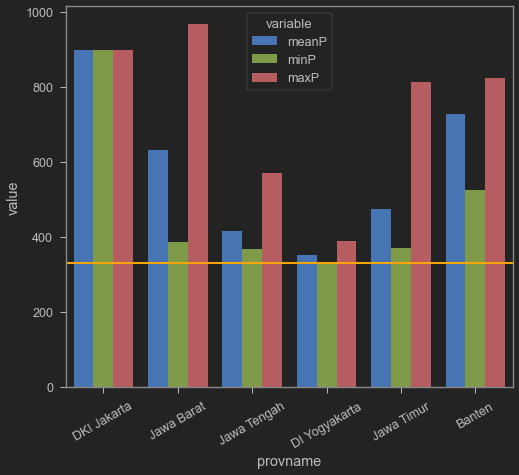
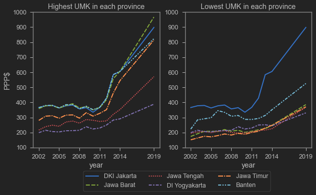
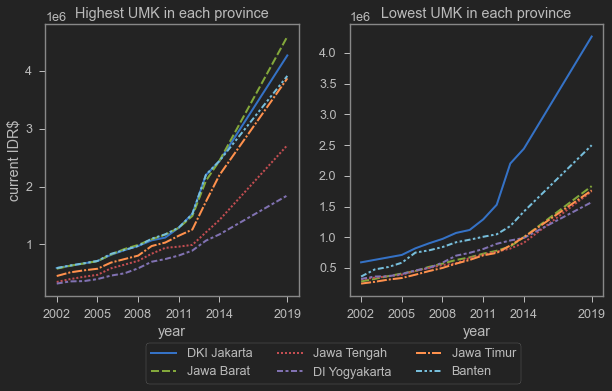
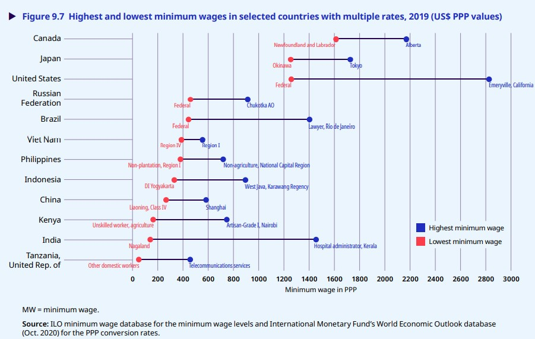
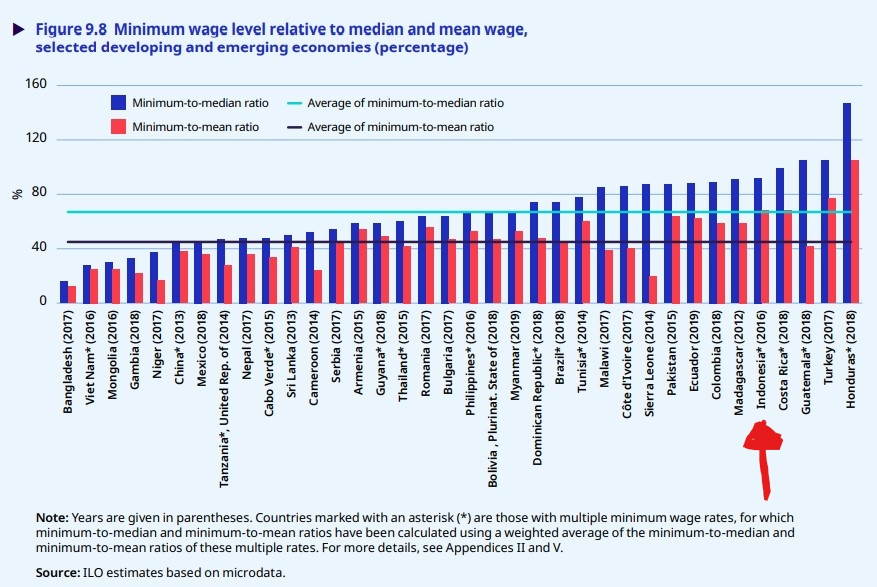

Some time ago, Twitter was abuzz about minimum wages. The trigger seemed to be news about Minister of Manpower Ida Fauziyah commenting on how high minimum wages are in Indonesia. One widely shared report was tweeted by CNN Indonesia below.

<blockquote class="twitter-tweet"><p lang="in" dir="ltr">Menaker Sebut Upah Minimum di Indonesia Terlalu Tinggi <a href="https://t.co/QcN7DKj8bx">https://t.co/QcN7DKj8bx</a></p>&mdash; CNN Indonesia (@CNNIndonesia) <a href="https://twitter.com/CNNIndonesia/status/1461177882315685888?ref_src=twsrc%5Etfw">November 18, 2021</a></blockquote> <script async src="https://platform.twitter.com/widgets.js" charset="utf-8"></script>

As you can see, the tweet received about 1,000 replies, far above CNN Indonesia's usual engagement level.

But what is even more interesting is this tweet from a highly influential account:

<blockquote class="twitter-tweet"><p lang="in" dir="ltr">Menteri Tenaga Kerja Ida Fauziyah mengatakan tak layak buruh menuntut kenaikan upah karena upah minimum di Indonesia sudah terlalu tinggi. Benarkah terlalu tinggi? Menurut Global Wage Report 2020-2021: upah minimum RI ada di papan bawah negara2 Asean, hanya menang dari Myanmar. <a href="https://t.co/16PDZcAB7M">pic.twitter.com/16PDZcAB7M</a></p>&mdash; Farid Gaban (@faridgaban) <a href="https://twitter.com/faridgaban/status/1460954416576536577?ref_src=twsrc%5Etfw">November 17, 2021</a></blockquote> <script async src="https://platform.twitter.com/widgets.js" charset="utf-8"></script>

The account holder is someone quite respected in the Indonesian Twittersphere who frequently offers opinions that I find very critical, sharp, and thought-provoking. The chart he tweeted was taken from the [Global Wage Report 2020-2021](https://www.ilo.org/global/publications/books/WCMS_762534/lang--en/index.htm) published by the International Labour Organization (ILO).

The chart shows minimum wages in several countries in both US dollars and PPP dollars. It shows that Indonesia's minimum wage is very low, only slightly above Myanmar. This seems to prove that Indonesia's minimum wage does not match the Minister's claim that it is "too high."

So what was the Minister's basis for saying that? Is there a missing link? Looking at replies and quote-tweets, we find several clues. Here is one:

<blockquote class="twitter-tweet"><p lang="in" dir="ltr">UMR $111 itu UMR Yogya bukan Indonesia. Jabar sudah Rp4.7 jt ($337). Lebih tinggi dari Cina, Thailand, Malaysia.. <a href="https://t.co/MIhUJfgSOJ">https://t.co/MIhUJfgSOJ</a></p>&mdash; ARK (@ngabdul) <a href="https://twitter.com/ngabdul/status/1461127855119679493?ref_src=twsrc%5Etfw">November 18, 2021</a></blockquote> <script async src="https://platform.twitter.com/widgets.js" charset="utf-8"></script> 

It appears the Global Wage Report used the lowest minimum wage in each country. However, Indonesia's minimum wage regulations exhibit substantial variation. Some districts/cities have very low minimum wages, while others are quite high. What the Minister likely meant by "expensive" were minimum wages in industrial hubs, not the very lowest. But as you might expect, the screenshot, with the context provided, [had already gone viral](https://twitter.com/faridgaban/status/1460954416576536577/retweets/with_comments).

So are minimum wages in Indonesia actually high or low? Well, it probably depends on the benchmark. High or low compared to what?

## Sampling UMK on Java Island, 2019

I tried to do a quick fact-check, at least for Java. Following the chart tweeted by @fgaban, I will use 2019 figures and PPP dollars as the unit. According to the chart, Indonesia's minimum wage is 331 PPP dollars. I looked up 2019 UMK regulations for various districts/cities on Java. The PPP conversion factor comes from the [World Bank databank](https://data.worldbank.org/indicator/PA.NUS.PPP?end=2019&locations=ID&start=2012), while UMK data comes from:

- Banten	https://indolabourdatabase.files.wordpress.com/2018/12/SK-UMK-Banten-2019.pdf
- East Java	https://surabaya.tribunnews.com/2https://indolabourdatabase.files.wordpress.com/2018/12/SK-UMK-Banten-2019.pdf018/11/16/berikut-ini-nilai-umk-2019-di-jawa-timur-surabaya-tertinggi
- DIY	https://maucash.id/umr-yogyakarta
- Central Java	https://jatengprov.go.id/publik/umk-35-kabupaten-kota-ditetapkan-semarang-tertinggi-banjarnegara-terendah/
- West Java	https://databoks.katadata.co.id/datapublish/2019/11/29/daftar-umk-di-jawa-barat-karawang-cetak-tertinggi
- DKI	https://www.kompas.com/tren/read/2019/11/22/161505465/membandingkan-ump-dki-jakarta-dengan-umk-daerah-sekitarnya?page=all


```python
umk19=pd.read_csv('gabung.csv').query('year == 2019')
umk19=pd.melt(umk19, id_vars=['provname'], value_vars=['meanP','minP','maxP'])
sns.barplot(data=umk19,x="provname",y='value',hue='variable')
plt.axhline(331,color='orange',linewidth=2)
plt.xticks(rotation=30)
```


    (array([0, 1, 2, 3, 4, 5]),
     [Text(0, 0, 'DKI Jakarta'),
      Text(1, 0, 'Jawa Barat'),
      Text(2, 0, 'Jawa Tengah'),
      Text(3, 0, 'DI Yogyakarta'),
      Text(4, 0, 'Jawa Timur'),
      Text(5, 0, 'Banten')])


    

    


The orange line above represents 331, the figure for Indonesia's minimum wage according to the Global Wage Report 2020-2021. Indeed, the lowest minimum wage in Indonesia is in DIY (Yogyakarta), as several people who replied to @fgaban's tweet pointed out. However, the average UMK on Java appears quite high. The closest to DIY are Central Java and East Java. But West Java and Banten have much higher average UMKs. Is this the effect of being near Jakarta?

By the way, Jakarta's average, maximum, and minimum are all the same. Obviously, because it only has a provincial minimum wage (UMP). For other provinces, the UMK varies by district/city. The variation is quite different across provinces.

Some additional facts about the 2019 UMK (in Rupiah):

| Province | Highest UMK | Amount | Lowest UMK | Amount |
| -------- | ------------- | ------- | ------------ | ------- |
| Banten | Kota Cilegon | 3,913,078 | Lebak | 2,498,068 |
| West Java | Karawang | 4,594,324 | Kota Banjar | 1,831,884 |
| Central Java | Kota Semarang | 2,715,000 | Banjarnegara | 1,748,000 |
| D.I. Yogyakarta | Kota Yogyakarta | 1,846,400 | Gunung Kidul | 1,571,000 |
| East Java | Kota Surabaya | 3,871,052 | multiple | 1,763,267 | 

The highest UMK is the red bar, the lowest is the green, and blue is the average. In East Java, the districts/cities with the lowest UMK include PAMEKASAN, NGAWI, PONOROGO, SITUBONDO, MADIUN, MAGETAN, PACITAN, SAMPANG, and TRENGGALEK (apologies for the all-caps -- the labels came from Stata).

As shown above, the variation between the highest and lowest is remarkable. The biggest gap is probably in West Java, which is reportedly home to [60% of Indonesia's manufacturing firms](http://bappeda.jabarprov.go.id/uu-arahkan-pelaku-industri-jabar-beralih-ke-segitiga-rebana/). Karawang's UMK is even higher than DKI Jakarta's! It is perhaps unsurprising that [many factories have chosen to relocate to Central Java](https://www.idxchannel.com/economics/incar-upah-rendah-sedikitnya-100-pabrik-sudah-pindah-ke-jawa-tengah).


## UMK Trends on Java, 2002-2014 (+2019)

Minimum wages are not the focus of my research. Fortunately, I have a colleague whose research centres on minimum wages. She is [Nurina Merdikawati](https://crawford.anu.edu.au/people/phd/nurina-merdikawati), whom I usually call Dika. She recently presented [her research](https://crawford.anu.edu.au/news-events/events/19298/minimum-wage-policy-and-poverty-developing-country) on the impact of minimum wages on poverty. She used Java UMK data from 2002 to 2014, and was kind enough to share it with me.

Below I plot UMK trends on Java for 2002-2014 using Dika's data. I added my own collected 2019 data. I do not have figures for 2015 to 2018, so in the charts below you will see a straight line between 2014 and 2019. I include the same chart in both PPP dollars and Rupiah.


```python
umk=pd.read_csv('gabung.csv')
fig, axs = plt.subplots(figsize=(10,5),ncols=2)
sns.lineplot(data=umk,x='year',y='maxP',hue='provname', 
             style='provname',linewidth=2, ax=axs[0],legend=False)
sns.lineplot(data=umk,x='year',y='minP',hue='provname', 
             style='provname',linewidth=2, ax=axs[1],legend=False)
axs[0].set_title('Highest UMK in each province')
axs[0].set_ylabel('PPP$')
axs[0].set_xticks([2002,2005,2008,2011,2014,2019])
axs[1].set_title('Lowest UMK in each province')
axs[1].set_ylabel('')
axs[1].set_xticks([2002,2005,2008,2011,2014,2019])
axs[0].set_ylim(100,1000) #a
axs[1].set_ylim(100,1000) #b
labels=['DKI Jakarta','Jawa Barat','Jawa Tengah','DI Yogyakarta','Jawa Timur','Banten']
plt.legend(title='',labels=labels, bbox_to_anchor=(0.7,-0.15), ncol=3)
```


    <matplotlib.legend.Legend at 0x238ae9840d0>


    

    


```python
fig, axs = plt.subplots(figsize=(10,5),ncols=2)
sns.lineplot(data=umk,x='year',y='maximum',hue='provname', 
             style='provname',linewidth=2, ax=axs[0],legend=False)
sns.lineplot(data=umk,x='year',y='minimum',hue='provname', 
             style='provname',linewidth=2, ax=axs[1],legend=False)
axs[0].set_title('Highest UMK in each province')
axs[0].set_ylabel('current IDR')
axs[0].set_xticks([2002,2005,2008,2011,2014,2019])
axs[1].set_title('Lowest UMK in each province')
axs[1].set_ylabel('')
axs[1].set_xticks([2002,2005,2008,2011,2014,2019])
labels=['DKI Jakarta','Jawa Barat','Jawa Tengah','DI Yogyakarta','Jawa Timur','Banten']
plt.legend(title='',labels=labels, bbox_to_anchor=(0.7,-0.15), ncol=3)
```


    <matplotlib.legend.Legend at 0x238ac3f8730>


    

    


From both charts, we can see that UMK rose gradually but then jumped sharply around 2012/2013, and increased even more steeply by 2019. Unfortunately, I am not interested enough to fill in the 2015-2018 data, but minimum wages almost certainly did not decline, so the insights from those years would not add much. The trend is definitely upward toward 2019.

In any case, the charts above illustrate how rapidly UMK on Java has been rising, likely well above inflation.

## So Are Indonesia's Minimum Wages High or Low?

A proper investigation would need to go beyond Java and beyond 2019. I strongly recommend that interested readers look at more comprehensive studies or contact Dika to chat. However, I think our exercise here is reasonably valid, especially since both the highest and lowest UMKs are on Java. Java also remains the top destination for manufacturing investors, so I believe Java provides sufficient insight to continue the discussion.

Returning to the question of high or low, I think we can at least look at it from two angles. First, comparing wages between Indonesia and other countries. Second, comparing Indonesia's current wages with its own past (in other words, the rate of increase).

On the first point, comparing Indonesia's lowest minimum wage with the lowest minimum wage in other countries using PPP dollars is appropriate. This is the advantage of PPP dollars -- inflation and consumer prices in each country are already incorporated, making cross-country comparisons valid.

However, the lowest minimum wage alone does not provide full context. If we look deeper into the report, there is actually a lot of information about the distribution of minimum wages. Figure 7.16 in the report gives some sense of the UMK distribution in Indonesia. Reading this chart alongside the one tweeted by @fgaban immediately gives a better picture of UMK distribution and adds context to the Minister's comment.

But the most important chart is Figure 9.7 in the same report. This chart, about three pages after Figure 9.3 (which @fgaban posted), shows the lowest and highest minimum wages in several countries.



From the chart above, we can see that the minimum wage in the lowest-paying province in Indonesia is indeed relatively lower than in the Philippines, Vietnam, and Brazil. However, if we look at the highest minimum wage, Karawang's UMK is higher than the minimum wages in Vietnam and the Philippines, and even higher than Shanghai's minimum wage!

The second angle is comparing current UMK with historical levels. We can see that on Java, UMK has been rising very rapidly, especially in DKI Jakarta and surrounding areas. This gives businesses a clear signal that in the long term, minimum wages in these areas will keep rising, and at some point production there will no longer be attractive.

There is actually a third angle (sorry): comparing minimum wage regulations with the median and/or average wage. You may remember from high school statistics the difference between the mean and the median. The minimum wage is supposed to be the lowest wage that should be paid in a given area. Since it is the floor, there should naturally be a gap between it and the mean or median. If the minimum wage is too close to the median or mean, it may indicate that the minimum wage is set too high for the business sector.

Fortunately, this can also be seen in the same report.



The chart above shows $\frac{\text{minimum wage}}{\text{average wage}}$ (red bar) and $\frac{\text{minimum wage}}{\text{median wage}}$ (blue bar). 100% means the minimum wage equals the average or median wage. As we can see, Indonesia's minimum wage is above the global average when measured by the ratios $\frac{\text{minimum wage}}{\text{average wage}}$ and $\frac{\text{minimum wage}}{\text{median wage}}$. By this measure, Indonesia's minimum wage regulation appears somewhat high relative to the regional wage level (mean or median), compared with Vietnam, China, the Philippines, and Thailand.

In other words, there are many indicators for determining whether Indonesia's minimum wage is "too high" or "too low." We do not really know which measure the Minister used when she said minimum wages are too high. There are many layers between the original statement and the Twitter frenzy. The Minister made her statement at a press conference, which most of us did not attend. The press wrote it up, chose a "representative" headline, posted it on Twitter, and it was disseminated by netizens with their own added context. Communication distortion can occur at any level in this process. We do not know whether people who read the tweet also read the article, or the full report, and so on.

According to [this idxchannel article](https://www.idxchannel.com/economics/menaker-sebut-upah-minimum-di-indonesia-terlalu-tinggi-ini-penjelasannya), the Minister used the Kaitz Index. The Kaitz Index is more appropriately linked to $\frac{\text{minimum wage}}{\text{median wage}}$. Using this measure, the Minister's statement appears reasonably valid.

Minimum wages that are too high can also be seen through changes in the level of economic informality. The informal economy consists of economic actors (workers and business owners) who are not registered in business databases. Informal economic actors generally do not have tax identification numbers (and do not pay taxes), and rarely have protections such as employment insurance or pensions. Because they are unregistered, informal businesses are also more likely to pay below the minimum wage, and informal workers are generally paid below it.

In other words, the higher the minimum wage, the less incentive businesses have to formalise, because they would have to pay the minimum wage. Likewise, as the number of jobs paying above the minimum wage shrinks, workers are forced to join the informal economy and accept wages below the minimum. In other words, an excessively high minimum wage can lead to a growing "black market" in the labour market. Indonesia is one of the countries with a [fairly high level of informality](https://www.lowyinstitute.org/the-interpreter/true-challenge-indonesia-s-large-informal-economy).

That is all for this post. So are minimum wages too high or too low? Ask Dika, not me. The main point is to always be critical when receiving information, whether from Twitter posts or any other source (including this blog!). Always cross-check and make the effort to read more in-depth studies, or better yet, conduct your own!

n.b.: The 2019 Java UMK data is shown below. For the 2002-2014 data, feel free to contact Dika.


```python
pd.set_option('display.max_rows', None)
umk.query('year==2019')
```


<div>
<style scoped>
    .dataframe tbody tr th:only-of-type {
        vertical-align: middle;
    }

    .dataframe tbody tr th {
        vertical-align: top;
    }

    .dataframe thead th {
        text-align: right;
    }
</style>
<table border="1" class="dataframe">
  <thead>
    <tr style="text-align: right;">
      <th></th>
      <th>kabid</th>
      <th>year</th>
      <th>umk</th>
      <th>prov</th>
      <th>kabname</th>
      <th>provname</th>
      <th>rerata</th>
      <th>minimum</th>
      <th>maximum</th>
      <th>PPPC</th>
      <th>inflation</th>
      <th>PPP</th>
      <th>meanP</th>
      <th>minP</th>
      <th>maxP</th>
    </tr>
  </thead>
  <tbody>
    <tr>
      <th>2002</th>
      <td>3101</td>
      <td>2019</td>
      <td>4267349.00</td>
      <td>31</td>
      <td>KEPULAUAN SERIBU</td>
      <td>DKI Jakarta</td>
      <td>4267349.0</td>
      <td>4267349.0</td>
      <td>4267349.0</td>
      <td>4751.936</td>
      <td>3.031</td>
      <td>898.02325</td>
      <td>898.02325</td>
      <td>898.02325</td>
      <td>898.02325</td>
    </tr>
    <tr>
      <th>2003</th>
      <td>3171</td>
      <td>2019</td>
      <td>4267349.00</td>
      <td>31</td>
      <td>KODYA JAKARTA SELATAN</td>
      <td>DKI Jakarta</td>
      <td>4267349.0</td>
      <td>4267349.0</td>
      <td>4267349.0</td>
      <td>4751.936</td>
