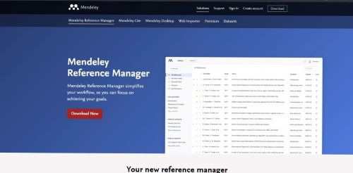
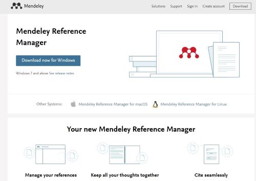
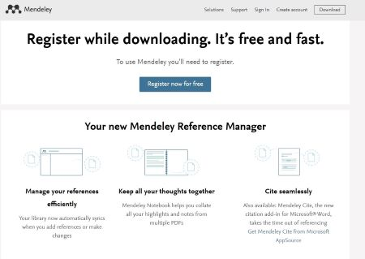
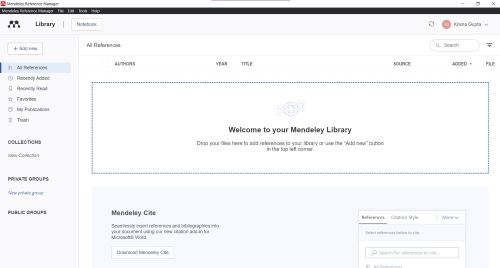

## Menggunakan Mendeley di dalam penulisan ilmiah

Krisna Gupta  
Ketua Komisi Ekonomi Ditlitka 2020/2021  
Australian National University  
14 Januari 2021

---

## What you need

- Laptop / komputer pribadi
  - contoh ini menggunakan windows 10
- Elsevier account
- Program mendeley Reference Manager
- reference list untuk latihan

---

## Download Mendeley Reference Manager

- Klik [link ini](https://www.mendeley.com/download-reference-manager), lalu pencet "download now" (tombol merah)

---

## Download Mendeley for desktop

- Pencet download for windows, lalu simpan file-nya di lokasi favorit anda.

---

## Download Mendeley for desktop

- Anda akan diantar ke laman ini utk registrasi.
- Registrasi mudah dan cepat. Pake aja akun e-mail pribadi.
- Kita perlu akun tersebut utk memakai mendeley. 

---

## Membuka Mendeley

- Setelah selesai di-install, buka programnya lalu login dengan akun elsevier yang sudah anda buat.
- tampilannya seperti di bawah ini
- jangan lupa klik "Download Mendeley Cite".

---

### Install citation plugin for ms word

- jangan lupa ditutup dulu file microsoft office yang sedang dibuka (word, excel, ppt, outlook, dll)
