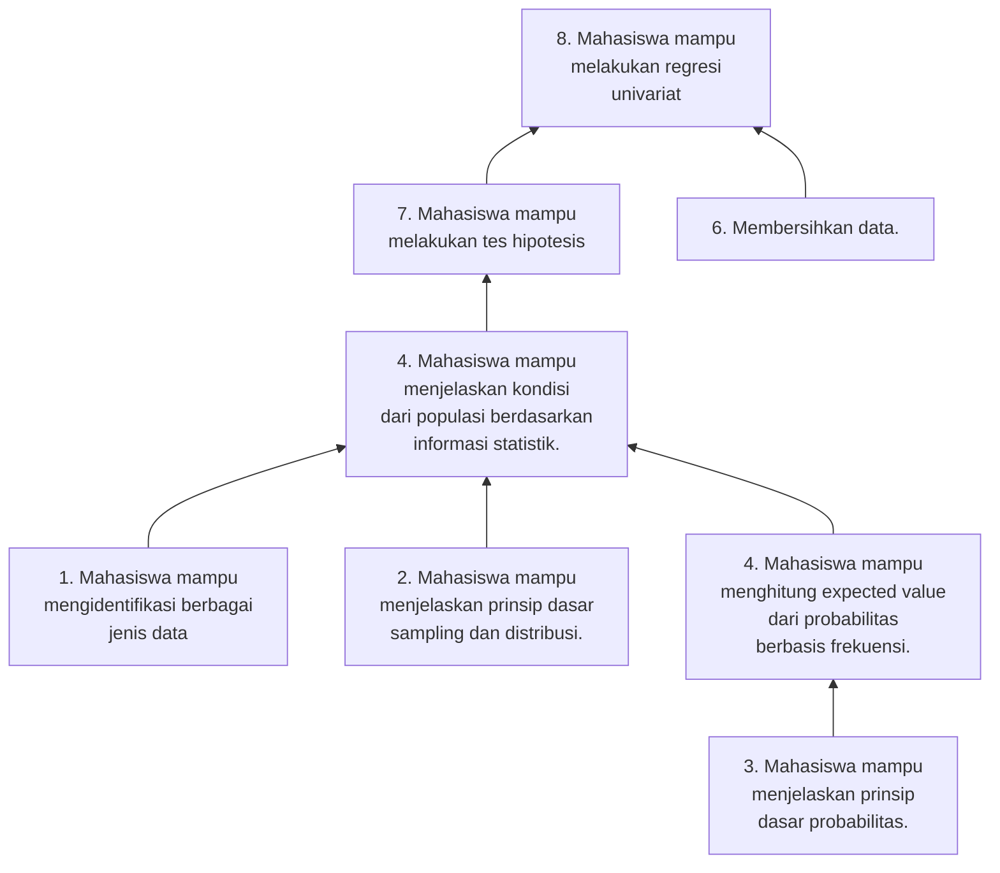

## Tentang mata kuliah ini

Menurut [World Economic Forum](https://www.weforum.org/agenda/2020/10/top-10-work-skills-of-tomorrow-how-long-it-takes-to-learn-them/), kemampuan berpikir analitik dan penggunaan teknologi merupakan 2 dari 10 kemampuan yang paling dicari pada 2025. Hal ini sejalan dengan keinginan Kementerian Perindustrian untuk mengarahkan pengembangan Industri 4.0 yang menitikberatkan pada kemampuan analitis dan penggunaan teknologi komputasi. Seiring meningkatnya akses data, maka pemahaman statistik semakin diperlukan, apalagi di bidang ilmu sosial. Melihat tren ke depan, Politeknik APP Jakarta merasa perlunya membekali mahasiswa dengan kemampuan yang akan tinggi permintaannya di masa depan.

Mata kuliah ini merupakan salah satu mata kuliah wajib di Politeknik APP Jakarta jurusan Perdagangan Internasional. Mata kuliah ini bermaksud memberi pemahaman tentang prinsip dasar ilmu statistika, seperti probabilitas dan sampling. Mahasiswa juga akan belajar bagaimana mendapat gambaran dari populasi dengan melihat angka rata-rata, median, modus, rentang dan distribusi. Mahasiswa akan juga dibekali kemampuan untuk menggunakan alat-alat analisis seperti _hypothesis testing_ dan regresi, dalam pengawasan.

## Peta Kompetensi

Mata kuliah ini diharapkan mampu membantu mengisi salah satu [Capaian Pembelajaran Lulusan (CPL) pengetahuan]() di Politeknik APP Jakarta khususnya prodi PIWAR yaitu "Menguasai pengetahuan tentang cara memilih dan menggunakan alat manajemen (management tools) untuk menetapkan suatu keputusan manajerial".

## Capaian Pembelajaran dan Sub-Capaian Pembelajaran

Setelah lulus mata kuliah ini, mahasiswa diharapkan akan mampu menggunakan alat-alat analisis berbasis statistika.

Beberapa sub-capaian antara lain:

1.	Mengidentifikasi berbagai jenis data (C1).
2.	Menerangkan prinsip dasar sampling dan distribusi (C2).
3.	Menerangkan prinsip-prinsip dasar probabilitas (C2).
4.	Menjelaskan kondisi dari populasi berdasarkan informasi statistik (C2). 
5.	Menghitung expected value dari probabilitas berbasis frekuensi (C3).
6.	Membersihkan data sehingga _machine-readable_ (C3).
7.	Melakukan tes hipotesis (C3).
8.	Melakukan regresi univariat (C3).

## Syarat & Prasayarat

Tidak ada prasyarat untuk mata kuliah ini. Mata kuliah ini sendiri merupakan prasyarat untuk mata kuliah [Metodologi Penelitian](https://krisna.or.id/courses/metopel/).

## Metode pembelajaran

| Rumusan kompetensi | Ceramah | Seminar/ diskusi | praktikum | problem-based learning | project-based learning | collaborate learning | simulasi |
| ------ | --- | --- | --- | --- | --- | --- | --- |
| Mengidentifikasi berbagai jenis data (C1). | ✅ | - | - | - | - | - | - |
| Menerangkan prinsip dasar sampling dan distribusi (C2). | ✅ | - | - | - | - | - | - |
| Menerangkan prinsip-prinsip dasar probabilitas (C2). | ✅ | - | - | - | - | - | - |
| Menjelaskan kondisi dari populasi berdasarkan informasi statistik (C2).  | ✅ | ✅ | - | ✅ | - | ✅ | - |
| Menghitung expected value dari probabilitas berbasis frekuensi (C3). | ✅ | - | - | ✅ | - | - | - |
| Membersihkan data sehingga _machine-readable_ (C3). | ✅ | - | - | ✅ | - | ✅ | - |
| Melakukan tes hipotesis (C3). |  ✅ | - | - | ✅ | - | - | - |
| Melakukan regresi univariat (C3). | ✅ | - | - | ✅ | - | - | - |

## Buku Pegangan

Mata kuliah ini tidak didasari oleh buku tertentu, dan sudah didesain sebagaimana sehingga perkuliahan, latiah dan tugas saja sudah cukup. Namun demikian, ada beberapa buku yang akan berguna bagi mahasiswa untuk dibaca untuk meningkatkan pemahaman. 

Buku yang paling saya rekomendasikan adalah Supranto (2016). Saefuddin dkk (2009) memiliki bahasa yang menurut saya cukup sederhana, sementara Sugiyono (2017) merupakan salah satu buku metode statistika yang paling populer. Semua buku-buku ini tersedia di perpustakaan Politeknik APP Jakarta.

## Evaluasi

## Daftar Pustaka

- Saefuddin, A., Notodiputro, K. A., Alamudi, A., & Sadik, K. (2009). Statistika Dasar. BM Adam. 
- Sugiyono. (2017). Statistika untuk penelitian. Bandung: Alfabeta.
- Supranto, J. (2016). Statistik: Teori & Aplikasi. Jakarta: Erlangga.

