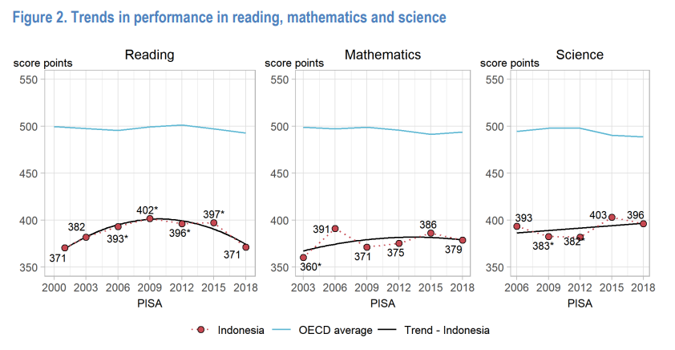

Pada hari Kamis tanggal 6 Juli 2023, Badan Kebijakan Fiskal di Kemenkeu menyelenggarakan acara bernama _fiscal day_ atau hari fiskal. Salah satu tema yang diangkat adalah diskusi kebijakan mengenai bonus demografi di Indonesia. Diskusi ini sangat relevan, apalagi saat ini di mana Indonesia tengah mengejar pertumbuhan investasi dan pertumbuhan ekonomi, mencegah terjadinya "tua sebelum kaya".

BKF memulai dengan statistik yang menarik. Katanya, pada 2020, penduduk usia kerja di Indonesia mencapai 191 juta jiwa atau sekitar 70,7% dari total penduduk. Hal ini baik karena artinya rasio penduduk bekerja dibanding penduduk tidak bekerja cukup tinggi. Pada tahun 2028-2031 angka ini akan mulai menurun. Sayangnya, menurut BKF, bonus demografi ini dapat menjadi masalah apabila masyarakatnya tidak produktif.

Menurut dokumen briefingnya BKF:

> Sayangnya, isu SDM di Indonesia masih dihadapkan pada sejumlah tantangan. Diantaranya angkatan kerja Indonesia masih didominasi lulusan Sekolah Dasar (SD) ke bawah dengan 39,76%. Pekerja lulusan Sekolah Menengah Pertama (SMP) sebanyak 18,24%, Sekolah Menengah Atas (SMA) 19,18%, dan Sekolah Menengah Kejuruan (SMK) 9,31%. Sementara, pekerja lulusan pendidikan tinggi masih sangat terbatas, yakni Diploma I/II/III 2,20%, serta Diploma IV, S1, S2, S3 sebesar 9,31% (Badan Pusat Statistik, Februari 2023). Kondisi tersebut berdampak terhadap produktivitas dan daya saing tenaga kerja yang relatif rendah.

BKF juga mencatat rendahnya skor _Human Development Index_ dari Indonesia.

Jika dilihat dibandingkan negara tetangga, HDI Indonesia mirip dengan Vietnam, masih lebih tinggi dari India, dan masih di bawah Malaysia dan Thailand. Yang cukup mengejutkan adalah bagaimana China dan Vietnam mengejar Indonesia sementara Indonesia tampak berjalan di tempat.

<iframe src="https://ourworldindata.org/grapher/children-per-woman-vs-human-development-index?time=latest&country=IDN~SGP~VNM~MYS~THA~PHL~IND~CHN" loading="lazy" style="width: 100%; height: 600px; border: 0px none;"></iframe>

Ada beberapa poin yang cukup menarik untuk didiskusikan:

1.	Apakah bonus demografi Indonesia yang saat ini dialami sudah menunjukkan tanda-tanda menjadi berkah, atau justru menunjukkan sinyal musibah? 

2.	Apakah kebijakan pemerintah yang saat ini ada sudah cukup ideal? Sektor apa yang perlu diprioritaskan untuk memaksimalkan bonus demografi? 

3.	Kebijakan seperti apa yang perlu dipersiapkan pemerintah untuk menyambut hadirnya era aging population pasca era bonus demografi berakhir? 

4.	Diskusikan dan susun rekomendasi serta inovasi kebijakan yang lebih baik terkait bonus demografi! 

## Berkah atau musibah?

Ya memang kalau dilihat dari beberapa statistik tentang youth, sepertinya terlihat tanda-tanda menuju ke musibah. 2 grafik di bawah menunjukkan pemuda di Indonesia yang ngga ngaoa-ngapain maupun yang menganggur. Angkanya memang di bawah India, tapi masih di atas negara-negara tetangga.

<iframe src="https://data.worldbank.org/share/widget?end=2021&indicators=SL.UEM.NEET.ZS&locations=CN-IN-ID-MY-TH-VN-SG-PH&start=2017" width='450' height='300' frameBorder='0' scrolling="no" ></iframe>

<iframe src="https://data.worldbank.org/share/widget?end=2021&indicators=SL.UEM.NEET.ZS&locations=CN-IN-ID-MY-TH-VN-SG-PH&start=2017" width='450' height='300' frameBorder='0' scrolling="no" ></iframe>

Pengangguran terbuka berdasarkan tingkat pendidikan (%)
| Tingkat pendidikan | 2020 | 2021 | 2022 |
| ----------- | ----- | ----- | ----- |
| SD ke bawah | 3,61 | 3,61 | 3,59 |
| SMP | 6,46 | 6,45 | 5,95 |
| SMU | 9,86 | 9,09 | 8,57 |
| SMK | 13,55 | 11,13 | 9,42 |
| Diploma | 8,08 | 5,87 | 4,59 |
| S1 ke atas | 7,35 | 5,98 | 4,80 |

Paling sedikit proporsi pengangguran malah lulusan SD ke bawah, dan SMK yang malah ditujukan untuk bekerja malah paling tinggi. Jadi dibilang kerna masalah pendidikan juga mungkin tidak terlalu tepat ya karena pendidikan naik malah makin nganggur, _to some extent_. Jangan-jangan ada _mis-match_? Tentunya hal ini di luar masalah [pendidikan secara umum](https://smeru.or.id/id/keywords/kualitas-pendidikan). Menurut SMERU:

> Saat ini hanya 37% guru yang mempunyai kualifikasi mengajar sebagaimana ditetapkan oleh Undang-Undang Guru Tahun 2005, dan sekitar 15% guru mangkir mengajar pada setiap hari kerja di seluruh Indonesia.

Tidak hanya itu, menurut statistik dari BPS, [nyaris 60%](https://bps.go.id/indicator/6/2155/1/proporsi-lapangan-kerja-informal-menurut-jenis-kelamin.html) diantara yang bekerja, bekerja di sektor yang tergolong informal. Menurut penelitian [Bank Dunia](https://documents.worldbank.org/en/publication/documents-reports/documentdetail/262411468771676229/income-insecurity-and-underemployment-in-indonesias-informal-sector), pekerja di sektor informal cenderung berisiko lebih tinggi kehilangan pendapatan apalagi jika ada _shock_. 

Anak muda yang kurang terdidik dengan baik dan kekurangan lapangan pekerjaan mungkin ada kecenderungan terlibat premanisme. Kebetulan, Indonesia juga punya masalah premanisme (_vigilantism_). Hal ini diteliti oleh [Sana Jaffrey](https://link.springer.com/article/10.1007/s12116-021-09336-7#Constitutional%20Barriers%20to%20Legislative%20Change%20Incentivize%20Extra-Legal%20Measures) yang melihat maraknya vigilantism di Indonesia dan India, negara yang _youth unemployment_-nya mirip dengan Indonesia. Di samping itu, menurut [Blane Lewis](https://www.tandfonline.com/doi/abs/10.1080/03003930.2022.2103673?journalCode=flgs20), aktivitas premanisme lokal meningkat mendekati masa-masa pemilu di daerah.

SIngkat kata, memang sepertinya sulit untuk optimis terhadap bonus demografi Indonesia.

## Kebijakan saat ini cukup?

Menurut BKF, ada beberapa kebijakan yang terkait dengan memanfaatkan bonus demografi:

1. Alokasi 20% APBN untuk anggaran pendidikan. Di 2023 ini alokasinya menyentuh Rp612,2 Triliun yang disalurkan pada beberapa kementerian/lembaga (Kemendikbudristek, BRIN, Kemenag, dll.) serta melalui Transfer ke Daerah dan Dana Desa.
2. Program kartu prakerja. pada 2020, anggaran Rp10 triliun untuk 2 juta peserta. Adapun di tahun 2023, alokasi anggarannya turun menjadi Rp2,67 triliun dengan sasaran 1 juta peserta.
3. Pengembangan pendidikan vokasi melalui _super tax deduction_ yang diatur melalui Peraturan Presiden Nomor 68 Tahun 2022 tentang Revitalisasi Pendidikan Vokasi dan Pelatihan Vokasi.

Menurut BKF, kebijakan-kebijakan ini sepertinya kurang tepat. Seperti misalnya alokasi 20% APBN tidak berhasil memperbaiki kualitas sekolah dan lulusannya (terlihat dari skor PISA yang [bukannya naik malah turun](https://www.oecd.org/pisa/publications/PISA2018_CN_IDN.pdf)). 

Mungkin ga salah yah. Saya juga kalau ditanya apa resepnya memperbaiki kualitas sekolah juga mungkin bingung. Tapi perbaikan sekolah tidak akan mengubah hal dengan cepat. Saat ini aja sepertinya pihak yang bertugas memperbaiki pendidikan di Indonesia juga belum ngerti harus ngapain, sementara itu bonus demografi akan berakhir dengan cepat. Tentu saja perlu diperbaiki nih sistem pendidikan, tapi sepertinya juga perlu kebijakan quick wins.

Kartu pra-kerja juga bisa kita kritisi. Jika pendidikan bermasalah, maka kemampuan lulusannya untuk belajar konsep/hal baru juga bisa jadi bermasalah.

Tentu juga tidak boleh lupa bahwa manusia yang berkualitas datang dari ibu yang sehat dan anak yang tidak stunting. Gizi ibu dan anak sangat penting, dan akses kepada makanan bergizi sangat diperlukan, dengan harga yang terjangkau. [Hambatan impor sangat-sangat tidak menolong](https://theconversation.com/jangan-dibatasi-impor-bahan-makanan-bisa-perkuat-perekonomian-dan-ketahanan-pangan-192625) dalam hal ini.

Lastly, tentunya lapangan kerja juga memiliki masalah karena investasi yang bisa jadi kurang. Kalo ini sih udah masalah klasik ya. Sebenarnya Indonesia ini cukup kompetitif, tapi ada banyak hal yang men-discourage seseorang untuk memulai investasi. Ada banyak masalahnya, misalnya kepastian hukum yang jelek, birokrasi yang berbelit-belit, dan [kapital yang mahal](https://www.krisna.or.id/post/ngobroltempo/).

> Interest rate gede, bank ga menerima peralatan produksi sebagai jaminan, dan pemerintah masih rajin ngeluarin surat utang dengan bunga menggiurkan (crowding out). Investor dalam negeri kekurangan likuiditas, sementara investor asing seneng-seneng aja masuk Indo karena interest rate di luar negeri rendah dan Bank Indonesia yang sangat-sangat menjaga nilai mata uang Indonesia agar selalu stabil (dengan naikin interest rate wkwkw). Crowding out makin nyata ketika sektor ekspor tidak bantu naikin likuiditas domestik.

<iframe src="https://data.worldbank.org/share/widget?end=2022&indicators=FR.INR.LEND&locations=CN-IN-ID-TH-MY-VN-SG-PH&start=2006" width='450' height='300' frameBorder='0' scrolling="no" ></iframe>

Untuk quick wins, tentu kita memerlukan pekerjaan-pekerjaan yang dapat menghire demografi kita yang saat ini didominasi lulusan wajib belajar 12 tahun. Eh malah bikin kebijakan industri 4.0 yang notabene memerlukan tenaga kerja terdidik dan mengemploy sedikit tenaga kerja wajib belajar 12 tahun. wkwk.

## Kebijakan pasca bonus demografi

Ini sebenernya pertanyaan yang sangat sulit. Indonesia saat ini gak punya saving rate yg cukup. Sepertinya akan susah untuk siap-siap. Currency dan ekonominya terlalu gak penting untuk bisa refinancing murah seperti Jepang ataupun China. Jalan satu-satunya saat ini adalah tingkatkan pertumbuhan ekonomi yang sehat serta memperbaiki pendidikan. Tapi ini artinya perlu investasi besar-besaran dan meraup keuntungannya secepat-cepatnya, _preferably_ sebelum 2035. Mungkin nggak ya? Takutnya kalau terlalu jor-joran nanti malah jadi kaya 1998? Tetep susah sih tanpa penguatan pendidikan dan institusi yang pastinya makan waktu.

Mungkin salah satu jalan keluar yang mungkin adalah siap-siap mencarikan lapangan pekerjaan di luar negeri, kalau memang negeri sendiri udah segitu susahnya untuk diperbaiki. Ada banyak pekerjaan di luar negeri yang dapat memberikan gaji yang lumayan dan punya cukup uang untuk dikirim ke kampung halaman. Tentu udah sering dengar tentang TKI, tapi ada peluang di sektor senior care atau panti jompo gitu, mengingat negara lain bakal duluan berpopulasi tua. Baru-baru ini Indonesia-AUstralia menjalin kerjasama insinyur yang mungkin ke depannya akan mempermudah insinyur Indonesia kerja di Australia. Tapi ini tentunya juga tidak mudah.

Evaluasi program-program yang saat ini ada harus terus dijalankan. BKF tentu ngga ada di posisi yang bisa menghentikan sebuah kebijakan, tapi at least bisa lah bikin studi untuk evaluasi.