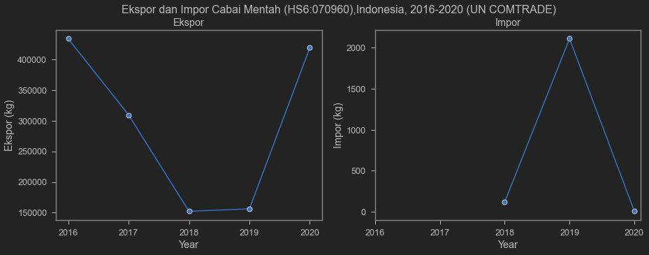
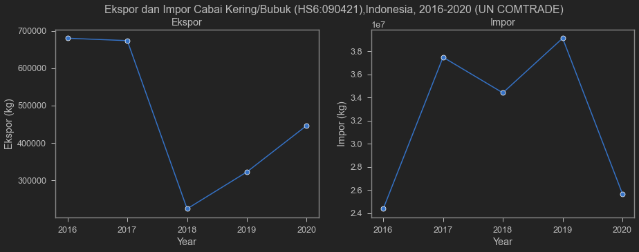

Cabai adalah salah satu komoditas yang sangat penting. Masyarakat Indonesia sangat menyukai cabai. Saya sampai kuliah ke luar negeri pun tetap suka beli sambel karena memang cabai seenak itu. Tidak hanya vital dalam berbagai masakan a la nusantara, tapi juga mengandung vitamin c yang sangat tinggi loh gaes!

Pada suatu pagi saya melihat video yang lumayan viral tentang petani yang marah dan menendang-nendang tanaman cabainya.

<blockquote class="twitter-tweet"><p lang="in" dir="ltr">Ngene Iki Lurrrrrr akibaté, nek Rego / Harga si-Lombok terjun bebas, murahnya kebangetan,..petani tekor, modal tanam tekadang pinjaman / kredit Bank, tahu kenapa...! <a href="https://t.co/IjTEcvZxO0">pic.twitter.com/IjTEcvZxO0</a></p>&mdash; Susilo Samin Blora (@Susilo_Blora) <a href="https://twitter.com/Susilo_Blora/status/1430780278364987394?ref_src=twsrc%5Etfw">August 26, 2021</a></blockquote> <script async src="https://platform.twitter.com/widgets.js" charset="utf-8"></script> 

Kalau menurut akun yang saya embed di atas, sepertinya penyebabnya adalah jatuhnya harga cabai ketika panen. Tentunya ini adalah hal yang menyedihkan. Bayangin, usaha berbulan-bulan, biaya, waktu dan tenaga, semua sirna ketika harga output jatuh.

Postingan lain menurut saya cukup menarik. Saya embed postingannya di bawah ini:

<blockquote class="twitter-tweet"><p lang="in" dir="ltr">lanjutannya. diambil dari sini sepertinya ya <a href="https://t.co/Lz4vNibZb6">https://t.co/Lz4vNibZb6</a> <a href="https://t.co/lthDKPFjvc">pic.twitter.com/lthDKPFjvc</a></p>&mdash; Krisna &#39;imed&#39; Gupta (@iMedKrisna) <a href="https://twitter.com/iMedKrisna/status/1431461097760976903?ref_src=twsrc%5Etfw">August 28, 2021</a></blockquote> <script async src="https://platform.twitter.com/widgets.js" charset="utf-8"></script> 

postingan tersebut menarik karena dua hal. Pertama, akun tersebut mengaitkan fenomena tersebut dengan [Undang-Undang Cipta Kerja (UUCK)](https://peraturan.bpk.go.id/Home/Details/149750/uu-no-11-tahun-2020), dan mengatakan bahwa sekarang impor cabai tidak perlu lagi memperhitungkan produksi petani. Poin kedua, akun tersebut mengambil gambar dan judul dari postingan berita dari Bisnis.com dengan judul ["Pasokan Cabai Surplus, Kok Ada Impor 27.851 Ton?"](https://ekonomi.bisnis.com/read/20210824/12/1433531/pasokan-cabai-surplus-kok-ada-impor-27851-ton).

Tentu saja yang menarik adalah berita tersebut mengonfirmasi bahwa impor yang dilakukan adalah terhadap cabai dalam bentuk kering/bubuk untuk industri manufaktur. Mengutip berita tersebut:

> Bisnis.com, JAKARTA — Kementerian Pertanian menyebutkan bahwa pasokan aneka cabai untuk konsumsi di Indonesia berada pada posisi surplus. Indonesia juga mengimpor cabai untuk memenuhi kebutuhan industri. 

> Direktur Pengolahan dan Pemasaran Hasil Hortikultura Kementan Bambang Sugiharto menjelaskan impor cabai sebesar 27.851 ton sepanjang semester I/2021 dilakukan untuk memenuhi kebutuhan industri. Cabai diimpor dalam bentuk cabai kering, cabai dihancurkan atau ditumbuk dan bukan cabai segar konsumsi. 

> Berdasarkan data Badan Pusat Statistik (BPS), produksi cabai nasional pada 2020 mencapai 2,77 juta ton. Angka ini mengalami peningkatan 7,11 persen dibandingkan dengan 2019. Selain itu, Indonesia tercatat mengekspor aneka cabai dengan nilai USD25,18 juta pada 2020 atau naik 69,86 persen dibandingkan dengan 2019.

Sayangnya akun tersebut tidak menyediakan link ke berita aslinya untuk dibaca followersnya. Cuma capture judul. Hati-hati yah teman-teman! Selalu pertanyakan capture-an judul saja dan selalu baca isi berita sebelum menyebarkan dengan _prejudice_ tertentu!

Tapi terlepas fakta tersebut, saya lumayan tertarik dengan narasinya. Beliau mengaitkan fenomena ini dengan impor. Dengan kata lain, harga cabai turun karena impor dilakukan di saat panen cabai berlangsung. Kedua, akun tersebut mengaitkan importase tersebut dengan UUCK.

Tentunya susah ya membuktikannya secara komprehensif dan koheren. Tapi mungkin kita bisa setidaknya mengira-ngira beberapa hal.

Pertama, supaya impor mempengaruhi harga domestik, paling tidak kita harus menemukan besarnya impor relatif terhadap produksi lokal maupun ekspor. Menurut cuplikan berita di atas, produksi nasional adalah 2.77 juta ton. Tidak hanya itu, Indonesia bahkan adalah eksportir cabai!

Hal kedua adalah bahwa impor cabai yang tinggi adalah disebabkan oleh UU CK. Artinya, sebelum ada UU CK, impor harusnya lebih sedikit atau bahkan tidak signifikan sama sekali, lalu naik di 2020 dan 2021.

Kita coba cek dengan data ekspor impor. Pada postingan kali ini, saya pakai API-nya [UN COMTRADE](https://comtrade.un.org/Data/) karena datanya lumayan lengkap dan bisa diakses siapa saja. Skip aja bagian ini kalau males liat kode yg dipakai.

Gw akan ambil data total ekspor dan impor Indonesia dari dan ke negara-negara lain. Barang yang akan saya tarik datanya ada 2. Pertama adalah Cabai Mentah dengan kode HS-6-digit 070960, yang dituduhkan kita impor banyak sejak UU CK berlaku. Barang yang kedua adalah Cabai Kering (non-crushed) dengan kode HS-6-digit 090421, barang yang ternyata diimpor sesuai dengan berita di atas. Tuh ya cabe mentah dan cabe kering kode HS-nya aja beda. hahaha. Emang bahaya baca judul doang.

Dari keduad ata tersebut, mari kita lihat apakah iya kita impor banyak Cabai Mentah sejak tahun 2020, tahun di mana UU CK mulai berlaku. Sayangnya UN COMTRADE belum punya data tahun 2021. Tentunya BPS punya data bulanan, tapi karena tidak semua orang punya akses terhadap data tsb, hold dulu tahun 2021-nya. He he.

## Ngambil data dari UN COMTRADE

Tarik pake API dari [UN COMTRADE](https://comtrade.un.org/Data/).


```python
# cari api key-nya di https://comtrade.un.org/Data/
api_key='/api/get?max=502&type=C&freq=A&px=HS&ps=2016%2C2017%2C2018%2C2019%2C2020&r=360&p=0&rg=2%2C1&cc=070960%2C090421'
url='https://comtrade.un.org/'+api_key+'&fmt=csv'
cabe=pd.read_csv(url)
# cek nama variabel
cabe.columns
```


    Index(['Classification', 'Year', 'Period', 'Period Desc.', 'Aggregate Level',
           'Is Leaf Code', 'Trade Flow Code', 'Trade Flow', 'Reporter Code',
           'Reporter', 'Reporter ISO', 'Partner Code', 'Partner', 'Partner ISO',
           '2nd Partner Code', '2nd Partner', '2nd Partner ISO',
           'Customs Proc. Code', 'Customs', 'Mode of Transport Code',
           'Mode of Transport', 'Commodity Code', 'Commodity', 'Qty Unit Code',
           'Qty Unit', 'Qty', 'Alt Qty Unit Code', 'Alt Qty Unit', 'Alt Qty',
           'Netweight (kg)', 'Gross weight (kg)', 'Trade Value (US$)',
           'CIF Trade Value (US$)', 'FOB Trade Value (US$)', 'Flag'],
          dtype='object')


banyak amat yak variabelnya. ambil yang penting aja. Saya akan buat dua jenis tabel, satu untuk Cabe Mentah, dan satu lagi untuk Cabe Kering.


```python
# Ambil variabel yg penting aja
cabe=cabe[['Year','Trade Flow','Commodity Code', 'Commodity',
           'Netweight (kg)', 'Trade Value (US$)']]
# Menyiapkan cabe mentah
xcabe_mentah=cabe.query('`Commodity Code` == 70960 & `Trade Flow` == "Export"').sort_values(by=['Year']).reset_index()
xcabe_mentah=xcabe_mentah[['Year','Netweight (kg)','Trade Value (US$)']]
xcabe_mentah=xcabe_mentah.rename(columns={"Netweight (kg)": "Ekspor (kg)",
                                          "Trade Value (US$)": "Ekspor (US$)"})
mcabe_mentah=cabe.query('`Commodity Code` == 70960 & `Trade Flow` == "Import"').sort_values(by=['Year']).reset_index()
mcabe_mentah=mcabe_mentah[['Year','Netweight (kg)','Trade Value (US$)']]
mcabe_mentah=mcabe_mentah.rename(columns={"Netweight (kg)": "Impor (kg)",
                                          "Trade Value (US$)": "Impor (US$)"})
#cabe_mentah=cabe_mentah.set_index('Year')
#cabe_mentah['Tahun']=pd.to_datetime(cabe_mentah['Year'],format='%Y')
xcabe_kering=cabe.query('`Commodity Code` == 90421 & `Trade Flow` == "Export"').sort_values(by=['Year']).reset_index()
xcabe_kering=xcabe_kering[['Year','Netweight (kg)','Trade Value (US$)']]
xcabe_kering=xcabe_kering.rename(columns={"Netweight (kg)": "Ekspor (kg)",
                                          "Trade Value (US$)": "Ekspor (US$)"})
mcabe_kering=cabe.query('`Commodity Code` == 90421 & `Trade Flow` == "Import"').sort_values(by=['Year']).reset_index()
mcabe_kering=mcabe_kering[['Year','Netweight (kg)','Trade Value (US$)']]
mcabe_kering=mcabe_kering.rename(columns={"Netweight (kg)": "Impor (kg)",
                                          "Trade Value (US$)": "Impor (US$)"})
```


## Cabai Mentah

Pertama mari kita cek tabel ekspor dan impor cabe mentah, sekalian grafiknya.


```python
cm=pd.merge(xcabe_mentah,mcabe_mentah,on='Year',how='outer')
print(cabe.Commodity.iloc[2])
print(cabe['Commodity Code'].iloc[2])
cm
```

    Vegetables; fruits of the genus capsicum or of the genus pimenta, fresh or chilled
    70960
    


<div>
<style scoped>
    .dataframe tbody tr th:only-of-type {
        vertical-align: middle;
    }

    .dataframe tbody tr th {
        vertical-align: top;
    }

    .dataframe thead th {
        text-align: right;
    }
</style>
<table border="1" class="dataframe">
  <thead>
    <tr style="text-align: right;">
      <th></th>
      <th>Year</th>
      <th>Ekspor (kg)</th>
      <th>Ekspor (US$)</th>
      <th>Impor (kg)</th>
      <th>Impor (US$)</th>
    </tr>
  </thead>
  <tbody>
    <tr>
      <th>0</th>
      <td>2016</td>
      <td>433825</td>
      <td>587063</td>
      <td>NaN</td>
      <td>NaN</td>
    </tr>
    <tr>
      <th>1</th>
      <td>2017</td>
      <td>309464</td>
      <td>635331</td>
      <td>NaN</td>
      <td>NaN</td>
    </tr>
    <tr>
      <th>2</th>
      <td>2018</td>
      <td>152292</td>
      <td>387459</td>
      <td>120.0</td>
      <td>526.0</td>
    </tr>
    <tr>
      <th>3</th>
      <td>2019</td>
      <td>156327</td>
      <td>316311</td>
      <td>2112.0</td>
      <td>4216.0</td>
    </tr>
    <tr>
      <th>4</th>
      <td>2020</td>
      <td>418972</td>
      <td>669580</td>
      <td>6.0</td>
      <td>37.0</td>
    </tr>
  </tbody>
</table>
</div>


```python
fig, axes = plt.subplots(1, 2, figsize=(15, 5))
fig.suptitle('Ekspor dan Impor Cabai Mentah (HS6:070960),Indonesia, 2016-2020 (UN COMTRADE)')
sns.lineplot(ax=axes[0], data=cm ,x='Year', y='Ekspor (kg)',marker='o')
axes[0].set_title('Ekspor (kg)')
axes[0].xaxis.set_ticks([2016,2017,2018,2019,2020])
sns.lineplot(ax=axes[1], data=mcabe_mentah ,x='Year', y='Impor (kg)',marker='o')
axes[1].set_title('Impor (kg)')
axes[1].xaxis.set_ticks([2016,2017,2018,2019,2020])
```


    [<matplotlib.axis.XTick at 0x26ed40c7ca0>,
     <matplotlib.axis.XTick at 0x26ed40c7c70>,
     <matplotlib.axis.XTick at 0x26ed40f9520>,
     <matplotlib.axis.XTick at 0x26ed41123a0>,
     <matplotlib.axis.XTick at 0x26ed4126df0>]


    

    


Sesuai tabel dan grafik di atas, kita bisa liat bahwa kita emang impor cabai mentahnya kuecil banget. Bahkan tahun 2020, pas UU CK berlaku, bukannya naik, malah turun. Data UN COMTRADE bilang bahwa tahun 2020, Indonesia mengimpor 6 kilogram cabai. Jelas angka ini jauh di bawah angka produksi 2.77 ton. UNCOMTRADE ga punya data impor cabai mentah di tahun 2016 dan 2017, mungkin karena emang tahun segitu kita ga impor cabe mentah.

Bahkan, kita termasuk negara pengekspor cabe mentah. Hal yang sebenarnya menarik. Artinya, negara kita lumayan kompetitif dalam produksi cabe (mungkin?). Bukannya impor, kita malah ekspor banyak! Kalau begitu kenapa Petani merugi? Apakah para petani cabai cuma lebay?

Belum tentu! Ada banyak hal yang bisa diangkat. Bisa jadi distribusi ke pasar, mungkin ada yang tahan suplai, bisa aja ga semua petani bisa akses pasar ekspor, bisa jadi demand masyarakat yang lemah, bisa jadi masa tanam yang tidak dikoordinasi. Misalnya, pas masa tanam, semua tanam dan ga ada yg panen, sehingga cabai langka di pasar. Pas panen, semua panen secara bersamaan, sehingga terjadi lonjakan _supply_ cabai di pasar. Ketika suplai banyak, harga jatuh.

Ada banyak kemungkinan masalahnya yang saya ga terlalu menguasai. Tapi yang jelas, impor bukan masalahnya. Jangan salah, ada banyak masalah yang ditimbulkan rente impor (dan rente ekspor), tapi sepertinya tidak untuk cabai. 

## Cabai Kering (non-crushed)

Salah satu problem yang bisa kita hipotesiskan adalah lemahnya daya serap industri terhadap cabe petani. Hal ini dapat terefleksi dari impor cabe kering. Logikanya, Jika cabe merah suplainya banyak, harusnya cabe-cabe tersebut dapat digunakan untuk produksi cabe kering, sehingga impor cabe kering dapat ditekan. Mari kita lihat bagaimana kondisi ekspor dan impor cabe kering di tabel dan grafik di bawah.


```python
ck=pd.merge(xcabe_kering,mcabe_kering,on='Year',how='outer')
print(cabe.Commodity.iloc[10])
print(cabe['Commodity Code'].iloc[10])
ck
```

    Spices; fruits of the genus Capsicum or Pimenta, dried, neither crushed nor ground
    90421
    


<div>
<style scoped>
    .dataframe tbody tr th:only-of-type {
        vertical-align: middle;
    }

    .dataframe tbody tr th {
        vertical-align: top;
    }

    .dataframe thead th {
        text-align: right;
    }
</style>
<table border="1" class="dataframe">
  <thead>
    <tr style="text-align: right;">
      <th></th>
      <th>Year</th>
      <th>Ekspor (kg)</th>
      <th>Ekspor (US$)</th>
      <th>Impor (kg)</th>
      <th>Impor (US$)</th>
    </tr>
  </thead>
  <tbody>
    <tr>
      <th>0</th>
      <td>2016</td>
      <td>680078</td>
      <td>4497982</td>
      <td>24374457</td>
      <td>31019978</td>
    </tr>
    <tr>
      <th>1</th>
      <td>2017</td>
      <td>673598</td>
      <td>2393926</td>
      <td>37490445</td>
      <td>45749699</td>
    </tr>
    <tr>
      <th>2</th>
      <td>2018</td>
      <td>223126</td>
      <td>725423</td>
      <td>34409357</td>
      <td>51208284</td>
    </tr>
    <tr>
      <th>3</th>
      <td>2019</td>
      <td>321959</td>
      <td>934735</td>
      <td>39132270</td>
      <td>65280761</td>
    </tr>
    <tr>
      <th>4</th>
      <td>2020</td>
      <td>446247</td>
      <td>1095573</td>
      <td>25674802</td>
      <td>52323399</td>
    </tr>
  </tbody>
</table>
</div>


```python
fig, axes = plt.subplots(1, 2, figsize=(15, 5))
fig.suptitle('Ekspor dan Impor Cabai Kering/Bubuk (HS6:090421),Indonesia, 2016-2020 (UN COMTRADE)')

sns.lineplot(ax=axes[0], data=ck ,x='Year', y='Ekspor (kg)',marker='o')
axes[0].set_title('Ekspor')
axes[0].xaxis.set_ticks([2016,2017,2018,2019,2020])
sns.lineplot(ax=axes[1], data=ck ,x='Year', y='Impor (kg)',marker='o')
axes[1].set_title('Impor')
axes[1].xaxis.set_ticks([2016,2017,2018,2019,2020])
```


    [<matplotlib.axis.XTick at 0x26ed47da910>,
     <matplotlib.axis.XTick at 0x26ed47da8e0>,
     <matplotlib.axis.XTick at 0x26ed480bd90>,
     <matplotlib.axis.XTick at 0x26ed483f400>,
     <matplotlib.axis.XTick at 0x26ed482db50>]


    

    


Nah kalo cabe kering beda ya situasinya. Ternyata meskipun ada ekspornya, impor masih mendominasi. Skala di impor di grafik saking gedenya sampe harus dibikin 1e7 (atau $10^7$) hahaha. Nah kalau cabe kering baru gede impornya. Saya juga ga tau apakah cabai kering impornya dikontrol seperti cabai merah, tapi kalau dilihat, harusnya ini tidak memiliki dampak yang terlalu signifikan terhadap harga petani. Indonesia punya industri makanan yang sangat besar, jadi sebenernya cukup wajar jika butuh pasokan yang lebih banyak daripada yang dapat disuplai oleh petani. Di samping itu, Cabe kering memang memiliki keunggulan di _storage_, di mana bisa kita beli banyak lalu disimpen. Artinya, harga cabe kering kemungkinan tidak perlu tergantung kapan panennya. Menguntungkan bagi industri.

Problemnnya, tentunya, adalah ketika masyarakat yang beli cabe juga ikutan beli cabe kering. Jika diskrepansi harganya memang sejauh itu, bisa jadi masyarakat yang sebenernya lebih suka cabe segar, jadi memilih cabe kering. Seperti disebut di atas, cabe kering impornya gede. Seberapa banyak yang beneran dipake industri? Apakah solusinya adalah melarang impor cabe kering juga? Bagaimana dengan industri pengguna cabe yang harus membeli cabe lebih mahal?

## Misteri cabai

Bagaimanapun juga, harga cabai petani yang rendah tetap menjadi sebuah permasalahan. Saya coba gali-gali dikit soal masalah cabai ini, dan cuma nemu 1 paper yg sepertinya sepakat bahwa masalahnya banyak, tapi bukan impor.

Muflikh dkk (2021)[^1] mengatakan bahwa sejak 2016, Indonesia sudah berhenti sama sekali impor cabai karena kebijakan penetapan harga acuan cabai sama sekali tidak berhasil mengendalikan harga cabai yang selalu volatil setiap tahunnya. Hal ini bisa jadi mempengaruhi alasan kenapa industri mengimpor banyak sekali cabai kering: di luar negeri, produsen cabai kering dapat _free access_ terhadap cabai mentah yang murah harganya. Berhubung industri dalam negeri sulit mengimpor cabai, maka impor saja cabai keringnya. Seperti saya sebut sebelumnya, industri makanan Indonesia termasuk industri yang sangat besar dan cepat pertumbuhannya.

Well, jika masalahnya di harga internasional yang rendah, sudah jelas permasalahan petani cabai jauh lebih fundamental daripada impor ataupun UU CK. Cabe mentah dalam negeri, meskipun petani mengeluhkan harganya yang murah, tetap relatif lebih mahal daripada di luar negeri. Hal ini tetap problematik **bahkan** di tengah larangan impor cabai. Hal ini menunjukkan permasalahan domestik yang lebih fundamental ketimbang mempermasalahkan impor.

selain itu, Muflikh dkk (2021) mengatakan:

> The volatility is caused mainly by seasonal production, unorganised market governance, and consumer preference for fresh chillies. 

Dengan kata lain, sepertinya permasalahan harga cabai Indonesia memang lebih banyak adalah permasalahan domestik.

Berikutnya terkait UU CK. volatilitas harga cabai sudah lama terjadi, begitupun dengan regulasi impor cabe mentah dan tingginya impor cabe kering. Cabe Mentah sudah diproteksi selama ini, dan sejak 2016 tidak ada lagi impor cabe mentah. Di samping itu, cabe kering selama ini memang tidak ada pembatasan impor. Apa yang mau jadi "lebih bebas impornya" kalau selama ini memang sudah bebas? 

Artinya, agak sulit untuk menyalahkan UU CK, setidaknya saat ini. Mungkin kita harus lihat data 2021 untuk secara gamblang menyalahkan UU CK, atau melihat realisasi peraturan turunan yang memang menyasar impor cabe mentah dan cabe kering. UU CK memang sebuah peraturan yang kontroversial. Banyak yang dapat kita kritisi dari situ, tapi memang sebaiknya kita kritisi dengan kepala dingin dan tepat sasaran. Apalagi pakai screenshot headline tanpa mencantumkan sumbernya, sebaiknya kita hindari.

Sepertinya saya akan berhenti di sini saja. Saya lumayan paham soal perdagangan internasional, tapi bukan ekspert cabai. Moga-moga tulisan ini dapat memotivasi orang-orang yang ingin memajukan pertanian, khususnya pertanian cabai, di Indonesia. Seperti saya bilang, sepertinya masih ada ruang untuk _rigorous study_ tentang cabai di Indonesia, yang bisa menjadi judul thesis yang sangat menarik. Tentu saja lebih keren lagi kalau bisa turun langsung ke lapangan. Hehe.

Saya sudahi dulu postingan kali ini. Terima kasih sudah membaca!

------------------------------------------------------------------------

## Update

#### Larangan impor cabe keriting?

Saya _embed_ beberapa respon di twitter terkait cabe di bagian ini. Kalau ada yang menarik akan kuupdate terus.

<blockquote class="twitter-tweet"><p lang="in" dir="ltr">Hrg cabe dlm negeri lg hancur, hrg hancur sdh berbulan², klo pun dipanen malah petani tambah merugi. Sebagian petani membiarkan cabenya membusuk dilahan.<br><br>Masyarakat konsumsi cabe segar jng cabe kering, krn kita kalah bersaing dng hrg cabe kering impor.<br><br>Mari kita diskusikan ini. <a href="https://t.co/dZD3SwSPr7">https://t.co/dZD3SwSPr7</a> <a href="https://t.co/nZcyT4QfBe">pic.twitter.com/nZcyT4QfBe</a></p>&mdash; Petani Rasional (@PetaniRasional) <a href="https://twitter.com/PetaniRasional/status/1431632092429905925?ref_src=twsrc%5Etfw">August 28, 2021</a></blockquote> <script async src="https://platform.twitter.com/widgets.js" charset="utf-8"></script> 

Kalo beda harganya sejauh itu, sesuka-sukanya orang dengan cabe mentah, mungkin akan pilih cabe kering juga. Ga hanya industri, konsumen rumah tangga bisa jadi bakal beli cabe kering kalo cabe merah harganya tinggi.

Solusinya, larang impor cabe kering juga? Mungkin dibahas lagi di postingan lain yaa.

<blockquote class="twitter-tweet"><p lang="in" dir="ltr">Tujuan impor cabe kering yg harusnya untuk kebutuhan industri ((( KONON KATANYA ))), tetapi faktanya bocor sampai beredar dipasaran tradisional, ditambah lg petani dlm negri lg panen raya. Dampaknya harga cabe hancur dalam tempo waktu yg lama, petani menjerit. <a href="https://t.co/coalvk1m7L">pic.twitter.com/coalvk1m7L</a></p>&mdash; Petani Rasional (@PetaniRasional) <a href="https://twitter.com/PetaniRasional/status/1430719631887458307?ref_src=twsrc%5Etfw">August 26, 2021</a></blockquote> <script async src="https://platform.twitter.com/widgets.js" charset="utf-8"></script> 

#### Tanam komoditas lain

twit di bawah ini juga menarik: tanam komoditas yang bisa diekspor. market riset sendiri, dan forget pemerintah. Tentunya ga semua petani bisa seperti ini, dan ga berarti kita harus berhenti kritisi program pemerintah terkait pertanian.

<blockquote class="twitter-tweet"><p lang="in" dir="ltr">Mas,<br>Aku tanam Lemon California, walau gak begitu banyak. Di bulang juni-juli kemarin juga kena badai harga. Di petani anjlok sampai 1500-2000 perkilo. Sedang harga dipasaran tetap sama. Kenapa gak dipasarkan langsung? Mana ada waktu dan tenaganya. Belum lagi biayanya untuk itu.</p>&mdash; Calon Ketua RT (@bukanboslagi) <a href="https://twitter.com/bukanboslagi/status/1432002620969807876?ref_src=twsrc%5Etfw">August 29, 2021</a></blockquote> <script async src="https://platform.twitter.com/widgets.js" charset="utf-8"></script>

#### Kesulitan subsidi dan membentuk kelompok tani

Subsidi tidak tepat sasaran sepertinya sudah menjadi hal lumrah ya di negara yang birokrasinya jelek. Ini twit yang memberikan cerita lebih mendetil tentang karut marut subsidi pupuk, mulai dari sulitnya akses (susah gabung kelompok tani) sampai ke penjualan kembali ke harga pasar (bukannya pupuknya dipake, malah jualan pupuk a la rent seeker).

<blockquote class="twitter-tweet"><p lang="in" dir="ltr">Pupuk subsidi itu hanya diperoleh kelompok tani. Jgn lupa masih sgt banyak petani yg tdk masuk kelompok tani. Bentuk kelompok tani jg gak mudah di daerah.<br>Jd distribusi pupuk subsidi gak semulus yg dibayangkan. Kacaunya anggota kel tani jual balik pupuk subsidi dgn harga pasar.</p>&mdash; Andreas S Kurniawan (@ansyaku) <a href="https://twitter.com/ansyaku/status/1432143731503759363?ref_src=twsrc%5Etfw">August 30, 2021</a></blockquote> <script async src="https://platform.twitter.com/widgets.js" charset="utf-8"></script> 

[^1]: Muflikh, Y. N., Smith, C., Brown, C., & Aziz, A. A. (2021). Analysing price volatility in agricultural value chains using systems thinking: A case study of the Indonesian chilli value chain. Agricultural Systems, 192, 103179. https://doi.org/https://doi.org/10.1016/j.agsy.2021.103179 

