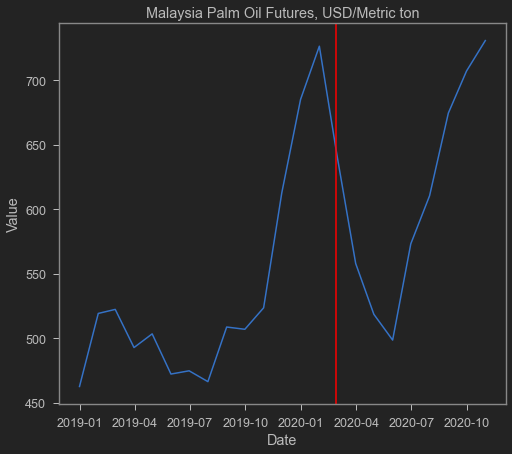
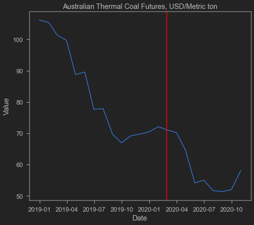
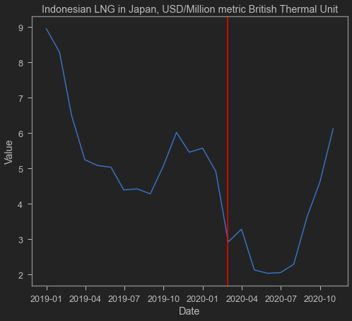
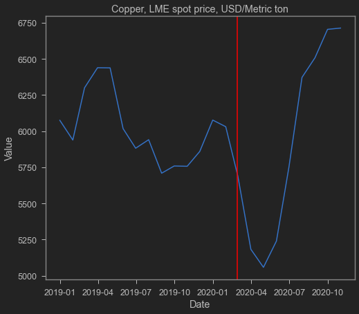
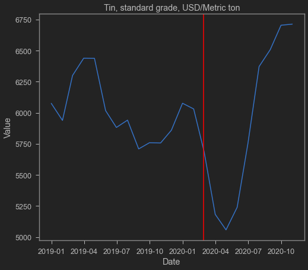
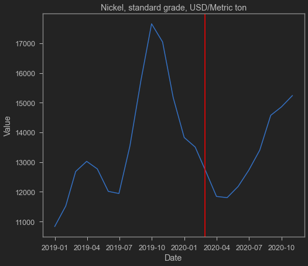

COVID-19 memang memukul ekspor impor yah. Namun beberapa bulan belakangan sepertinya neraca perdagangan Indonesia makin menunjukkan tanda-tanda surplus. Saya sering cerita bahwa manufaktur Indonesia banyak yang terhubung dengan Global Value Chain (GVC) sehingga [impor diperlukan untuk produksi dan melakukan ekspor](https://krisna.netlify.app/post/imporinput/). Tentu saja di tengah terjadinya COVID-19, produksi sepertinya agak terhambat dan impor Indonesia akan produk setengah jadi dan kapital sepertinya mengalami penurunan. Pemerintah juga gak suka dengan impor, apalagi impor kapital yang mahal-mahal dan menggerus mata uang rupiah.

Nah, kalau maunya ekspor doang dan gak suka impor banyak-banyak, ya paling bener sih pake ekspor komoditas. Batubara, CPO dan barang tambang lainnya ini tinggal ekspor aja, ga perlu produksi yang susah-susah dan ga perlu nilai tambah apapun dari impor. Indonesia emang sangat kaya dan seringkali tergantung dengan impor komoditas, mulai dai minyak bumi, lalu batubara dan mineral lainnya, sampai sekarang-sekarang ini adalah CPO.

Seiring dengan recovery tiongkok dan masih tingginya _support_ yang dialirkan oleh pemerintah negara barat seperti USA dan EU, permintaan akan barang-barang ini makin membaik saja. Hal ini terefleksi oleh mulai meningkatnya harga-harga barang di pasar komoditas. Berikut ini beberapa visualisasi harga barang andalan Indonesia disadur dari IMF.

Garis merah vertikal menunjukkan akhir Februari 2020 / awal Maret 2020 ketika COVID-19 pertama kali terdeteksi di Indonesia.

Oh ya, satu catatan penting mengenai batubara, trennya memang mengalami penurunan terus baru-baru ini. Hal ini seiring dengan makin menjauhnya dunia dari batubara karena sedang mengincar energi terbarukan. Ditambah RRT yang ikut-ikutan mau bikin plan menuju dekarbonisasi, sepertinya mengandalkan batubara bisa jadi tidak _sustainable_ ke depannya dan Indonesia harus mulai mencari cara baru untuk mendapatkan current account yang stabil ke depannya.

Lain kali saya akan update dengan ekspornya juga deh, tidak hanya harga. Sekarang segini dulu.

    <matplotlib.lines.Line2D at 0x1fcd1b7c610>

    <matplotlib.lines.Line2D at 0x1fcd1c6c3d0>

    <matplotlib.lines.Line2D at 0x1fcd1bf0580>

    <matplotlib.lines.Line2D at 0x1fcd1e74100>

    <matplotlib.lines.Line2D at 0x1fcd1d56430>

    <matplotlib.lines.Line2D at 0x1fcd1db49d0>

