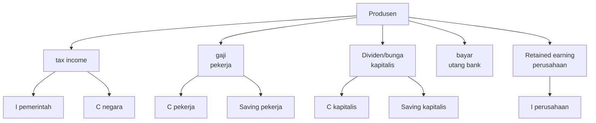
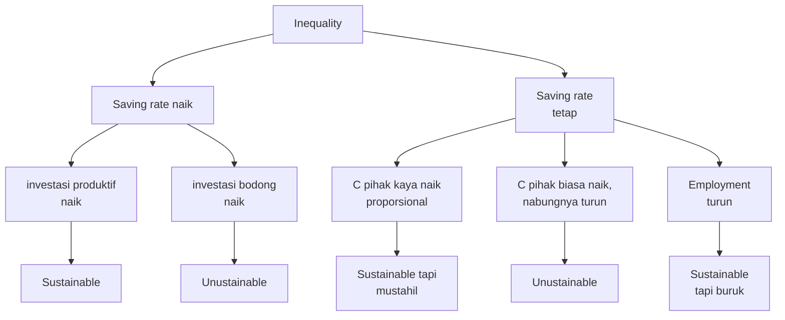

Saya belum lama ini menyelesaikan buku Michael Pettis yang berjudul "The Great Rebalancing: Trade, Conflict, and the Perilous Road Ahead for the World Economy". Buku ini membahas tentang ketidakseimbangan ekonomi global yang disebabkan oleh perbedaan tingkat tabungan dan konsumsi antara negara-negara maju dan berkembang. Pettis berargumen bahwa ketidakseimbangan ini dapat menyebabkan krisis ekonomi global jika tidak ditangani dengan baik.

Saya acapkali menggunakan argumen ini ketika membahas materi mengenai perdagangan internasional, misalnya di acara Lembaga Manajemen UI [beberapa waktu lalu](https://www.krisna.or.id/talk/global-macroeconomic-imbalance/).

Di postingan kali ini saya mau coba unpack sedikit mekanisme inequality, saving rate dan dampaknya ke ekonomi nasional (dan global, karena imbalance di 1 negara akan diimbangi imbalance di negara lain). Lalu saya akan bahas sedikit dengan kondisi di Indonesia.

## Inequality, saving rate, and aftermath

Nah, di buku tersebut, Pettis berargumen bahwa perubahan saving rate sangat dipengaruhi oleh tingkat ketimpangan pendapatan di suatu negara. Negara dengan ketimpangan pendapatan yang tinggi cenderung memiliki saving rate yang lebih tinggi, karena individu kaya cenderung menabung lebih banyak daripada individu miskin. Sebaliknya, negara dengan ketimpangan pendapatan yang rendah cenderung memiliki saving rate yang lebih rendah, karena individu miskin cenderung menghabiskan sebagian besar pendapatannya untuk konsumsi.

Dia ngecite kata-kata Fed Reserve Board Chairman Marriner Eccles:
> "A mass production has to be accompanied by mass consumption."

jika tambahan kekayaan yang diciptakan tidak didistribusi dengan baik, maka tambahan konsumsi yang tercipta akan lebih kecil dari tambahan kekayaant tersebut, ketimpangan meningkat disertai dengan meningkatnya saving rate. 

Nah menurut Pettis, proses ketimpangan ini tidak hanya dapat terjadi antar-individu (misalnya antara sesama pekerja atau sesama kapitalis), antar-kelas, tetapi juga dapat terjadi antar-economic agent. Maksudnya, ketimpangan (dan akibatnya saving rate) dapat tercipta jika perusahaan dan negara mengontrol pendapatan lebih banyak daripada masyarakat.

Kekayaan perusahaan agak beda dengan kekayaan masyarakat di kelas kapitalis[^1]. Kelas kapitalis hanya dapat uang dari perusahaan seandainya perusahaan tersebut membagi deviden, atau perusahaan tersebut membayar bunga utang (ke bond holder, atau ke bank, yang mana profitnya ditransfer ke pemilik bank dan masyarakat dalam bentuk bunga tabungan). Jika perusahaan menahan laba (retained earning), baik untuk tujuan dibiarin aja atau direinvest, maka itu jadi kekayaan perusahaan. Jadi, saving nasional juga ada saving perusahaan di baliknya. Dan Pettis berargumen, semakin besar retained earning perusahaan (tidak dibagi dalam bentuk bonus utk karyawan maupun deviden utk pemilik saham), maka semakin besar saving rate nasional[^2].

Kalo mau diilustrasikan, mungkin kurang lebih kayak gini. Pertama, kita anggap 1 bumi sebagai satu sistem ekonomi tertutup (kita belum bisa trade dengan Bulan atau Mars). 

$$
GDP = C + I
$$

semua hasil produksi hanya dapat menjadi konsumsi, sementara sisanya dijadikan investasi untuk hari esok. Maka C dan I dihitung dari:

di mana C total adalah C pekerja + C kapitalis + C negara, dan I total adalah saving pekerja + saving kapitalis + I perusahaan + I pemerintah.

Nah, menurut Pettis, ketimpangan akan mengakibatkan saving rate yang lebih tinggi vis-a-vis consumption rate. Ketika ketimpangan terjadi dari kenaikan retained earnings ketimbang gaji pekerja atau deviden kapitalis, maka otomatis total C akan turun karena reinvested earnings semuanya jadi I perusahaan[^3].

Tentunya kenaikan proporsi pemerintah juga bisa ditingkatkan dengan, misalnya, meningkatkan rasio pajak ataupun meningkatkan peran BUMN. abis gitu semuanya terserah pemerintah apakah mau naikin C (misalnya subsidi atau program simply running admin dgn bayar gaji pegawai) atau naikin I(misalnya bangun kereta cepat atau kota baru. misalnya lho ini).

Mari kita asumsikan tiba-tiba ada **transfer dari pihak biasa ke pihak kaya**, tanpa mempengaruhi PDB (ini asumsi yang kuat tapi kita tinggalin dulu untuk sementara). Pihak kaya ini bisa saja transfer dari orang miskin ke orang kaya, tapi juga bisa aja transfer dari masyarakat ke perusahaan atau ke negara.

Framework dari Pettis cukup sederhana. Dapat diilustrasikan dengan diagram berikut:

Meskipun diagram di atas keliatan kayak dikotomis, tapi sebenenrya bisa aja semua terjadi secaara proporsional.

Menurut Pettis, skenario dominan yang yang terjadi di Spanyol, Portugal, Italia, Yunani dan Amerika Serikat adalah skenario di mana konsumsi pihak biasa naik sementara saving rate mereka turun. Ini dapat terjadi dalam bentuk utang masyarakat yang naik untuk membiayai konsumsi sehari-hari, atau minimal masyakarat yang kesulitan nabung karena gajinya habis cuma untuk bertahan hidup. Alias, saving yang meningkat oleh pihak kaya (misalnya [tech companies di AS](https://www.economist.com/business/2017/06/03/tech-firms-hoard-huge-cash-piles)), "dikompensasi" oleh saving yang menurun dari pihak biasa. Nah, harga aset yang tinggi akibat investasi pihak kaya, bikin pihak biasa merasa kaya sehingga ketimpangan ini ga begitu berasa. Tapi ya harga aset emang bisa naik terus? wkwk.

Mana yang terjadi di Indonesia?

## Bagaimana dengan Indonesia?

Baru-baru ini pak Haryo juga [menmposting](https://x.com/Aswicahyono/status/1967069732009566245?s=20) angka GINI Indonesia. Makin besar angkanya berarti makin tinggi tingkat ketimpangan pendapatan di suatu negara.

<blockquote class="twitter-tweet">
Dari data SWIID (Standardized World Income Inequality Database) saya bandingkan Gini IDN vs 3 negara tetangga  Negara2 lain gini_disp (Gini setelah pajak, biru) lebih rendah dari gini-mkt (Gini sebelum pajak, merah). Tapi data IDN kebalik. Apa perpajakan di IDN ~&gt; REGRESIF? <a href="https://t.co/27CeKEot3l">https://t.co/27CeKEot3l</a> <a href="https://t.co/kNi71CFShk">pic.twitter.com/kNi71CFShk</a>
&mdash; Haryo Aswicahyono (@Aswicahyono) <a href="https://twitter.com/Aswicahyono/status/1967069732009566245?ref_src=twsrc%5Etfw">September 14, 2025</a></blockquote> 

Angka GINI indonesia meningkat cukup signifikan (terutama yang setelah transfer/pajak) di sekitar selepas tahun 2001. Di tahun segitu, Cina bergabung dengan WTO dan harga komoditas minerba dan minyak nabati meningkat tajam. Peningkatan harga komoditas ini lumayan berhenti/melandai setelah sekitar 2011an.

Saya ga terlalu kaget karena saya pernah ngecek soal saving rate di postingan saya [yang ini](https://www.krisna.or.id/post/consumption/). Saya mencoba melihat bagaimana dinamika inequality dan saving rate di Indonesia. Premisnya waktu itu saya cukup tertegun melihat net ekspor Indonesia yang naik ga kira-kira di 2022. Artinya eksternal saving kita naik cukup signifikan. Sayapun mulai ngoprek data BPS, Dan ya, saving rate HH 20% termiskin sampe negatif. saya juga menemukan penelitian Bank Dunia yang mendapati turunnya bagian pendapatan yang dinikmati kaum pekerja.

Clearly hal ini tampak tidak begitu baik, apalagi baru-baru ini banyak terjadi _discontent_ di kalangan masyarakat, yang semakin merasakan bahwa pertumbuhan ekonomi Indonesia tampak tidak dinikmati oleh banyak orang dengan lebih merata. Saya juga sempat mau nulis soal upaya pemerintah tentang  meningkatkan saving rate, salah satunya dengan mengubah BUMN dari kewajiba setor PNBP ke negara (yang dibelanjakan menjadi konsumsi, harusnya) jadi fresh funds untuk Danantara yang akan diinvestasikan. Pun dengan SAL yang makin tinggi, essentially mengurangi konsumsi pemerintah demi tabungan untuk injeksi sektor keuangan.

Well, at least semoga kenaikan saving rate ini menjadi investasi yang produktif dan bukan investasi bodong yah! demikian postingan kali ini semoga bermanfaat.

[^1]: Cara saya menggunakan definisi "kelas" sangat bebas nilai dan murni sesuai definisi aja. "kelas" yang saya maksud gini sebenernya engga bener-bener dikotomis. Karena kita, pekerja yang terima gaji, juga dapat memiliki kapital yang menghasilkan.

[^2]: ketimpangan pendapatan lewat kapital (bunga dan deviden) vs pendapatan lewat gaji disebut juga "compositional inequality", dibahas dengan cukup lengkap oleh [Branko Milanovic](https://branko2f7.substack.com/p/new-capitalism-ii-compositional-vs), penulis "Capitalism, Alone".

[^3]: Kenapa jadi I semua? Ya karena semua pendapatan yang tidak dikonsumsi akan jadi I. Tentu saja jika retained earningsnya dibiarin ngendap gitu aja di rekening, akan tetap dihitung sebagai I. Ini simply akunting aja.