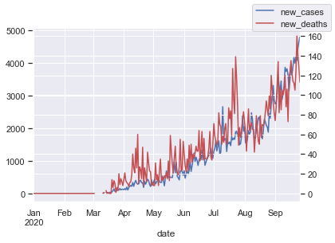
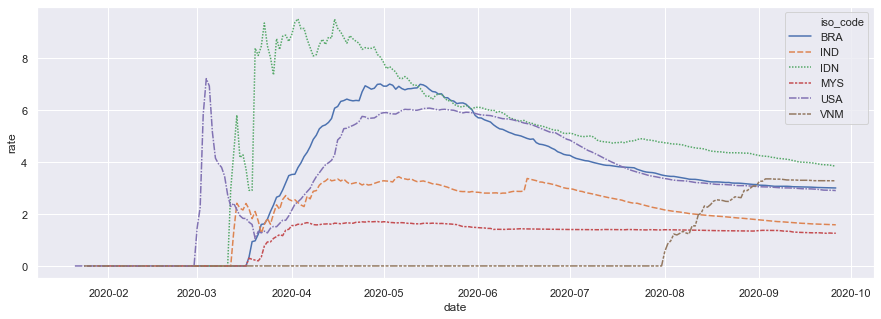

Pagi ini, seperti biasa, saya menyiapkan sarapan dan mencuci piring yang semalam saya tidak cuci sambil mendengarkan podcast. Salah satu podcast yang hari ini saya dengar adalah [Babbage](https://www.economist.com/podcasts/2020/09/23/the-pandemics-progress-what-is-the-next-stage-in-the-fight-against-covid-19) di google podcast. Salah satu yang bikin penasaran adalah penurunan tingkat kematian.

Seiring dengan meningkatnya jumlah kasus, wajarnya-nya tingkat kematian juga meningkat. Namun yang terjadi tidak seperti itu. Di Babbage, Bu [Slavea Chankova](https://mediadirectory.economist.com/people/slavea-chankova/), healthcare-correspondent The Economist, mengatakan bahwa para dokter telah berhasil mempelajari cara-cara yang lebih baik dalam menangani pasien COVID-19. Penggunaan ICU juga berhasil ditekan.

Beberapa sumber lain juga mengatakan hal serupa. Misalnya, sebuah postingan dari [The Conversation](https://theconversation.com/coronavirus-why-arent-death-rates-rising-with-case-numbers-145865) mengatakan bahwa seiring dengan meningkatnya proporsi usia muda diantara penderita COVID-19, tingkat kematian akan menurun karena memang virus ini lebih fatal terhadap orang berusia lanjut. Tentu saja seiring meningkatnya kapasitas tes, kita semakin banyak mendapatkan orang-orang tanpa gejala (OTG) yang tidak memerlukan perawatan apapun. Sampel yang besar akan semakin representatif dan tingkat kematian akan 'converge' ke tingkat kematian yang sebenarnya.

## Bagaimana dengan Indonesia?
Postingan dari [The Conversation](https://theconversation.com/coronavirus-why-arent-death-rates-rising-with-case-numbers-145865) tersebut menunjukkan bahwa di Inggris Raya, tingkat kematian baru yang stagnan, meskipun kasus baru masih meningkat.


Di Indonesia sendiri, sepertinya tingkat kematian baru masih meningkat seiring dengan bertambahnya kasus. Saya mencoba mengilustrasikan ini menggunakan data dari [Our World in Data](https://ourworldindata.org/coronavirus)


```python
import pandas as pd
import seaborn as sns; sns.set()
import matplotlib.pyplot as plt
c=pd.read_csv("https://raw.githubusercontent.com/owid/covid-19-data/master/public/data/owid-covid-data.csv")
c['date']=pd.to_datetime(c['date'])
```


```python
y1=c['new_cases'][c['iso_code']=='IDN']
y2=c['new_deaths'][c['iso_code']=='IDN']
x=c['date'][c['iso_code']=='IDN']
df=pd.DataFrame({'date':x,'new_cases':y1,'new_deaths':y2})
plt.figure(figsize=(15,5))
ax = df.plot(x='date', y='new_cases', legend=False)
ax2 = ax.twinx()
df.plot(x='date', y='new_deaths', ax=ax2, legend=False, color="r")
ax.figure.legend()
plt.show()

#nt=sns.load_dataset("c")
#sns.lineplot(x=x, y=y, data=c)
# sns.lineplot(x=x, y=y4, data=c)
```


    <Figure size 1080x360 with 0 Axes>





Gambar di atas menunjukkan bahwa jumlah kematian baru di Indonesia per hari masih meningkat tajam seiring dengan masih meningkatnya jumlah kasus baru. Indonesia sendiri masih mengalami tingkat kasus baru yang naik secara eksponensial. Di saat negara lain mengalami gelombang kedua, Indonesia sepertinya masih belum melewati gelombang pertama seiring pertambahan kasus yang masih [belum melambat sama sekali](https://tirto.id/update-corona-indonesia-24-september-angka-kematian-capai-10-ribu-f48j). Meskipun telah berhasil meningkatkan kapasitas tes secara signifikan, pemerintah masih mendapatkan kritikan soal [ masih belum cukupnya kapasitas tes di Indonesia saat ini](https://theconversation.com/3-overlooked-facts-behind-indonesias-high-covid-19-death-rate-135223). 

## Tingkat Kematian Telah Berkurang

Tingkat kematian sendiri di Indonesia sebenarnya telah berkurang. Harian [The Jakarta Post](https://www.thejakartapost.com/news/2020/08/05/indonesias-covid-19-mortality-rate-still-tops-global-average-task-force.html), mengutip jubir Wiku Adisasmito, melaporkan bahwa rasio kematian di Indonesia berkurang terus sejak bulan April, meskipun saat ini masih di atas rata-rata dunia. Ini bisa jadi merupakan kabar baik, meskipun di Indonesia saat ini sedang ramai [polemik pengubahan definisi kematian akibat COVID-19](https://katadata.co.id/pingitaria/berita/5f6b179d9567c/polemik-usulan-perubahan-definisi-angka-kematian-covid-19).

Memang tingkat kematian Indonesia, dengan menggunakan definisi jumlah total kematian per total kasus, terus menurun sejak bulan April 2020. Namun demikian, Indonesia konsistem memiliki tingkat kematian yang lebih tinggi dibandingkan dengan negara lain yang juga mengalami kritik tajam dari warganya soal penanganan COVID-19, seperti Brazil, India, dan Amerika Serikat. Ilustrasi di bawah menggunakan data dari [Our World in Data](https://ourworldindata.org/coronavirus).


```python
cn=c[(c['iso_code'] == 'IDN') | (c['iso_code'] == 'IND') | (c['iso_code'] == 'BRA')  | (c['iso_code'] == 'USA') | (c['iso_code'] == 'VNM') | (c['iso_code'] == 'MYS')]
cn['rate']=cn['total_deaths']/cn['total_cases']*100
plt.figure(figsize=(15,5))
#nt=sns.load_dataset("c")
#sns.lineplot(x=x, y=y, data=c)
sns.lineplot(x="date", y="rate", hue="iso_code", style="iso_code",data=cn)
```


Ini di UK

Kecuali Vietnam, tingkat total kematian per total kasus di negara-negara yang saya pilih di atas sepertinya memiliki pola serupa. Demikian, penyebabnya pun mungkin serupa. Para dokter telah memahami cara-cara terbaik dalam menangani pasien COVID-19, setelah mengalami pandemi berjalan lebih dari 6 bulan. Di samping itu, seiring dengan meningkatnya kapasistas tes, tingkat kematian di seluruh dunia akan mengalami konvergensi ke arah yang lebih representatif. Orang muda yang masih memiliki mobilitas tinggi tentu saja akan memiliki kemungkinan terjangkit virus yang lebih tinggi, dan kasus-kasus orang muda ini akan menurunkan tingkat kematian total.

## Berarti semua akan baik-baik saja?
Sepertinya belum tentu. Di Indonesia sendiri saat ini telah ramai soal [kapasitas rumah sakit yang semakin terbatas seiring dengan meningkatnya jumlah kasus](https://katadata.co.id/ekarina/berita/5f5f0c5f3618e/kapasitas-rumah-sakit-hampir-penuh-dokter-dukung-psbb-jakarta). Jumlah tenaga kesehatan tidak dapat ditingkatkan dengan cepat, bahkan cenderung berkurang sampai [beberapa rumah sakit sempat tutup](https://www.kompas.com/tren/read/2020/08/13/080500665/berikut-4-rs-yang-sempat-ditutup-karena-tenaga-medisnya-terpapar-covid-19?page=all). Hal ini tentu sangat berbahaya dan penanganan medis yang berkurang efektivitasnya akan kembali meningkatkan rasio kematian.

Indonesia sendiri masih memiliki tingkat kasus baru yang terus meningkat. Tingkat kematian, meskipun secara proporsi mungkin berkurang, masih terus meningkat. Sementara itu, sumber daya penting tidak dapat ditingkatkan dengan rasio yang sama dengan penyebaran virus yang masih sangat cepat.

Tentu saja ada dua solusi yang mungkin, yaitu antara mengurangi laju persebaran, dengan meningkatkan kapasitas sumber daya kesehatan seperti rumah sakit dan tenaga kesehatan. Mana yang lebih mudah dilakukan?

Baru-baru ini, hal lain yang bikin geger di Indonesia adalah mundurnya [Profesor Akmal Taher dari satgas COVID-19](https://www.thejakartapost.com/news/2020/09/25/top-indonesian-doctor-quits-covid-19-task-force.html). Alasan yang dikemukakan, salah satunya, adalah karena *testing* dan *tracing* belum optimal dilakukan oleh institusi di Indonesia. Beliau merasa bahwa keinginannya untuk meningkatkan *testing* dan *tracing* dapat dilakukannya di tempat lain. 

Alasannya lumayan mengejutkan. Bicara sumber daya dan otoritas, mana ada institusi yang lebih baik daripada satgas COVID-19? Apakah ini artinya satgas COVID-19 lebih mementingkan intervensi satunya lagi, yaitu penguatan infrastruktur rumah sakit? Apakah memang mendirikan RS baru, membeli *bed* baru dan merekrut dokter dan perawat baru lebih mudah? Sesulit itukah melakukan *test & trace* di Indonesia?

Saya tidak terlalu memahami permasalahan perCOVID-19an di Indonesia sih memang. Akhirnya, tulisan ini malah melahirkan lebih banyak pertanyaan daripada jawaban. Kalau menurut anda, bagaimana?