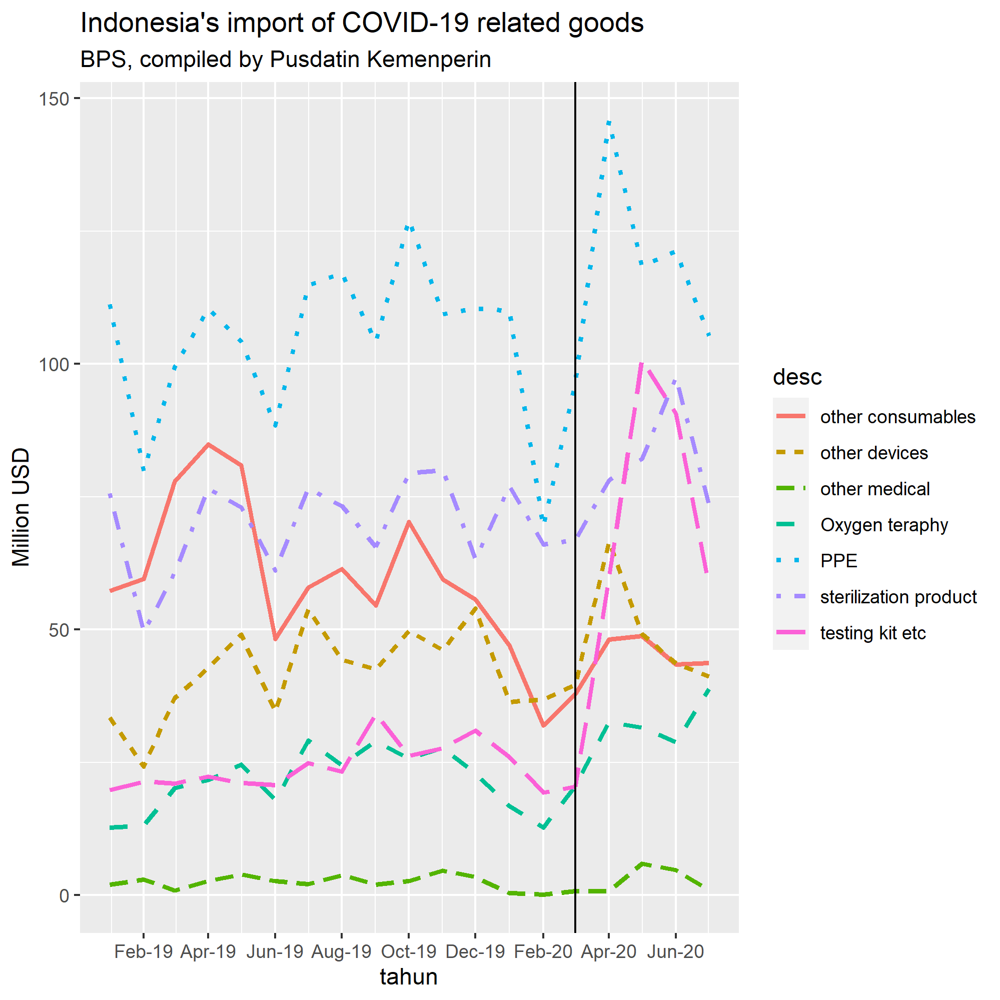

Postingan ini adalah *update* ekspor dan impor barang-barang terkait COVID-19 di Indonesia. Saya sempat [presentasi tentang kebijakan perdagangan Indonesia di awal COVID-19](https://krisna.netlify.app/talk/ip/) di acara global seminar ANU Indonesia Project.  Saya menggunakan data ekspor impor bulanan sampai bulan Maret dengan klasifikasi WHO/WCO revisi 2.

Kali ini, saya punya data sampai bulan Juli 2020, dan menggunakan klasifikasi WCO/WHO terbaru, yaitu [revisi tiga](http://www.wcoomd.org/-/media/wco/public/global/pdf/topics/nomenclature/covid_19/hs-classification-reference_edition-3_en.pdf?la=en). Ilustrasi menggunakan r. 

# Dinamika Ekspor nampak mirip dengan tahun lalu.

Mari kita lihat grafik impor.

``` r
# Loading and cleaning the data
library(tidyverse)
library(lubridate)

expor<-read.csv('Book1.csv') # read the data
a<-colnames(expor)           # add column names to a for easy rename
expor<-expor %>%             # rename variable names
  rename(hs=a[1],deskripsi=a[2],tujuan=a[3],periode=a[4],kg=a[5],usd=a[6])

# make periode into time series
expor$periode<-as.Date(paste0(as.character(expor$periode), '01'),format='%Y%m%d')

# Make aggregation to all countries
exporall<-expor %>% group_by(hs,periode) %>% summarise((expor=sum(usd)))
a<-colnames(exporall)
exporall<-exporall %>% rename(usd=a[3])

# Make aggregation on WCO goods classification
wco<-read.csv('wco.csv') # adding wco classification
wco<-wco %>% distinct(hshs, .keep_all = TRUE) # drop duplicates
wco$hshs<-as.character(wco$hshs) #make hshs a string so i can join them
exporall$hshs<-substr(as.character(exporall$hs),start=1,stop=6) # taking the first 6 digits
final<-inner_join(exporall,wco,by="hshs")
finall<-final %>% group_by(desc,periode) %>% summarise(expor=sum(usd))
a<-colnames(finall)
finall<-finall %>% rename(usd=a[3])
finall$usd6<-finall$usd/1000000

# plot
ggplot(finall,aes(x=periode,y=usd6, color=desc)) +
  geom_line(aes(linetype=desc),size=1.1) +
  scale_x_date(date_labels="%b-%y",date_breaks = "2 month")+
  # theme_ipsum() +
  # theme(axis.text.x=element_text(angle=60, hjust=1)) +
  geom_vline(xintercept=as.Date('20200301',format='%Y%m%d')) +
  labs(x='tahun',y="Million USD",title="Indonesia's export of COVID-19 related goods",subtitle="BPS,Compiled by Pusdatin Kemenperin")
```

<!-- -->

Selain Alat Pelindung Diri (APD), Indonesia menjual banyak perlengkapan kesehatan ke dunia. Penjualan APD di bulan Februari meningkat pesat berkat tingginya permintaan secara mendadak dari Cina dan Singapura, dua negara yang paling duluan mengalami pandemi ini. Di bulan Maret, Indonesia memberlakukan [larangan export untuk APD, masker](https://www.eastasiaforum.org/2020/06/16/indonesias-ppe-export-ban-backfires/) dan lain sebagainya, namun secara umum level ekspor APD tidak mengalami banyak perubahan.

Memang ekspor APD memiliki rantai pasoknya sendiri yang bisa berbahaya jika diinterupsi. Saya pernah mengatakan bahwa Indonesia punya potensi menjadi salah satu pemasok besar di pasar global APD. Sayangnya sepertinya ini tidak terjadi.

Ekspor Indonesia umumnya menurun di bulan Ramadhan. Kebijakan perdagangan Indonesia terkait COVID-19 banyak yang kedaluarsa di akhir bulan Juli 2020. Mungkin menarik melihat data setelah bulan Juli.

# Impor testing kit sangat tinggi

Kali ini kita membicarakan impor.



 Impor memiliki peran yang sangat penting di bidang kesehatan di Indonesia bahkan sebelum COVID-19. Memang Indonesia merupakan salah satu eksportir APD yang penting, tetapi impor APD pun tetap tinggi terutama karena ada APD seperti masker yang merupakan produk intensif kapital.

 Kasus pertama di Indonesia terdeteksi di awal Maret. Impor tiba-tiba meroket setelah bulan Maret, utamanya APD dan *testing kits*. Trennya melemah di bulan Mei (apakah karena libur lebaran?) kecuali testing kits. Yang menarik, pada bulan Juli level impor sebagian besar barang-barang ini berkurang banyak. Menarik untuk dilihat apakah ini akibat peningkatan produksi domestik. Gara-gara rantai pasok global, kita perlu melihat data impor bahan baku dari barang-barang ini. Sayangnya saya tidak memahami pohon industri sektor kesehatan. Selain itu, angka produksi nasional juga sepertinya tidak mudah untuk dicari.

 Perdagangan internasional telah terbukti berhasil mengangkat banyak negara dari kemiskinan, menumbuhkan ekonomi, dan meningkatkan pendapatan masyarakat. Sayangnya sepertinya banyak negara (termasuk Indonesia) malah jadi anti terhadap perdagangan ketika pandemik, justru saat-saat di mana kita butuh-butuhnya meningkatkan *supply* barang-barang terkait COVID-19 ini. Mudah-mudahan ini bukan langkah yang salah.

 # Klasifikasi WHO/WCO

<table class=" lightable-material lightable-striped lightable-hover" style='font-family: "Source Sans Pro", helvetica, sans-serif; margin-left: auto; margin-right: auto;'>

<thead>

<tr>

<th style="text-align:right;">

section

</th>

<th style="text-align:left;">

desc

</th>

<th style="text-align:right;">

hs

</th>

<th style="text-align:left;">

deskripsi

</th>

</tr>

</thead>

<tbody>

<tr>

<td style="text-align:right;">

1

</td>

<td style="text-align:left;">

testing kit etc

</td>

<td style="text-align:right;">

38220010

</td>

<td style="text-align:left;">

Plates, sheets, film, foil & strip of plastics impregnated or coated
with diagnostic reagents or laboratory

</td>

</tr>

<tr>

<td style="text-align:right;">

1

</td>

<td style="text-align:left;">

testing kit etc

</td>

<td style="text-align:right;">

38220020

</td>

<td style="text-align:left;">

Paperboard, cellulose wadding & web of cellulose fibres impregnated or
coated with diagnostic reagents or laboratory

</td>

</tr>

<tr>

<td style="text-align:right;">

1

</td>

<td style="text-align:left;">

testing kit etc

</td>

<td style="text-align:right;">

38220030

</td>

<td style="text-align:left;">

Sterilisation indicator strips & tapes

</td>

</tr>

<tr>

<td style="text-align:right;">

1

</td>

<td style="text-align:left;">

testing kit etc

</td>

<td style="text-align:right;">

38220090

</td>

<td style="text-align:left;">

Diagnostic/laboratory reagents on a backing prepared
diagnostic/laboratory reagents Oth than HS 3822.00.10 - 3822.00.30

</td>

</tr>

<tr>

<td style="text-align:right;">

1

</td>

<td style="text-align:left;">

testing kit etc

</td>

<td style="text-align:right;">

30021500

</td>

<td style="text-align:left;">

Oth blood fractions, whet/not modified/obtain by biotechnological
process,put up in measured doses

</td>

</tr>

<tr>

<td style="text-align:right;">

1

</td>

<td style="text-align:left;">

testing kit etc

</td>

<td style="text-align:right;">

90278010

</td>

<td style="text-align:left;">

Oth instruments\&apparatus,exposure meters

</td>

</tr>

<tr>

<td style="text-align:right;">

1

</td>

<td style="text-align:left;">

testing kit etc

</td>

<td style="text-align:right;">

90278030

</td>

<td style="text-align:left;">

Oth instruments\&apparatus oth exposure meters,electricallyoperated

</td>

</tr>

<tr>

<td style="text-align:right;">

1

</td>

<td style="text-align:left;">

testing kit etc

</td>

<td style="text-align:right;">

90278040

</td>

<td style="text-align:left;">

Oth instruments\&apparatus oth exposure meters,not electrically operated

</td>

</tr>

<tr>

<td style="text-align:right;">

1

</td>

<td style="text-align:left;">

testing kit etc

</td>

<td style="text-align:right;">

38210010

</td>

<td style="text-align:left;">

Prepared culture media for the development of microorganisms

</td>

</tr>

<tr>

<td style="text-align:right;">

1

</td>

<td style="text-align:left;">

testing kit etc

</td>

<td style="text-align:right;">

38210090

</td>

<td style="text-align:left;">

Other than prepared culture media for the development of microorganisms

</td>

</tr>

<tr>

<td style="text-align:right;">

2

</td>

<td style="text-align:left;">

PPE

</td>

<td style="text-align:right;">

48189000

</td>

<td style="text-align:left;">

Cellulose wadding or webs of cellulose fibres, oth thn hs code
4818.10.00 - 4818.50.00

</td>

</tr>

<tr>

<td style="text-align:right;">

2

</td>

<td style="text-align:left;">

PPE

</td>

<td style="text-align:right;">

63079030

</td>

<td style="text-align:left;">

Umbrella covers in pre-cut triangular form

</td>

</tr>

<tr>

<td style="text-align:right;">

2

</td>

<td style="text-align:left;">

PPE

</td>

<td style="text-align:right;">

63079040

</td>

<td style="text-align:left;">

Surgical masks

</td>

</tr>

<tr>

<td style="text-align:right;">

2

</td>

<td style="text-align:left;">

PPE

</td>

<td style="text-align:right;">

63079061

</td>

<td style="text-align:left;">

Safety harnesses safety suitable for industrial use

</td>

</tr>

<tr>

<td style="text-align:right;">

2

</td>

<td style="text-align:left;">

PPE

</td>

<td style="text-align:right;">

63079069

</td>

<td style="text-align:left;">

Safety harnesses suitable not for industrial use

</td>

</tr>

<tr>

<td style="text-align:right;">

2

</td>

<td style="text-align:left;">

PPE

</td>

<td style="text-align:right;">

63079070

</td>

<td style="text-align:left;">

Fans and handscreens

</td>

</tr>

<tr>

<td style="text-align:right;">

2

</td>

<td style="text-align:left;">

PPE

</td>

<td style="text-align:right;">

63079080

</td>

<td style="text-align:left;">

Laces for shoes,boots,corsets & the like

</td>

</tr>

<tr>

<td style="text-align:right;">

2

</td>

<td style="text-align:left;">

PPE

</td>

<td style="text-align:right;">

63079090

</td>

<td style="text-align:left;">

Oth made up articls excl umbrella covers/surgical masks/safety
harnesses/fans\&handscreens/laces shoes,boots,corsets

</td>

</tr>

<tr>

<td style="text-align:right;">

2

</td>

<td style="text-align:left;">

PPE

</td>

<td style="text-align:right;">

90200000

</td>

<td style="text-align:left;">

Breathing appliances\&gas masks,excl protective masks having neither
mechanical part nor replaceable filters

</td>

</tr>

<tr>

<td style="text-align:right;">

2

</td>

<td style="text-align:left;">

PPE

</td>

<td style="text-align:right;">

90049010

</td>

<td style="text-align:left;">

Corrective spectacles

</td>

</tr>

<tr>

<td style="text-align:right;">

2

</td>

<td style="text-align:left;">

PPE

</td>

<td style="text-align:right;">

90049050

</td>

<td style="text-align:left;">

Protective goggles

</td>

</tr>

<tr>

<td style="text-align:right;">

2

</td>

<td style="text-align:left;">

PPE

</td>

<td style="text-align:right;">

90049090

</td>

<td style="text-align:left;">

Spectacles & the like excl corrective, protective googles

</td>

</tr>

<tr>

<td style="text-align:right;">

2

</td>

<td style="text-align:left;">

PPE

</td>

<td style="text-align:right;">

39269010

</td>

<td style="text-align:left;">

Floats for fishing nets

</td>

</tr>

<tr>

<td style="text-align:right;">

2

</td>

<td style="text-align:left;">

PPE

</td>

<td style="text-align:right;">

39269020

</td>

<td style="text-align:left;">

Fans and handscreens, frames and handles therefor, and parts thereof

</td>

</tr>

<tr>

<td style="text-align:right;">

2

</td>

<td style="text-align:left;">

PPE

</td>

<td style="text-align:right;">

39269032

</td>

<td style="text-align:left;">

Plastic moulds with denture imprints

</td>

</tr>

<tr>

<td style="text-align:right;">

2

</td>

<td style="text-align:left;">

PPE

</td>

<td style="text-align:right;">

39269039

</td>

<td style="text-align:left;">

Hygienic, medical and surgical articles oth plastic moulds with denture
imprints

</td>

</tr>

<tr>

<td style="text-align:right;">

2

</td>

<td style="text-align:left;">

PPE

</td>

<td style="text-align:right;">

39269041

</td>

<td style="text-align:left;">

Police shields

</td>

</tr>

<tr>

<td style="text-align:right;">

2

</td>

<td style="text-align:left;">

PPE

</td>

<td style="text-align:right;">

39269042

</td>

<td style="text-align:left;">

Protective masks for use in welding and similar work

</td>

</tr>

<tr>

<td style="text-align:right;">

2

</td>

<td style="text-align:left;">

PPE

</td>

<td style="text-align:right;">

39269044

</td>

<td style="text-align:left;">

Life saving cushions for the protection of persons falling from heights

</td>

</tr>

<tr>

<td style="text-align:right;">

2

</td>

<td style="text-align:left;">

PPE

</td>

<td style="text-align:right;">

39269049

</td>

<td style="text-align:left;">

Other safety and protective devices

</td>

</tr>

<tr>

<td style="text-align:right;">

2

</td>

<td style="text-align:left;">

PPE

</td>

<td style="text-align:right;">

39269053

</td>

<td style="text-align:left;">

Transmission or conveyor belts or belting

</td>

</tr>

<tr>

<td style="text-align:right;">

2

</td>

<td style="text-align:left;">

PPE

</td>

<td style="text-align:right;">

39269055

</td>

<td style="text-align:left;">

Plastic J-hooks or bunch blocks for detonators

</td>

</tr>

<tr>

<td style="text-align:right;">

2

</td>

<td style="text-align:left;">

PPE

</td>

<td style="text-align:right;">

39269059

</td>

<td style="text-align:left;">

Other articles for industrial uses

</td>

</tr>

<tr>

<td style="text-align:right;">

2

</td>

<td style="text-align:left;">

PPE

</td>

<td style="text-align:right;">

39269060

</td>

<td style="text-align:left;">

Point of poultry feeders

</td>

</tr>

<tr>

<td style="text-align:right;">

2

</td>

<td style="text-align:left;">

PPE

</td>

<td style="text-align:right;">

39269070

</td>

<td style="text-align:left;">

Padding for articles of apparel or clothing accessories

</td>

</tr>

<tr>

<td style="text-align:right;">

2

</td>

<td style="text-align:left;">

PPE

</td>

<td style="text-align:right;">

39269081

</td>

<td style="text-align:left;">

Cards for shoe lasts

</td>

</tr>

<tr>

<td style="text-align:right;">

2

</td>

<td style="text-align:left;">

PPE

</td>

<td style="text-align:right;">

39269082

</td>

<td style="text-align:left;">

Cards for prayer beads

</td>

</tr>

<tr>

<td style="text-align:right;">

2

</td>

<td style="text-align:left;">

PPE

</td>

<td style="text-align:right;">

39269089

</td>

<td style="text-align:left;">

Cards for jewellery or other small objects of personal adornment

</td>

</tr>

<tr>

<td style="text-align:right;">

2

</td>

<td style="text-align:left;">

PPE

</td>

<td style="text-align:right;">

39269091

</td>

<td style="text-align:left;">

Point of a kind used for grain storage

</td>

</tr>

<tr>

<td style="text-align:right;">

2

</td>

<td style="text-align:left;">

PPE

</td>

<td style="text-align:right;">

39269092

</td>

<td style="text-align:left;">

Empty capsules of a kind suitable for pharmaceutical use

</td>

</tr>

<tr>

<td style="text-align:right;">

2

</td>

<td style="text-align:left;">

PPE

</td>

<td style="text-align:right;">

39269099

</td>

<td style="text-align:left;">

Other articles of plastics & other materials of headings 39.01 to 39.14.
oth than 3926.10.00-3926.90.92

</td>

</tr>

<tr>

<td style="text-align:right;">

2

</td>

<td style="text-align:left;">

PPE

</td>

<td style="text-align:right;">

40151100

</td>

<td style="text-align:left;">

Gloves, mittens and mitts for surgical, of vulcanised rubber other than
hard rubber

</td>

</tr>

<tr>

<td style="text-align:right;">

2

</td>

<td style="text-align:left;">

PPE

</td>

<td style="text-align:right;">

40151900

</td>

<td style="text-align:left;">

Gloves, mittens and mitts for not surgical, of vulcanised rubber other
than hard rubber

</td>

</tr>

<tr>

<td style="text-align:right;">

2

</td>

<td style="text-align:left;">

PPE

</td>

<td style="text-align:right;">

61161010

</td>

<td style="text-align:left;">

Divers’ gloves,knitted or crocheted, Impregnated,coated or covered with
plastics or rubber

</td>

</tr>

<tr>

<td style="text-align:right;">

2

</td>

<td style="text-align:left;">

PPE

</td>

<td style="text-align:right;">

61161090

</td>

<td style="text-align:left;">

Other gloves, mittens and mitts, knitted or crocheted,impregnated,
coated or covered with plastics or rubber

</td>

</tr>

<tr>

<td style="text-align:right;">

2

</td>

<td style="text-align:left;">

PPE

</td>

<td style="text-align:right;">

62160010

</td>

<td style="text-align:left;">

Protective work gloves, mittens and mitts

</td>

</tr>

<tr>

<td style="text-align:right;">

2

</td>

<td style="text-align:left;">

PPE

</td>

<td style="text-align:right;">

62160091

</td>

<td style="text-align:left;">

Other gloves, mittens and mitts,of wool or fine animal hair

</td>

</tr>

<tr>

<td style="text-align:right;">

2

</td>

<td style="text-align:left;">

PPE

</td>

<td style="text-align:right;">

62160092

</td>

<td style="text-align:left;">

Other gloves, mittens and mitts,of cotton

</td>

</tr>

<tr>

<td style="text-align:right;">

2

</td>

<td style="text-align:left;">

PPE

</td>

<td style="text-align:right;">

62160099

</td>

<td style="text-align:left;">

Other gloves, mittens and mitts,of oth textile material excwool or fine
animal hair or cotton

</td>

</tr>

<tr>

<td style="text-align:right;">

2

</td>

<td style="text-align:left;">

PPE

</td>

<td style="text-align:right;">

65050010

</td>

<td style="text-align:left;">

Hats & oth headgear of a kind used for religious
purposes,knitted/crocheted

</td>

</tr>

<tr>

<td style="text-align:right;">

2

</td>

<td style="text-align:left;">

PPE

</td>

<td style="text-align:right;">

65050020

</td>

<td style="text-align:left;">

Hair-nets of any materials

</td>

</tr>

<tr>

<td style="text-align:right;">

2

</td>

<td style="text-align:left;">

PPE

</td>

<td style="text-align:right;">

65050090

</td>

<td style="text-align:left;">

Oth hats\&oth headgear,not for hair-nets/religious
purposes,knitted/crochet

</td>

</tr>

<tr>

<td style="text-align:right;">

2

</td>

<td style="text-align:left;">

PPE

</td>

<td style="text-align:right;">

62114210

</td>

<td style="text-align:left;">

Garments for fencing or wrestling,of cotton,women’s/girl’s

</td>

</tr>

<tr>

<td style="text-align:right;">

2

</td>

<td style="text-align:left;">

PPE

</td>

<td style="text-align:right;">

62114220

</td>

<td style="text-align:left;">

Prayer cloaks, of cotton, women’s or girl’s

</td>

</tr>

<tr>

<td style="text-align:right;">

2

</td>

<td style="text-align:left;">

PPE

</td>

<td style="text-align:right;">

62114290

</td>

<td style="text-align:left;">

Other garments exc for fencing/wrestling/prayer cloaks, ofcotton,
women’s or girl’s

</td>

</tr>

<tr>

<td style="text-align:right;">

2

</td>

<td style="text-align:left;">

PPE

</td>

<td style="text-align:right;">

40159010

</td>

<td style="text-align:left;">

Lead aprons, of vulcanised rubber other than hard rubber

</td>

</tr>

<tr>

<td style="text-align:right;">

2

</td>

<td style="text-align:left;">

PPE

</td>

<td style="text-align:right;">

40159020

</td>

<td style="text-align:left;">

Divers’ suits (wet suits), of vulcanised rubber other than hard rubber

</td>

</tr>

<tr>

<td style="text-align:right;">

2

</td>

<td style="text-align:left;">

PPE

</td>

<td style="text-align:right;">

40159090

</td>

<td style="text-align:left;">

Articles apparel\&clothing accessories,oth thn 40151100-40159020 for all
purposes, vulcanised rubber oth thn hard rubber

</td>

</tr>

<tr>

<td style="text-align:right;">

2

</td>

<td style="text-align:left;">

PPE

</td>

<td style="text-align:right;">

48185000

</td>

<td style="text-align:left;">

Articles of apparel and clothing accessories

</td>

</tr>

<tr>

<td style="text-align:right;">

2

</td>

<td style="text-align:left;">

PPE

</td>

<td style="text-align:right;">

62101011

</td>

<td style="text-align:left;">

Garments used for protection from chemical substances, radiation or
fire, of fabrics of heading 56.02 or 56.03

</td>

</tr>

<tr>

<td style="text-align:right;">

2

</td>

<td style="text-align:left;">

PPE

</td>

<td style="text-align:right;">

62101019

</td>

<td style="text-align:left;">

Other protective work garment (exc used for protection fromchemical
substance,radiation/fire),of fabric head 5602/5603

</td>

</tr>

<tr>

<td style="text-align:right;">

2

</td>

<td style="text-align:left;">

PPE

</td>

<td style="text-align:right;">

62101090

</td>

<td style="text-align:left;">

Garments of fabrics of heading 56.02 or 56.03, other than protective
work garments

</td>

</tr>

<tr>

<td style="text-align:right;">

2

</td>

<td style="text-align:left;">

PPE

</td>

<td style="text-align:right;">

62104010

</td>

<td style="text-align:left;">

Men’s or boys’ garments, used for protection from fire

</td>

</tr>

<tr>

<td style="text-align:right;">

2

</td>

<td style="text-align:left;">

PPE

</td>

<td style="text-align:right;">

62104020

</td>

<td style="text-align:left;">

Men’s or boys’ garments, used for protection from chemicalsubstances
or radiation

</td>

</tr>

<tr>

<td style="text-align:right;">

2

</td>

<td style="text-align:left;">

PPE

</td>

<td style="text-align:right;">

62104090

</td>

<td style="text-align:left;">

Other men’s or boys’ protective work garments (exc used
forprotection from fire/chemical subtances/radiation)

</td>

</tr>

<tr>

<td style="text-align:right;">

2

</td>

<td style="text-align:left;">

PPE

</td>

<td style="text-align:right;">

62105010

</td>

<td style="text-align:left;">

Women’s or girls’ garments, used for protection from fire

</td>

</tr>

<tr>

<td style="text-align:right;">

2

</td>

<td style="text-align:left;">

PPE

</td>

<td style="text-align:right;">

62105090

</td>

<td style="text-align:left;">

Other women’s or girls’ protective work garments (exc usedfor protection
from fire/chemical subtances/radiation)

</td>

</tr>

<tr>

<td style="text-align:right;">

2

</td>

<td style="text-align:left;">

PPE

</td>

<td style="text-align:right;">

40169911

</td>

<td style="text-align:left;">

Parts\&access kind used for vehicles of Chapter 87 for vehicles of head
8702,8703, 8704 or 8705,oth thn weatherstripping

</td>

</tr>

<tr>

<td style="text-align:right;">

2

</td>

<td style="text-align:left;">

PPE

</td>

<td style="text-align:right;">

40169912

</td>

<td style="text-align:left;">

Parts and accessories of vulcanised rubber other than hard rubber, of a
kind used for vehicles of heading 87.11

</td>

</tr>

<tr>

<td style="text-align:right;">

2

</td>

<td style="text-align:left;">

PPE

</td>

<td style="text-align:right;">

40169913

</td>

<td style="text-align:left;">

Weatherstripping of vulcanised rubber oth thn hard rubber, of a kind
used on motor vehicles of heading 8702,8703 or 8704

</td>

</tr>

<tr>

<td style="text-align:right;">

2

</td>

<td style="text-align:left;">

PPE

</td>

<td style="text-align:right;">

40169915

</td>

<td style="text-align:left;">

Parts\&accessories of vulcanised rubber oth thn hard rubber,of a kind
used for vehicles of head 8709, 8713, 8715 or 87.16

</td>

</tr>

<tr>

<td style="text-align:right;">

2

</td>

<td style="text-align:left;">

PPE

</td>

<td style="text-align:right;">

40169916

</td>

<td style="text-align:left;">

Bicycle mudguards of vulcanised rubber other than hard rubber

</td>

</tr>

<tr>

<td style="text-align:right;">

2

</td>

<td style="text-align:left;">

PPE

</td>

<td style="text-align:right;">

40169917

</td>

<td style="text-align:left;">

Bicycle parts of vulcanised rubber other than hard rubber

</td>

</tr>

<tr>

<td style="text-align:right;">

2

</td>

<td style="text-align:left;">

PPE

</td>

<td style="text-align:right;">

40169918

</td>

<td style="text-align:left;">

Other bicycle accessories of vulcanised rubber other than hard rubber

</td>

</tr>

<tr>

<td style="text-align:right;">

2

</td>

<td style="text-align:left;">

PPE

</td>

<td style="text-align:right;">

40169919

</td>

<td style="text-align:left;">

Parts\&accessories of a kind used for vehicles of Chapter 87 of
vulcanised rubber exc hard rubber oth thn 4016.99.11-20

</td>

</tr>

<tr>

<td style="text-align:right;">

2

</td>

<td style="text-align:left;">

PPE

</td>

<td style="text-align:right;">

40169920

</td>

<td style="text-align:left;">

Parts and accessories of rotochutes of heading 88.04 of vulcanised
rubber other than hard rubber

</td>

</tr>

<tr>

<td style="text-align:right;">

2

</td>

<td style="text-align:left;">

PPE

</td>

<td style="text-align:right;">

40169930

</td>

<td style="text-align:left;">

Rubber bands, of vulcanised rubber other than hard rubber

</td>

</tr>

<tr>

<td style="text-align:right;">

2

</td>

<td style="text-align:left;">

PPE

</td>

<td style="text-align:right;">

40169940

</td>

<td style="text-align:left;">

Wall tiles of vulcanised rubber other than hard rubber

</td>

</tr>

<tr>

<td style="text-align:right;">

2

</td>

<td style="text-align:left;">

PPE

</td>

<td style="text-align:right;">

40169951

</td>

<td style="text-align:left;">

Rubber rollers of vulcanised rubber other than hard rubber

</td>

</tr>

<tr>

<td style="text-align:right;">

2

</td>

<td style="text-align:left;">

PPE

</td>

<td style="text-align:right;">

40169952

</td>

<td style="text-align:left;">

Tyre mould bladders of vulcanised rubber other than hard rubber

</td>

</tr>

<tr>

<td style="text-align:right;">

2

</td>

<td style="text-align:left;">

PPE

</td>

<td style="text-align:right;">

40169953

</td>

<td style="text-align:left;">

Electrical insulator hoods of vulcanised rubber other than hard rubber

</td>

</tr>

<tr>

<td style="text-align:right;">

2

</td>

<td style="text-align:left;">

PPE

</td>

<td style="text-align:right;">

40169954

</td>

<td style="text-align:left;">

Rubber grommets and rubber covers for automotive wiring harnesses of
vulcanised rubber other than hard rubber

</td>

</tr>

<tr>

<td style="text-align:right;">

2

</td>

<td style="text-align:left;">

PPE

</td>

<td style="text-align:right;">

40169959

</td>

<td style="text-align:left;">

Oth articles a kind used in machinery/mechanical/electric appliances,or
for oth technical uses,oth thn 40169951-40169954

</td>

</tr>

<tr>

<td style="text-align:right;">

2

</td>

<td style="text-align:left;">

PPE

</td>

<td style="text-align:right;">

40169960

</td>

<td style="text-align:left;">

Rail pads of vulcanised rubber other than hard rubber

</td>

</tr>

<tr>

<td style="text-align:right;">

2

</td>

<td style="text-align:left;">

PPE

</td>

<td style="text-align:right;">

40169970

</td>

<td style="text-align:left;">

Structural bearings including bridge bearings of vulcanised rubber other
than hard rubber

</td>

</tr>

<tr>

<td style="text-align:right;">

2

</td>

<td style="text-align:left;">

PPE

</td>

<td style="text-align:right;">

40169991

</td>

<td style="text-align:left;">

Table coverings of vulcanised rubber other than hard rubber

</td>

</tr>

<tr>

<td style="text-align:right;">

2

</td>

<td style="text-align:left;">

PPE

</td>

<td style="text-align:right;">

40169999

</td>

<td style="text-align:left;">

Other articles of vulcanised rubber other than hard rubber, n.e.c in
4016

</td>

</tr>

<tr>

<td style="text-align:right;">

3

</td>

<td style="text-align:left;">

sterilization product

</td>

<td style="text-align:right;">

22071000

</td>

<td style="text-align:left;">

Undenatured ethyl alcohol of an alcoholic strength by volume of 80 % vol
or higher

</td>

</tr>

<tr>

<td style="text-align:right;">

3

</td>

<td style="text-align:left;">

sterilization product

</td>

<td style="text-align:right;">

22089010

</td>

<td style="text-align:left;">

Medicated samsu of an alcoholic strength by volume not exceeding 40 %
vol

</td>

</tr>

<tr>

<td style="text-align:right;">

3

</td>

<td style="text-align:left;">

sterilization product

</td>

<td style="text-align:right;">

22089099

</td>

<td style="text-align:left;">

oth than samsu, arrack and bitters of an alcoholic strength by volume
exceeding 114 % vol but not exceed 40 % vol

</td>

</tr>

<tr>

<td style="text-align:right;">

3

</td>

<td style="text-align:left;">

sterilization product

</td>

<td style="text-align:right;">

38089410

</td>

<td style="text-align:left;">

Disinfectants containing mixtures of coal tar acid & alkalis

</td>

</tr>

<tr>

<td style="text-align:right;">

3

</td>

<td style="text-align:left;">

sterilization product

</td>

<td style="text-align:right;">

38089420

</td>

<td style="text-align:left;">

Disinfectants other than those containing mixtures of coal tar acid &
alkalis

</td>

</tr>

<tr>

<td style="text-align:right;">

3

</td>

<td style="text-align:left;">

sterilization product

</td>

<td style="text-align:right;">

38089490

</td>

<td style="text-align:left;">

Disinfectants other than HS 3808.94.10 - 3808.94.20

</td>

</tr>

<tr>

<td style="text-align:right;">

3

</td>

<td style="text-align:left;">

sterilization product

</td>

<td style="text-align:right;">

84192000

</td>

<td style="text-align:left;">

Medical, surgical or laboratory sterilisers

</td>

</tr>

<tr>

<td style="text-align:right;">

3

</td>

<td style="text-align:left;">

sterilization product

</td>

<td style="text-align:right;">

28470010

</td>

<td style="text-align:left;">

Hydrogen peroxide, whether or not solidified with urea. In liquid form

</td>

</tr>

<tr>

<td style="text-align:right;">

3

</td>

<td style="text-align:left;">

sterilization product

</td>

<td style="text-align:right;">

28470090

</td>

<td style="text-align:left;">

Hydrogen peroxide, whether or not solidified with urea. Oth than liquid
form

</td>

</tr>

<tr>

<td style="text-align:right;">

3

</td>

<td style="text-align:left;">

sterilization product

</td>

<td style="text-align:right;">

30049010

</td>

<td style="text-align:left;">

Transdermal therapeutic system patches for the treatment of cancer or
heart diseases

</td>

</tr>

<tr>

<td style="text-align:right;">

3

</td>

<td style="text-align:left;">

sterilization product

</td>

<td style="text-align:right;">

30049020

</td>

<td style="text-align:left;">

Closed sterile water for inhalation, pharmaceutical grade

</td>

</tr>

<tr>

<td style="text-align:right;">

3

</td>

<td style="text-align:left;">

sterilization product

</td>

<td style="text-align:right;">

30049030

</td>

<td style="text-align:left;">

Antiseptics

</td>

</tr>

<tr>

<td style="text-align:right;">

3

</td>

<td style="text-align:left;">

sterilization product

</td>

<td style="text-align:right;">

30049041

</td>

<td style="text-align:left;">

Anaesthetics,Containing procaine hydrochloride

</td>

</tr>

<tr>

<td style="text-align:right;">

3

</td>

<td style="text-align:left;">

sterilization product

</td>

<td style="text-align:right;">

30049049

</td>

<td style="text-align:left;">

Anaesthetics,Other than Containing procaine hydrochloride

</td>

</tr>

<tr>

<td style="text-align:right;">

3

</td>

<td style="text-align:left;">

sterilization product

</td>

<td style="text-align:right;">

30049051

</td>

<td style="text-align:left;">

Analgesics,antipyretic\&oth med cont para
cetamol/dipyrone,acetylsalicylic,taken o

</td>

</tr>

<tr>

<td style="text-align:right;">

3

</td>

<td style="text-align:left;">

sterilization product

</td>

<td style="text-align:right;">

30049052

</td>

<td style="text-align:left;">

Analges,antipyretic\&ot.medicament for the treat.of
coughs/colds,contain/not antihistamine,contain chlrpeniramine maleate

</td>

</tr>

<tr>

<td style="text-align:right;">

3

</td>

<td style="text-align:left;">

sterilization product

</td>

<td style="text-align:right;">

30049053

</td>

<td style="text-align:left;">

Analges,antipyretic\&oth.medicament for the treat.of
cough/cold,contain/not antihistamine,contain diclofenac,taken orally

</td>

</tr>

<tr>

<td style="text-align:right;">

3

</td>

<td style="text-align:left;">

sterilization product

</td>

<td style="text-align:right;">

30049054

</td>

<td style="text-align:left;">

Analgesic,antipyretic\&oth medicament for treatment of
cough/cold,contain/not antihistamine,contain piroxicam/ibuprofen

</td>

</tr>

<tr>

<td style="text-align:right;">

3

</td>

<td style="text-align:left;">

sterilization product

</td>

<td style="text-align:right;">

30049055

</td>

<td style="text-align:left;">

Analgesic,antipyretic\&oth medicaments for the treatment of
cough/cold,contain/not antihistamines,other,in liniment form

</td>

</tr>

<tr>

<td style="text-align:right;">

3

</td>

<td style="text-align:left;">

sterilization product

</td>

<td style="text-align:right;">

30049059

</td>

<td style="text-align:left;">

Analgesic,antipyretic\&oth med cont acety lsalicylic
acd,paractaml/dpyron,not oral

</td>

</tr>

<tr>

<td style="text-align:right;">

3

</td>

<td style="text-align:left;">

sterilization product

</td>

<td style="text-align:right;">

30049064

</td>

<td style="text-align:left;">

Antimalarials, Containing artemisinin other than of subheading
3004.60.10

</td>

</tr>

<tr>

<td style="text-align:right;">

3

</td>

<td style="text-align:left;">

sterilization product

</td>

<td style="text-align:right;">

30049065

</td>

<td style="text-align:left;">

Antimalarials, Not Containing primaquine & artemisinin other than of
subheading 3004.60.10, Herbal medicaments

</td>

</tr>

<tr>

<td style="text-align:right;">

3

</td>

<td style="text-align:left;">

sterilization product

</td>

<td style="text-align:right;">

30049069

</td>

<td style="text-align:left;">

Antimalarials, Not Containing primaquine & artemisinin other than of
subheading 3004.60.10, Herbal medicaments

</td>

</tr>

<tr>

<td style="text-align:right;">

3

</td>

<td style="text-align:left;">

sterilization product

</td>

<td style="text-align:right;">

30049071

</td>

<td style="text-align:left;">

Anthelmintic, Containing piperazine or mebendazole (INN)

</td>

</tr>

<tr>

<td style="text-align:right;">

3

</td>

<td style="text-align:left;">

sterilization product

</td>

<td style="text-align:right;">

30049072

</td>

<td style="text-align:left;">

Anthelmintic Not containing piperazine or mebendazole (INN) for Herbal
medicaments

</td>

</tr>

<tr>

<td style="text-align:right;">

3

</td>

<td style="text-align:left;">

sterilization product

</td>

<td style="text-align:right;">

30049079

</td>

<td style="text-align:left;">

Anthelminti containing piperazine or mebendazole (INN) for Herbal
medicaments

</td>

</tr>

<tr>

<td style="text-align:right;">

3

</td>

<td style="text-align:left;">

sterilization product

</td>

<td style="text-align:right;">

30049082

</td>

<td style="text-align:left;">

Other medicaments for the treatment of HIV/AIDS

</td>

</tr>

<tr>

<td style="text-align:right;">

3

</td>

<td style="text-align:left;">

sterilization product

</td>

<td style="text-align:right;">

30049089

</td>

<td style="text-align:left;">

Oth medicaments for other intractable diseases oth than HIV/AIDS

</td>

</tr>

<tr>

<td style="text-align:right;">

3

</td>

<td style="text-align:left;">

sterilization product

</td>

<td style="text-align:right;">

30049091

</td>

<td style="text-align:left;">

Other medicaments containing sodium chloride or glucose, for infusion

</td>

</tr>

<tr>

<td style="text-align:right;">

3

</td>

<td style="text-align:left;">

sterilization product

</td>

<td style="text-align:right;">

30049092

</td>

<td style="text-align:left;">

Other medicaments containing sorbitol or salbutamol, for infusion

</td>

</tr>

<tr>

<td style="text-align:right;">

3

</td>

<td style="text-align:left;">

sterilization product

</td>

<td style="text-align:right;">

30049093

</td>

<td style="text-align:left;">

Other medicaments containing sorbitol or salbutamol, in other forms

</td>

</tr>

<tr>

<td style="text-align:right;">

3

</td>

<td style="text-align:left;">

sterilization product

</td>

<td style="text-align:right;">

30049094

</td>

<td style="text-align:left;">

Other medicaments containing cimetidine (INN) or ranitidine (INN) other
than for injection

</td>

</tr>

<tr>

<td style="text-align:right;">

3

</td>

<td style="text-align:left;">

sterilization product

</td>

<td style="text-align:right;">

30049096

</td>

<td style="text-align:left;">

Nasaldrop medicaments containing naphazoline, xylometazoline or
oxymetazoline

</td>

</tr>

<tr>

<td style="text-align:right;">

3

</td>

<td style="text-align:left;">

sterilization product

</td>

<td style="text-align:right;">

30049098

</td>

<td style="text-align:left;">

Herbal medicaments

</td>

</tr>

<tr>

<td style="text-align:right;">

3

</td>

<td style="text-align:left;">

sterilization product

</td>

<td style="text-align:right;">

30049099

</td>

<td style="text-align:left;">

Other medicaments except HS 3004.10.15 to 3004.90.98

</td>

</tr>

<tr>

<td style="text-align:right;">

3

</td>

<td style="text-align:left;">

sterilization product

</td>

<td style="text-align:right;">

29051200

</td>

<td style="text-align:left;">

Propan-1-ol (propyl alcohol) & propan-2-ol (isopropyl alcohol)

</td>

</tr>

<tr>

<td style="text-align:right;">

3

</td>

<td style="text-align:left;">

sterilization product

</td>

<td style="text-align:right;">

29151100

</td>

<td style="text-align:left;">

Formic acid

</td>

</tr>

<tr>

<td style="text-align:right;">

3

</td>

<td style="text-align:left;">

sterilization product

</td>

<td style="text-align:right;">

29151200

</td>

<td style="text-align:left;">

Salts of formic acid

</td>

</tr>

<tr>

<td style="text-align:right;">

3

</td>

<td style="text-align:left;">

sterilization product

</td>

<td style="text-align:right;">

29182100

</td>

<td style="text-align:left;">

Salicylic acid & its salts

</td>

</tr>

<tr>

<td style="text-align:right;">

3

</td>

<td style="text-align:left;">

sterilization product

</td>

<td style="text-align:right;">

85394900

</td>

<td style="text-align:left;">

Ultra-violet/infra-red lamps

</td>

</tr>

<tr>

<td style="text-align:right;">

3

</td>

<td style="text-align:left;">

sterilization product

</td>

<td style="text-align:right;">

85395000

</td>

<td style="text-align:left;">

Light-emitting diode (LED) lamps

</td>

</tr>

<tr>

<td style="text-align:right;">

3

</td>

<td style="text-align:left;">

sterilization product

</td>

<td style="text-align:right;">

85437010

</td>

<td style="text-align:left;">

Electric fence energisers

</td>

</tr>

<tr>

<td style="text-align:right;">

3

</td>

<td style="text-align:left;">

sterilization product

</td>

<td style="text-align:right;">

85437020

</td>

<td style="text-align:left;">

Remote control apparatus,oth radio remote control apparatus

</td>

</tr>

<tr>

<td style="text-align:right;">

3

</td>

<td style="text-align:left;">

sterilization product

</td>

<td style="text-align:right;">

85437030

</td>

<td style="text-align:left;">

Electrical machines with translation/dictionary functions

</td>

</tr>

<tr>

<td style="text-align:right;">

3

</td>

<td style="text-align:left;">

sterilization product

</td>

<td style="text-align:right;">

85437040

</td>

<td style="text-align:left;">

Equipment/machine for removal dust particle\&curingmaterial by UV light
for mfg of printed circuit boards

</td>

</tr>

<tr>

<td style="text-align:right;">

3

</td>

<td style="text-align:left;">

sterilization product

</td>

<td style="text-align:right;">

85437090

</td>

<td style="text-align:left;">

Oth equipment/machine for removal dust particle\&curingmaterial by UV
light for mfg of printed circuit boards

</td>

</tr>

<tr>

<td style="text-align:right;">

4

</td>

<td style="text-align:left;">

Oxygen teraphy

</td>

<td style="text-align:right;">

90192000

</td>

<td style="text-align:left;">

Ozone therapy,oxygen therapy, aerosoltherapy,
artificialrespiration/other therapeutic respiration apparatus

</td>

</tr>

<tr>

<td style="text-align:right;">

4

</td>

<td style="text-align:left;">

Oxygen teraphy

</td>

<td style="text-align:right;">

90183910

</td>

<td style="text-align:left;">

Catheters

</td>

</tr>

<tr>

<td style="text-align:right;">

4

</td>

<td style="text-align:left;">

Oxygen teraphy

</td>

<td style="text-align:right;">

90183990

</td>

<td style="text-align:left;">

Cannulae and the like

</td>

</tr>

<tr>

<td style="text-align:right;">

4

</td>

<td style="text-align:left;">

Oxygen teraphy

</td>

<td style="text-align:right;">

90268010

</td>

<td style="text-align:left;">

Oth instruments/apparatus for measuring/checking the
flow,level,pressure,electrically operated

</td>

</tr>

<tr>

<td style="text-align:right;">

4

</td>

<td style="text-align:left;">

Oxygen teraphy

</td>

<td style="text-align:right;">

90268020

</td>

<td style="text-align:left;">

Oth instruments/apparatus for measuring/checking the
flow,level,pressure, not electrically operated

</td>

</tr>

<tr>

<td style="text-align:right;">

4

</td>

<td style="text-align:left;">

Oxygen teraphy

</td>

<td style="text-align:right;">

90181900

</td>

<td style="text-align:left;">

Other electro-diagnostic apparatus used in medical

</td>

</tr>

<tr>

<td style="text-align:right;">

5

</td>

<td style="text-align:left;">

other medical

</td>

<td style="text-align:right;">

90221200

</td>

<td style="text-align:left;">

Computed tomography apparatus

</td>

</tr>

<tr>

<td style="text-align:right;">

5

</td>

<td style="text-align:left;">

other devices

</td>

<td style="text-align:right;">

90181200

</td>

<td style="text-align:left;">

Ultrasonic scanning apparatus,used in medical

</td>

</tr>

<tr>

<td style="text-align:right;">

5

</td>

<td style="text-align:left;">

other devices

</td>

<td style="text-align:right;">

90181100

</td>

<td style="text-align:left;">

Electro-cardiographs,used in medical

</td>

</tr>

<tr>

<td style="text-align:right;">

5

</td>

<td style="text-align:left;">

other devices

</td>

<td style="text-align:right;">

90189020

</td>

<td style="text-align:left;">

Intravenous administration set

</td>

</tr>

<tr>

<td style="text-align:right;">

5

</td>

<td style="text-align:left;">

other devices

</td>

<td style="text-align:right;">

90189030

</td>

<td style="text-align:left;">

Electronic instruments and appliances,used in medical

</td>

</tr>

<tr>

<td style="text-align:right;">

5

</td>

<td style="text-align:left;">

other devices

</td>

<td style="text-align:right;">

90189090

</td>

<td style="text-align:left;">

Other instruments and appliances,used in medical

</td>

</tr>

<tr>

<td style="text-align:right;">

5

</td>

<td style="text-align:left;">

other devices

</td>

<td style="text-align:right;">

90251911

</td>

<td style="text-align:left;">

Thermometers\&pyrometers,elect operated,temperature gauges for motor
vehicles

</td>

</tr>

<tr>

<td style="text-align:right;">

5

</td>

<td style="text-align:left;">

other devices

</td>

<td style="text-align:right;">

90251919

</td>

<td style="text-align:left;">

Thermometers\&pyrometers,elect operated,oth temperature gauges for motor
vehicles

</td>

</tr>

<tr>

<td style="text-align:right;">

5

</td>

<td style="text-align:left;">

other devices

</td>

<td style="text-align:right;">

90251920

</td>

<td style="text-align:left;">

Thermometers\&pyrometers not electrically operated

</td>

</tr>

<tr>

<td style="text-align:right;">

5

</td>

<td style="text-align:left;">

other devices

</td>

<td style="text-align:right;">

84131910

</td>

<td style="text-align:left;">

Pump fitted with measuring device,electrically operated,excl for
dispensing fuel/lubricant in filling-station/garage

</td>

</tr>

<tr>

<td style="text-align:right;">

5

</td>

<td style="text-align:left;">

other devices

</td>

<td style="text-align:right;">

84131920

</td>

<td style="text-align:left;">

Pump fitted with measuring device,not-electrically operatedexcl for
dispensing fuel/lubricant in filling-station/garage

</td>

</tr>

<tr>

<td style="text-align:right;">

5

</td>

<td style="text-align:left;">

other devices

</td>

<td style="text-align:right;">

90282020

</td>

<td style="text-align:left;">

Water meters

</td>

</tr>

<tr>

<td style="text-align:right;">

5

</td>

<td style="text-align:left;">

other devices

</td>

<td style="text-align:right;">

90282090

</td>

<td style="text-align:left;">

Liquid meters other than water meters.

</td>

</tr>

<tr>

<td style="text-align:right;">

5

</td>

<td style="text-align:left;">

other devices

</td>

<td style="text-align:right;">

73249010

</td>

<td style="text-align:left;">

Other, including parts, flushing water closets or urinals (fixed type)

</td>

</tr>

<tr>

<td style="text-align:right;">

5

</td>

<td style="text-align:left;">

other devices

</td>

<td style="text-align:right;">

73249091

</td>

<td style="text-align:left;">

Parts of kitchen sinks or bathtubs

</td>

</tr>

<tr>

<td style="text-align:right;">

5

</td>

<td style="text-align:left;">

other devices

</td>

<td style="text-align:right;">

73249093

</td>

<td style="text-align:left;">

Parts of flushing water closets or urinals (fixed type)

</td>

</tr>

<tr>

<td style="text-align:right;">

5

</td>

<td style="text-align:left;">

other devices

</td>

<td style="text-align:right;">

73249099

</td>

<td style="text-align:left;">

Other parts of kitchen sinks or bathtubs/flushing water closets or
urinals (fixed type)

</td>

</tr>

<tr>

<td style="text-align:right;">

6

</td>

<td style="text-align:left;">

other consumables

</td>

<td style="text-align:right;">

28044000

</td>

<td style="text-align:left;">

Oxygen

</td>

</tr>

<tr>

<td style="text-align:right;">

6

</td>

<td style="text-align:left;">

other consumables

</td>

<td style="text-align:right;">

30059010

</td>

<td style="text-align:left;">

Bandages

</td>

</tr>

<tr>

<td style="text-align:right;">

6

</td>

<td style="text-align:left;">

other consumables

</td>

<td style="text-align:right;">

30059020

</td>

<td style="text-align:left;">

Gauze

</td>

</tr>

<tr>

<td style="text-align:right;">

6

</td>

<td style="text-align:left;">

other consumables

</td>

<td style="text-align:right;">

30059090

</td>

<td style="text-align:left;">

Wadding & similar articles, except bandage & gauze

</td>

</tr>

<tr>

<td style="text-align:right;">

6

</td>

<td style="text-align:left;">

other consumables

</td>

<td style="text-align:right;">

30051010

</td>

<td style="text-align:left;">

Adhesive dressings & other articles having an adhesive layer,
impregnated or coated with pharmaceutical substances

</td>

</tr>

<tr>

<td style="text-align:right;">

6

</td>

<td style="text-align:left;">

other consumables

</td>

<td style="text-align:right;">

30051090

</td>

<td style="text-align:left;">

Adhesive dressings\&other articles having an adhesive layer,except
impregnated or coated with pharmaceutical substances

</td>

</tr>

<tr>

<td style="text-align:right;">

6

</td>

<td style="text-align:left;">

other consumables

</td>

<td style="text-align:right;">

34012020

</td>

<td style="text-align:left;">

Soap chips

</td>

</tr>

<tr>

<td style="text-align:right;">

6

</td>

<td style="text-align:left;">

other consumables

</td>

<td style="text-align:right;">

34012091

</td>

<td style="text-align:left;">

Soap in other forms of a kind used for flotation deinking of recycled
paper, other than soap chips

</td>

</tr>

<tr>

<td style="text-align:right;">

6

</td>

<td style="text-align:left;">

other consumables

</td>

<td style="text-align:right;">

34012099

</td>

<td style="text-align:left;">

Soap in other forms, other than soap chips & soap of a kind used for
flotation deinking of recycled paper

</td>

</tr>

<tr>

<td style="text-align:right;">

6

</td>

<td style="text-align:left;">

other consumables

</td>

<td style="text-align:right;">

34011140

</td>

<td style="text-align:left;">

Medicated soap including disinfectant soap

</td>

</tr>

<tr>

<td style="text-align:right;">

6

</td>

<td style="text-align:left;">

other consumables

</td>

<td style="text-align:right;">

34011150

</td>

<td style="text-align:left;">

Other soap including bath soap

</td>

</tr>

<tr>

<td style="text-align:right;">

6

</td>

<td style="text-align:left;">

other consumables

</td>

<td style="text-align:right;">

34011160

</td>

<td style="text-align:left;">

Soap\&org surf-active prod\&prep, of
felt/nonwovens,impregnated,coated/covered w/ soap/detergent

</td>

</tr>

<tr>

<td style="text-align:right;">

6

</td>

<td style="text-align:left;">

other consumables

</td>

<td style="text-align:right;">

34011190

</td>

<td style="text-align:left;">

Soap\&org surf-active prod\&prep,form of bars,cakes,mould
pcs/shapes,\&pap.wad,felt etc,for toilet use exc HS3401.11.40-60

</td>

</tr>

<tr>

<td style="text-align:right;">

6

</td>

<td style="text-align:left;">

other consumables

</td>

<td style="text-align:right;">

34013000

</td>

<td style="text-align:left;">

Organic surfaceactive products\&prep for washing the skin,in the form of
liq/cream\&put up for retSale,containing soap/not

</td>

</tr>

<tr>

<td style="text-align:right;">

6

</td>

<td style="text-align:left;">

other consumables

</td>

<td style="text-align:right;">

90183110

</td>

<td style="text-align:left;">

Disposable syringes, with or without needles

</td>

</tr>

<tr>

<td style="text-align:right;">

6

</td>

<td style="text-align:left;">

other consumables

</td>

<td style="text-align:right;">

90183190

</td>

<td style="text-align:left;">

Syringes, with/without needles oth than disposable syringes

</td>

</tr>

<tr>

<td style="text-align:right;">

6

</td>

<td style="text-align:left;">

other consumables

</td>

<td style="text-align:right;">

90183200

</td>

<td style="text-align:left;">

Tubular metal needles and needles for sutures

</td>

</tr>

<tr>

<td style="text-align:right;">

6

</td>

<td style="text-align:left;">

other consumables

</td>

<td style="text-align:right;">

39232910

</td>

<td style="text-align:left;">

Aseptic bags of oth plastics,reinforced or not with aluminium
foil,width≥315mm\&length≥410mm,incorporating a sealed gland

</td>

</tr>

<tr>

<td style="text-align:right;">

6

</td>

<td style="text-align:left;">

other consumables

</td>

<td style="text-align:right;">

39232990

</td>

<td style="text-align:left;">

AsepticBags of oth plastics,reinforced/not w aluminiumfoil (exc retort
pouches),width≥315mm\&length≥410mm,not SealedGland

</td>

</tr>

<tr>

<td style="text-align:right;">

6

</td>

<td style="text-align:left;">

other consumables

</td>

<td style="text-align:right;">

30067000

</td>

<td style="text-align:left;">

Gel prep designed to be used in hum or vet med as a lubricant for parts
of the body for surg operations or physical exam

</td>

</tr>

<tr>

<td style="text-align:right;">

6

</td>

<td style="text-align:left;">

other consumables

</td>

<td style="text-align:right;">

37011000

</td>

<td style="text-align:left;">

For Xray

</td>

</tr>

<tr>

<td style="text-align:right;">

6

</td>

<td style="text-align:left;">

other consumables

</td>

<td style="text-align:right;">

37021000

</td>

<td style="text-align:left;">

For Xray

</td>

</tr>

<tr>

<td style="text-align:right;">

6

</td>

<td style="text-align:left;">

other consumables

</td>

<td style="text-align:right;">

87059050

</td>

<td style="text-align:left;">

Oth special purpose motor vhcl,not design for person & goodStreet
cleaning vhcl, cesspool emptiers, mobile clinics

</td>

</tr>

<tr>

<td style="text-align:right;">

6

</td>

<td style="text-align:left;">

other consumables

</td>

<td style="text-align:right;">

87059090

</td>

<td style="text-align:left;">

Oth special purpose motor vhcl,not design for person & goodother special
vhcl

</td>

</tr>

<tr>

<td style="text-align:right;">

6

</td>

<td style="text-align:left;">

other consumables

</td>

<td style="text-align:right;">

94029010

</td>

<td style="text-align:left;">

Furniture designed for medical,surgical/ veterinarypurposes \&parts
thereof, oth than chairs

</td>

</tr>

<tr>

<td style="text-align:right;">

6

</td>

<td style="text-align:left;">

other consumables

</td>

<td style="text-align:right;">

94029020

</td>

<td style="text-align:left;">

Commodes

</td>

</tr>

<tr>

<td style="text-align:right;">

6

</td>

<td style="text-align:left;">

other consumables

</td>

<td style="text-align:right;">

94029090

</td>

<td style="text-align:left;">

Oth furniture designed for medical, surgical/veterinarypurpose\&part
thereof, oth than chairs and commodes

</td>

</tr>

<tr>

<td style="text-align:right;">

6

</td>

<td style="text-align:left;">

other consumables

</td>

<td style="text-align:right;">

84213920

</td>

<td style="text-align:left;">

Air purifiers

</td>

</tr>

<tr>

<td style="text-align:right;">

6

</td>

<td style="text-align:left;">

other consumables

</td>

<td style="text-align:right;">

84213990

</td>

<td style="text-align:left;">

Filtering/purifying mach & aparatus for gases

</td>

</tr>

<tr>

<td style="text-align:right;">

6

</td>

<td style="text-align:left;">

other consumables

</td>

<td style="text-align:right;">

73110023

</td>

<td style="text-align:left;">

Containers for compressed/liquefied gas,of iron/steel seamless steel
cylinders,capacity\>30L for LPG

</td>

</tr>

<tr>

<td style="text-align:right;">

6

</td>

<td style="text-align:left;">

other consumables

</td>

<td style="text-align:right;">

73110024

</td>

<td style="text-align:left;">

Containers for compressed/liquefied gas,of iron/steel seamless steel
cylinders,capacity\>30L &\<110L for LPG

</td>

</tr>

<tr>

<td style="text-align:right;">

6

</td>

<td style="text-align:left;">

other consumables

</td>

<td style="text-align:right;">

73110025

</td>

<td style="text-align:left;">

Oth containers for compressed/liquefied gas seamless steel cylinders,
for Liquefied Petroleum Gas (LPG)

</td>

</tr>

<tr>

<td style="text-align:right;">

6

</td>

<td style="text-align:left;">

other consumables

</td>

<td style="text-align:right;">

73110026

</td>

<td style="text-align:left;">

Oth containers for compressed/liquefied gas seamless steel cylinders,
capacity\<30L

</td>

</tr>

<tr>

<td style="text-align:right;">

6

</td>

<td style="text-align:left;">

other consumables

</td>

<td style="text-align:right;">

73110027

</td>

<td style="text-align:left;">

Oth containers for compressed/liquefied gas,seamless steel
cylinders,capacity\>30L&\<110L

</td>

</tr>

<tr>

<td style="text-align:right;">

6

</td>

<td style="text-align:left;">

other consumables

</td>

<td style="text-align:right;">

73110029

</td>

<td style="text-align:left;">

Oth containers for compressed/liquefied gas seamless steel cylinders,
capacity\>30L

</td>

</tr>

<tr>

<td style="text-align:right;">

6

</td>

<td style="text-align:left;">

other consumables

</td>

<td style="text-align:right;">

73110091

</td>

<td style="text-align:left;">

Other Containers for compressed or liquefied gas, of iron or steel with
capacity \< 7,3L

</td>

</tr>

<tr>

<td style="text-align:right;">

6

</td>

<td style="text-align:left;">

other consumables

</td>

<td style="text-align:right;">

73110092

</td>

<td style="text-align:left;">

Other Containers for compressed or liquefied gas, of iron or steel with
capacity \> 7,3L &\< 30L

</td>

</tr>

<tr>

<td style="text-align:right;">

6

</td>

<td style="text-align:left;">

other consumables

</td>

<td style="text-align:right;">

73110094

</td>

<td style="text-align:left;">

Other Containers for compressed or liquefied gas, of iron or steel with
capacity \> 30L &\< 110L

</td>

</tr>

<tr>

<td style="text-align:right;">

6

</td>

<td style="text-align:left;">

other consumables

</td>

<td style="text-align:right;">

73110099

</td>

<td style="text-align:left;">

Other Containers for compressed or liquefied gas, of iron or steel with
capacity \> 110L

</td>

</tr>

<tr>

<td style="text-align:right;">

6

</td>

<td style="text-align:left;">

other consumables

</td>

<td style="text-align:right;">

76130000

</td>

<td style="text-align:left;">

Aluminium containers for compressed or liquefied gas.

</td>

</tr>

<tr>

<td style="text-align:right;">

6

</td>

<td style="text-align:left;">

other consumables

</td>

<td style="text-align:right;">

63062200

</td>

<td style="text-align:left;">

Tents of synthetic fibres

</td>

</tr>

<tr>

<td style="text-align:right;">

6

</td>

<td style="text-align:left;">

other consumables

</td>

<td style="text-align:right;">

63062910

</td>

<td style="text-align:left;">

Tents of oth textiles of cotton

</td>

</tr>

<tr>

<td style="text-align:right;">

6

</td>

<td style="text-align:left;">

other consumables

</td>

<td style="text-align:right;">

63062990

</td>

<td style="text-align:left;">

Tents of oth textiles, oth than cotton

</td>

</tr>

<tr>

<td style="text-align:right;">

6

</td>

<td style="text-align:left;">

other consumables

</td>

<td style="text-align:right;">

84248910

</td>

<td style="text-align:left;">

Hand-operated household sprayers of capacity \<= 3 l

</td>

</tr>

<tr>

<td style="text-align:right;">

6

</td>

<td style="text-align:left;">

other consumables

</td>

<td style="text-align:right;">

84248920

</td>

<td style="text-align:left;">

Spray heads with dip tubes

</td>

</tr>

<tr>

<td style="text-align:right;">

6

</td>

<td style="text-align:left;">

other consumables

</td>

<td style="text-align:right;">

84248940

</td>

<td style="text-align:left;">

Wet processing equipment;apparatus for the spot applicationof
liquid;apparatus for the application of dry film/similar

</td>

</tr>

<tr>

<td style="text-align:right;">

6

</td>

<td style="text-align:left;">

other consumables

</td>

<td style="text-align:right;">

84248950

</td>

<td style="text-align:left;">

Mechanical appliances, electrically operated, oth than
foragricultural/horticultural

</td>

</tr>

<tr>

<td style="text-align:right;">

6

</td>

<td style="text-align:left;">

other consumables

</td>

<td style="text-align:right;">

84248990

</td>

<td style="text-align:left;">

Mechanical appliances, not electrically operated, oth thanfor
agricultural/horticultural

</td>

</tr>

<tr>

<td style="text-align:right;">

6

</td>

<td style="text-align:left;">

other consumables

</td>

<td style="text-align:right;">

70171010

</td>

<td style="text-align:left;">

Quartz reactor tubes\&holders glass,for production of semiconductor
wafers

</td>

</tr>

<tr>

<td style="text-align:right;">

6

</td>

<td style="text-align:left;">

other consumables

</td>

<td style="text-align:right;">

70171090

</td>

<td style="text-align:left;">

Laboratory/pharmaceutical glass of fused quartz/oth fusedsilica; other

</td>

</tr>

<tr>

<td style="text-align:right;">

6

</td>

<td style="text-align:left;">

other consumables

</td>

<td style="text-align:right;">

70172000

</td>

<td style="text-align:left;">

Laboratory,hygienic/pharmaceutical w/coef\< 5x106/kelvin,0-3000c

</td>

</tr>

<tr>

<td style="text-align:right;">

6

</td>

<td style="text-align:left;">

other consumables

</td>

<td style="text-align:right;">

70179000

</td>

<td style="text-align:left;">

Laboratry,hygienic/pharmaceutical glasswre,nor fused quartz/fused silica

</td>

</tr>

</tbody>

</table>
