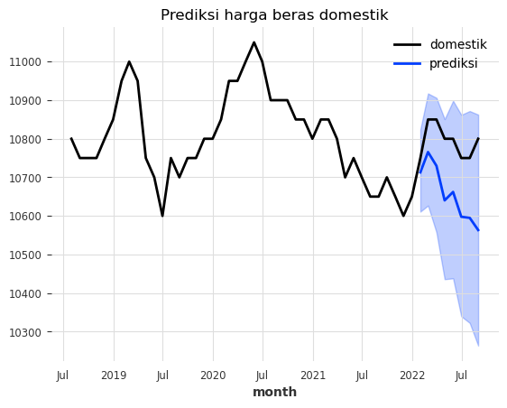
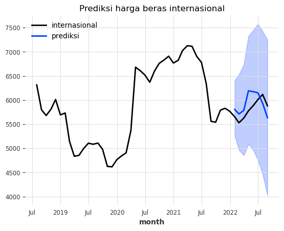

Saya adalah salah satu penikmat cuitan [Haryo Aswicahyono](https://twitter.com/Aswicahyono) yang sering membahas tentang ekonomi. Suatu hari yang lalu, beliau ngecuit tentang terutama harga beras yang masih tinggi meskipun stok beras melimpah. Berikut cuitannya:

<blockquote class="twitter-tweet"><p lang="in" dir="ltr">Biasanya kalau diviralin harga turun. Ini harga beras masih naik terus, padahal katanya stock melimpah.<br><br>Harga Pasar Modern: 15,900<br>Harga Pasar Tradisional: 15,700<br>Harga Pedagang Besar: 14,800<br>Harga Produsen (Petani): 13,100<br>ini harga rata2 se Indonesia ya<a href="https://t.co/dLx2YHPm1w">https://t.co/dLx2YHPm1w</a> <a href="https://t.co/KY80KG3sRK">pic.twitter.com/KY80KG3sRK</a></p>&mdash; Haryo Aswicahyono (@Aswicahyono) <a href="https://twitter.com/Aswicahyono/status/1940960141735866517?ref_src=twsrc%5Etfw">July 4, 2025</a></blockquote> <script async src="https://platform.twitter.com/widgets.js" charset="utf-8"></script>

Saya kebetulan pas itu lagi membuat paper tentang Neraca Komoditas untuk Center for Indonesian Policy Studies (CIPS) bersama Hasran dan Rasya. Beras adalah salah satu produk yang terkena Neraca Komoditas. Karena itu, saya sendiri lagi nulis dikit soal beras, dan benar, saya menemukan hal yang sama: harga beras domestik yang masih tinggi. Tingginya harga beras ini jadi sangat kontras ketika kita bandingkan dengan harga beras internasional yang sudah turun di awal 2024.

<div>                        <script type="text/javascript">window.PlotlyConfig = {MathJaxConfig: 'local'};</script>
        <script charset="utf-8" src="https://cdn.plot.ly/plotly-3.0.1.min.js" integrity="sha256-oy6Be7Eh6eiQFs5M7oXuPxxm9qbJXEtTpfSI93dW16Q=" crossorigin="anonymous"></script>                <div id="e5db522d-dcbc-4736-a11f-9390ccc3423e" class="plotly-graph-div" style="height:100%; width:100%;"></div>            <script type="text/javascript">                window.PLOTLYENV=window.PLOTLYENV || {};                                if (document.getElementById("e5db522d-dcbc-4736-a11f-9390ccc3423e")) {                    Plotly.newPlot(                        "e5db522d-dcbc-4736-a11f-9390ccc3423e",                        [{"hovertemplate":"jenis=domestik\u003cbr\u003emonth=%{x}\u003cbr\u003eharga=%{y}\u003cextra\u003e\u003c\u002fextra\u003e","legendgroup":"domestik","line":{"color":"#3366CC","dash":"solid"},"marker":{"symbol":"circle"},"mode":"lines","name":"domestik","orientation":"v","showlegend":true,"x":["2018-07-31T00:00:00.000000000","2018-08-31T00:00:00.000000000","2018-09-30T00:00:00.000000000","2018-10-31T00:00:00.000000000","2018-11-30T00:00:00.000000000","2018-12-31T00:00:00.000000000","2019-01-31T00:00:00.000000000","2019-02-28T00:00:00.000000000","2019-03-31T00:00:00.000000000","2019-04-30T00:00:00.000000000","2019-05-31T00:00:00.000000000","2019-06-30T00:00:00.000000000","2019-07-31T00:00:00.000000000","2019-08-31T00:00:00.000000000","2019-09-30T00:00:00.000000000","2019-10-31T00:00:00.000000000","2019-11-30T00:00:00.000000000","2019-12-31T00:00:00.000000000","2020-01-31T00:00:00.000000000","2020-02-29T00:00:00.000000000","2020-03-31T00:00:00.000000000","2020-04-30T00:00:00.000000000","2020-05-31T00:00:00.000000000","2020-06-30T00:00:00.000000000","2020-07-31T00:00:00.000000000","2020-08-31T00:00:00.000000000","2020-09-30T00:00:00.000000000","2020-10-31T00:00:00.000000000","2020-11-30T00:00:00.000000000","2020-12-31T00:00:00.000000000","2021-01-31T00:00:00.000000000","2021-02-28T00:00:00.000000000","2021-03-31T00:00:00.000000000","2021-04-30T00:00:00.000000000","2021-05-31T00:00:00.000000000","2021-06-30T00:00:00.000000000","2021-07-31T00:00:00.000000000","2021-08-31T00:00:00.000000000","2021-09-30T00:00:00.000000000","2021-10-31T00:00:00.000000000","2021-11-30T00:00:00.000000000","2021-12-31T00:00:00.000000000","2022-01-31T00:00:00.000000000","2022-02-28T00:00:00.000000000","2022-03-31T00:00:00.000000000","2022-04-30T00:00:00.000000000","2022-05-31T00:00:00.000000000","2022-06-30T00:00:00.000000000","2022-07-31T00:00:00.000000000","2022-08-31T00:00:00.000000000","2022-09-30T00:00:00.000000000","2022-10-31T00:00:00.000000000","2022-11-30T00:00:00.000000000","2022-12-31T00:00:00.000000000","2023-01-31T00:00:00.000000000","2023-02-28T00:00:00.000000000","2023-03-31T00:00:00.000000000","2023-04-30T00:00:00.000000000","2023-05-31T00:00:00.000000000","2023-06-30T00:00:00.000000000","2023-07-31T00:00:00.000000000","2023-08-31T00:00:00.000000000","2023-09-30T00:00:00.000000000","2023-10-31T00:00:00.000000000","2023-11-30T00:00:00.000000000","2023-12-31T00:00:00.000000000","2024-01-31T00:00:00.000000000","2024-02-29T00:00:00.000000000","2024-03-31T00:00:00.000000000","2024-04-30T00:00:00.000000000","2024-05-31T00:00:00.000000000","2024-06-30T00:00:00.000000000","2024-07-31T00:00:00.000000000","2024-08-31T00:00:00.000000000","2024-09-30T00:00:00.000000000","2024-10-31T00:00:00.000000000","2024-11-30T00:00:00.000000000","2024-12-31T00:00:00.000000000","2025-01-31T00:00:00.000000000","2025-02-28T00:00:00.000000000","2025-03-31T00:00:00.000000000","2025-04-30T00:00:00.000000000"],"xaxis":"x","y":{"dtype":"f8","bdata":"AAAAAAAYxUAAAAAAAP\u002fEQAAAAAAA\u002f8RAAAAAAAD\u002fxEAAAAAAABjFQAAAAAAAMcVAAAAAAABjxUAAAAAAAHzFQAAAAAAAY8VAAAAAAAD\u002fxEAAAAAAAObEQAAAAAAAtMRAAAAAAAD\u002fxEAAAAAAAObEQAAAAAAA\u002f8RAAAAAAAD\u002fxEAAAAAAABjFQAAAAAAAGMVAAAAAAAAxxUAAAAAAAGPFQAAAAAAAY8VAAAAAAAB8xUAAAAAAAJXFQAAAAAAAfMVAAAAAAABKxUAAAAAAAErFQAAAAAAASsVAAAAAAAAxxUAAAAAAADHFQAAAAAAAGMVAAAAAAAAxxUAAAAAAADHFQAAAAAAAGMVAAAAAAADmxEAAAAAAAP\u002fEQAAAAAAA5sRAAAAAAADNxEAAAAAAAM3EQAAAAAAA5sRAAAAAAADNxEAAAAAAALTEQAAAAAAAzcRAAAAAAAD\u002fxEAAAAAAADHFQAAAAAAAMcVAAAAAAAAYxUAAAAAAABjFQAAAAAAA\u002f8RAAAAAAAD\u002fxEAAAAAAABjFQAAAAAAAfMVAAAAAAADgxUAAAAAAAPnFQAAAAAAAXcZAAAAAAADzxkAAAAAAAD7HQAAAAAAABshAAAAAAABqyEAAAAAAAFHIQAAAAAAAnMhAAAAAAACDyEAAAAAAAGrIQAAAAAAAS8lAAAAAAAB3ykAAAAAAAMLKQAAAAAAA28pAAAAAAAD0ykAAAAAAAHHLQAAAAAAAM81AAAAAAAAzzUAAAAAAAITMQAAAAAAAB8xAAAAAAADuy0AAAAAAAAfMQAAAAAAAB8xAAAAAAAAHzEAAAAAAANXLQAAAAAAAvMtAAAAAAAC8y0AAAAAAANXLQAAAAAAAB8xAAAAAAAAgzEA="},"yaxis":"y","type":"scatter"},{"hovertemplate":"jenis=internasional\u003cbr\u003emonth=%{x}\u003cbr\u003eharga=%{y}\u003cextra\u003e\u003c\u002fextra\u003e","legendgroup":"internasional","line":{"color":"#DC3912","dash":"solid"},"marker":{"symbol":"circle"},"mode":"lines","name":"internasional","orientation":"v","showlegend":true,"x":["2018-07-31T00:00:00.000000000","2018-08-31T00:00:00.000000000","2018-09-30T00:00:00.000000000","2018-10-31T00:00:00.000000000","2018-11-30T00:00:00.000000000","2018-12-31T00:00:00.000000000","2019-01-31T00:00:00.000000000","2019-02-28T00:00:00.000000000","2019-03-31T00:00:00.000000000","2019-04-30T00:00:00.000000000","2019-05-31T00:00:00.000000000","2019-06-30T00:00:00.000000000","2019-07-31T00:00:00.000000000","2019-08-31T00:00:00.000000000","2019-09-30T00:00:00.000000000","2019-10-31T00:00:00.000000000","2019-11-30T00:00:00.000000000","2019-12-31T00:00:00.000000000","2020-01-31T00:00:00.000000000","2020-02-29T00:00:00.000000000","2020-03-31T00:00:00.000000000","2020-04-30T00:00:00.000000000","2020-05-31T00:00:00.000000000","2020-06-30T00:00:00.000000000","2020-07-31T00:00:00.000000000","2020-08-31T00:00:00.000000000","2020-09-30T00:00:00.000000000","2020-10-31T00:00:00.000000000","2020-11-30T00:00:00.000000000","2020-12-31T00:00:00.000000000","2021-01-31T00:00:00.000000000","2021-02-28T00:00:00.000000000","2021-03-31T00:00:00.000000000","2021-04-30T00:00:00.000000000","2021-05-31T00:00:00.000000000","2021-06-30T00:00:00.000000000","2021-07-31T00:00:00.000000000","2021-08-31T00:00:00.000000000","2021-09-30T00:00:00.000000000","2021-10-31T00:00:00.000000000","2021-11-30T00:00:00.000000000","2021-12-31T00:00:00.000000000","2022-01-31T00:00:00.000000000","2022-02-28T00:00:00.000000000","2022-03-31T00:00:00.000000000","2022-04-30T00:00:00.000000000","2022-05-31T00:00:00.000000000","2022-06-30T00:00:00.000000000","2022-07-31T00:00:00.000000000","2022-08-31T00:00:00.000000000","2022-09-30T00:00:00.000000000","2022-10-31T00:00:00.000000000","2022-11-30T00:00:00.000000000","2022-12-31T00:00:00.000000000","2023-01-31T00:00:00.000000000","2023-02-28T00:00:00.000000000","2023-03-31T00:00:00.000000000","2023-04-30T00:00:00.000000000","2023-05-31T00:00:00.000000000","2023-06-30T00:00:00.000000000","2023-07-31T00:00:00.000000000","2023-08-31T00:00:00.000000000","2023-09-30T00:00:00.000000000","2023-10-31T00:00:00.000000000","2023-11-30T00:00:00.000000000","2023-12-31T00:00:00.000000000","2024-01-31T00:00:00.000000000","2024-02-29T00:00:00.000000000","2024-03-31T00:00:00.000000000","2024-04-30T00:00:00.000000000","2024-05-31T00:00:00.000000000","2024-06-30T00:00:00.000000000","2024-07-31T00:00:00.000000000","2024-08-31T00:00:00.000000000","2024-09-30T00:00:00.000000000","2024-10-31T00:00:00.000000000","2024-11-30T00:00:00.000000000","2024-12-31T00:00:00.000000000","2025-01-31T00:00:00.000000000","2025-02-28T00:00:00.000000000","2025-03-31T00:00:00.000000000","2025-04-30T00:00:00.000000000"],"xaxis":"x","y":{"dtype":"f8","bdata":"xty1hPSquEBhN2xbVKe2QE+vlGUgMLZA001iEPixtkAwTKYKHn23QI47pYP1PbZAzF1LyJ9ktkBpAG+BNBe0QFitTPi14rJADDz3Hlb2skChZ7PqI4ezQOWzPA9e8rNAVz7L82Dcs0AcX3tm+fSzQLTIdr6PcrNAE0n0MuoQskBW1GAaBgmyQAOy17svnbJAJXUCmujsskDuX1lp8imzQNydtdv++bRACCC1iWMaukBmoDL+TdC5QAq6vaQRdrlADaZh+CDiuEA1e6AV0My5QPfkYaHGabpAEDtT6JyuukDl0CLbGf66QAZkr3dvcLpAFeP8TRiqukDPMSB7vXO7QN0kBoHV1rtACp3X2A3Mu0BWfa62Mvi6QD0K16PwfrpAfCdmvcjGuEDBHD1+D7i1QOPHmLu2pLVAon+Ci0WgtkBXJvxSF8a2QGUZ4lgXhrZA6ZrJNzsVtkBWgsXhjJm1QKd0sP7n+7VAPUSjO\u002fiQtkA3iUFgZf22QO1kcJS8erdAgv+tZNflt0AMAiuHlvm2QLGiBtPwwbZAECOERxtXuEBOnNzvMKm5QMx\u002fSL8NlrpAYOrnTcXWukCYF2AfnUC6QAfwFkhQeLpAlPYGXwigukBzhXe5cPK6QChhpu0fyb1AZmZmZmZ1vUAyVTAqCee\u002fQKN1VDU1sMFATfOOUyijwkBzEd+J3YrDQH6MuWvpI8NAJ6Wg25\u002fcwkByUMJMk\u002fXCQGFUUicE+MFAVg4tsrW3wUAFbt3NIw7CQKBP5EmG08FAHLYtykSwwUAMAiuHrgjBQH7ja89EVcBA0qkrn+VXv0Dc14FzrkS\u002fQIY97fBXs75AYviImIo6vEDMXUvIh5i5QLTIdr5PgLhAAAAAAAAA+H8="},"yaxis":"y","type":"scatter"}],                        {"template":{"data":{"barpolar":[{"marker":{"line":{"color":"rgb(17,17,17)","width":0.5},"pattern":{"fillmode":"overlay","size":10,"solidity":0.2}},"type":"barpolar"}],"bar":[{"error_x":{"color":"#f2f5fa"},"error_y":{"color":"#f2f5fa"},"marker":{"line":{"color":"rgb(17,17,17)","width":0.5},"pattern":{"fillmode":"overlay","size":10,"solidity":0.2}},"type":"bar"}],"carpet":[{"aaxis":{"endlinecolor":"#A2B1C6","gridcolor":"#506784","linecolor":"#506784","minorgridcolor":"#506784","startlinecolor":"#A2B1C6"},"baxis":{"endlinecolor":"#A2B1C6","gridcolor":"#506784","linecolor":"#506784","minorgridcolor":"#506784","startlinecolor":"#A2B1C6"},"type":"carpet"}],"choropleth":[{"colorbar":{"outlinewidth":0,"ticks":""},"type":"choropleth"}],"contourcarpet":[{"colorbar":{"outlinewidth":0,"ticks":""},"type":"contourcarpet"}],"contour":[{"colorbar":{"outlinewidth":0,"ticks":""},"colorscale":[[0.0,"#0d0887"],[0.1111111111111111,"#46039f"],[0.2222222222222222,"#7201a8"],[0.3333333333333333,"#9c179e"],[0.4444444444444444,"#bd3786"],[0.5555555555555556,"#d8576b"],[0.6666666666666666,"#ed7953"],[0.7777777777777778,"#fb9f3a"],[0.8888888888888888,"#fdca26"],[1.0,"#f0f921"]],"type":"contour"}],"heatmap":[{"colorbar":{"outlinewidth":0,"ticks":""},"colorscale":[[0.0,"#0d0887"],[0.1111111111111111,"#46039f"],[0.2222222222222222,"#7201a8"],[0.3333333333333333,"#9c179e"],[0.4444444444444444,"#bd3786"],[0.5555555555555556,"#d8576b"],[0.6666666666666666,"#ed7953"],[0.7777777777777778,"#fb9f3a"],[0.8888888888888888,"#fdca26"],[1.0,"#f0f921"]],"type":"heatmap"}],"histogram2dcontour":[{"colorbar":{"outlinewidth":0,"ticks":""},"colorscale":[[0.0,"#0d0887"],[0.1111111111111111,"#46039f"],[0.2222222222222222,"#7201a8"],[0.3333333333333333,"#9c179e"],[0.4444444444444444,"#bd3786"],[0.5555555555555556,"#d8576b"],[0.6666666666666666,"#ed7953"],[0.7777777777777778,"#fb9f3a"],[0.8888888888888888,"#fdca26"],[1.0,"#f0f921"]],"type":"histogram2dcontour"}],"histogram2d":[{"colorbar":{"outlinewidth":0,"ticks":""},"colorscale":[[0.0,"#0d0887"],[0.1111111111111111,"#46039f"],[0.2222222222222222,"#7201a8"],[0.3333333333333333,"#9c179e"],[0.4444444444444444,"#bd3786"],[0.5555555555555556,"#d8576b"],[0.6666666666666666,"#ed7953"],[0.7777777777777778,"#fb9f3a"],[0.8888888888888888,"#fdca26"],[1.0,"#f0f921"]],"type":"histogram2d"}],"histogram":[{"marker":{"pattern":{"fillmode":"overlay","size":10,"solidity":0.2}},"type":"histogram"}],"mesh3d":[{"colorbar":{"outlinewidth":0,"ticks":""},"type":"mesh3d"}],"parcoords":[{"line":{"colorbar":{"outlinewidth":0,"ticks":""}},"type":"parcoords"}],"pie":[{"automargin":true,"type":"pie"}],"scatter3d":[{"line":{"colorbar":{"outlinewidth":0,"ticks":""}},"marker":{"colorbar":{"outlinewidth":0,"ticks":""}},"type":"scatter3d"}],"scattercarpet":[{"marker":{"colorbar":{"outlinewidth":0,"ticks":""}},"type":"scattercarpet"}],"scattergeo":[{"marker":{"colorbar":{"outlinewidth":0,"ticks":""}},"type":"scattergeo"}],"scattergl":[{"marker":{"line":{"color":"#283442"}},"type":"scattergl"}],"scattermapbox":[{"marker":{"colorbar":{"outlinewidth":0,"ticks":""}},"type":"scattermapbox"}],"scattermap":[{"marker":{"colorbar":{"outlinewidth":0,"ticks":""}},"type":"scattermap"}],"scatterpolargl":[{"marker":{"colorbar":{"outlinewidth":0,"ticks":""}},"type":"scatterpolargl"}],"scatterpolar":[{"marker":{"colorbar":{"outlinewidth":0,"ticks":""}},"type":"scatterpolar"}],"scatter":[{"marker":{"line":{"color":"#283442"}},"type":"scatter"}],"scatterternary":[{"marker":{"colorbar":{"outlinewidth":0,"ticks":""}},"type":"scatterternary"}],"surface":[{"colorbar":{"outlinewidth":0,"ticks":""},"colorscale":[[0.0,"#0d0887"],[0.1111111111111111,"#46039f"],[0.2222222222222222,"#7201a8"],[0.3333333333333333,"#9c179e"],[0.4444444444444444,"#bd3786"],[0.5555555555555556,"#d8576b"],[0.6666666666666666,"#ed7953"],[0.7777777777777778,"#fb9f3a"],[0.8888888888888888,"#fdca26"],[1.0,"#f0f921"]],"type":"surface"}],"table":[{"cells":{"fill":{"color":"#506784"},"line":{"color":"rgb(17,17,17)"}},"header":{"fill":{"color":"#2a3f5f"},"line":{"color":"rgb(17,17,17)"}},"type":"table"}]},"layout":{"annotationdefaults":{"arrowcolor":"#f2f5fa","arrowhead":0,"arrowwidth":1},"autotypenumbers":"strict","coloraxis":{"colorbar":{"outlinewidth":0,"ticks":""}},"colorscale":{"diverging":[[0,"#8e0152"],[0.1,"#c51b7d"],[0.2,"#de77ae"],[0.3,"#f1b6da"],[0.4,"#fde0ef"],[0.5,"#f7f7f7"],[0.6,"#e6f5d0"],[0.7,"#b8e186"],[0.8,"#7fbc41"],[0.9,"#4d9221"],[1,"#276419"]],"sequential":[[0.0,"#0d0887"],[0.1111111111111111,"#46039f"],[0.2222222222222222,"#7201a8"],[0.3333333333333333,"#9c179e"],[0.4444444444444444,"#bd3786"],[0.5555555555555556,"#d8576b"],[0.6666666666666666,"#ed7953"],[0.7777777777777778,"#fb9f3a"],[0.8888888888888888,"#fdca26"],[1.0,"#f0f921"]],"sequentialminus":[[0.0,"#0d0887"],[0.1111111111111111,"#46039f"],[0.2222222222222222,"#7201a8"],[0.3333333333333333,"#9c179e"],[0.4444444444444444,"#bd3786"],[0.5555555555555556,"#d8576b"],[0.6666666666666666,"#ed7953"],[0.7777777777777778,"#fb9f3a"],[0.8888888888888888,"#fdca26"],[1.0,"#f0f921"]]},"colorway":["#636efa","#EF553B","#00cc96","#ab63fa","#FFA15A","#19d3f3","#FF6692","#B6E880","#FF97FF","#FECB52"],"font":{"color":"#f2f5fa"},"geo":{"bgcolor":"rgb(17,17,17)","lakecolor":"rgb(17,17,17)","landcolor":"rgb(17,17,17)","showlakes":true,"showland":true,"subunitcolor":"#506784"},"hoverlabel":{"align":"left"},"hovermode":"closest","mapbox":{"style":"dark"},"paper_bgcolor":"rgb(17,17,17)","plot_bgcolor":"rgb(17,17,17)","polar":{"angularaxis":{"gridcolor":"#506784","linecolor":"#506784","ticks":""},"bgcolor":"rgb(17,17,17)","radialaxis":{"gridcolor":"#506784","linecolor":"#506784","ticks":""}},"scene":{"xaxis":{"backgroundcolor":"rgb(17,17,17)","gridcolor":"#506784","gridwidth":2,"linecolor":"#506784","showbackground":true,"ticks":"","zerolinecolor":"#C8D4E3"},"yaxis":{"backgroundcolor":"rgb(17,17,17)","gridcolor":"#506784","gridwidth":2,"linecolor":"#506784","showbackground":true,"ticks":"","zerolinecolor":"#C8D4E3"},"zaxis":{"backgroundcolor":"rgb(17,17,17)","gridcolor":"#506784","gridwidth":2,"linecolor":"#506784","showbackground":true,"ticks":"","zerolinecolor":"#C8D4E3"}},"shapedefaults":{"line":{"color":"#f2f5fa"}},"sliderdefaults":{"bgcolor":"#C8D4E3","bordercolor":"rgb(17,17,17)","borderwidth":1,"tickwidth":0},"ternary":{"aaxis":{"gridcolor":"#506784","linecolor":"#506784","ticks":""},"baxis":{"gridcolor":"#506784","linecolor":"#506784","ticks":""},"bgcolor":"rgb(17,17,17)","caxis":{"gridcolor":"#506784","linecolor":"#506784","ticks":""}},"title":{"x":0.05},"updatemenudefaults":{"bgcolor":"#506784","borderwidth":0},"xaxis":{"automargin":true,"gridcolor":"#283442","linecolor":"#506784","ticks":"","title":{"standoff":15},"zerolinecolor":"#283442","zerolinewidth":2},"yaxis":{"automargin":true,"gridcolor":"#283442","linecolor":"#506784","ticks":"","title":{"standoff":15},"zerolinecolor":"#283442","zerolinewidth":2}}},"xaxis":{"anchor":"y","domain":[0.0,1.0],"title":{"text":"month"}},"yaxis":{"anchor":"x","domain":[0.0,1.0],"title":{"text":"harga"}},"legend":{"title":{"text":"jenis"},"tracegroupgap":0,"orientation":"h","yanchor":"bottom","y":1.02,"xanchor":"right","x":1},"title":{"text":"harga beras bulanan (PIHPS)"}},                        {"responsive": true}                    )                };            </script>        </div>

Harga beras sempat naik di pertengahan 2023 gara-gara [iklim dan India](https://www.cnbc.com/2023/08/10/global-rice-prices-soar-close-to-12-year-highs-according-to-un-fao-.html?msockid=0807c93cf124679e3401dc6df07266b0), major exporter yang melarang ekspor berasnya. Tapi jika kita perhatikan trennya, harga beras domestik (dan internasional) sudah mulai naik sejak pertengahan 2022, tepatnya sekitar bulan Agustus 2022. Harga beras domestik dan internasional naik bersama-sama sampai awal 2024 ketika kedua harga bergerak ke arah yang berbeda. Harga beras domestik masih naik, sedangkan harga beras internasional sudah mulai turun. Lucunya, harga beras domestik yang tidak mau turun itu justru terjadi ketika stok domestik beras [sedang melimpah](https://www.bulog.co.id/2025/05/04/stok-bulog-selama-4-bulan-capai-35-juta-ton-terbesar-sejak-merdeka/)

Melihat stok melimpah, tentu saja permasalahan harga beras domestik bisa jadi karena masalah [distribusi](https://www.kompas.id/artikel/mengapa-harga-beras-melonjak-meski-stok-nasional-tinggi?status=sukses_login&loc=header) dari gudang ke pasar yang tidak cukup cepat. Saya tidak begitu familiar bagaimana rantai distribusi dari bulog ke pasar, seberapa besar harga beli dari gudang bulog dan harga jual yang ditetapkan oleh pemasar. Tapi jika distribusi bisa dilakukan dengan cepat sehingga stok harga beras.

## Neraca Komoditas

Bagian dari supply chain beras tersebut adalah Neraca Komoditas. Neraca Komoditas adalah sebuah sistem untuk mengontrol impor beras. Beras hanya boleh diimpor jika data hasil ramalan di Neraca Komoditas menunjukkan bahwa produksi akan lebih kecil daripada konsumsi. Jika Neraca Komoditas memprediksi produksi yang besar, maka impor akan distop. Impor adalah alasan kenapa harga beras domestik bisa turun, karena harga beras internasional selalu lebih rendah daripada harga domestik.

Harga internasional seringkali menjadi acuan bagi analis untuk melihat pergerakan harga domestik. Hal-hal yang mempengaruhi produksi beras secara luas akan mempengaruhi harga internasional dan harga domestik. Misalnya, cuaca buruk yang terjadi di kawasan akan menurunkan produksi beras di Indonesia dan tetangga-tetangganya, sehingga harga akan naik. Tapi jika ada kejadian yang terjadi hanya di Indonesia saja, maka hanya harga Indonesia aja yang naik. Inilah salah satu gunanya impor: jika ada masalah di Indonesia saja tapi beras internasional tidak terpengaruh, maka impor akan membantu menstabilkan harga domestik.

Kecepatan menstabilkan harga domestik tentu saja tergantung dengan kecepatan impor. Neraca Komoditas katanya dibuat untuk mempercepat impor beras. Beras sendiri menjadi bagian dari Neraca Komoditas sejak 2022. Sebelumnya, impor beras tetap dibatasi tapi tidak menggunakan sistem Neraca Komoditas ini. Apakah Neraca Komoditas lebih baik?

Di paper yang saya tulis bersama Hasran dan Rasya di atas, kami menggunakan melihat pergerakan harga beras Indonesia tanpa Neraca Komoditas dengan menggunakan harga beras yang diestimasi berdasarkan harga-harga lainnya (nama metodenya synthetic control method). Hasilnya? Tunggu papernya keluar ya wk wk wk.

Nah, di blog kali ini, kita bisa bikin iseng versi 'lite' pake forecasting. Premisnya, bagaimana pergerakan harga beras domestik seandainya neraca komoditas tidak ada. Di postingan kali ini, kita pake Darts, tepatnya Exponential Smoothing, untuk forecast harga beras setelah Neraca Komoditas (wicis 2022 januari) berdasarkan data historis, lalu kita bandingkan hasilnya dengan harga beras yang sebenarnya. Perbedaannya akan kita atribusikan ke Neraca Komoditas. Sebagai pembanding, kita akan lakukan hal yang sama untuk harga beras internasional yang kita tau tidak terpengaruh oleh Neraca Komoditas.

Seriesnya monthly, harga beras domestiknya ambil dari PIHPS (Pusat Informasi Harga Pangan Strategis) sementara harga beras internasional diambil dari IMF commodity market. Datanya saya cut cuma sampe Agustus 2023, soalnya abis Agustus 2023 mulai ada tren naik. Time Series saja tidak cukup untuk kontrol hal-hal kayak gini.


```python
#package
import pandas as pd
import plotly.express as px
from darts import TimeSeries
from darts.models import ExponentialSmoothing

# plot domestik vs internasional
df = pd.read_excel('beras.xlsx')
df['month'] = pd.Series(pd.date_range(start='2018-07-01', end='2025-05-10', freq='ME'))
dfl=df.melt(id_vars=['month'], var_name='jenis', value_name='harga')
fig = px.line(dfl, x="month", y="harga", title='harga beras bulanan (PIHPS)',color='jenis',
              color_discrete_sequence=px.colors.qualitative.G10,template='plotly_dark')
fig.update_layout(
        legend=dict(
            orientation="h",  # Horizontal orientation
            yanchor="bottom", # Anchor the legend's y-position to the bottom
            y=1.02,           # Adjust the y-position (can be slightly above the plot)
            xanchor="right",  # Anchor the legend's x-position to the right
            x=1               # Adjust the x-position (can be slightly to the right of the plot)
        )
    )
fig.write_html('wew.html', full_html=False, include_plotlyjs='cdn')
```


```python
df2=df[:-32]
```


```python
series = TimeSeries.from_dataframe(df2, "month", "domestik")
train,val=series[:-8],series[-8:]
model=ExponentialSmoothing()
model.fit(train)
prediction=model.predict(len(val),num_samples=1000)
series.plot()
prediction.plot(label='prediksi',low_quantile=.05,high_quantile=.95)
plt.title('Prediksi harga beras domestik')
plt.legend()

```


    <matplotlib.legend.Legend at 0x1ea12e5bd90>


    

    


```python
series = TimeSeries.from_dataframe(df2, "month", "internasional")
train,val=series[:-8],series[-8:]
model=ExponentialSmoothing()
model.fit(train)
prediction=model.predict(len(val),num_samples=1000)
series.plot()
prediction.plot(label='prediksi',low_quantile=.05,high_quantile=.95)
plt.title('Prediksi harga beras internasional')
plt.legend()
```


    <matplotlib.legend.Legend at 0x1ea12ef4a50>


    

    


Wkwkw gile confidence intervalnya lebar banget wkkw. Yah to be expected sih, soalnya seriesnya pendek banget dan amat sangat mungkin ada banyak faktor-faktor struktural yang mempengaruhi harga beras. Tapi yaa gapapa, namanya juga iseng.

Hasil forecastingnya menunjukkan bahwa harga beras domestik mestinya mengalami tren menurun atau setidaknya datar sejak diterapkannya Neraca Komodtias. Tapi yang terjadi adalah harga beras domestik justru naik. Sementara itu, harga beras internasional kayaknya ga beda jauh dari hasil forecastingnya. Tapi yaa sebenernya hasil forecastingnya masih masuk ke confidence interval 95%, tapi lumayan mepet wkwk. Apakah ini gara-gara Neraca Komoditas? Bisa jadi, tapi kita perlu analisis lebih lanjut untuk memastikan. Jangan lupa, ini cuma iseng-iseng aja, jangan dijadikan dasar untuk kebijakan publik ya wkwk.

Oke deh segini aja dulu postingan hari ini. Sebenernya postingan ini semi-semi promosi paper dan juga semi-semi nyoba-nyoba Darts. Next time kita coba forecasting lain lagi yang lebih seru ya.
