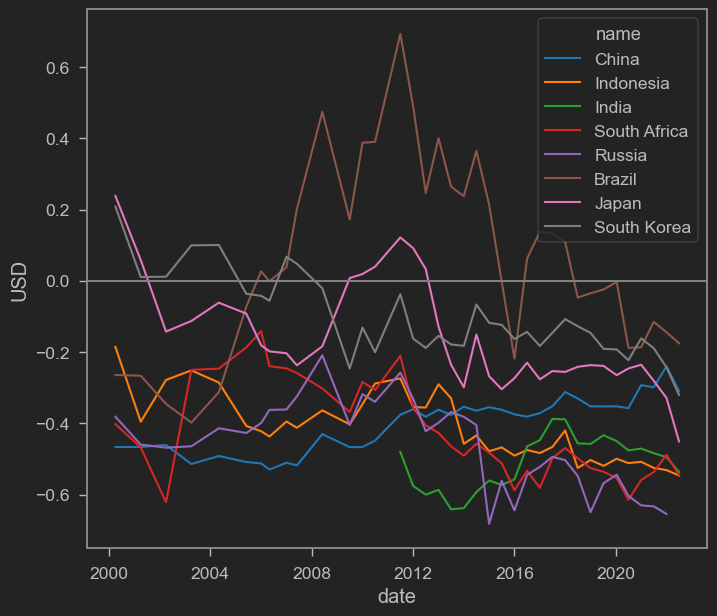

Belakangan ini isu [dedolarisasi](https://www.reuters.com/article/markets-dollar-dedollarisation-idTRNIKBN2XG09Q) sedang hangat-hangatnya. Dedolarisasi, atau upaya banyak negara untuk mengurangi ketergantungan terhadap mata uang Dollar Amerika (USD), memang katanya sedang digalakkan terutama oleh Negara-negara [BRICS](https://katadata.co.id/sortatobing/ekonopedia/64362b63a2ec5/dedolarisasi-upaya-brics-dan-asean-kurangi-ketergantungan-dolar-as) (Brazil, Russia, India, China, and South Africa). 

Indonesia pun tidak kalah, karena Bank Indonesia telah menjalin kerjasama Local Currency Settlement (LCS) dengan Korea Selatan, Jepang, China, Malaysia dan Thailand. Dengan kata lain, sekarang Indonesia dan negara partner dapat menggunakan mata uang domestik masing-masing untuk menyelesaikan pembayaran _cross-border_ tanpa menggunakan dolar Amerika (USD).

Kalau dari berita [ini](https://www.kompas.id/baca/ekonomi/2023/05/02/indonesia-tambah-negara-untuk-kerjasama-dedolarisasi), LCS sangat penting untuk meminimalisir risiko nilai tukar dalam transaksi bilateral kedua negara. Mungkin bisa jadi ya, kalau memang penggunaan mata uangnya fokus hanya untuk jual beli barang dan jasa. Namun dewasa ini, mata uang juga digunakan untuk jual beli aset. Bahkan bisa jadi penggunaan mata uang untuk jual beli aset mendominasi penggunaan untuk barang dan jasa.

## Mata uang sebagai alat tukar aset?

Untuk menjawabnya, sedikit pengetahuan teknis tentang neraca pembayaran / balance of payment (BoP) akan diperlukan. BoP terdiri dari 2 neraca utama, yaitu neraca perdagangan (current account) dan neraca finansial (financial account). Jika current account 

Ilustrasi mudahnya, dalam ekonomi terbuka, kita punya

$$
Y=C+I+G+(X-M)
$$

Sementara itu, tabungan (saving) adalah pendapatan yang tidak dikonsumsi dan sudah dikurangi pajak, sehingga S=Y-C-G (asumsikan total pajak = G). Sehingga:

$$
Y-C-G-I=X-M
$$

Kita ganti Y-C-G dengan S sehingga

$$
S-I=X-M
$$

S-I adalah neraca finansial, sementara X-M adalah neraca perdagangan. Yang satu akan diseimbangkan yang lainnya.

Gampangnya gini, neraca perdagangan yang surplus itu artinya anda jual barang tapi dibayarnya pake utang. Atau lebih tepatnya anda jadi punya tabungan. Tabungannya ga dipake dulu karena ya namanya juga mau nabung.

Nah, kembali ke pertanyaan kita sebelumnya soal penggunaan mata uang, bagi negara-negara yang memiliki surplus neraca perdagangan, artinya mereka menyimpan mata uang hasil jualannya dalam bentuk aset / investasi. Di sinilah mulai muncul sebuah masalah: Buat apa kita pegang mata uang negara lain?

Pegang mata uang negara lain mungkin akan berguna jika kita akan menggunakannya untuk impor dari negara tersebut. Tapi hal ini jadi kurang berlaku apabila negara-negara yang kerjasama ini HAMPIR SEMUANYA SURPLUS! Coba lihat di bawah ini

<iframe src="https://data.worldbank.org/share/widget?end=2021&indicators=NE.RSB.GNFS.ZS&locations=ID-KR-JP-CN-BR-RU-ZA-IN&start=2011" width='450' height='300' frameBorder='0' scrolling="no" ></iframe>

Di atas saya tampilkan defisit neraca perdagangan (dalam % PDB) dari BRICS, Indonesia, Jepang dan Korsel. Seperti anda lihat, hampir semuanya surplus. Dengan kata lain, mereka umumnya ngasih lebih banyak barang ke dunia internasional, tapi uangnya tidak dibelanjakan alias disimpan dalam bentuk aset.

## Undervaluation

Hal ini bisa jadi dikarenakan negara-negara ini lumayan mengambil mahzab merkantilis, yaitu mahzab ekonomi yang mementingkan kebijakan mendorong ekspor dan [membenci impor](https://nasional.kompas.com/read/2021/03/05/07210071/saat-jokowi-gaungkan-benci-produk-luar-negeri) untuk meningkatkan daya saing industrinya. Negara yang mengandalkan ekspor sebagai daya saing dan pertumbuhan ekonomi biasanya lebih suka jika mata uang mereka lemah, karena mata uang yang lemah mengakibatkan ekspor jadi murah dan impor jadi mahal, sehinggai X-M nya surplus.

Bagi negara-negara ini, intervensi mata uang sangat dihalalkan demi menjaga mata uangnya supaya tetap melemah, meskipun mestinya mata uangnya harusnya bernilai lebih tinggi. Potensi kegiatan seperti ini dapat kita cek dengan mengecek undervaluation, atau nilai mata uang nominalnya dibandingkan dengan nilai yang sebenarnya. Salah satu cara yang bisa dipake adalah dengan memanfaatkan [Big Mac Index](https://www.krisna.or.id/en/post/bigmacindex/) dari majalah The Economist.


```python
#import wbdata as wb

import datetime

## Read data from the economist

url='https://raw.githubusercontent.com/TheEconomist/big-mac-data/master/output-data/big-mac-raw-index.csv'

bmi=pd.read_csv(url,parse_dates=['date'])

## Create the 'real' exchange rate measures

bmi['bmi']=bmi['dollar_ex']+bmi['dollar_ex']*bmi['USD']

bmi.iso_a3.unique() # Showing unique iso_a3 codes for the next cell
```


    array(['ARG', 'AUS', 'BRA', 'GBR', 'CAN', 'CHL', 'CHN', 'CZE', 'DNK',
           'EUZ', 'HKG', 'HUN', 'IDN', 'ISR', 'JPN', 'MYS', 'MEX', 'NZL',
           'POL', 'RUS', 'SGP', 'ZAF', 'KOR', 'SWE', 'CHE', 'TWN', 'THA',
           'USA', 'PHL', 'NOR', 'PER', 'TUR', 'VEN', 'EGY', 'COL', 'CRI',
           'PAK', 'SAU', 'LKA', 'UKR', 'URY', 'ARE', 'IND', 'VNM', 'AZE',
           'BHR', 'HRV', 'GTM', 'HND', 'JOR', 'KWT', 'LBN', 'MDA', 'NIC',
           'OMN', 'QAT', 'ROU'], dtype=object)


```python
b=[]

ctr=('CHN','IDN','IND','ZAF','RUS','BRA','JPN','KOR')

for i in ctr:

    bmii=bmi.loc[(bmi['iso_a3'] == i)]

    b.append(bmii)

b=pd.concat(b)

sns.lineplot(data=b,x='date',y='USD',hue='name',palette='tab10')

plt.axhline(0,color='grey')
```


    <matplotlib.lines.Line2D at 0x2b17256fa48>


    

    


Seperti kita lihat, Kecuali mungkin Brazil, BRICS, Indonesia, Jepang dan Korsel semuanya memiliki mata uang yang _undervalued_ dibandingkan USD. Dengan kata lain, ada indikasi bahwa negara-negara ini sengaja menekan mata uangnya agar produk-produk mereka "kompetitif" di pasar global.

Sebenarnya menggunakan Big Mac Index ga scientific-scientific banget, tapi jika anda emang tertarik mendalami lebih jauh tentang currency misalignment, coba cek publikasi teman saya Pak Wishnu Mahraddika di [sini](https://www.semanticscholar.org/paper/Real-exchange-rate-misalignments-in-developing-The-Mahraddika/db4e36ea6bda5ea90c484157e80bdf2111f31161).

Dengan kata lain, negara-negara ini tampaknya secara aktif ingin memiliki neraca perdagangan yang surplus! Tapi kan gak mungkin mau surplus semua? Hal ini makin kontras jika kita bandingkan neraca perdagangan dengan menggunakan USD

<iframe src="https://data.worldbank.org/share/widget?end=2021&indicators=NE.RSB.GNFS.CD&locations=ID-KR-JP-CN-BR-RU-ZA-IN&start=2011" width='450' height='300' frameBorder='0' scrolling="no" ></iframe>

Siapa yang sanggup menyerap surplus China??

## Negeri Paman Sam sebagai penyelamat

Selama ini, surplus dari negara-negara net eksportir ini adalah tak lain dan tak bukan, Amerika Serikat.

<iframe src="https://data.worldbank.org/share/widget?end=2021&indicators=NE.RSB.GNFS.CD&locations=ID-KR-JP-CN-BR-RU-ZA-IN-US&start=2011" width='450' height='300' frameBorder='0' scrolling="no" ></iframe>

Seperti yang anda lihat, Selama ini AS lah yang menjadi penyerap surplus dari negara-negara ini. Bagaimana cara pemerintah AS menyerap ini semua? Tentunya dengan utang! Semua orang mau jualan ke Amerika Serikat karena duitnya banyak, dan karena semua orang jualan ke AS, maka semua orang punya dolar AS, sehingga akhirnya dolar AS dipake oleh semua orang, sehingga akhirnya jadi cadangan devisa utama orang-orang! Network effect yang self-fulfilling!

Tidak hanya itu, AS juga merupakan negara yang neraca finansialnya relatif terbuka. Sangat mudah bagi semua orang untuk berdagang aset di AS. Anda bisa dengan mudah beli saham dan produk finansial lainnya di AS. Di AS, kontrol terhadap kapital tidak ketat, sehingga semua orang merasa aman menaruh uangnya di AS. AS juga tempat di mana banyak start-up kreatif dan menjanjikan bermunculan

## Dedolarisasi mengurangi risiko nilai tukar?

Masalahnya, negara-negara kita kerjasama ini (Termasuk Malaysia dan Thailand) hampir semuanya negara surplus. Mereka menjaga surplus mereka dengan menukarkan barangnya dengan aset asing. Aset asing yang paling banyak dipakai? Tentu saja negara dengan defisit terbesar sedunia, Amerika Serikat. Akibatnya, meskipun kita berdagang secara bilateral dengan mata uang masing-masing, tapi tetap aja mata uang tersebut ditukar lagi dengan dolar untuk membeli aset AS. Atau ya perdagangan bilateral kita mungkin cuma sepersekian dibandingkan perdagangan kita dengan AS. 

Lagi-lagi, selama AS masih merupakan negara pembeli barang dan jasa nomor 1 di dunia, maka akan susah untuk tidak memegang dolar AS. Dan karena ujung-ujungnya kita akan transaksi dengan AS (baik membeli aset maupun menjual barang), ya artinya mata uang relatif terhadap AS akan tetap berpengaruh.

Tapi upaya dedolarisasi mungkin malah lebih besar dari AS sendiri! Sanksi yang dilakukan AS terhadap Rusia membuat seluruh dunia berpikir ulang akan aset USD negara-negara lain. Di samping itu, kemungkinan _default_ bonds pemerintah AS gara-gara plafon utang juga mungkin mengurangi kepercayaan dunia internasional terhadap aset AS.

Dan daripada nilai tukar, sebenarnya perubahan tatanan global ke depan bisa jadi lebih besar dampaknya kepada perekonomian kita. Jika memang akhirnya BRICS dan banyak negara memutuskan dedolarisasi untuk tetap jalan, negara-negara surplus raksasa harus memikirkan industri domestiknya karena pastinya tidak akan bisa jualan seperti dulu (karena main buyer dari banyak negara adalah AS). Dampaknya bisa jadi lebih besar ketimbang "sekadar" nilai tukar.

Meski demikian, saya rasa sih opsi-opsi LCS begini tetap menarik ya. Semakin banyak sistem pembayaran yang dapat dipilih tentunya akan semakin baik dan upaya seperti LCS patut kita apresiasi.

Demikian postingan kali ini semoga bermanfaat.
