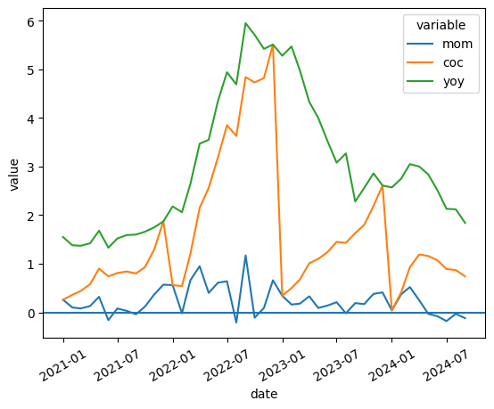

di Indonesia


```python
import pandas as pd
import seaborn as sns
import datetime
## Read data from the economist
url=f'https://docs.google.com/spreadsheets/d/1--ddaTIthvm3kQe97GTEqj1Rb1km0fwI/export?gid=1542512999#gid=1542512999&format=xlsx'
data=pd.read_excel(url,engine='openpyxl')
## Create the 'real' exchange rate measures
index=data.iloc[:,0:3]
index=pd.melt(index, id_vars='date').reset_index()
sns.lineplot(data=index,y='value',x='date',hue='variable')

```


    <Axes: xlabel='date', ylabel='value'>


    

    

