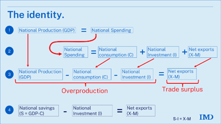

```python

```

## Overproduce vs Underproduce

Amerika Serikat (AS) lewat USTR [menuduh Indonesia](https://ustr.gov/sites/default/files/files/Press/Releases/2026/USTR%20301%20FRN%20Industrial%20Excess%20Capacity%203-11-26.pdf) (dan beberapa negara lain) melakukan "structural excess capacity and production in manufacturing sector" sehingga akan dikenakan tariff Section 301. Mendurut USTR, excess capacity "...leads to, among others, overproduction and large or persistent trade surpluses, as well as underutilized and unused capacity, in manufacturing sectors".

Overproduction dan trade surpluses itu apa? [Richard Baldwin](https://www.linkedin.com/pulse/did-us-underproduction-cause-chinas-overproduction-richard-baldwin-njzje) baru-baru ini menuliskan permasalahan dalam tuduhan overproduction dan trade surpluses. Menurut dia, overproduction dan trade surplus merupakan dua hal yang sulit untuk didefinisikan penyebabnya. 

Semua produksi akan dikonsumsi pada akhirnya, baik oleh diri sendiri maupun oleh negara lain melalui ekspor. Katakanlah Indonesia (dan negara-negara surplus lain) dikatakan "overproduction" adalah net ekspor, karena Indonesia menghasilkan lebih banyak produk dibanding konsumsi domestiknya. Sementara itu, AS yang lebih banyak konsumsi domestiknya daripada produksinya akan jadi net importir.

Nah, problemnya kan kenapa AS bisa konsumsi lebih banyak daripada produksi? Jawabannya adalah karena AS beli pakai utang. AS adalah negara yang secara persisten menerbitkan utang. Dan Baldwin sendiri menegaskan identitas akunting di mana net ekspor barang dan jasa = net capital import (lihat chart di bawah ini). 



Dengan kata lain, bisa aja yang salah justru AS karena hobi menerbitkan utang luar negeri untuk mendanai konsumsinya. Baldwin menulis:

> "The US government lives beyond its means in a spectacular fashion (CBO, 2026). It’s spending more than it collects in taxes to the tune of almost 6% of GDP. Not only is there no plan to close this governmental overspending..."

It takes two to tango. Hanya karena beberapa negara surplus terus tidak berarti negara tersebut overproduce. Bisa saja negara yang defisit terus yang underproduce! Tentu saja susah bagi AS untuk stop ngutang karena nanti warganya protes, tapi selama AS ngutang terus ya dia bakal defisit terus dan negara lain akan surplus terus. Tapi kenapa asing terus yang disalahin? Ha ha ha.

## Underconsumption vs trade surplus

AS juga menuduhkan konsumsi rendah sebagai overproduction. Grafik di bawah ini merupakan trade surplus dan final consumption (termasuk pemerintah) dalam %PDB. Memang terlihat adanya tren negatif: negara yang konsumsinya rendah biasanya punya trade surplus.


```python
import pandas as pd
import wbdata
import plotly.express as px
import plotly.graph_objects as go

# Indikator WDI
indicators = {
    "NE.CON.TOTL.ZS": "consumption",    # Konsumsi akhir (% PDB), termasuk pemerintah
    "NE.RSB.GNFS.ZS": "trade_balance",  # Neraca perdagangan barang & jasa (% PDB)
}

year = 2024
df = wbdata.get_dataframe(indicators, date=str(year))

# Metadata negara untuk membuang agregat kawasan/pendapatan
countries = pd.DataFrame(
    [(c["name"], c["region"]["value"]) for c in wbdata.get_countries()],
    columns=["country", "region"],
).set_index("country")

df = (
    df.join(countries)
    .reset_index(names="country")
    .query("region != 'Aggregates'")
    .dropna(subset=["consumption", "trade_balance"])
)

# Negara yang diberi label:
#  - fokus utama: Indonesia, AS, dan ekonomi besar Asia (Tiongkok, Viet Nam, India)
#  - kiri-atas (konsumsi rendah, surplus dagang): pengekspor energi/komoditas
#  - kanan-bawah (konsumsi tinggi, defisit dagang): penerima bantuan/remitansi
highlight = [
    "Indonesia", "United States", "China", "Viet Nam", "India",
    "Qatar", "Brunei Darussalam", "Norway",
    "Lesotho", "Kiribati", "Tuvalu", "Nepal", "Tajikistan",
    "Liberia", "Timor-Leste", "Mozambique",
]
df["label"] = df["country"].where(df["country"].isin(highlight), "")

fig = px.scatter(
    df,
    x="consumption",
    y="trade_balance",
    color="region",
    hover_name="country",
    text="label",
    opacity=0.55,
    template="plotly_dark",
    labels={
        "consumption": "Konsumsi akhir (% PDB)",
        "trade_balance": "Neraca perdagangan barang & jasa (% PDB)",
    },
    title=f"Konsumsi akhir vs neraca perdagangan barang & jasa, {year}",
)
fig.update_traces(textposition="top center", textfont=dict(size=10, color="lightgrey"))

# Tonjolkan negara fokus dengan penanda besar
focus = df[df["country"].isin(
    ["Indonesia", "United States", "China", "Viet Nam", "India"]
)]
fig.add_trace(
    go.Scatter(
        x=focus["consumption"],
        y=focus["trade_balance"],
        mode="markers",
        marker=dict(size=14, color="#ffd166", line=dict(width=1.5, color="white")),
        text=focus["country"],
        hoverinfo="text",
        showlegend=False,
    )
)

fig.add_hline(y=0, line_dash="dot", line_color="grey")
fig.update_layout(width=900, height=600, showlegend=False)
fig.show()
```


Tapi itu tidak berarti negara dengan trade surplus mendorong surplusnya dengan menekan konsumsi. Negara dengan final consumption paling rendah adalah Irlandia dan Singapura, dua negara yang terkenal merupakan negara safe haven. Mereka menyerap banyak investasi asing (dan domestik) sehingga konsumsinya rendah relatif terhadap PDB, dan ekspor jasanya juga tinggi karena jasa keuangan yang kuat. Negara dengan konsumsi akhir tinggi biasanya juga defisit neraca perdagangan karena mengandalkan bantuan dan transfer luar negeri.

Indonesia sendiri punya level konsumsi per PDB yang mirip dengan Vietnam, dan masih di atas China. China sendiri memang terkenal mendorong PDB dengan terus melakukan investasi. Menurut Pettis, investasi di China sudah kebanyakan. Contohnya, kemarin sektor property di China sempat crash karena bikin rumah dan perkantoran tapi gak ada yang beli. Memang investasi yang tinggi dan terus dilakukan tapi tidak ada yang beli merupakan salah satu ciri overpruduction. Hal ini bisa mendorong inefisiensi ekonomi, dan net ekspor tinggi malah merugikan konsumen domestik.

## Apakah Indonesia overproduce?

Overproduction dapat terjadi jika pasarnya diintervensi. Misalnya, membangun kapasitas pembangkit listrik tapi tidak ada yang beli, atau mendorong kapasitas produksi baja meskipun harga baja dunia terus turun, sehingga returnnya jadi sangat kecil. Pasar akan secara otomatis mengkoreksi hal ini dengan kebangkrutan bagi industrinya, tapi intervensi pemerintah yang terus-terusan ngasih dana ke perusahaan-perusahaan seperti ini akan membuat industri yang inefisien ini untuk terus beroperasi (seringkali disebut zombie firm).

Apakah di Indonesia ada ciri kayak begini? Perusahaan yang rugi terus tapi ditop-up terus permodalannya pakai uang yang sebenarnya dapat digunakan untuk mendorong konsumsi masyarakat? Jika jawabannya "ya", maka net ekspor merupakan indikasi rendahnya kesejahteraan masyarakat, dengan ciri-ciri rendahnya daya beli masyarakat meskipun investasi naik terus. Eventually, investor akan merasa bahwa investasinya tidak memberikan hasil yang tinggi.

## Kesimpulan

Kesimpulannya, overproduction akan ditemani oleh underproduction. Kita tidak benar-benar tau mana yang jadi penyebabnya. Market secara umum akan mengkoreksi hal ini. Makanya biasanya sih negara yang jadi penyebabnya adalah negara yang sering intervensi. AS jelas tukang intervensi dengan penerbitan utang-utangnya (dan dengan posisi dolar sebagai global reserve bank sentral dan investor). Negara surplus juga ada aja yang tukan intervensi. Jadi mungkin dua-duanya punya andil. Tinggal negara mana yang intervensinya lebih gede.
