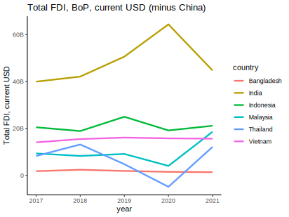
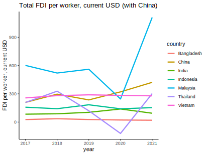

Indonesia dikejutkan pada suatu hari libur dengan diterbitkannya [Perpu Cipta Kerja](https://katadata.co.id/ariayudhistira/infografik/63b8f666b58c4/kontroversi-hari-libur-di-perppu-cipta-kerja) sebagai pengganti UU yang saat ini tengah diperdebatkan oleh Mahkamah Konstitusi (MK). Sepertinya ini diakibatkan oleh kekhawatiran pemerintah akan [investasi asing](https://www.republika.co.id/berita/rnwmit457/peneliti-perppu-cipta-kerja-tak-lantas-tuntaskan-masalah-investasi). Argumennya adalah, dengan UU CK yang masih diperdebatkan oleh MK mengakibatkan ketidak pastian bagi investor. Hal ini ditambah lagi dengan masuknya tahun politik, yang membuat perkembangan UU CK, yang sekarang bolanya sedang di Pemerintah, jadi serba tidak pasti.

Kekhawatiran pemerintah sepertinya cukup beralasan. Kondisi perekonomian global di tengah berkobarnya inflasi di negara-negara maju bukanlah saat yang baik untuk melakukan investasi. Banyak investor sedang [galau](https://www.cnbc.com/2022/11/03/companies-look-to-diversify-as-chinas-covid-controls-take-a-toll.html) apakah stay di China atau pergi ke negara lain, dan bagi yang mengincar diversifikasi, sepertinya [tidak terlalu melirik Indonesia](https://www.businessinsider.com/china-trade-war-covid-companies-moving-supply-chains-2022-12). Semua ini di tengah kebanggaan kita akan meningkatnya investasi asing di Smelter nikel yang susah-susah diundang pakai larangan ekspor [yang tidak murah](https://www.thejakartapost.com/opinion/2022/04/03/indonesias-claim-that-banning-nickel-exports-spurs-downstreaming-isquestionable.html), [Softbank](https://bisnis.tempo.co/read/1675957/kembali-singgung-batalnya-softbank-berinvestasi-di-ikn-bahlil-pemerintah-tidak-bisa-diatur-investor?utm_source=Twitter&utm_medium=Audev&utm_campaign=Bisnis_O) yang mundur dari janjinya investasi di ibu kota baru, dan tentu saja [Tesla](https://www.cnbcindonesia.com/tech/20221129201843-37-392292/luhut-haqqul-yaqin-tesla-bakal-investasi-di-indonesia) yang belum terlihat komitmennya.

Kalau lihat dari data [World Development Indicators](https://data.worldbank.org/), sepertinya Indonesia kedatangan FDI yang cukup tinggi. Dilihat dari gambar 1, FDI di Indonesia hanya kalah dari India.



Meski demikian, kita harus perhitungkan ukuran ekonomi juga. Meski FDI Indonesia lumayan tinggi, kita perlu melihat FDI per pekerja. Karena bagaimanapun juga, kapital yang dibangun dengan investasi akan digunakan oleh pekerja. Anggep aja gini, 2 perusahaan bisa saja sama-sama membeli 10 komputer. Tapi investasi tersebut akan lebih bernilai di perusahaan yang pegawainya 10 dibanding 20. Bagi perusahaan 1, tiap pegawai dapat 1 komputer, sementara pegawai di perusahaan 2 harus gantian. Itu juga kalo dapet komputer. jangan-jangan suruh bawa laptop sendiri (ini curhat. tolong diabaikan).



Dan yha ketika kita buat per kapita, FDI Indonesia memang perlu lebih banyak. BTW gambar 1 nggak ada China karena kalo ditambahin China, negara-negara lain langsung keliatan sangat-sangat kecil saking gedenya FDI di China 😅

Jika kita lihat secara tren, baik gambar 1 maupun gambar 2 menunjukkan bahwa perkembangan investasi di Indonesia tidak meningkat secara lebih tinggi dibanding negara-negara tetangga. Bahkan jika kita lihat trennya, dampak UU CK tidak begitu terasa.

Terakhir, sebagai negara yang ukuran ekonomi domestiknya besar, sangat wajar jika Indonesia sebenarnya lebih tergantung pada investasi domestik ketimbang investasi asing. Data [BPS yang diambil dari BKPM](https://www.bps.go.id/indicator/13/793/1/realisasi-investasi-penanaman-modal-dalam-negeri-menurut-provinsi-investasi-.html) menunjukkan bahwa emang investasi asing itu relatif lebih kecil ketimbang investasi domestik.

Tabel 1. realisasi penanaman modal domestik dan asing dalam juta USD
| Investasi | 2016 | 2017 | 2018 | 2019 | 2020 | 2021 |
| --------- | ---- | ---- | ---- | ---- | ---- | ---- |
| Domestik | 216.230,8 |	262.350,5 |	328.604,9 | 386.498,4 |	413.535,5 |	447.063,6 |
| Asing | 28.964,1 |	32.239,8 |	29.307,9 | 28.208,8 |	28.666,3 |	31.093,1 |

Di sisi lain, hal ini juga dapat menunjukkan bahwa investor asing memang dari awal tidak begitu tertarik dengan Indonesia. Meski investasi domestik tumbuh terus, tapi FDI stagnan. Apakah Perpu dapat mengubahnya? Mari kita lihat!

reproduksi gambar 1 dan 2 silakan lihat di bawah ini.

```r
library(WDI)
library(tidyverse)

indi<-c(           
  "fdi"="BX.KLT.DINV.CD.WD",
  "lab"="SL.TLF.TOTL.IN",
  "pop"="SP.POP.TOTL"
)

ctr<-c('BGD','CHN','IDN','MYS','IND','THA','VNM')

dat<-as_tibble(WDI(
  indicator = indi,
  country = ctr,
  start=2017
  ))
dat$weks<-dat$fdi/dat$pop
dat$wuks<-dat$fdi/dat$lab

dat |>
  subset(country!="China") |> 
  ggplot(aes(x=year,y=fdi,color=country))+geom_line(linewidth=1.1)+theme_classic()+
  labs(title = "Total FDI, BoP, current USD (minus China)", y="Total FDI, current USD")+
  scale_y_continuous(labels = scales::label_number_si())
ggsave("pic1.svg")
ggplot(data=dat,aes(x=year,y=weks,color=country))+geom_line(linewidth=1.1)+theme_classic()+
  labs(title = "Total FDI per capita, current USD (with China)", y="FDI per capita, current USD")+
  scale_y_continuous(labels = scales::label_number_si())
ggsave("pic2.svg")
ggplot(data=dat,aes(x=year,y=wuks,color=country))+geom_line(linewidth=1.1)+theme_classic()+
  labs(title = "Total FDI per worker, current USD (with China)", y="FDI per worker, current USD")+
  scale_y_continuous(labels = scales::label_number_si())
ggsave("pic3.svg")
```