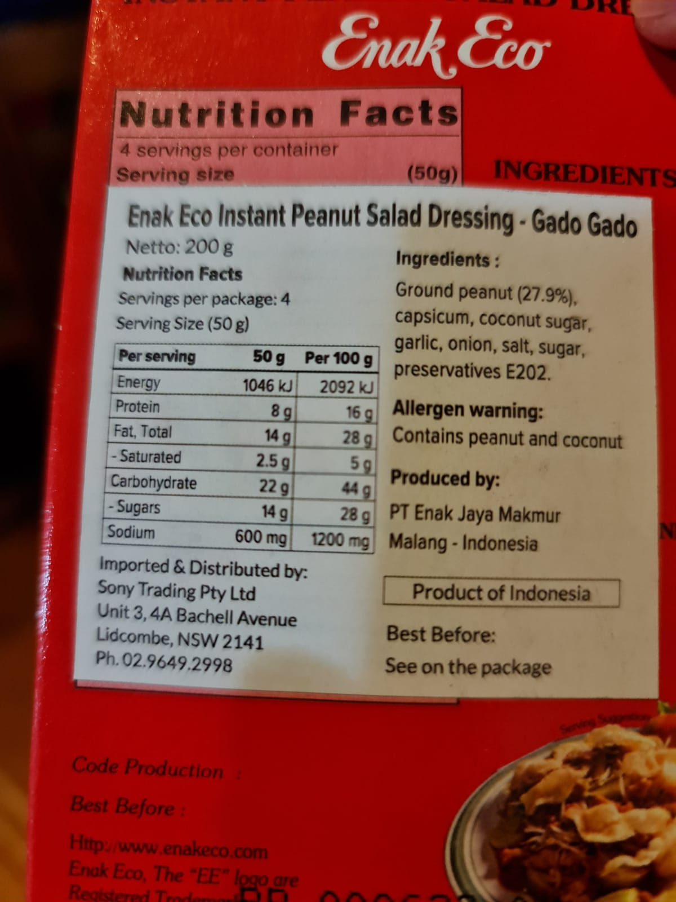

---

# Documentation: https://wowchemy.com/docs/managing-content/


title: "Global Value Chain dalam bumbu gado-gado"

subtitle: ""

summary: ""

authors: [admin]

tags: [perdagangan, Global Value Chain, Python, UNCOMTRADE]

categories: [perdagangan, Global Value Chain, Python, UNCOMTRADE]

date: 2021-08-31T23:27:21+10:00

lastmod: 2021-08-31T23:27:21+10:00

featured: false

draft: false


# Featured image

# To use, add an image named `featured.jpg/png` to your page's folder.

# Focal points: Smart, Center, TopLeft, Top, TopRight, Left, Right, BottomLeft, Bottom, BottomRight.

image:

  caption: "Produk dengan kode HS 21039019"

  focal_point: ""

  preview_only: false


# Projects (optional).

#   Associate this post with one or more of your projects.

#   Simply enter your project's folder or file name without extension.

#   E.g. `projects = ["internal-project"]` references `content/project/deep-learning/index.md`.

#   Otherwise, set `projects = []`.

projects: []

---


Hari ini saya sarapan gado-gado. Menurut saya, gado-gado (dan bumbu kacang secara umum) adalah sebuah fenomena yang luar biasa. Meskipun kacang pertama kali [diperkenalkan oleh Portugis yang dibawa dari Mexico](https://en.wikipedia.org/wiki/Peanut_sauce), Masyarakat Indonesialah yang pertama kali membuat bumbu kacang. Bumbu kacang ini sungguh _versatile_ karena bisa dicampur apa aja. Dikasih sayur, bisa. Kasih gorengan, enak. Nasi uduk, hayu. Buat bumbu ayam bakar, ya bisa (alias jadi sate).


Orang bule juga ternyata sangat menyukai bumbu kacang. Seperti kita ketahui, orang bule kalo sarapan suka pake roti yang diolesin selai kacang. Tentunya sungguh wajar jika mereka juga suka bumbu kacang. Daripada salad dressing a la eropa, jelas lah enakan gado-gado. wkwkwk. Kesukaan rang bule akan bumbu kacang (ditambah dengan banyaknya orang Asia dan orang Indonesia di Australia) memberikan skala ekonomi yang cukup untuk importir bumbu kacang.


Tentunya sebagai insan yang ga bisa masak, saya lebih suka pake bumbu kacang yang udah jadi. Praktis. ga perlu ngulek-ngulek. Ntar kalo bikin sendiri mah udahlah nguleknya capek, makan waktu, kagak enak pula! Udahla mending kita beli bumbu jadi aja. Praktis dan udah pasti rasanya oke.


Saya suka beli bumbu ini, yang namanya "Enak Eco", beli di toko Vietnam deket rumah. Harganya sekitar A$4. Mantap ya. Export quality wkwkw. Diekspor dari mana sih benda ini?





Ternyata bumbu ini adalah karya anak bangsa. Made in Malang, tepatnya diproduksi oleh PT Enak Jaya Makmur. Diimpor oleh Sony Trading di New South Wales.


## Cabe lalu gado-gado: peran Global Value Chain


Beberapa waktu lalu, saya sempet bikin postingan tentang [impor cabe](https://krisna.or.id/post/cabe) yang ternyata lumayan banyak peminatnya. Memang ketika itu situasinya adalah harga cabe sedang rendah, sehingga petani merugi. Di postingan tersebut juga saya memperlihatkan bahwa cabe mentah sudah dibatasi impornya, sementara cabe kering impornya bebas.


Katanya sih cabe mentah dikonsumsi oleh masyarakat, sementara cabe kering dikonsumsi oleh industri. Meskipun ternyata ga juga, akan tetapi tidak dapat kita pungkiri bahwa industri berperan besar dalam mengimpor cabe, terutama melihat betapa [besarnya pertumbuhan industri makanan dan minuman](https://www.wartaekonomi.co.id/read323825/industri-makanan-minuman-masih-jadi-andalan-di-2021) di Indonesia.


Menggunakan produk impor untuk diolah di dalam negeri menjadi produk ekspor bukanlah hal baru. Sejak zaman di mana banyak negara melakukan perjanjian dagang, adalah hal lumrah bagi perusahaan di suatu negara untuk menggunakan bahan baku dari negara lain. Seperti halnya coklat belgia yang cokelatnya datang dari pantai gading, gado-gado Indonesia pun cabenya datang dari negara lain. Vietnam, negara yang sejatinya berteknologi rendah, dapat menjadi eksportir ponsel pintar besar dunia karena mengimpor komponen. Ekonom memakai istilah "Global Value Chain" (GVC) untuk mendeskripsikan fenomena ini.


Di postingan cabe itu, kita juga jadi tahu bahwa ada negara lain yang sanggup bikin cabe lebih murah daripada Indonesia. Akan tetapi, mereka ga bisa bikin gado-gado seenak kita lho (mungkin). Hahaha. Dengan cabe yang murah, maka bumbu gado-gado juga bisa jadi murah. Akibatnya, produk ini jadi laris tidak hanya di pasar dalam negeri, tetapi juga di pasar luar negeri.


Tanpa berpanjang lebar lagi, mari kita coba cek 'kandungan internasional' di dalam bumbu gado-gado impor ini. haha.


## Ingredients dengan bantuan UN COMTRADE


Tentunya saya ga begitu paham struktur industri bumbu gado-gado. Karena itu, kita akan pake kira-kira aja. Dari bungkus belakang bumbu ini, dapat dilihat bahwa bumbunya antara lain adalah kacang tanah, cabe (capsicum), coconut sugar, bawang putih, bawang merah, garem, gula, dan pengawet.


Dari list tersebut, saya tinggal googling HS Code, untuk mendapatkan kode HS buat kita tarik datanya dari UN COMTRADE. Di sini kita sekali lagi harus bikin _caveat_ wkwkw. Pertama, Ga ada informasi bahan-bahan ini dibeli oleh PT Enak Jaya Makmur dalam bentuk apa. Misalnya, apa kacang tanahnya murni yg masih ada kulitnya? Atau udah dikupas dan disangrai? Cabe pun demikian. Basah? Kering? Bubuk? Kode HS nya beda-beda. haha! Karena tidak ada informasi ini, maka saya melakukan sedikit spekulasi. Jadi jangan terlalu percaya sama kode HS yang akhirnya saya pake wkwkwkw. Jika anda lebih tahu, kode yg saya pake di postingan ini bisa direplikasi dengan mudah, jadi bisa coba versi anda sendiri. Atau lebih baik lagi, kasih tau saya resep yg benernya melalui [twitter](https://twitter.com/iMedKrisna) wkwkwk.


Seperti halnya postingan cabe, kita tarik data-data yang diperlukan pake API dari [UN COMTRADE](https://comtrade.un.org/Data/).


```python
# cari api key-nya di https://comtrade.un.org/Data/

api_key='/api/get?max=502&type=C&freq=A&px=HS&ps=2019&r=360&p=0&rg=2%2C1&cc=200811%2C170290%2C070320%2C070310%2C071220%2C250100%2C291619%2C170111%2C090421%2C170114'

url='https://comtrade.un.org/'+api_key+'&fmt=csv'

gado2=pd.read_csv(url)

gado2=gado2[['Year','Trade Flow','Commodity Code', 'Commodity',

           'Netweight (kg)', 'Trade Value (US$)']]
```

Setelah kita download datanya, lalu saya coba perlihatkan deskripsi dari komoditas yang saya pake. Itu 4 komoditas pertama harusnya ada 0 di depannya (jadi 070310, 6 digit) tapi saya terlalu malas untuk konversi jadi biar aja jadi 5 digit wkwkw.


```python
pd.set_option('display.max_colwidth', None) # show full content of a column

desc=gado2[['Commodity Code','Commodity']] # ambil cuma kode dan nama barang

desc.drop_duplicates() # print
```


<div>
<style scoped>
    .dataframe tbody tr th:only-of-type {
        vertical-align: middle;
    }

    .dataframe tbody tr th {
        vertical-align: top;
    }

    .dataframe thead th {
        text-align: right;
    }
</style>
<table border="1" class="dataframe">
  <thead>
    <tr style="text-align: right;">
      <th></th>
      <th>Commodity Code</th>
      <th>Commodity</th>
    </tr>
  </thead>
  <tbody>
    <tr>
      <th>0</th>
      <td>70310</td>
      <td>Vegetables, alliaceous; onions and shallots, fresh or chilled</td>
    </tr>
    <tr>
      <th>2</th>
      <td>70320</td>
      <td>Vegetables, alliaceous; garlic, fresh or chilled</td>
    </tr>
    <tr>
      <th>4</th>
      <td>71220</td>
      <td>Vegetables; onions, whole, cut, sliced, broken or in powder but not further prepared, dried</td>
    </tr>
    <tr>
      <th>6</th>
      <td>90421</td>
      <td>Spices; fruits of the genus Capsicum or Pimenta, dried, neither crushed nor ground</td>
    </tr>
    <tr>
      <th>8</th>
      <td>170114</td>
      <td>Sugars; cane sugar, raw, in solid form, other than as specified in Subheading Note 2 to this chapter, not containing added flavouring or colouring matter</td>
    </tr>
    <tr>
      <th>10</th>
      <td>170290</td>
      <td>Sugars; n.e.c. in heading no. 1702, including invert sugar and other sugar and sugar syrup blends containing, in the dry state, 50% by weight of fructose</td>
    </tr>
    <tr>
      <th>12</th>
      <td>200811</td>
      <td>Nuts; ground-nuts, whether or not containing added sugar, other sweetening matter or spirit</td>
    </tr>
    <tr>
      <th>14</th>
      <td>250100</td>
      <td>Salt (including table salt and denatured salt); pure sodium chloride whether or not in aqueous solution; sea water</td>
    </tr>
    <tr>
      <th>16</th>
      <td>291619</td>
      <td>Acids; unsaturated acyclic monocarboxylic, cyclic monocarboxylic, their anhydrides, halides, peroxides and peroxyacids; their halogenated, sulphonated, nitrated or nitrosated derivatives, n.e.c. in item no. 2916.1</td>
    </tr>
  </tbody>
</table>
</div>


Seperti dapat dilihat, deskripsinya agak panjang dan njelimet wkwk. Saya sertakan juga bubuk bawang di situ. Untuk cabe, saya pake cabe kering. Saya ga gitu tau Coconut sugar pake HS yg mana, tapi jadinya di sini saya pake 170290. Feel free to disagree with my choices hahaha.


Oh iya satu lagi, saya pake data tahun 2019. 2020 ada tapi takut rusak gara-gara COVID. 2019 harusnya ga jauh beda dengan business as usual.


Okeh, setelah dapat barang-barang yang mau dilirik, mari kita tampilkan ekspor dan impornya bahan-bahan ini.


```python
## Tarik ekspor doang

x1=gado2.query('`Trade Flow`=="Export"').reset_index()

x1=x1[['Commodity Code','Netweight (kg)','Trade Value (US$)']]

x1=x1.rename(columns={"Netweight (kg)": "Ekspor (kg)",

                                          "Trade Value (US$)": "Ekspor (US$)"})

## Tarik impor doang

m1=gado2.query('`Trade Flow`=="Import"').reset_index()

m1=m1[['Commodity Code','Netweight (kg)','Trade Value (US$)']]

m1=m1.rename(columns={"Netweight (kg)": "Impor (kg)",

                                          "Trade Value (US$)": "Impor (US$)"})

## Gabung dan bikin tabelnya enak dilihat

gabung=pd.merge(x1,m1,on='Commodity Code',how='outer')

gabung['Product description']=['Onion/Shallot','Garlic','Onion Powder','Dried Chili','Cane Sugar','Coconut Sugar','Ground-nuts','salt',

                 'Perservatives']

gabung=gabung[['Commodity Code','Product description','Ekspor (kg)','Impor (kg)','Ekspor (US$)','Impor (US$)']]

## Print dengan format thousand separated by comma

gabung.style.format({"Ekspor (kg)": "{:,.0f}", "Impor (kg)": "{:,.0f}"

                    , "Ekspor (US$)": "{:,.0f}", "Impor (US$)": "{:,.0f}"})
```


<style type="text/css">
</style>
<table id="T_8adc3_">
  <thead>
    <tr>
      <th class="blank level0" >&nbsp;</th>
      <th class="col_heading level0 col0" >Commodity Code</th>
      <th class="col_heading level0 col1" >Product description</th>
      <th class="col_heading level0 col2" >Ekspor (kg)</th>
      <th class="col_heading level0 col3" >Impor (kg)</th>
      <th class="col_heading level0 col4" >Ekspor (US$)</th>
      <th class="col_heading level0 col5" >Impor (US$)</th>
    </tr>
  </thead>
  <tbody>
    <tr>
      <th id="T_8adc3_level0_row0" class="row_heading level0 row0" >0</th>
      <td id="T_8adc3_row0_col0" class="data row0 col0" >70310</td>
      <td id="T_8adc3_row0_col1" class="data row0 col1" >Onion</td>
      <td id="T_8adc3_row0_col2" class="data row0 col2" >8,786,797</td>
      <td id="T_8adc3_row0_col3" class="data row0 col3" >111,934,997</td>
      <td id="T_8adc3_row0_col4" class="data row0 col4" >10,588,352</td>
      <td id="T_8adc3_row0_col5" class="data row0 col5" >56,596,401</td>
    </tr>
    <tr>
      <th id="T_8adc3_level0_row1" class="row_heading level0 row1" >1</th>
      <td id="T_8adc3_row1_col0" class="data row1 col0" >70320</td>
      <td id="T_8adc3_row1_col1" class="data row1 col1" >Garlic</td>
      <td id="T_8adc3_row1_col2" class="data row1 col2" >25,804</td>
      <td id="T_8adc3_row1_col3" class="data row1 col3" >465,344,332</td>
      <td id="T_8adc3_row1_col4" class="data row1 col4" >11,977</td>
      <td id="T_8adc3_row1_col5" class="data row1 col5" >529,965,497</td>
    </tr>
    <tr>
      <th id="T_8adc3_level0_row2" class="row_heading level0 row2" >2</th>
      <td id="T_8adc3_row2_col0" class="data row2 col0" >71220</td>
      <td id="T_8adc3_row2_col1" class="data row2 col1" >Onion Powder</td>
      <td id="T_8adc3_row2_col2" class="data row2 col2" >6,224</td>
      <td id="T_8adc3_row2_col3" class="data row2 col3" >6,098,177</td>
      <td id="T_8adc3_row2_col4" class="data row2 col4" >19,052</td>
      <td id="T_8adc3_row2_col5" class="data row2 col5" >17,914,797</td>
    </tr>
    <tr>
      <th id="T_8adc3_level0_row3" class="row_heading level0 row3" >3</th>
      <td id="T_8adc3_row3_col0" class="data row3 col0" >90421</td>
      <td id="T_8adc3_row3_col1" class="data row3 col1" >Dried Chili</td>
      <td id="T_8adc3_row3_col2" class="data row3 col2" >321,959</td>
      <td id="T_8adc3_row3_col3" class="data row3 col3" >39,132,270</td>
      <td id="T_8adc3_row3_col4" class="data row3 col4" >934,735</td>
      <td id="T_8adc3_row3_col5" class="data row3 col5" >65,280,761</td>
    </tr>
    <tr>
      <th id="T_8adc3_level0_row4" class="row_heading level0 row4" >4</th>
      <td id="T_8adc3_row4_col0" class="data row4 col0" >170114</td>
      <td id="T_8adc3_row4_col1" class="data row4 col1" >Cane Sugar</td>
      <td id="T_8adc3_row4_col2" class="data row4 col2" >124,025</td>
      <td id="T_8adc3_row4_col3" class="data row4 col3" >3,965,555,215</td>
      <td id="T_8adc3_row4_col4" class="data row4 col4" >113,024</td>
      <td id="T_8adc3_row4_col5" class="data row4 col5" >1,317,595,639</td>
    </tr>
    <tr>
      <th id="T_8adc3_level0_row5" class="row_heading level0 row5" >5</th>
      <td id="T_8adc3_row5_col0" class="data row5 col0" >170290</td>
      <td id="T_8adc3_row5_col1" class="data row5 col1" >Coconut Sugar</td>
      <td id="T_8adc3_row5_col2" class="data row5 col2" >39,810,415</td>
      <td id="T_8adc3_row5_col3" class="data row5 col3" >91,207,379</td>
      <td id="T_8adc3_row5_col4" class="data row5 col4" >53,547,449</td>
      <td id="T_8adc3_row5_col5" class="data row5 col5" >71,438,428</td>
    </tr>
    <tr>
      <th id="T_8adc3_level0_row6" class="row_heading level0 row6" >6</th>
      <td id="T_8adc3_row6_col0" class="data row6 col0" >200811</td>
      <td id="T_8adc3_row6_col1" class="data row6 col1" >Ground-nuts</td>
      <td id="T_8adc3_row6_col2" class="data row6 col2" >2,768,870</td>
      <td id="T_8adc3_row6_col3" class="data row6 col3" >3,126,465</td>
      <td id="T_8adc3_row6_col4" class="data row6 col4" >8,220,574</td>
      <td id="T_8adc3_row6_col5" class="data row6 col5" >5,334,185</td>
    </tr>
    <tr>
      <th id="T_8adc3_level0_row7" class="row_heading level0 row7" >7</th>
      <td id="T_8adc3_row7_col0" class="data row7 col0" >250100</td>
      <td id="T_8adc3_row7_col1" class="data row7 col1" >salt</td>
      <td id="T_8adc3_row7_col2" class="data row7 col2" >542,077</td>
      <td id="T_8adc3_row7_col3" class="data row7 col3" >2,595,397,085</td>
      <td id="T_8adc3_row7_col4" class="data row7 col4" >155,069</td>
      <td id="T_8adc3_row7_col5" class="data row7 col5" >95,522,423</td>
    </tr>
    <tr>
      <th id="T_8adc3_level0_row8" class="row_heading level0 row8" >8</th>
      <td id="T_8adc3_row8_col0" class="data row8 col0" >291619</td>
      <td id="T_8adc3_row8_col1" class="data row8 col1" >Perservatives</td>
      <td id="T_8adc3_row8_col2" class="data row8 col2" >2,229</td>
      <td id="T_8adc3_row8_col3" class="data row8 col3" >2,277,642</td>
      <td id="T_8adc3_row8_col4" class="data row8 col4" >13,200</td>
      <td id="T_8adc3_row8_col5" class="data row8 col5" >11,570,694</td>
    </tr>
  </tbody>
</table>


Seperti dapat dilihat pada tabel di atas, hampir semua bahan-bahan yang saya gunakan di sini memiliki impor yang jauh lebih tinggi daripada ekspornya. Dengan kata lain, kemungkinan kandungan internasionalnya (setidaknya dari sisi bahan baku) cukup tinggi. Bumbu gado-gado ternyata adalah produk GVC!! Kita beli bahan baku dari negara lain, kita olah, lalu kita jual lagi ke berbagai pasar di belahan dunia. Di konsep GVC, kita bisa bilang PT Eka melakukan "Backward participation". Ga salah emang kalo Indonesia dibilang surganya makanan!

GVC tidak dapat dilaksanakan apabila terdapat hambatan di dalam perdagangan. Perusahaan seperti PT Enak Jaya di Malang ini harus memiliki kepastian berusaha yang baik. Biasanya ketika kita dengar kepastian berusaha, yang ada di kepala kita adalah izin operasi. Akan tetapi, untuk perusahaan yang bergerak di bidang yang tinggi GVC (seperti PT Enak Jaya ini), kepastian akan kemudahan mengimpor menjadi sangat penting. Ketika 1 saja bahan di atas terhalang akses impornya, mereka harus mencari sumber domestik yang harga dan kualitasnya serupa. Seandainya tidak ada bahan baku dengan harga dan kualitas yang sama di dalam negeri, maka mereka terancam harus berhenti beroperasi. GVC yang "terlalu" tinggi (banyak yang menyebutnya dengan hyperglobalization) membuat satu saja gangguan suplai dari suatu negara akan mengganggu seluruh proses produksi. Contoh yang paling rame saat ini adalah [berhentinya produksi mobil karena adanya krisis chip global](https://www.nytimes.com/2021/04/23/business/auto-semiconductors-general-motors-mercedes.html).

GVC telah terbukti secara empiris mengankat ekonomi berbagai negara seperti RRT, Vietnam dan Bangladesh. Berkat GVC, kita ga harus bisa produksi semua barang. Setiap negara dapat berkonsentrasi mengerjakan apa yang ia ahli kerjakan. Contoh paling enak sih ya lagi-lagi Vietnam, negara yang banyak penduduknya bisa merakit, tapi tidak bisa mengembangkan teknologi pembuatan komponen semi konduktor. Mereka tinggal "mengimpor" bahan baku teknologi tinggi tersebut, sehingga masyarakat bisa membuat ponsel. Di negeri pembuat komponen, harga buruhnya terlalu mahal. Di sinilah peluang bagi Vietnam untuk memberi sumbangsih pada GVC.

_But at what cost?_

## Kebijakan pembatasan impor

GVC memberikan kesempatan bagi setiap negara untuk berkonsentrasi pada proses produksi yang paling ia kuasai, sehingga ada "surplus" yang dihasilkan dari efisiensi tersebut. Tapi tentunya ada sisi buruk dari globalisasi. _trade creates winners and losers_. Siapa yang menjadi "loser" dalam kasus ini?

Di contoh Vietnam tadi, tenaga kerja _low skill_ memang banyak dimiliki Vietnam dan upahnya murah. Akan tetapi, tenaga _low skill_ di negara maju menjadi korbannya. Karena mereka tidak sanggup bekerja dengan gaji semurah Vietnam, mereka jadi kehilangan pekerjaan dan harus mencari kerjaan lain. Sayangnya, pekerjaan di negara maju yang gajinya gede adalah pekerjaan-pekerjaan _high skill_, dan tidak mudah bagi mereka untuk bertransformasi ke pekerjaan tersebut. [Autor dkk (2013)](https://www-jstor-org.virtual.anu.edu.au/stable/42920646?pq-origsite=summon&seq=1#metadata_info_tab_contents) [^1] menemukan terjadinya lonjakan pengangguran setelah impor (terutama baja) dari RRT membanjiri Amerika Serikat (AS). Banyak yang mengatakan bahwa para tenaga kerja yang terdampak inilah yang menghasilkan pemilih Donald Trump menjadi Presiden AS. Begitu terpilih, doi langsung memasang tarif terhadap produk baja.

Indonesia tidak perlu menunggu Donald Trump untuk membatasi impor. Diantara bahan-bahan yang saya pake di atas, sebagian mengalami pembatasan impor, dan sebagian lain dapat diimpor secara bebas. Bawang merah, bawang putih, gula, kacang dan garam adalah barang-barang yang impornya diregulasi. Dengan kata lain, pemerintah menerapkan kuota impor, di mana hanya perusahaan tertentu yang ditunjuk oleh negara (biasanya BUMN) yang boleh impor.

Pembatasan ini dirasa perlu karena Pemerintah berupaya melindungi petani, peternak dan nelayan di Indonesia dari kompetisi internasional. Indonesia memang memiliki beragam masalah dalam memajukan sektor pertanian. Solusi paling mudah dan populer adalah dengan melakukan pembatasan impor. Kenapa bisa populer ya? Ntahlah.

## Efek Domino Pembatasan Impor ke Industri

Problem utama dari pembatasan impor adalah efeknya kepada konsumen dan industri hilir. Dampak langsung kepada konsumen (termasuk petani itu sendiri) dapat dilihat dari inflasi. Memang sebagian besar strategi impor pemerintah adalah untuk mengendalikan harga dan inflasi. Seperti kata akun ini:

<blockquote class="twitter-tweet"><p lang="in" dir="ltr">Karena semua komoditi itu penyumbang utama perhitungan inflasi.<br><br>Jadi kebijakan ngga melihat apakah petani hancur penghasilannya dengan impor besar-besaran saat panen, tapi karena itu kesempatan paling efektif menekan rata-rata inflasi setahun. <a href="https://t.co/k4OxVm72Qb">https://t.co/k4OxVm72Qb</a></p>&mdash; Rulie Maulana (@ruliemaulana) <a href="https://twitter.com/ruliemaulana/status/1431263577944457219?ref_src=twsrc%5Etfw">August 27, 2021</a></blockquote> <script async src="https://platform.twitter.com/widgets.js" charset="utf-8"></script> 

Tentunya cabe agak beda ya, karena cabe merah bener-bener distop impornya, sementara cabe kering dan cabe bubuk tidak kena pembatasan. Tapi untuk barang-barang lain, twit di atas cenderung benar.

Dampak langsung juga dirasakan oleh industri hilir. Ketika harga bahan baku naik, maka harga produk turunannya juga akan naik. Seandainya PT Enak harus membeli bahan baku dengan harga lebih mahal, otomatis harga bumbu gado-gadonya akan naik. Jika pembatasan perdagangannya sangat-sangat ketat, sementara domestik tidak bisa suplai bahan baku yang kompetitif, akan ada dua kemungkinan. Pertama, PT Enak bisa jadi memilih untuk pindah negara, dan beroperasi di negara yang boleh impor bahan baku dengan relatif lebih bebas. Kemungkinan kedua, PT Enak akan tetap operasi di Indonesia dan menaikkan harga. Tapi jika harganya terlalu tinggi, PT Enak akan kalah bersaing dari perusahaan yang ada di negara yang membolehkan impor. Ekspornya bisa jadi berkurang, atau malah bumbu gado-gado impor akan mulai menarik bagi konsumen Indonesia. Jika ini yang terjadi, kemungkinan PT Enak akan melobi pemerintah dan minta diproteksi juga.

Di kasus tarif baja AS, tidak lama setelahnya, Trump harus [memberlakukan tarif kepada mesin cuci](https://www.economist.com/finance-and-economics/2021/02/11/washing-machines-reveal-how-trade-and-competition-are-linked) karena industri pembuatan mesin cuci di AS kalah bersaing dengan mesin cuci impor yang bajanya ga kena tarif. Kalau di Indonesia, mungkin contoh paling baik adalah tekstil. Ketika bahan-bahan tekstil kena kuota impor, maka harga baju jadi mahal. Akhirnya industri baju juga minta diproteksi dengan pembatasan impor. 

Dampak pada industri hilir ini secara tidak langsung akan dirasakan oleh konsumen.

## Pembatasan impor adalah soal keberpihakan

Pada prinsipnya, kebijakan pembatasan impor adalah sebuah keberpihakan. Ketika pemerintah memberlakukan kuota impor atau tariff pada industri hulu (seperti agraris), maka pemerintah sedang berpihak pada industri hulu dengan mengorbankan industri hilir. Begitupun sebaliknya. Jika proteksi diberlakukan pada dua-duanya? Korbannya tentu saja adalah konsumen. Di samping itu, ekonomi yang terlalu proteksionis akan memiliki masalah dalam bersaing di pasar global. Akhirnya kita akan ketinggal GVC, dan perdagangan secara umum akan jauh berkurang. Perusahaan PT Enak Jaya berpotensi gulung tikar atau pindah ke negara lain jika ingin tetap mempertahankan model bisnis GVC. Perlu dipertanyakan juga: ngapain kita ikut perjanjian perdagangan bebas? Apakah saatnya kita vote untuk Indonexit (voting keluar dari ASEAN gitu. Ala-ala Brexit kwkwk)?

Dari sisi konstituen? Industri agrikultur masih merupakan penyumbang tenaga kerja yang besar. Petani di Indonesia masih banyak. Tentunya jika ada pemilu, program-program pro petani akan lebih populer. 

Bagaimana dari sisi pemerintah? Coba kita bahas dari sisi baik. Sepanjang pengetahuan saya, industri manufaktur adalah penyumbang pajak mayoritas. Penting bagi pemerintah Indonesia untuk memiliki industri manufaktur yang tajir, karena duit APBN datang dari situ. Jika pemerintah ingin memaksimalkan pajak, maka wajar jika pemerintah berpihak kepada industri manufaktur. Di samping itu, Industri manufaktur juga kayaknya lebih banyak diisi pekerja yang formal daripada yang [informal](https://www.bps.go.id/indicator/6/1171/1/persentase-tenaga-kerja-informal-sektor-pertanian.html). Dari sisi ini, pajak yang dihasilkan oleh industri manufaktur dapat digunakan untuk menjalankan program yang memberikan "kompensasi" pada sektor pertanian. Hal ini lebih produktif daripada pembatasan impor.

Jika kita mau berpikir jelek, pembatasan impor juga menarik karena pembatasan impor memberikan "insentif" tertentu bagi elit-elit di pemerintahan. Udah segudang kasus korupsi yang melibatkan kuota impor. Diantara kasus korupsi kuota impor yang paling terkenal mungkin adalah [kasus suap kuota daging sapi](https://nasional.tempo.co/read/458101/suap-daging-pks-begini-awal-mulanya) yang melibatkan petinggi penting sebuah parpol. Namun kasus korupsi juga tidak jauh dari bumbu gado-gado yang saya beli. Diantaranya kasus suap [kuota bawang putih](https://nasional.tempo.co/read/1290541/bin-dituduh-punya-jatah-dalam-kasus-suap-impor-bawang-putih/full&view=ok), yang akhirnya pelakunya dipenjara meskipun di bawah tuntutan. Di samping itu, ada juga kasus [korupsi gula](https://nasional.tempo.co/read/1341932/suap-impor-gula-kpk-tuntut-eks-bos-ptpn-iii-6-tahun-penjara) yang melibatkan eks bos BUMN gula, dan ada juga tersangka [pengadaan garam impor](https://tirto.id/korupsi-dan-sengkarut-pengelolaan-garam-cqvi). Suap-menyuap ini, [menurut KPPU](https://bisnis.tempo.co/read/1454576/kppu-ingatkan-pemerintah-soal-potensi-rente-impor-garam/full&view=ok), diakibatkan oleh buruknya transparansi penunjukkan perusahaan yang berhak mendapatkan kuota.

Jadi kalo pemerintah bilang pembatasan impor adalah demi rakyat, ya mungkin bisa dipikir-pikir lagi wkwkw.

Oh ya, Tidak semua jeleknya pembatasan impor adalah terkait kasus korupsi. kadang pengendalian perdagangan juga tidak sempurna dan mengakibatkan adanya barang ilegal atau palsu, seperti di kasus [bawang merah](https://www.merdeka.com/uang/pemerintah-dituding-berperan-ciptakan-kasus-bawang-merah-palsu.html).

Salah satu penelitian yang mencoba mendokumentasikan hal-hal ini ditulis oleh kolega saya Felippa Amanta yang bisa dibaca di [sini](https://repository.cips-indonesia.org/media/341330-dampak-negatif-kebijakan-perdagangan-non-d6b37e99.pdf).

Mungkin juga ada alasan yang lebih fundamental, Lebih ideologis akan alasan kenapa kita mau memproteksi petani. Apa artinya efisien jika identitas kita sebagai negara agraris terkikis? Jika identitas sebuah bangsa adalah berdasarkan produk yang dia ekspor, apa mau kita berubah dari negara agraris jadi negara CPO? Atau negara pembuat gado-gado? Semua demi efisiensi?

Yha pada akhirnya ini adalah pertanyaan politik, bukan ekonomi. Ekonomi mah cuma sebuah alat aja, untuk membantu para pembuat visi untuk mencapai visi tersebut. Jika masyarakat memilih untuk menjaga identitas sebagai negara agraris dengan mengabaikan efisiensi, maka tentu itu wajar-wajar saja.

## Win-win solution?

Saya ga ngerti juga kenapa banyak negara mengedepankan solusi anti impor ketimbang solusi yang lebih mendasar. Sudah lama Indonesia menerapkan proteksionisme pada industri-industrinya, tapi produktivitasnya tidak kunjung membaik. Taraf hidup petani tidak juga membaik. Bagaimana dengan solusi yang tidak melibatkan proteksi perdagangan internasional? Apakah tidak ada solusi untuk meningkatkan produktivitas petani? Jika kita berhasil meningkatkan produktivitas petani, maka produktivitas manufaktur juga akan tertolong secara otomatis. Dengan begitu, kita tidak lagi perlu proteksi. Kita bisa bersaing dengan negara lain!

Ini pertanyaan yang nanti bisa kemana-mana lagi jawabannya wkwkw. Tapi sepanjang yang saya tau, kita punya program subsidi pupuk dan subsidi bibit. Tapi program [subsidi pupuk](https://news.detik.com/berita-jawa-timur/d-5376557/kejaksaan-tetapkan-satu-tersangka-korupsi-pupuk-bersubsidi-di-jombang) dan [subsidi bibit](https://majalah.tempo.co/read/hukum/141840/benih-bersubsidi-bersemai-korupsi) juga tidak terlepas dari kasus korupsi. wkwkk.

Di samping itu, program-program seperti subsidi memerlukan pendanaan dari APBN. Sementara itu, tidak perlu dana ekstra untuk melakukan pembatasan impor. Jadi meskipun sama-sama dikorup, pembatasan impor lebih "hemat anggaran". Di mata Kementerian yang memikirkan pembiayaan APBN, mungkin mendingan melakukan pembatasan impor daripada membiayai program-program baru yang akan dijalankan oleh Kementerian yang efisiensinya perlu dipertanyakan. Ini mungkin lho!

Tapi oke deh Sekian dulu postingan ini! Mari kita selalu optimis menjadi bangsa yang besar, maju, dan berdaya saing! Dan tetap makan gado-gado!

[^1]: Autor, D., Dorn, D., & Hanson, G. (2013). The China Syndrome: Local Labor Market Effects of Import Competition in the United States. <i>The American Economic Review,</i> <i>103</i>(6), 2121-2168. Retrieved September 1, 2021, from http://www.jstor.org/stable/42920646