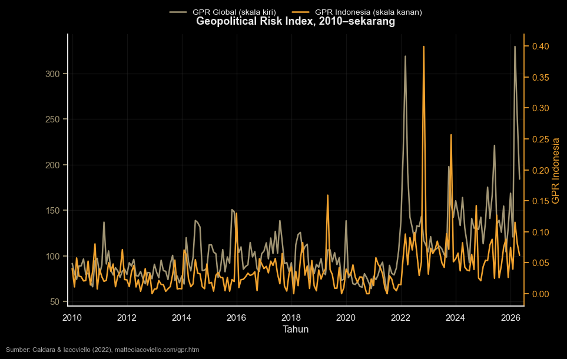

Indonesia (dan beberapa negara lain) tengah [diinvestigasi AS](../excap/) untuk kemudian dikenai tarif. Alasan pengenaan tarif ini adalah alasan ekonomi, yaitu terkait keseimbangan perdagangan barang AS terhadap Indonesia. Meski demikian, perjanjian ART berpotensi [mengalienasi China](https://www.hinrichfoundation.com/research/wp/trade-geopolitics/indonesia-trade-policy-amid-us-china-rivalry) dan membatasi kedaulatan suatu negara dalam menentukan hubungan dagangnya dengan negara lain. Dengan kata lain, beberapa provisi dalam ART sangat erat kaitannya dengan pertahanan / _security_.

Penggunaan instrumen ekonomi (dalam hal ini permintaan domestik AS yang besar) untuk mencapai tujuan politik (dalam hal ini rivalitas AS-China), yang disebut juga dengan geoekonomi, merupakan sebuah cabang baru dari disiplin ilmu ekonomi politik. [Artikel survei](https://www.econstor.eu/bitstream/10419/310330/1/1916697089.pdf) dari Kiel Institute[^1] mendefinisikan geoekonomi dengan

> the field of study that examines the links between geopolitics and economics

ga menolong ya definisinya ha ha ha ha. Geopolitics sendiri adalah sebuah studi tentang persaingan antar negara untuk memengaruhi sebuah wilayah/negara dan penduduknya. Contoh yang relatif baru mungkin adalah penggunaan sanksi/embargo ekonomi oleh AS untuk mendorong Iran menghentikan program nuklirnya. Ada juga sanksi oleh AS untuk [Francesca Albanese](https://www.reuters.com/world/europe/us-puts-un-expert-albanese-back-list-sanctioned-individuals-treasury-website-2026-05-27/), seorang aktivis kemanusiaan, karena mendorong investigasi ICC untuk genosida rakyat Palestina oleh Israel. Pemotongan akses gas oleh Rusia ke Eropa untuk mencegah Eropa membantu Ukraina juga dapat dianggap geoekonomi.

Tapi ada contoh lebih jadul yang menggunakan alat perdagangan internasional. Jesús Fernández-Villaverde mencontohkan [situasi pada 1915](https://www.youtube.com/watch?v=ezzVhAA-ABc). Ketika itu, Inggris menggunakan kekuatannya sebagai pemasok batubara dan hulu tekstil untuk memaksa Italia bergabung dengan Inggris dalam perang dunia pertama. Inggris mengancam pemblokiran pasokan barang-barang penting untuk Italia jika Italia tidak membantu Inggris dalam perang dunia ke-1. Jadi, geoekonomi sebenarnya bukan konsep baru, tapi konsep lama yang hidup kembali.

Bahkan, studi tentang hubungan antara perdagangan dan kekuatan (_trade and power_) sudah berlangsung sejak lama. Prinsip utamanya adalah, integrasi ekonomi dapat meningkatkan kekuatan nasional, tapi membuka peluang akan ketergantungan dan risiko internasional.

Perdagangan internasional dengan prinsip _comparative advantage_ menyatakan bahwa perdagangan internasional akan mendorong kesejahteraan dan output ekonomi karena setiap negara fokus membuat barang yang pandai dibuatnya, dan tidak membuat barang yang ia tidak pandai buat. Untuk barang yang tidak dibuat di negaranya, dia akan membelinya dari negara yang pandai membuat barang tersebut.

Dengan merelaksasi "restriksi" bahwa trade balance harus 0, sebuah negara bisa saja menjual barang lebih banyak dari yang ia beli dengan meningkatkan cadangan devisa (alias, surplus trade balance diseimbangkan dengan foreign asset purchases/surplus financial acoount). Hal ini dapat memaksimalkan kesejahteraan jangka panjang untuk kasus misalnya negara dengan sumber daya alam non-terbarukan yang kaya dan membuat SWF seperti Arab Saudi dan Norwegia. Namun secara umum, meningkatkan cadangan devisa mengurangi kesejahteraan dan konsumsi global setidaknya dalam jangka pendek.

Mendorong trade balance untuk senantiasa positif untuk mengumpulkan cadev sering disebut dengan konsep merkantilis. Merkantilis merupakan konsep yang cukup usang karena ia tidak memaksimalkan kesejahteraan, tapi cadev acapkali berguna untuk geopolitik dan konsep merkantilis seringkali hidup kembali di situasi di mana risiko geopolitik meningkat[^2].

Surveynya seru banget. mereka mendokumentasikan literatur yang sangat besar dan dalam di geoekonomi. Particularly salah satu yang menarik adalah peran hegemon yang bisa mendorong ekstraksi ke ekonomi yang lebih kecil, tapi di sisi lain menyelesaikan masalah klasik _public goods_ seperti penindakan kontrak, keamanan, dan hub-spoke. Secara spesifik, hegemon/great powers memfasilitasi perdagangan di dalam networknya. Kehadiran hegemon mendorong lebih banyak terbitnya perjanjian. Udah gitu, negara kecil yang punya perjanjian dengan hegemon typically meningkat perdagangannya tidak hanya dengan si hegemon tapi juga dengan negara-negara kecil lain yang ada di network-nya si hegemon.

Diskusi soal pandanga liberalis dan realis juga menarik. Liberalis mengatakan bahwa integrasi ekonomi akan membuat perang semakin jarang karena biaya peluang yang tinggi (damai lebih menguntungkan daripada berantem). Realis berkata sebaliknya: Integrasi ekonomi bikin konflik makin mungkin. Studi empiris menemukan bahwa globalisasi membuat perang gede lebih jarang terjadi, tapi perang kecil-kecil lebih mungkin karena dalam situasi free trade, berganti trading partner menjadi lebih mudah.

Di trade ada beberapa paper yang menarik. Tentu yang paling terkenal adalah Caldara dan Iacoviello, "Measuring Geopolitical Risk", dengan index berbasis berita[^3]. Aiyar, Presbitero, and Ruta membuat survey untuk mengukur tanda-tanda "friendshoring" dengan indikator seperti voting pattern di UN General Assembly[^4]. Fernandez-Villaverde, Mineyama, dan Song malah bikin indeks fragmentasi yang lebih komprehensif[^5][^6].

Kedepannya sepertinya literatur di geoekonomi akan semakin kaya, terutama dengan pemanfaatan data-data mikro yang semakin detil. Saya sendiri merupakan seorang yang cinta damai dan sangat gak suka dengan konflik. Tapi apa boleh buat, sepertinya suga gak suka, literatur perdagangan internasional akan mengarah ke geoekonomi. Sebagai ekonom dan orang Indonesia yang akan mengalami dampak geopolitik, mempelajarinya menjadi suatu tanggung jawab tersendiri.

BTW di bawah saya chart-in index-nya Caldara dan Iacoviello, diambil dari [sini](https://www.matteoiacoviello.com/gpr_country.htm).

[^1]: Mohr, Cathrin; Trebesch, Christoph (2025) : Geoeconomics, Kiel Working Paper,
No. 2279, Kiel Institute for the World Economy (IfW Kiel), Kiel

[^2]: Jaman sekarang, bank sentral sering pakai USD sebagai cadev utama. Tapi ini bisa kita anggep hal baru. Emas merupakan cadev yang lebih mainstream dalam sejarah panjang umat manusia. Nah, ngumpulin kebanyakan cadev bisa nurunin nilai cadev ketika mau dipake. Tapi iya, peningkatan permintaan emas (dan bikin harga naik) biasanya sering dikaitkan dengan peningkatan risiko geopolitik/konflik.

[^3]: Caldara, Dario, and Matteo Iacoviello. 2022. “Measuring Geopolitical Risk.” American
Economic Review 112 (4): 1194–1225.

[^4]: Aiyar, Shekhadar, Andrea F. Presbitero, and Michele Ruta, eds. 2023. Geoeconomic Fragmentation: The Economic Risks from a Fractured World Economy. CEPR Press.

[^5]:Fernandez-Villaverde, Jesus, Tomohide Mineyama, and Dongho Song. 2024. “Are We Fragmented Yet? Measuring Geopolitical Fragmentation and Its Causal Effect.” NBER
Working Paper 32638

[^6]: Penelitian lain termasuk Antras and Staiger (2012), Blanchard, Bown, and Johnson (2024), Grossman, Helpman, and Redding (2024), Alfaro and Chor (2023), Smirnyagin and
Tsyvinski (2022) dan Liu, Smirnyagin, and Tsyvinski (2024)


```python
import pandas as pd
import matplotlib.pyplot as plt
import fig_den as den

# --- Data: Geopolitical Risk Index (Caldara & Iacoviello 2022) ---
# GPR      = indeks global (rata-rata historis = 100)
# GPRC_IDN = indeks khusus Indonesia (skala jauh lebih kecil)
url = "https://www.matteoiacoviello.com/gpr_files/data_gpr_export.xls"
gpr = pd.read_excel(url, parse_dates=["month"])
gpr = gpr[gpr["month"].dt.year >= 2010]

# --- DEN house style + dark mode (latar hitam) ---
den.style()
BG, FG, GRID = "#000000", "#E8E8E8", "#3A3A3A"
plt.rcParams.update({
    "figure.facecolor": BG, "axes.facecolor": BG, "savefig.facecolor": BG,
    "text.color": FG, "axes.labelcolor": FG, "axes.titlecolor": FG,
    "xtick.color": FG, "ytick.color": FG, "axes.edgecolor": FG,
    "grid.color": GRID,
})

C_GLOBAL, C_IDN = den.TAN, den.GOLD

# Skala GPR global (58-330) jauh berbeda dari GPRC Indonesia (0-0.4),
# jadi pakai dua sumbu-y: global di kiri, Indonesia di kanan.
fig, ax = den.subplots(figsize=(10, 6))

l1, = ax.plot(gpr["month"], gpr["GPR"], color=C_GLOBAL, lw=1.8,
              label="GPR Global (skala kiri)")
ax.set_ylabel("GPR Global", color=C_GLOBAL)
ax.tick_params(axis="y", colors=C_GLOBAL)

ax2 = ax.twinx()
ax2.grid(False)
ax2.set_facecolor("none")
l2, = ax2.plot(gpr["month"], gpr["GPRC_IDN"], color=C_IDN, lw=1.8,
               label="GPR Indonesia (skala kanan)")
ax2.set_ylabel("GPR Indonesia", color=C_IDN)
ax2.tick_params(axis="y", colors=C_IDN)
ax2.spines["right"].set_visible(True)
ax2.spines["right"].set_color(C_IDN)

den.label(ax, title="Geopolitical Risk Index, 2010–sekarang", xlabel="Tahun")
ax.legend([l1, l2], [l1.get_label(), l2.get_label()],
          loc="upper center", bbox_to_anchor=(0.5, 1.12), ncol=2, frameon=False)
ax.margins(x=0.01)
fig.text(0.02, -0.02,
         "Sumber: Caldara & Iacoviello (2022), matteoiacoviello.com/gpr.htm",
         fontsize=8, color=FG, alpha=0.7)
plt.show()

```


    

    

