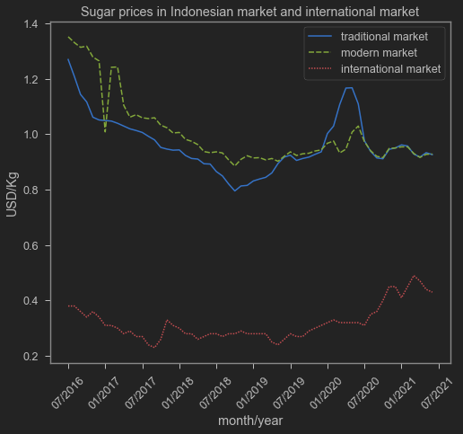
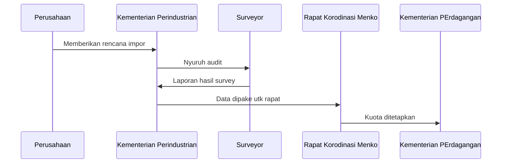
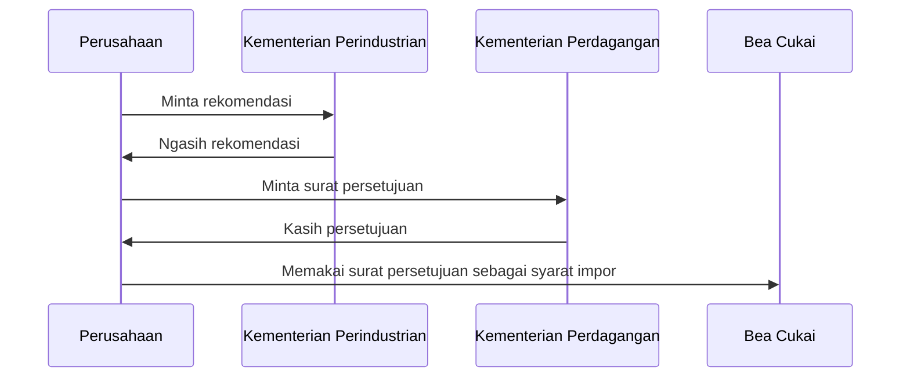

## Harga gula
Gula adalah salah satu komoditas paling penting di Indonesia. Konsumsi gula sangat Indonesia sangat tinggi. Pada 2018 saja, Indonesia mengonsumsi 26.34 kg per penduduk, jauh lebih tinggi daripada India, Vietnam dan Filipina[^1]. Hal ini bahkan terjadi di saat harga gula domestik jauh lebih tinggi daripada harga internasional[^1].

Gw ngumpulin data dari CEIC Indonesia Premium Database[^3] dan situs FAO[^4], lalu membandingkan harga gula di pasar Indonesia dengan harga gula di pasar internasional dalam sebuah grafik.


```python
url='secret!' # url is deleted because I can't freely distribute data from CEIC sorry
a=pd.read_csv(url) # taking data from google drive
a=pd.melt(a,id_vars='date',value_vars=['tprice','mprice','ip']) # melt it to fit my plot
# making a neat x axis
lol=pd.date_range('2016-07-01','2021-07-01', 
              freq='6MS').strftime("%m/%Y").tolist()
```


```python
# plotting
sns.lineplot(data=a,x='date',y='value',hue='variable',style='variable')
plt.xticks(ticks=lol,rotation=45)
plt.legend(labels=['traditional market','modern market','international market'])
plt.title('Sugar prices in Indonesian market and international market')
plt.xlabel('month/year')
plt.ylabel('USD/Kg')
```


    Text(0, 0.5, 'USD/Kg')


    

    

Seperti dapat dilihat di gambar di atas, harga gula domestik selalu lebih mahal daripada harga internasional, sekitar 3 kali lipat lah. Kok bisa ya? Berarti importir gula untung banget dong ya? Kalau gitu kita rame-rame aja yuk jadi importir gula biar kaya seperti penimbun susu beruang!

Tidak semudah itu, Ferguso. Kenapa? Karena perdagangan internasional gula dibatasi!

## Perdagangan Gula

Indonesia mengimpor hampir 70% dari kebutuhan gula domestik pada 2018[^2]. Tidak hanya warganya yang doyan gula, gula juga sangat penting bagi industri gula rafinasi. Industri gula rafinasi domestik inilah yang akhirnya menyuplai gula yang digunakan industri lain seperti makanan dan minuman. Hal ini seperti disampaikan oleh sohib saya, Risetio.

{}
sebelumnya saya nulis bahwa industri pengguna gula seperti industri makanan dan minuman termasuk yang harus mengajukan permohonan impor ke Kemenperin dan Kemendag. Namun menurut Risetio, orang yang pernah terlibat di industri ini, yang ngimpor gula sebagian besar adalah industri gula rafinasi domestik. Industri gula rafinasi inilah yang kemudian nyuplai industri lain. Si industri lainnya kayaknya ga bisa impor langsung. Lihat twitter thread di bawah ini.
{}

<blockquote class="twitter-tweet"><p lang="in" dir="ltr">Balesnya di sini aja Med. Jadi kalau baca artikel tersebut, ada 1 kesalahan paling krusial. Perusahaan industri pengguna gula (industri makanan dan minuman) TIDAK meminta rekomendasi impor maupun persetujuan impor gula.</p>&mdash; Risetioz (@risetioz) <a href="https://twitter.com/risetioz/status/1413680694774038531?ref_src=twsrc%5Etfw">July 10, 2021</a></blockquote> <script async src="https://platform.twitter.com/widgets.js" charset="utf-8"></script> 

Perdagangan gula diatur dengan [Peraturan Menteri Perdagangan Nomor 14 Tahun 2020](http://jdih.kemendag.go.id/peraturan/detail/1960/2) yang menggantikan Peraturan Menteri Perdagangan Nomor 117 Tahun 2015. Peraturan ini memberikan kuota impor. Menurut peraturan ini, impor gula hanya diperbolehkan untuk kebutuhan industri ataupun mengontrol inflasi dan memenuhi kebutuhan domestik. Seberapa banyak kuota impor pada tahun $t$ ditentukan oleh rapat koordinasi dengan Menteri Koordinator Perekonomian pada $t-1$. Ntah kenapa saya merasa ini sebenarnya arena pertarungan antara Menteri Pertanian yang meminta agar kuota rendah aja untuk melindungi petani gula, sementara Menteri Perindustrian meminta agar kuota impor tinggi aja supaya industri bisa akses bahan baku murah. Tapi bisa aja saya salah sih. ini sotoy aja wkwkw.

Nah, bagi industri pengguna gula, langkah-langkahnya kira-kira begini:


Singkatnya, perusahaan-perusahaan nyetor data kebutuhan bahan baku gula kepada Kementerian Perindustrian. Kementerian lalu menunjuk surveyor untuk memastikan bahwa data tersebut valid. Artinya, kalau kamu perusahaan kapasitas kecil tapi minta kuota banyak, jangan-jangan kamu sebenernya reseller! Surveyor fungsinya adalah untuk ngecek apakah bener permintaan impornya sesuai kapasitas. Proses ini terjadi **setiap tahun**.

Nah, setelah kuota ditetapkan, pada tahun berikutnya perusahaan ini tinggal melakukan impor! Flow-nya kira-kira begini:



Prosesnya lumayan panjang dan lama, melibatkan banyak Kementerian dan aplikasi web seperti SIINAS, INATRADE dan INSW. Kementerian bisa saja tidak memberikan 100% kuota yang diminta perusahaan. Jadi perusahaan ga pernah bener-bener tau kenapa kuota dia dipotong, trus potongannya dikasih ke siapa, atau berapa banyak sisa kuota yang belum di-claim oleh perusahaan lain[^1]. Selain itu, banyak perusahaan yang ngimpor akhirnya malah buat dijual lagi, bukannya dipake produksi[^1]

Kuota untuk dijual langsung hanya boleh dikasih ke BUMN. Perusahaan BUMN-nya ga banyak, dan ketika performa mereka kurang (misalnya timing ngelepas gula ke pasar-nya gak pas atau realisasi rendah), mereka akan tetep dapet kuota juga di tahun berikutnya[^1]. Akibatnya ga ada kompetisi dan terjadi inefisiensi[^1].

Tidak mengandalkan impor juga kayaknya susah, soalnya memang produksi juga agak bermasalah. Beberapa problem terkait dengan produktivitas lahan adalah kurangnya tenaga kerja terampil, subsidi pupuk dan bibit yang tidak diawasi dengan baik, dan penggilingan yang tidak efisien[^1]. Baik subsidi di level petani (_on-farm_) maupun revitalisasi pabrik gula (_off-farm_) sudah lama dilakukan oleh pemerintah, tapi hasilnya tetaplah gula yang harga domestiknya selalu lebih mahal.

## Neraca Komoditas sebagai solusi baru?

Sekarang ada sesuatu yang diberi nama ['Neraca Komoditas'](https://money.kompas.com/read/2021/05/04/130900726/pemerintah-godok-neraca-komoditas-apa-urgensinya-?page=all), yang merupakan sebuah data yang direncanakan memiliki informasi akan seberapa besar produksi dan konsumsi dari berbagai macam komoditas, termasuk gula. Perbedaan antara produksi dan konsumsi inilah yang nanti akan jadi kuota. Menetapkan kuota kayaknya bisa jadi sangat politis, di mana adalah perkelahian Kemenperin dan Kementan. Apalagi baru-baru ini Kemenperin baru aja keluarin aturan yang [memastikan ketersediaan bahan baku industri](https://www.antaranews.com/berita/2152478/neraca-komoditas-gula-perlu-segera-dibentuk-kata-anggota-dpr).

Neraca Komoditas sepertinya didesain untuk memotong alur proses negosiasi kuota di dalam rapat koordinasi. Saya punya impresi bahwa Kementan bawa data sendiri tentang seberapa banyak produksi tebu (dan gula?), sementara Kemenperin punya data sendiri tentang seberapa banyak gula yang dibutuhkan industri (ingat gambar 1?). Nah, masalah bisa muncul ketika Kementan bilang produksi gula melimpah, sementara Kementerin bilang "mana neh industri gue pada gak dapet tebu." Dengan satu data Neraca Komoditas ini, perdebatan tersebut seharusnya bisa dihilangkan.

Sebenernya lebih menarik lagi jika Neraca Komoditas bisa menghilangkan kebutuhan mengajukan surat rekomendasi dan ijin impor. Karena satu data, harusnya bisa aja kan tiap perusahaan dapet jatah yang udah fix gitu, jadi mereka ga dulu-duluan ngajuin kebutuhan impor. Lebih baik lagi seandainya kuota per perusahaan dibuka ke publik sehingga perusahaan bisa protes apabila mereka merasa alokasi kuota per perusahaan tidak adil. Di samping itu, publik juga bisa mengaudit sistem ini dengan lebih baik lagi.

Namun jika sistem surat rekomendasi masih ada, maka kemungkinan birokrasi bagi industri ya masih ada. Neraca Komoditas mungkin bisa membantu mengurangi beban bagi birokrat, tapi sistem ini bisa jadi ga membuat pemenuhan kebutuhan industri jadi lebih cepat.

Pada akhirnya, kuota tetaplah kuota. Problem lama kuota bisa jadi masih ada. Jika hanya perusahaan tertentu saja yang bisa dapat kuota (dan prosesnya ga transparan), maka problem _rent-seeking_ bakalan masih ada. Juga masalah _shadow trading_ di mana perusahaan yang ngaku-ngaku pake gula untuk produksi ternyata adalah _reseller_.

Oh iya, untuk perusahaan kecil yang ga punya ijin impor industri, aturan Neraca Komoditas juga mempersiapkan semacem _material center_ yang akan ngimporin untuk mereka. Apakah ini bakal jadi BUMN juga? Masih harus dilihat sih.

Memang mudah yah jadi pesimis wkwkw. Tapi mari kita berikan prasangka baik bagi pemerintah. Sekali lagi.

Oh iya kalo ada komen atau masukan, boleh lhoo. Tujukan aja ke [twitter-ku](https://twitter.com/iMedKrisna/status/1413659834138841089?s=20).


[^1]: Saputri, N. K., & Respatiadi, H. (2018). Policy reform to lower sugar prices in Indonesia. CIPS Indonesia. https://repository.cips-indonesia.org/media/270481-policy-reform-to-lower-sugar-prices-in-i-839081a1.pdf 

[^2]: Amanta, F. (2021). The cost of Non-Tariff Measures on Food and Agriculture in Indonesia. CIPS Policy Paper, 36. https://www.cips-indonesia.org/cost-of-ntm 

[^3]: CEIC. "Average Retail Price: Sugar: Local". _CEIC Indonesia Premium Database_. CEIC.

[^4]: FAO. "ICE Future US: Sugar". _GIEWS FPMA_. https://fpma.apps.fao.org/giews/food-prices/tool/public/#/dataset/international


