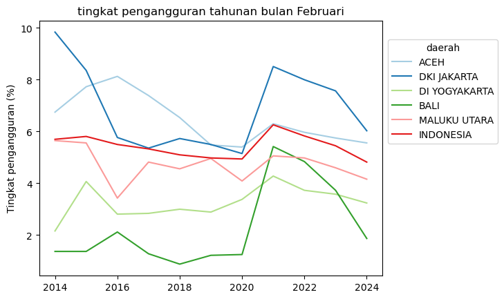

Beberapa waktu yang lalu, saya dan mas Anton diundang tim Indah G Show ngobrol-ngobrol di platform tersebut. Di situ sih kami ngobrol-ngobrolnya santai ya dan mostly spontan karena impromptu. Sayangnya, di event ngobrol santai / spontan gini, seringkali saya tidak begitu hapal data, dan kesempatan untuk ngecek data tentu saja tidak ada atau setidaknya akan merusak momen gitu, agak beda dengan ngobrol di twitter yang tidak langsung / tidak tatap muka.

Nah, salah satu momen ini adalah ketika kami ngomongin soal tingkat pengangguran (unemployment rate). Waktu itu (waktu itu tapingnya kalo tidak salah bulan Oktober apa November gitu ya, 2024) berita tentang deflasi dan pengangguran sedang marak, dan sedang ramai dikatakan bahwa pengangguran lagi banyak. Saya mengatakan bahwa tingkat pengangguran ketika itu mungkin tidak berbeda jauh dari sebelum-sebelumnya. Nah kebetulan saya ngomong bahwa tingkat pengangguran setiap daerah bisa saja berbeda. Sayangnya ngecek angka pengangguran berbagai provinsi butuh sedikit waktu.

Nah sekarang saatnya mengecek data itu. Jadi saya mengatakan bisa jadi pengangguran tidak lebih tinggi dari biasanya di 2024, dan saya bilang bisa saja di Aceh tinggi tapi di Jakarta rendah, so it's not so bad (or at least not worse than typical).

Untuk mengeceknya saya menggunakan tabel [tingkat pengangguran terbuka menurut provinsi](https://www.bps.go.id/id/statistics-table/2/NTQzIzI=/tingkat-pengangguran-terbuka-menurut-provinsi--persen-.html) dari BPS. BPS menggunakan survey Sakernas yang dilakukan di 2 bulan yang berbeda yaitu Februrari dan Agustus. Saya coba plot 10 tahun terakhir, masing-masing di Februari dan Agustus. Saya ambil beberapa provinsi aja, yaitu Aceh dan Jakarta (karena 2 daerah tersebut saya sebut di podcast), lalu Yogyakarta, Bali dan Maluku Utara (ga ada alasan khusus). Datanya ada di bawah ini.


```python
import seaborn as sns
import matplotlib as plt
import pandas as pd
```


```python
data=pd.read_excel("ur.xlsx")
feb=data.query("bulan=='Februari'")
aug=data.query("bulan=='Agustus'")
```


```python
ax=sns.lineplot(data=feb,x="tahun",y="ur",hue='daerah',palette='Paired')
sns.move_legend(ax,loc='lower right',bbox_to_anchor=(1.35,.5))
ax.set(xlabel="",ylabel="Tingkat pengangguran (%)",title="tingkat pengangguran tahunan bulan Februari")
```


    [Text(0.5, 0, ''),
     Text(0, 0.5, 'Tingkat pengangguran (%)'),
     Text(0.5, 1.0, 'tingkat pengangguran tahunan bulan februari')]


    

    


```python
ax=sns.lineplot(data=aug,x="tahun",y="ur",hue='daerah',palette='Paired')
sns.move_legend(ax,loc='lower right',bbox_to_anchor=(1.35,.5))
ax.set(xlabel="",ylabel="Tingkat pengangguran (%)",title="tingkat pengangguran tahunan bulan Agustus")
```


    [Text(0.5, 0, ''),
     Text(0, 0.5, 'Tingkat pengangguran (%)'),
     Text(0.5, 1.0, 'tingkat pengangguran tahunan bulan februari')]


    

    


Obviously 2020 ada pandemi COVID-19 sehingga tingkat pengangguran langsung melonjak. Bali dan Jakarta mengalami problem yang jauh lebih tinggi dari daerah lain dan nasional (garis merah), sangat wajar mengingat 2 daerah ini sangat tinggi sektor jasa-nya.

Secara keseluruhan, bisa kita lihat bahwa 2024 Agustus dan Februari, tingkat pengangguran sudah mulai kembali ke tren awal. Di samping itu, Jakarta selama ini memang memiliki tingkat pengangguran yang tinggi, di atas rata-rata nasional, seperti halnya Aceh. Bahkan bisa dikatakan Jakarta seringkali lebih tinggi tingkat penganggurannya dibanding Aceh.

Mudah-mudahan grafik ini membantu klarifikasi.
