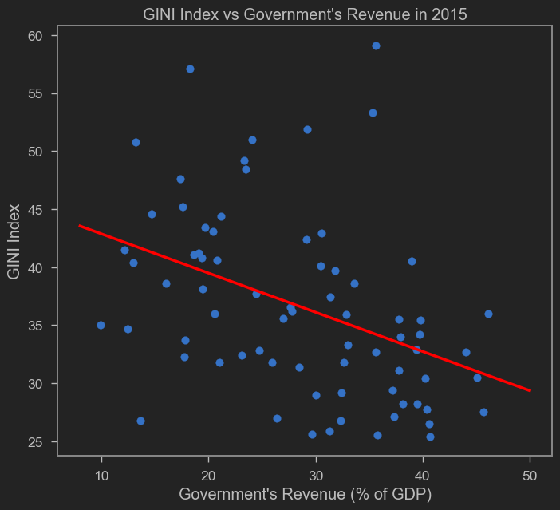

Masalah ketimpangan merupakan salah satu masalah yang sangat penting dewasa ini. Tentu anda sering lihat orang-orang membicarakan masalah ketimpangan di media sosial. Baru-baru ini ada akun twitter yang lewat di lini masa saya bilang bahwa di saat banyak orang miskin seperti ini kok bisa-bisanya ada tiket ColdPlay harganya 11 juta?? Laku pula! Ludes des des!!

Kita bisa argumen lah tentang kesahihan pernyataan si akun twitter yang saya contohkan di atas. Namun kita tidak bisa memungkiri betapa ramainya pembicaraan mengenai ketimpangan tidak hanya di Indonesia, tapi juga di dunia. Dulu awal-awal jaman neoliberalisme berjaya (mungkin 80an-90an), studi tentang ketimpangan tidak mendapatkan cukup _spotlight_ di mata para ekonom yang influensial. Ketimpangan dianggap _byproduct_ dari ekonomi yang efisien. Di samping itu, untuk negara yang lebih produktif, efisien dan kaya, meratakan ekonomi tentu lebih mudah ketimbang di negara yang miskin. Sekarang tidak lagi. Semakin banyak ekonom yang menyadari pentingnya inequality bahkan ketika negaranya belum kaya.

Tapi poin bahwa negara kaya lebih mudah mengurangi ketimpangan bisa jadi argumen yang valid. Bagaimanapun juga, masyarakat yang kaya akan belanja lebih banyak dan memutar roda ekonomi bagi yang lain, atau yang disebut "trickle-down economics" (kita bisa argue againts trickle-down economics. Mungkin di lain postingan). 

Tapi yang lebih penting adalah kalau masyarakatnya kaya, maka negara bisa memajaki lebih banyak. Dengan pajak yang lebih banyak, maka uang yang bisa didistribusikan ke masyarakat tidak mampu akan jauh lebih banyak. Ini sebenarnya trickle-down juga, tapi trickle-down yang dipaksa oleh negara. Ini adalah trik yang dipakai negara-negara yang cenderung sosdem dan welfare state. Gara-gara redistribusi ini, ketimpangan dari pendapatan tidak begitu masalah, karena yang pendapatannya tinggi kena pajak lebih tinggi juga, lalu hasilnya dibagi-bagi dalam bentuk bansos, sehingga ketimpangan secara konsumsi dapat ditekan.

Karena itu jelas penting untuk melihat bagaimana pertumbuhan PDB bisa menjadi pajak dan pemasukan negara non-pajak yang tinggi! Bagaimana dengan revenue pemerintah Indonesia dibandingkan dengan negara lain?

<iframe src="https://data.worldbank.org/share/widget?end=2021&indicators=GC.REV.XGRT.GD.ZS&locations=ID-MY-TH-AU-SG&start=2008" width='450' height='300' frameBorder='0' scrolling="no" ></iframe>

Hubungan antara ketimpangan dan pendapatan negara sebenarnya bisa dicek. Bahkan mudah dicek karena jaman sekarang kita bisa ambil data dari [World Development Indicators](https://data.worldbank.org/indicator/GC.REV.XGRT.GD.ZS?end=2021&locations=ID-MY-TH-AU-SG&start=2008) punya World Bank. Di sini saya coba plot data GINI Ratio dan Government's Revenue dari situ.

GINI Ratio bernilai 0-100, di mana 0 berarti perfect equality, sementara 100 berarti perfect inequality (ketimpangan paling timpang setimpang-timpangnya). Sementara itu, Government's Revenue diukur berdasarkan % of GDP. Saya ambil dari World Development Indicators, tahun yang saya pakai adalah tahun 2015.



Sepertinya memang ada tendensi kebalik, sesuai teori saya di atas. Yaitu, makin tinggi pendapatan negara, makin rendah rasio GINI di negara tersebut. Memang kayaknya ada beberapa outlier yah tapi mostly fit dengan garis merah hasil regresinya. Kalo lihat dari tulisan sederhana ini, keliatan bahwa memastikan pendapatan negara sejalan dengan pertumbuhan ekonomi harus menjadi salah satu target penting bagi negara. Di samping itu, meneruskan atau bahkan [menambahkan program-program kontra-ketimpangan](https://ekonomi.bisnis.com/read/20230509/9/1654164/bank-dunia-minta-sri-mulyani-tambah-anggaran-bansos) semakin diperlukan.

Disclaimer ya ini kan cuma OLS biasa. no treatment apapun dan potensi banyak bias. Anggap aja Ini cuma intro bagi anda yang ingin melakukan penelitian yang lebih serius dan mendalam. Untuk anda yang tertarik mendalami dan ingin mereplikasi gambar di atas, saya menggunakan kode di bawah ini. Ok semoga postingan ini bermanfaat.


```python
import wbdata as wb
import datetime
import statsmodels.api as sm
import numpy as np
import matplotlib.pyplot as plt

## Sedot data dari World Development Indicators
a=wb.get_dataframe({"SI.POV.GINI" : "GINI"},
                   data_date=datetime.datetime(2015,1,1), convert_date=True, keep_levels=True)
a["GR"]=wb.get_dataframe({"GC.REV.XGRT.GD.ZS" : "GR"},
                   data_date=datetime.datetime(2015,1,1), convert_date=True, keep_levels=True)
a=a.reset_index()

## Nyari parameter buat garis regresi pake OLS
x = sm.add_constant(a.GR)
model=sm.OLS(a.GINI,x,missing='drop')

results = model.fit()
b,c=results.params

## Plot gambar
plt.scatter(a.GR,a.GINI)

# Plot regression line
plt.plot(xseq, b + c * xseq, color="red", lw=2.5)

plt.xlabel("Government's Revenue")
plt.ylabel('GINI Ratio')
plt.title("GINI Ratio vs Government Ratio")

```