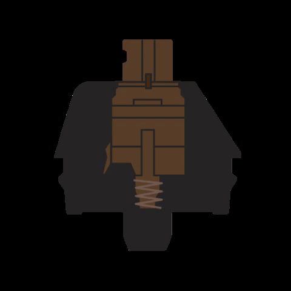
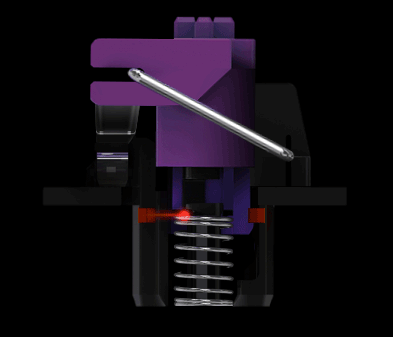

Semester ini saya sibuk banget. Banyak kerjaan, [presentasi](https://krisna.netlify.app/talk/paper2/) salah satu milestone disertasi saya, dan ngajar. Khusus untuk ngajar, kali ini saya cukup beruntung karena di masa korona ini, kampus mengurangi staff besar-besaran dan saya termasuk yang masih dikaryakan. hehe. Masalahnya, karena yang di-_hire_ dikit, saya ketimpaan banyak banget _marking_ alias meriksa tugas dan UAS. Stres banget deh.

Seiring dengan berakhirnya semester datang pula Black Friday + cyber monday + Boxing day, adalah serangkaian hari-hari penuh diskon di Australia. Hmmm, kupikir. Berhubung selama ini jarang foya-foya, boleh deh sekali-kali nraktir diri sendiri.

Diantara yang berdiskon, barang-barang elektronik kebagian diskon yang gede-gedean. Berhubung lagi ada duit, saya memutuskan untuk nyoba beli keyboard buat gantiin keyboard yang sekarang. Saya selama ini pake [logitech MX Keys](https://www.jbhifi.com.au/products/logitech-mx-keys-advanced-wireless-illuminated-keyboard), keyboard yg sangat keren dan enak. Kalau liat-liat di forum, keyboard mekanikal katanya lebih enak buat ngetik karena ada _feedback_ yang lebih baik. Mencetnya ga harus dalem-dalem jadinya lebih nyaman buat ngetik. Berhubung belum pernah coba ngetik pake keyboard mekanikal, saya pikir bole juga nih nyobain.

Saya mencoba beli keyboard baru di [JB-Hifi](https://www.jbhifi.com.au/), sebuah toko elektronik gede di Australia. Harganya lumayan kompetitif, tokonya banyak, ada toko di Belconnen yang bisa nyoba-nyoba switch juga, jadinya bisa ngetes kayak gimana keyboardnya. Dan yang paling enak adalah, kalau kita ga suka barangnya setelah nyoba-nyoba seminggu dua minggu, keyboardnya bisa kita tuker tambah dengan yang lain. Inilah kekuatan [Australian Consumer Law](https://support.jbhifi.com.au/hc/en-au/articles/360053720393-Faulty-Products-Consumer-Guarantees).

Berkat fitur tuker tambah tersebut, saya jadi bisa nyoba 3 keyboard berbeda. Saya browsing-browsing beberapa switch yg katanya enak buat ngetik, dan memutuskan membeli berdasarkan diskon. Keyboard pertama yang saya coba adalah [Logitech G512 GX Brown Switch](https://www.jbhifi.com.au/products/logitech-g512-carbon-lightsync-rgb-mechanical-gaming-keyboard-gx-brown-switch), terutama karena saya fans berat Logitech. Barang-barangnya mahal tapi emang oke punya. Sayangnya ternyata kurang cocok. Lalu saya pindah ke produk razer, yaitu Razer BlackWidow. Ternyata masih kurang cocok, akhirnya terakhir saya pake Razer Huntsman. Begini spesifikasi keyboard-keyboard tersebut.

| Keyboard | Logitech MX Keys | Logitech G512 GX Brown | Razer BlackWidow | Razer Huntsman |
|----------|------------------|------------------------|------------------|----------------|
| Switches | Scissor | [GX-Brown](https://www.logitechg.com/en-au/innovation/mechanical-switches.html) | [Razer Green](https://www2.razer.com/au-en/razer-mechanical-switches) | [Razer Purple](https://www2.razer.com/au-en/razer-optical-switch) |
| Feel | Tactile | Bump | Clicky | Clicky |
| Actuation force (g) | 37.1 | 50 | 50 | 35.5 |
| Actuation travel (mm) | 1.26 | 1.9 | 1.74 | 1.56 |
| Total travel (mm) | 1.84 | 4.0 | 4.0 | 3.5 |
| typing speed (WPM) | 73 | 68 | 73 | 80 |

Beberapa keterangan:
1. Actuation force: seberapa kuat kita perlu tekan itu keyboard. Makin gede makin bikin pegel kalo ngetik lama. Tapi kalo gede jadi lebih susah typo karena mengurangi salah pencet.
1. Actuation travel: Seberapa jauh kita perlu tekan sampe hurufnya muncul di layar. Makin gede makin dalem.
1. Total travel: Seberapa jauh kita bisa tekan sampe mentok. makin gede makin dalem.
1. Saya ngetes typing speed pake typing di [typingtest.com](https://www.typingtest.com/
) pake tingkat kesulitan medium selama 3 menit. WPM = Word per Minute (kata per menit)
1. Angka-angka lain didapat dari [rtings.com](https://www.rtings.com/), namun khusus yg logitech dikopas dari [website resmi logitech](https://www.logitechg.com/en-au/innovation/mechanical-switches.html).

Saya mau coba kasih review dan alasan kenapa saya gak cocok dengan Logitech G512 dan Razer BlackWidow. Sekarang masih tahap coba-coba dengan huntsman. Moga-moga cocok. Saya akan fokus ke ketik-mengetik dan _switch_ nya, karena _switch_ itu alasan utama saya coba-coba keyboard mekanik. Paling yang kepake adalah makro. Saya gak terlalu tertarik dengan RGB-nya.

Perlu diketahui sebelumnya bahwa saya bukan antusias keyboard. Saya cuma user biasa yang brosing-brosing aja. Ga bener-bener pemerhati keyboard. Saya baca macem-macem review dari Rtings, Tomshardware, dll. Juga nonton macem-macem video youtube dari channel seperti RandomFrankP atau Hardware Canuch. Kalo perlu review yang serius, boleh coba main ke sana.

## Logitech MX Keys

| what I love | What I hate |
| --------- | ---------- |
| tipis dan compact | programmable cuma di tombol F1-F12 |
| enak buat ngetik | mahal |
| wireless-nya bagus banget | |
| batre tahan lama | |
| logitech flow is amazing | |

Di awal-awal COVID-19 masih ramai di Australia (sekitar awal Maret), Kampus saya mengizinkan pemindahan sebagian alokasi dana penelitian mahasiswa untuk membeli perlengkapan _Work From Home_ (WFH). ALasannya tentu saja karena kampus mau ditutup dan seluruh staf dan mahasiswa diharuskan untuk bekerja dari rumah. Pada umumnya, dana penelitian sering kali dipakai untuk menghadiri konferensi akademis. Berhubung korona juga kan ya, jadi ga mungkin juga ada konferensi dalam waktu dekat. Yaudah deh dimanfaatkanlah itu dana untuk beli perlengkapan WFH.

Logitech MX Keys saya pilih sebagai keyboard buat di rumah. Ga ada alasan khusus sih waktu itu, karena saya fans logitech aja.

Ternyata keyboard ini enak banget. Switch-nya menurut saya lebih enak daripada keyboard di kantor. Namun ada beberapa kelebihan yang bisa saya katakan. Pertama, dia wireless, bisa pake dongle (2.4 Ghz) dan bluetooth. Wirelessnya bisa pake unified dongle, alias keyboard dan mouse (juga logitech) bisa pake 1 dongle yang sama. Bluetoothnya bisa konek ke 3devices, bisa komputer lain tapi juga tablet dan _smartphone_. Sangat menolong ketika saya mau ngetik di tab atau _smartphone_. _setup_ wireless juga enak banget karena bikin meja rapih. Di samping itu, switching antara wireless dongle dan 3 device bluetooth sangat-sangat mudah karena ada tombol fisiknya di keyboard.

Kedua, Logitech juga punya teknologi yang namanya _flow_. Kalau saya kopi tulisan di laptop, saya bisa kopas ke tablet. membantu banget deh.

Ketiga, keyboard ini tipis banget, lumayan kecil, dan build qualitynya oke banget. Meja jadi berasa lega dan posisi tangan tuh enak banget karena keyboardnya tipis jadi ga perlu ngangkat jari tinggi-tinggi. Ga pegel ngetik di sini karena _actuation point_ nya pendek dan force-nya kecil.

## Logitech G512 GX-Brown

| What I love | What I hate |
| ----------- | ----------- |
| Harga cukup terjangkau | kabelnya ga enak banget |
| | switch-nya |
| | ga ada makro |

Keyboard ini adalah yang pertama saya beli, sekaligus keyboard mekanis pertama yang pernah saya punya. Harganya termasuk lumayan murah untuk keyboard mekanikal, dan waktu itu lagi diskon. Berhubung pertama kali, saya nyoba yang murah dulu. Ga berani langsung yg mahal. hehe.

Switch GX-Brown adalah switch logitech yang katanya _tactile_ tapi ga ada bunyi klik-kliknya kayak mekanis pada umumnya. Keyboard mengirimkan sinyal ketika pelatnya tersambung pas tombolnya diklik. Sayangnya nggak begitu keliatan di gif ini yang saya bikin dari gambar yang ada di website logitech.

Setelah dicoba-coba, ternyata pake G512 bikin capek dan kurang cocok buat saya. Jari malah agak pegel dan telapak tangan sekitar kelingking malah pegel. Sepertinya karena kebiasaan pake keyboard yang pendek, saya mencetnya selalu sampe ujung. Padahal harusnya semi-terbang gitu, ga usah dalem-dalem mencetnya. Cukup sampe _actuation point_ aja.

Kita juga bisa lihat dari tabel di atas, bahwa keyboard ini (dan keyboard mekanikal pada umumnya) memang perlu tekanan yang sedikit lebih kuat. Mungkin ga terlalu ngefek ya kalo cuma ngetik bentar. Tapi kalo ngetik seharian ternyata berasa juga.

Keyboard ini juga tinggi banget dibandingkan MX Keys. Tangan kurang pas rasanya ngetik. terpaksa beli wrist rest yg agak tinggi supaya tangan bisa lurus. Lumayan agak lebih nyaman, tapi tetep pegel kalo ngetik lama. Ketinggian keyboard juga disumbang oleh tinggi _keycaps_ nya dan travel distance yang emang lebih jauh. Lagi, keliatannya bedanya tipis ya, tapi kalo ngetik seharian ya pegel juga.

Soal speed, kecepatan ngetik saya malah drop pake ini, meskipun awalnya coba pindah mekanikal karena lebih enak buat ngetik. Wah udah ga enak, slow juga, bener-bener bad investment dah. Untungnya masih bisa dituker.

Saya jadinya nyoba yang clicky, karena katanya pake yg clicky lebih enak dan lebih berasa _actuation point_-nya ketimbang yg _tactile_, sehingga lebih enak ngetiknya ga harus pencet ampe dalem-dalem banget.

## Razer BlackWidow

| What I love | What I hate |
| ----------- | ----------- |
| Razer green switch is amazing | Good value for money | 
| Fully programmable | |
| RGB-nya rame bgt | |

Saya tuker sama Razer BlackWidow. Ini adalah produk razer pertama yang saya coba. Keyboard ini punya switch yang clicky, alias bunyi-bunyi pas dipencet. Di gif di bawah ini yang saya ambil dari situs resmi razer, kita bisa lihat ketika keyboardnya dipencet, ada plat yang nubruk plat di dalamnya. Ketika itulah key-nya teregister dan tombol yang kita pencet terdeteksi oleh komputer.

Kita juga bisa lihat bahwa platnya nubruk tanpa perlu keycap nya kita pencet sampe mentok.

Ternyata bener sih, mendingan yang clicky sekalian daripada yang nanggung. Asli enak banget mencetnya pas bunyi klik-klik gitu wkwkw. Tapi ternyata pake keyboard ini juga kurang pewe. Jari tetep pegel mencetnya. Keyboard ini kalo berdasarkan spek juga punya travel distance dan actuation force yang gede, setara dengan MX-Brown. Saya juga mungkin ngetiknya masih sampe bawah, meskipun ada bunyi klik-kliknya.

Meskipun begitu, ternyata keyboard yang bunyinya klik-klik enak juga dipake. Berasa ngetik sesuatu yang penting banget. ha ha ha. Tentu saja jeleknya adalah keyboard ini lumayan berisik. Agak mengganggu kalo kerja di kantor gitu. Istri saya bilang bahwa suaranya lumayan berisik, meski ga terlalu ganggu, tapi susah kalo pas istri saya mau tidur[^1].

Keyboard ini fully programmable, jadinya bener-bener semua key bisa diganti dengan tombol lain dan pilihannya banyak banget, seperti bisa jadi alt dan shift juga, bisa buat launch program atau website, dan yg terpenting bisa buat nyimpen text.

Keyboard ini lebih enak daripada Logitech GX-Brown. Menurut saya, Razer Green Switch termasuk switch yg enak banget dipake, apalagi kalo udah terbiasa ngetik ngambang gitu. Tapi awal-awal sih masih agak berat. Learning curve-nya lumayan kalo baru datang dari keyboard membran tipis. Tapi begitu udah terbiasa, beeeh enak.

[^1]: Tempat WFH saya = kamar tidur. apa boleh buat. Maklum nyewa unit yang kecil supaya murah.

## Razer Huntsman

| What I love | What I hate |
| ----------- | ----------- |
| Razer purple switch is amazing | Mahal | 
| Fully programmable | |
| RGB-nya rame bgt | |

Keyboard terakhir yang saya coba adalah Razer huntsman. Dia pakai teknologi baru yang namanya opto-mechanical. Kalau switch sebelumnya pakai sinyal elektrik dari plat besi, switch di keyboard ini pake sinar laser untuk mengirimkan sinyal dari keyboard ke komputer. Pas keyboard-nya dipencet, lasernya nyambung ke penerimanya, lalu mengirimkan sinyal bahwa tombolnya udah dipencet.

Katanya si razer, mengirim sinyal dengan laser membuatnya jadi jauuuuuuuuuuuuuuuuuuuuuuuuuuuh lebih cepat daripada pake pelat besi. Tapi kayaknya gak terlalu ngefek sih, apalagi buat orang tua seperti saya yg refleknya dah kayak siput kwwk.

Tapi yang membuatku tertarik nyoba ini adalah karena dia punya actuation force yang lebih ringan dan travel distance yang lebih pendek daripada mekanikal biasa, namun dengan clicky feeling yang sama dengan si razer green switch. Dengan begitu, harusnya bisa lebih nyaman di jari buat ngetik. Terutama buat pengetik yang baru mulai pake mekanikal keyboard.

Clicky feelingnya menurut saya gak semenyenangkan Razer BlackWidow. Tapi tetep enak sih. Yang lebih penting adalah sejauh ini tangan masih baik-baik aja. Lebih enak ngetik di sini buat saya daripada green switch. Mudah-mudahan kedepannya saya cocok dengan keyboard ini. hahah.

Tapi emang kalo soal kecepatan, sejauh ini pake switch ini memberikan typing speed paling cepat sih (80 WPM), bahkan lebih cepat daripada MX Keys di 73 WPM. Memang lebih nyaman ngetik di sini. Perlu dilihat lagi lah beberapa lama ke depan, seberapa nyaman pake switch yang ini. Tapi sejauh ini memang Huntsman menurut saya lebih enak dibandingkan dua keyboard sebelum ini.

## Kesimpulan
Ngetik di MX Keys sebenernya udah enak. Meskipun mencetnya sampai ujung (ya iya tipis banget soalnya), tapi tangan tetep ga pegel. Fitur wireless-nya yg bisa pindah-pindah device dan bisa dibawa ngopas juga sangat-sangat berguna. Unifying receiver bikin meja rapih ga ada kabel dan dongle cuma 1 untuk keyboard dan mouse itu bikin hemat slot USB. Logitech ni emang the best deh kalo bikin produk office.

Tapi emang ngetik clicky-clicky memberi perasaan bahagia yg saya juga ga tau datang dari mana. wkwk. Keyboard mekanikal juga punya segudang makro yg sangat berguna buat naroh command / method yg kepake banget buat koding. Mungkin saya cuma kurang terbiasa aja ngetik di keyboard tebel karena dah keseringan pake laptop dan MX Keys. Sejauh ini belum terlalu jauh merasakan enaknya keyboard mekanikal dibandingkan dengan MX Keys (selain klak klik-nya). Oh iya lama-lama lucu juga ngeliatin RGB wkwkw.

Update: razer huntsman akhirnya jadi my daily driver. Setelah bisa ngetik yg bener pake mechanical keyboard, clicky switchesnya razer ternyata enak banget. Speed tercepat saya ya di razer huntsman ini. Dia lebih ringan daripada clicky mechanical switches lain pada umumnya, jadi lumayan cocok buat yang baru nyoba. Fully programmablenya juga bagus banget buat anda yang perlu. Kayaknya software buat program key dan makro paling enak di razer deh. I do miss MX Keys' versatile wireless capability tapi programmability dan clicky switch wins me.

Baca juga percobaan yellow switch dengan keyboard Razer Blackwidow V3 Mini di [sini](https://krisna.netlify.app/post/keyboard2/)