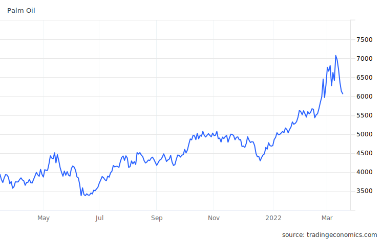
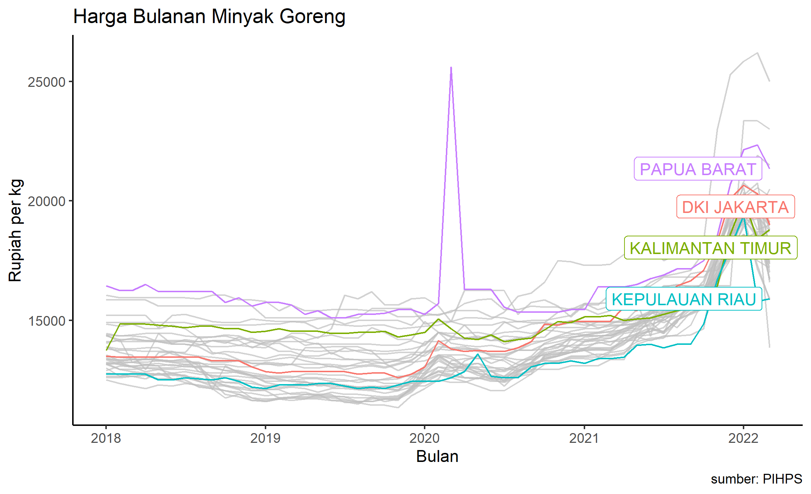

## Pendahuluan

Beberapa hari ini pemerintah sedang dihebohkan dengan naiknya harga minyak goreng. Pemerintah berusaha agar harga minyak goreng (migor) bisa ditahan di harga rendah. Presiden [menugaskan Kementerian Perdagangan](https://www.jawapos.com/ekonomi/04/01/2022/jokowi-minta-mendag-stabilkan-harga-minyak-goreng/) untuk menjaga agar harga migor bisa terkendali. Sementara itu, instrumen yang digunakan oleh Kementerian Perdagangan (Kemendag) adalah pengenaan _Domestic Market Obligation_ (DMO) bagi minyak kelapa sawit sebagai bahan baku migor dan penetapan _Domestic Price Obligation_ (DPO) bagi minyak sawit dan Harga Eceran Tertinggi (HET) bagi migor. Berikut rincian [Permendag](http://jdih.kemendag.go.id/peraturan?page=1) yang sudah dikeluarkan oleh Kemendag sampai tulisan ini dibuat.

| no | tanggal | aturan | isu |
| -- | ------- | ------ | --- |
| 1 | 11 Januari 2022 | Permendag 1/2022 | Subsidi BPD PKS utk migor kemasan sederhana, dengan HET 14 ribu rupiah per liter. |
| 2 | 18 Januari 2022 | Permendag 2/2022 | Kewajiban DMO 9 *tariff lines* dimulai. |
| 3 | 19 Januari 2022 | Permendag 3/2022 | revisi no 1, subsidi diperluas utk semua kemasan. |
| 4 | 1 Februari 2022 | Permendag 6/2022 | HET jadi 3: 11.500 utk curah, 13.500 utk kemasan sederhana, 14.000 utk kemasan premium. |
| 5 | 8 Februari 2022 | Permendag 8/2022 | Revisi no 2, DMO diperluas ke 60 *tariff lines*. |
| 6 | 10 Februari 2022 | Kempmendag 129/2022 | DMO ditetapkan sebesar 20%. |
| 7 | 9 Maret 2022 | Kempmendag 170/2022 | DMO ditetapkan sebesar 30%. |

Perkembangan terakhir, pemerintah akan [melepas HET](https://katadata.co.id/happyfajrian/berita/6230c963601c9/pemerintah-lepas-harga-minyak-goreng-kemasan-ke-mekanisme-pasar) untuk minyak goreng kemasan. Sementara itu, migor curah akan mematuhi HET 14 ribu rupiah per liter. Hal ini efektif berlaku pada 16 Maret 2022. Kenapa? Karena dengan HET seperti nomor 4 di tabel 1, terjadi kelangkaan pasokan migor sehingga banyak masyarakat tidak kebagian migor, bahkan sampai ada yang [meninggal](https://www.kompas.tv/article/270000/seorang-ibu-meninggal-saat-antre-minyak-goreng-pengamat-memilukan-terpaksa-demi-cukupi-kebutuhan) saat mengantri migor.

## Asumsi permasalahan

Instrumen DMO yang digunakan tentunya berangkat dari asumsi bahwa penyebab migor mahal adalah karena bahan baku yang mahal. Memang pada sekitar bulan juli, harga minyak kepala sawit di pasar sepertinya mulai naik. Menurut data dari [tradingeconomics.com](https://tradingeconomics.com/commodity/palm-oil) (gambar 1), harga komoditas _Crude Palm Oil_ (CPO) mulai terkerek naik sekitar Juli 2021, dan naik lagi September 2021.

BTW lihat deh harga setelah Januari. haha. Harga makin tinggi setelah Indonesia menerapkan DMO dan DPO.

Sementara itu, data yang ditunjukkan oleh Mendag pada [Konferensi Pers](https://www.youtube.com/watch?v=FTS9TGx_scM) (menit 5) pada 9 Maret 2022 lalu menunjukkan kenaikan tipis pada bulan Juli 2021, dan pada sekitar bulan November 2021 barulah terjadi kenaikan yang cukup tajam. Sepertinya kenaikan di November ini yang memicu reaksi dari Pemerintah. Beliau juga menunjukkan ada penurunan terhadap harga minyak goreng pada bulan Februari 2022.

Berbekal informasi ini, rasanya wajar jika Kemendag kemudian mendeduksi bahwa kenaikan harga CPO inilah yang menjadi biang naiknya harga migor. Jika demikian, maka cara penyelesaiannya adalah dengan mengurangi kemudahan ekspor (dalam hal ini dengan menggunakan DMO) sehingga kenaikan harga CPO di dalam negeri dapat ditekan. 

Dengan kata lain, karena Mendag merasa bahwa permasalahannya ada di kompetisi pembeli, maka Mendag membantu pembeli CPO lokal dengan memaksa eksportir mengalihkan 20% (kemdian 30%) dari produknya untuk pasar dalam negeri.

Sayangnya, migor masih juga mahal. Padahal DMO dan DPO seharusnya membuat harga dan ketersediaan bahan baku migor cukup banyak di pasaran. Deduksi berikutnya: CPO dialirkan ke pasar dalam negeri, tetapi untuk produk yang bukan migor. Karena itulah DMO diperluas dari 9 produk jadi 60 produk (tabel 1 nomor 5), untuk mencakup produk-produk CPO turunan lainnya seperti sabun.

Ternyata migor masih juga langka meskipun dengan semua kebijakan tersebut. Deduksi berikutnya: ada mafia, spekulan, ataupun bocor ke luar negeri. Inilah awal mula kenapa Kemendag melibatkan kepolisian.

Tapi mungkinkah ada masalah lain?

## Kemungkinan masalah: dari dalam negeri

Jika masalahnya memang adalah harga internasional, maka mestinya DMO dan DPO akan menyelesaikannya. DMO dan DPO, sayangnya, tidak terlalu berguna jika ada masalah lain yang mungkin timbul dari dalam negeri.

#### Biodiesel

Masalah pertama adalah biodiesel. Menurut [Faisal Basri](https://faisalbasri.com/2022/02/03/ulah-pemerintahlah-yang-membuat-harga-minyak-goreng-melonjak/), kenaikan harga CPO belakangan ini sebenernya tidak terlalu mempengaruhi ekspor Indonesia. Karena itu beliau bilang kemungkinan masalahnya sebenarnya ada di dalam negeri.

Beliau mengatakan bahwa saat ini telah terjadi pergeseran yang cukup signifikan dari penggunaan CPO, dari didominasi pangan menjadi dominasi biodiesel. Dikutip dari blog Faisal Basri:

> konsumsi CPO untuk biodiesel naik tajam dari 5,83 juta ton tahun 2019 menjadi 7,23 juta ton tahun 2020 atau kenaikan sebesar 24 persen. Sebaliknya, konsumsi CPO untuk industri pangan turun dari 9,86 juta ton tahun 2019 menjadi 8,42 juta ton tahun 2020.

Hal ini diakibatkan program B20 oleh Pemerintah yang disubsidi oleh BPDPKS. Program ini bahkan meningkan ke B30 dan diproyeksikan untuk terus ditingkatkan sampai B100. artinya, kebutuhan CPO untuk biodiesel diproyeksikan akan terus meningkat.

Tentu saja produsen migor tidak bisa bersaing dengan Bahan Bakar Nabati (BBN) karena program B20 dan B30 selama ini disubsidi oleh BPDPKS. Hal ini juga menyulitkan BPDPKS untuk menyulitkan migor juga karena jika subsidi program BBN ini dipotong maka hampir pasti program ini harus berhenti karena BBN sama sekali tidak kompetitif dibandingkan bahan bakar lain.

Hal yang sama dikatakan oleh [Nisrina](https://mediaindonesia.com/ekonomi/469771/cips-produksi-biofuel-ganggu-kestabilan-pasokan-minyak-goreng) dari CIPS.

#### Produksi yang terbatas
Kebutuhan yang akan terus meningkat tersebut tentunya harus diimbangi dengan peningkatan produksi. Masalahnya, produksi CPO Indonesia juga memiliki tren yang terus menurun sejak 2019.

CIPS menuliskan adanya permasalahan di [produksi](https://id.cips-indonesia.org/post/ringkasan-kebijakan-harga-minyak-goreng-di-indonesia) CPO Indonesia pada umumnya. Beberapa hal yang disebutkan antara lain kenaikan harga pupuk (Rusia dan China salah satu eksportir pupuk utama Indonesia. Rusia lagi perang sementara Cina mulai melarang ekspor pupuk), kurangnya tenaga kerja, dan faktor cuaca. Kenaikan permintaan, baik luar dan dalam negeri, akan memaksa naiknya harga CPO jika _supply_ berkurang.

## Kenapa HET tidak berhasil?

Dua masalah di atas menyentuh fundamental _supply_ dan _demand_ yang menunjukkan adanya pemaksaan harga yang harus naik, bahkan ketika tidak ada mafia ataupun spekulan. Karena itu, jika kedua masalah yang saya tulis di atas benar, maka HET juga tidak akan berhasil. Selain dua hal di atas, ada beberapa hal lain yang membuat HET memperburuk situasi.

#### Ongkos distribusi

Ongkos distribusi bisa jadi berbeda-beda di berbagai daerah dapat mengancam kesuksesan HET. Pabrik migor sepertinya lebih banyak berada di wilayah Indonesia Barat seperti Sumatera dan Jawa. Pengapalan ke daerah lain tentunya diperlukan. Jika hal ini benar, maka harga migor di Indonesia akan bervariasi di berbagai wilayah yang berbeda di hari-hari normal. Mengambil data [harga bulanan minyak goreng](https://hargapangan.id/tabel-harga/pasar-tradisional/komoditas) dari PIHPS, saya bikin grafik di bawah ini. Berisi harga bulanan migor di pasar tradisional sejak Januari 2018 di semua provinsi di Indonesia. Saya highlight beberapa provinsi.

Jika memang ada variasi harga meskipun pada hari biasa, maka HET mengancam kelangkaan di daerah-daerah yang distribusinya sulit. Apalagi di zaman gini ketika harga-harga energi dan kapal lagi mahal-mahalnya.

#### Masalah lain

Sebenarnya HET Minyak goreng kemasan sudah lama mau diatur oleh pemerintah, sejak 2016 (kalau gak salah). Ada aturan yang mewajibkan retailer untuk menjual migor dalam kemasan, ga boleh lagi curah. Namun peraturan ini tertunda terus karena migor kemasan akan jadi terlalu mahal jika dipaksakan untuk semua produsen dan konsumen. Akhirnya sampe sekarang pun aturan tersebut terus tertunda. Harusnya sih kalau berkaca dari penundaan-penundaan ini, HET sudah dapat diduga akan menimbulkan masalah. In fact, kayaknya blm pernah ada HET yang berhasil di Indonesia.

## Penutup

Masalah ini mungkin malah jadi makin parah gara-gara DMO,DPO dan HET tidak berhasil juga menstabilkan harga dan ketersediaan. Bahkan, masyarakat yang kehilangan kepercayaan diri pada pemerintah untuk bisa mengamankan stok, malah akan mulai melakukan penimbunan yang malah akan makin memperparah keadaan. 

Sementara itu, produsen yang tidak sanggup memenuhi DMO ataupun tidak sanggup menyuplai migor di harga serendah yang diatur oleh HET akan terpaksa berhenti produksi. Tentunya hal ini akan memiliki efek berantai ke penyerapan tenaga kerja dan konsumsi pada umumnya, sesuatu yang sangat ironis terutama menjelang bulan puasa.

Bisakah kita menyalahkan Kemendag (saja)? Tentu saja jawabannya tidak juga. Sebagai lembaga yang ditugasi Presiden, wajar-wajar saja Kemendag menggunakan DMO, DPO dan HET karena itulah instrumen yang dimiliki oleh Kemendag. Beberapa jalan keluar lain yaitu peningkatan bea keluar membutuhkan kerjasama dengan Kementerian Keuangan. Program BBN ada di Kementerian ESDM. Subsidi warga ada di Kementerian Sosial. Belum lagi bicara _supply side_ seperti menyelesaikan masalah tenaga kerja, cuaca dan harga pupuk. Belum lagi bicara distribusi yang emang langganan jadi masalah Indonesia dari dulu. Semua hal tersebut, yang secara fundamental akan menaikan harga migor, tidak ada di kewenangan Kemendag.

Jika yang kamu punya adalah palu, maka semua masalah akan terlihat seperti paku. wkwkwk.

Sekarang kemendag sudah bersedia menghentikan HET meskipun bea keluar CPO sepertinya belum berubah (CMIIW). Saya rasa ini adalah langkah yang cukup tepat. Sekarang migor mulai ada. Menurut saya mendingan harga naik tapi barangnya ada. Setidaknya, kita bisa biarkan masyarakat mengoptimalkan sendiri alokasi belanja mereka. Setidaknya jika barangnya ada, kita semua bisa tetap beli dan mengonsumsinya dengan hemat.

Saya sendiri cukup yakin bahwa harga yang pertama kali dikenakan oleh pasar setelah HET lepas agak-agak terlalu tinggi. Saya sih cukup yakin bahwa kita akan mulai melihat harga migor yang turun pelan-pelan seiring meningkatnya minat produsen untuk menyuplai migor di harga yang lebih kompetitif bagi mereka. Meskipun lebaran udah mau mulai bentar lagi ya. _We'll see_.

Untuk saat ini, saya sangat apresiasi langkah Kemendag yang akhirnya melepas harga ke pasar. Saatnya membela Pak Lutfi dan teman-teman di Kemendag 🙂