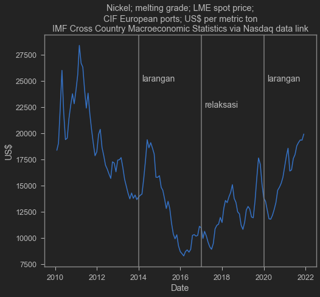

Baru-baru ini, Indonesia lagi ramai soal MoU Indonesia dan LG Energy Solution, perusahaan penghasil sel baterai asal Korea Selatan. Isi perjanjiannya kira-kira bahwa LG Energy Solution akan melakukan investasi besar-besaran di Indonesia dari hulu ke hilir di produksi sel baterai di Indonesia. Saya dan rekan saya Wishnu Mahraddika menulis tentang ini di [The Conversation Indonesia](https://theconversation.com/mengapa-tren-kendaraan-listrik-adalah-momentum-transformasi-industri-otomotif-indonesia-152958). Kami cukup optimis dengan perkembangan tersebut dan berharap bahwa ini akan menjadi momentum perkembangan industri otomotif di Indonesia khususnya di bidang mobil listrik.

## Investasi berbasis lartas

Hal yang tidak saya bahas di sana secara ekstensif adalah mengenai pentingnya peranan larangan ekspor nikel. Beberapa waktu belakangan ini, Pemerintah Indonesia [memperketat perdagangan bijih nikel](https://katadata.co.id/desysetyowati/berita/5e9a4c3ac65b3/bkpm-larangan-ekspor-bijih-nikel-sesuai-uu-minerba#:~:text=Pemerintah%20melarang%20ekspor%20bijih%20nikel,Pengusahaan%20Pertambangan%20Mineral%20dan%20Batubara.) dalam rangka meningkatkan nilai tambah di dalam negeri. Hal ini mengakibatkan sulitnya mendapatkan nikel bagi pabrikan di luar Indonesia. Investor yang membutuhkan nikel terpaksa harus investasi di Indonesia.

Namun pelarangan ekspor mineral bukannya tanpa masalah. Dalam jangka pendek, pembatasan tersebut berakibat pada berkurangnya investasi dan lapangan kerja di [sektor hilir](https://www.iisd.org/sites/default/files/publications/case-study-indonesia-downstream-linkages.pdf). Harga jual nikel diatur oleh Kementerian ESDM untuk menjaga skala ekonomis smelter, yang berakibat pada harga jual di [bawah harga internasional](https://tirto.id/harga-patokan-nikel-ditetapkan-30-di-bawah-harga-internasional-fSwz). Proses pengawasan dan pengaturan harga ini dianggap belum efektif karena pengawasan yang [tidak tegas](https://katadata.co.id/sortatobing/berita/5f7b0de0c8da2/kisruh-penambang-vs-pemilik-smelter-soal-harga-bijih-nikel?utm_source=Direct&utm_medium=Tags%20Pelarangan%20Ekspor%20Nikel&utm_campaign=BIG%20HL%20Slide%201).

Berikut ini harga nikel LME, saya comot dari IMF Cross Country Macroeconomic Statistics, sedot dari quandl.

    Text(0, 0.5, 'US$')

    

    

Seiring dengan meningkatnya performa Republik Rakyat Tiongkok (RRT) dan beberapa negara yang kasus COVID-19 nya sudah berkurang, ditambah dengan Joe Biden yang berencana meningkatkan support domestic demand Amerika Serikat, permintaan akan komoditas ekspor Indonesia kemungkinan bakalan naik. Beberapa pengamat bahkan meramalkan akan terjadi ledakan harga komoditas lagi. Kita bahkan sudah merasakan naiknya harga kedelai yang membuat pengrajin tempe pada emosi. 

Pembatasan ini sedikit mengurangi potensi _recovery_ pasca COVID-19 dengan ekspor. Selama industri turunan nikel belum memiliki kapasitas untuk ekspor, pembatasan ini akan memberikan tekanan ke neraca pembayaran. Pengorbanan jangka pendek ini mungkin saja akan terbayar jika ekspor sel baterai dan mobil listrik dapat mendorong surplus neraca pembayaran di masa depan secara signifikan.

## Retaliasi
Tentu saja problem utama dari mengandalkan ekspor adalah retaliasi. Pagi ini, akun twitter Kementerian Perdagangan ([@Kemendag](https://twitter.com/Kemendag)) mencuitkan bahwa Uni Eropa mengajukan protes melalui World Trade Organization (WTO). Hal ini gara-gara larangan ekspor nikel Indonesia mengganggu supply chain industri di sana.

<blockquote class="twitter-tweet">
RI&#39;s new Trade Minister M Lutfi said he welcomes EU&#39;s appeal for <a href="https://twitter.com/wto?ref_src=twsrc%5Etfw">@wto</a> to rule in its favour on the EU-Indonesia nickel dispute (DS592).
&mdash; Kemendag (@Kemendag) <a href="https://twitter.com/Kemendag/status/1350227457157206022?ref_src=twsrc%5Etfw">January 15, 2021</a></blockquote> 

Ini baru pengajuan awal. Bisa saja negara lain akan turut serta mendukung Uni Eropa di kasus ini. Jika Indonesia kalah, maka Indonesia harus merevisi peraturan larangan nikel tersebut. Hal ini akan berdampak terhadap investor-investor yang sudah terlanjur membangun smelter dan industri pengolahan nikel lainnya, karena pembukaan kembali ekspor nikel akan membuat harga nikel Indonesia terkerek naik, mengganggu hitung-hitungan balik modal mereka.

Kita juga tidak boleh lupa bahwa nikel, meskipun sangat penting, hanyalah sebagian dari total kebutuhan mobil listrik. Produksi mobil listrik tetap membutuhkan beberapa produk yang tidak dimiliki oleh Indonesia saat ini. Dapat dibayangkan buruknya retaliasi terhadap supply chain secara keseluruhan. 

Larangan ekspor seperti ini pernah dilakukan oleh RRT. Pada tahun 2010, RRT memblokir ekspor _rare-earth metal_. Banding WTO pada 2014 memutuskan bahwa RRT telah menyalahi peraturan WTO dan larangan tersebut [harus direvisi](https://www.reuters.com/article/us-china-wto-rareearths-idUSBREA2P0ZK20140326).

WTO saat ini sedang lemah dan belum jelas berapa lama kasus EU-Indonesia ini akan diselesaikan. Namun hal ini dapat berujung pada retaliasi. Bisa saja EU akan melarang atau memajaki ekspor sel baterai atau mobil listrik dari Indonesia nantinya. Hal ini mungkin akan sedikit mengurangi potensi eksplorasi pasar dunia bagi Indonesia sendiri.

Memang mengandalkan lartas perdagangan biasanya bukanlah cara terbaik untuk meningkatkan investasi. Utamanya karena lartas perdagangan sangat distortif dan berpotensi membuat ekonomi menjadi tidak efisien. Kita tentu berharap peningkatan investasi datang dari birokrasi yang efisien, kepastian hukum, pekerja yang produktif, dan lain sebagainya. Tapi sayangnya menggunakan lartas sepertinya memang opsi yang jauh lebih mudah dan cepat untuk dilakukan.

## Tetap optimis
Tapi kita tetap optimis. Bisa saja investasi ini akan memiliki _trickle-down_ kepada industri lain dan juga sektor UMKM, seperti hal-nya keinginan pemerintah. Kita juga masih perlu melihat apakah UU CK akan berhasil mereformasi lingkungan usaha di Indonesia menjadi lebih baik, efisien dan memiliki kepastian hukum.

Tentu saja kita harus optimis Kementerian Perdagangan akan berhasil menyelesaikan persoalan ini. Indonesia saat ini punya RCEP juga, yang mungkin akan punya mekanisme sendiri nantinya. Meskipun merelakan potensi _recovery_ ekspor, mudah-mudahan semuanya akan terbayar dengan industri mobil listrik yang maju di masa depan. Level skeptis yang sehat tetap harus dijaga, namun tentu saja kita semua harus tetap optimis!
